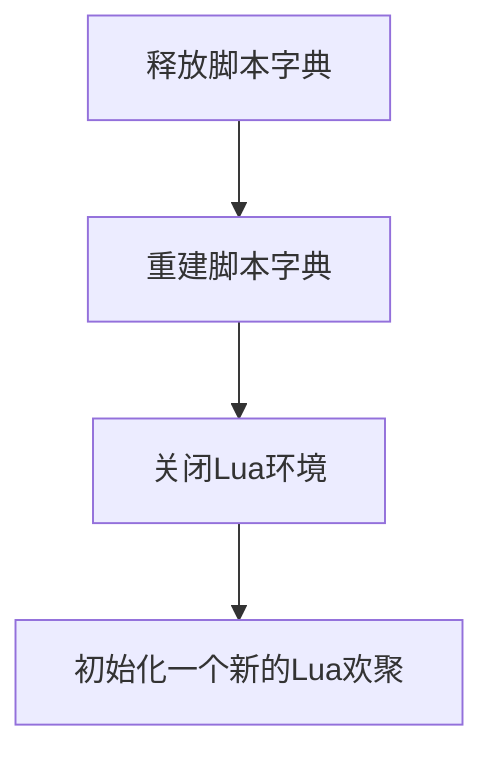
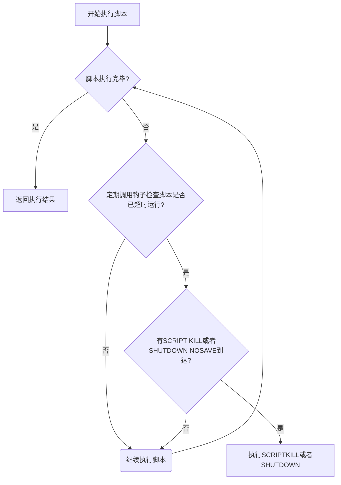
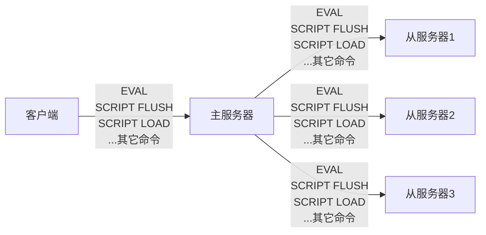

# Redis源码分析-Lua脚本

[TOC]


Redis从2.6版本开始引入对Lua脚本的支持；

## 创建并修改Lua环境

Redis创建并修改Lua环境的过程：

1. 创建一个基础的Lua环境，之后的所有修改都是针对这个环境进行的；
2. 载入多个函数库到Lua环境里面，让Lua脚本可以使用这些函数库来进行数据操作；
3. 创建全局表格redis，这个表格包含了对Redis进行操作的函数，比如用于在Lua脚本中执行Redis命令的redis.call函数；
4. 使用Redis自制的随机函数来替换Lua原有的带有副作用的随机函数，从而避免在脚本中引入副作用；
5. 创建排序辅助函数，Lua环境使用这个辅助函数来对一部分Redis命令的结果进行排序，从而消除这些命令的不确定性；
6. 创建redis.pcall函数的错误包裹辅助函数，这个函数可以提供更详细的出错信息；
7. 对Lua环境中的全局环境进行保护，防止用户在执行Lua脚本的过程中，将额外的全局变量添加到Lua环境中；
8. 将完成修改的Lua环境保存到服务器状态的Lua属性中，等待执行服务器传来的Lua脚本。

### 创建Lua环境

首先调用Lua的C API函数`lua_open`，创建一个新的Lua环境；

### 载入函数库

将以下函数在入到Lua环境里面：

- 基础库（base library）
- 表格库（table library）
- 字符串库（string library）
- 数学库（math library）
- 调试库（debug library）
- [Lua CJSON库](https://www.kyne.com.au/~mark/)
- [Struct库]
- [Lua cmsgpack库](https://github.com/antirez/lua-cmsgpack)

### 创建redis全局table

在Lua环境中创建一个全局redis table，包含以下函数：

- 用于执行Redis命令的redis.call和redis.pcall函数；
- 用于记录Redis日志（log）的redis.log函数；
- 用于计算SHA1校验和的redis.shalhex函数；
- 用于返回错误信息的redis.error_reply函数和redis.status_reply函数；

### 使用Redis自制的随机函数来替换Lua原有的随机函数

Redis要求所有传入服务器的Lua脚本，以及Lua环境中的所有函数，都必须是“无副作用的纯函数”（side effect pure function）。

### 创建排序辅助函数

Redis将以下命令称为“带有不确定性的命令”：

- SINTER
- SUNION
- SDIFF
- SMEMBERS
- HKEYS
- HVALS
- KEYS

### 创建redis.pcall函数的错误报告辅助函数

服务器为Lua环境创建一个名为`__redis__err__handler`的错误处理函数；

### 保护Lua的全局环境

服务器将对Lua环境中的全局环境进行保护，确保传入服务器的脚本不会因为忘记使用local关键字而将额外的全局变量添加到Lua环境里面；

### 将Lua环境保存到服务器状态的Lua属性里面

将Lua环境保存到服务器状态的Lua属性：

```c

/** @brief redis服务端 */
struct redisServer {
    /* Scripting */
    lua_State *lua;           /* Lua中断器 */
    redisClient *lua_client;  /* lua终端（伪终端） */
    redisClient *lua_caller;  /* The client running EVAL right now, or NULL */
    dict *lua_scripts;        /* lua脚本字典；key:lua脚本的SHA1校验和，value:Lua脚本 */
    mstime_t lua_time_limit;  /* Script timeout in milliseconds */
    mstime_t lua_time_start;  /* lua脚本开始执行时间（ms） */
    int lua_write_dirty;  /* True if a write command was called during the
                             execution of the current script. */
    int lua_random_dirty; /* True if a random command was called during the
                             execution of the current script. */
    int lua_timedout;     /* True if we reached the time limit for script
                             execution. */
    int lua_kill;         /* Kill the script if true. */
};
```


## Lua环境协作组件

### 伪客户端

Lua脚本使用redis.call函数或者redis.pcall函数执行一个Redis命令，需要完成以下步骤：

```sequence
Title:Lua脚本执行Redis命令的通行步骤
Lua环境->伪客户端:传送redis.call函数想要执行的Redis命令
伪客户端-->命令执行器:将命令传给执行器执行
命令执行器->伪客户端:返回命令的执行结果
伪客户端-->Lua环境:将命令结果传回给Lua环境
```

1. Lua环境将redis.call函数或者redis.pcall函数想要执行的命令传给伪客户端；
2. 伪客户端将脚本想要执行的命令传给命令执行器；
3. 命令执行器执行伪客户端传给它的命令，并将命令的执行结果返回给伪客户端；
4. 伪客户端接受命令执行器返回的命令结果，并将这个命令结果返回给Lua环境；
5. Lua环境在接收到命令结果之后，将结果返回给redis.call函数或者redis.pcall函数；
6. 接收到结果的redis.call函数或者redis.pcall函数会将命令结果作为函数返回值返回给脚本中的调用者；

### lua_scripts字典

Redis服务器会将所有被EVAL命令执行过的Lua脚本，以及所有被SCRIPT LOAD命令载入过的Lua脚本都保存到`lua_scripts`字典里面；

`lua_scripts`字典有两个作用，一个是实现`SCRIPT EXISTS`命令，另一个是实现脚本复制功能；其定义如下：

```c

/** @brief redis服务端 */
struct redisServer {
  ...
    dict *lua_scripts; /* lua脚本字典；key:lua脚本的SHA1校验和，value:Lua脚本 */
  ...
};
```


## EVAL命令的实现

使用EVAL命令执行Lua脚本，例：

```sh
redis> EVAL "return 'hello world'" 0
```

EVAL命令的执行过程可以分为以下步骤：

1. 根据客户端给定的Lua脚本，在Lua环境中定义一个Lua函数；
2. 将客户端给定的脚本保存到`lua_scripts`字典，等待将来进一步使用；
3. 执行刚刚在Lua环境中定义的函数，以此来执行客户端给定的Lua脚本；

### 定义脚本函数

Lua函数的名字由`f_`前缀加上脚本的SHA1校验和（40字符）组成，而函数体则是脚本内容本身；

例：

```sh
EVAL"return'helloworld'"0
```

服务器将在Lua环境中定义以下函数：

```lua
function f_5332031c6b470dc5a0dd9b4bf2030dea6d65de91()
	return 'hello world'
end
```

使用函数来保存客户端传入的脚本有以下好处：

1. 执行脚本的步骤非常简单，只要调用与脚本相对应的函数即可；
2. 通过函数局部性来让Lua环境保持清洁，减少GC的工作量，并且避免了使用全局变量；
3. 如果某个脚本所对应的函数在Lua环境中被定义过至少一次，那么只要记得这个脚本的SHA1校验和，服务器就可以在不知道脚本本身的情况下，直接通过调用Lua函数来执行脚本，这是EVALSHA命令的实现原理；

### 将脚本保存到lua_scripts字典

EVAL命令将客户端传入的脚本保存到服务器的`lua_scripts`字典；

### 执行脚本函数

准备和执行脚本的过程如下：

1. 将EVAL命令中传入的键名（key name）参数和脚本参数分别保存到KEYS数组的ARGV数组，然后将这两个数组作为全局变量传入到Lua环境里面；
2. 为Lua环境装载超市处理钩子（hook），这个钩子可以在脚本出现超时运行情况时，让客户端通过SCRIPT KILL命令停止脚本，或者通过SHUTDOWN命令直接关闭服务器；
3. 执行脚本函数；
4. 移除之前装载过的超时钩子；
5. 将执行脚本函数所得的结果保存到客户端状态的输出缓冲区里面，等待服务器将结果返回给客户端；
6. 对Lua环境执行垃圾回收操作；


## EVALSHA命令的实现

使用EVALSHA命令通过Lua脚本的校验和来执行脚本，例：

```sh
redis> EVALSHA "xx" 0 // xx：脚本的校验和
"hello world"
```


## 脚本管理命令的实现

### SCRIPT FLUSH

SCRIPT FLUSH命令用于清除服务器中所有和Lua脚本有关的信息，这个命令会释放并重建`lua_scripts`字典，关闭现有的Lua环境并重新创建一个新的Lua环境；



### SCRIPT EXISTS

SCRIPT EXISTS命令根据输入的SHA1校验和，检查校验和对应的Lua脚本是否存在于服务器中；

SCRIPT EXISTS命令允许一次传入多个SHA1校验和；

### SCRIPT LOAD

SCRIPT LOAD命令首先在Lua环境中为脚本创建相对应的函数，然后再将脚本保存到lua_scripts字典里面；

例：

```sh
redis> SCRIPT LOAD "return'hi'"
"2f31ba2bb6d6a0f42cc159d2e2dad55440778de3"
```

服务器将在Lua环境中创建以下函数：

```lua
function f_2f31ba2bb6d6a0f42cc159d2e2dad55440778de3()
  return'hi'
end
```

### SCRIPT KILL

如果服务器设置了`lua-time-limit`配置选项，那么在每次执行Lua脚本之前，服务器都会在Lua环境里面设置一个超时处理钩子（hook）;

超时处理钩子在脚本运行期间，会定期检查脚本已经运行了多长时间，一旦钩子发现脚本的运行时间已经超过了lua-time-limit选项设置的时长，钩子将定期在脚本运行的间隙中，查看是否有`SCRIPT KILL`命令或者`SHUTDOWN`命令到达服务器；

带有超时处理钩子的脚本执行过程：




## 脚本复制

Redis复制Redis命令时，主服务器会直接讲被执行的命令传播（propagate）给所有从服务器：



### 复制EVAL命令，SCRIPT FLUSH命令和SCRIPT LOAD命令

- EVAL

  对于EVAL命令来说，在主服务器执行的Lua脚本同样会在所有从服务器中执行；

- SCRIPT FLUSH

  如果客户端向主服务器发送`SCRIPT FLUSH`命令，那么主服务器也会向所有从服务器传播SCRIPT FLUSH命令；

- SCRIPT LOAD

  如果客户端使用`SCRIPT LOAD`命令，向主服务器载入一个Lua脚本，那么主服务器将向所有从服务器传播相同的`SCRIPT LOAD`命令，使得所有从服务器也会载入相同的Lua脚本；

### 复制EVALSHA命令

因为主服务器与从服务器载入Lua脚本的情况可能有所不同，相同的EVALSHA命令在从服务器执行时可能出现脚本未找到（not found）错误；所以主服务器不能像复制其它命令那样，直接将EVALSHA命令传播给从服务器；

Redis要求主服务器在传播EVALSHA命令的时候，必须确保EVASHA命令要执行的脚本已经被所有从服务器载入过，如果不能确保这一点的话，主服务器会将EVALSHA命令转换成一个等价的EVAL命令，然后通过传播EVAL命令来代替EVALSHA命令；

流程如下：

1. 判断传播EVALSHA命令是否安全的方法；

   主服务器使用服务器状态的repl_scriptcache_dict字典记录自己已经将那些脚本传播给了所有从服务器：

   ```c
   
   /** @brief redis服务端 */
   struct redisServer {
     ...
      /* Replication script cache. */
       dict *repl_scriptcache_dict;        /* 已经传播出去的Lua脚本字典；key:Lua脚本SHA1校验和 */
       list *repl_scriptcache_fifo;        /* First in, first out LRU eviction. */
     ...
   };
   ```

2. 清空repl_scriptcache_dict字典；

   每当主服务器添加一个新的从服务器时，主服务器都会清空自己的repl_scriptcache_dict字典；

3. EVALSHA命令转换成EVAL命令的方法；

   通过使用EVALSHA命令指定的SHA1校验和，以及lua_scripts字典保存的Lua脚本，服务器将一个EVALSHA命令：

   `EVALSHA <sha1> <numkeys> [key ...] [arg ...]`

   转换为一个等价的EVAL命令：

   `EVAL <script> <numkeys> [key ...] [arg ...]`

4. 传播EVALSHA命令的方法：

   主服务器判断传播EVAL还是EVALSHA的过程：

   ```mermaid
   graph TD
   start(主服务器在本机执行完命令<br>EVALSHA shal numkeys key arg) --> is_in{校验和shal是否存在于repl_scriptcache_dict字典?}
   is_in --是--> spread1(传播<br>EVALSHA shal numkeys key arg)
   is_in --否--> trans(将EVALSHA命令转换成等价的EVAL命令) --> spread2(传播<br>EVALSHA shal numkeys key arg) --> add(将shal添加到repl_scriptcache_dict字典)
   ```

   


## 参考

### 文献

[1] 黄健宏.Redis设计与实现
