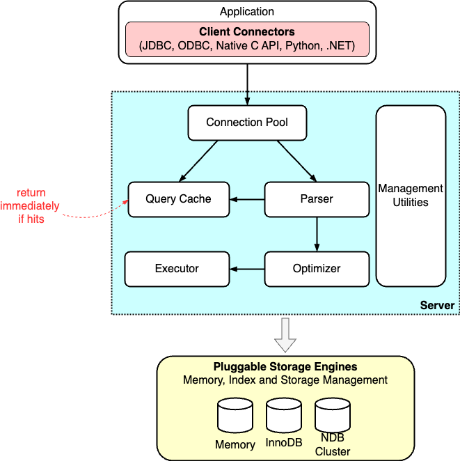

# MySQL Architectural

[TOC]

## SQL Execution

Broadly speaking, MySQL is structured into two main tiers:

- Server Tier

  This tier includes connectors, query caches, analyzers, optimizers, and executors. It covers most of the core service functions of MySQL, including all built-in functions such as date, time, mathematical, and cryptographic functions. All cross-storage-engine functionalities, like stored procedures, triggers, and views, are implemented at this layer.

- Storage Engine Tier

  This layer is responsible for data storage and retrieval. Its pluggable architecture allows for the use of various storage engines, such as InnoDB, MyISAM, and Memory. InnoDB is the most popular and has been the default storage engine since MySQL version 5.5.5.

### Query

## Reference

[1] [What Happens When a SQL is Executed?](https://blog.bytebytego.com/p/what-happens-when-a-sql-is-executed)