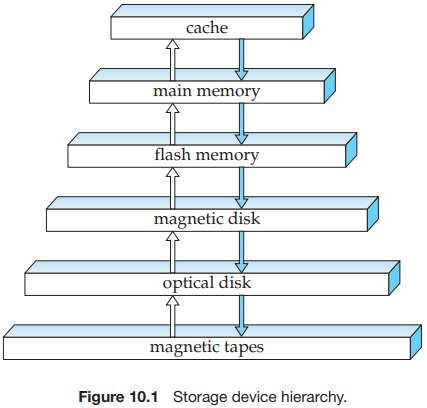
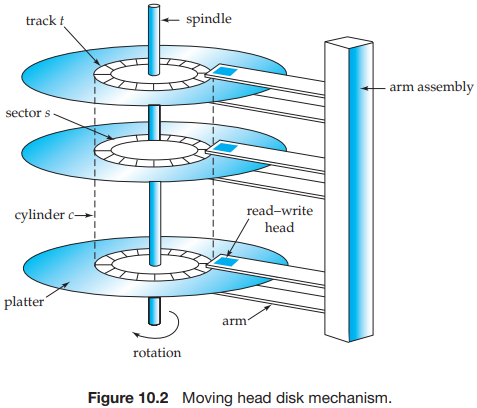
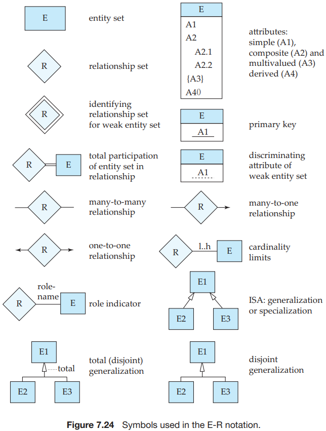
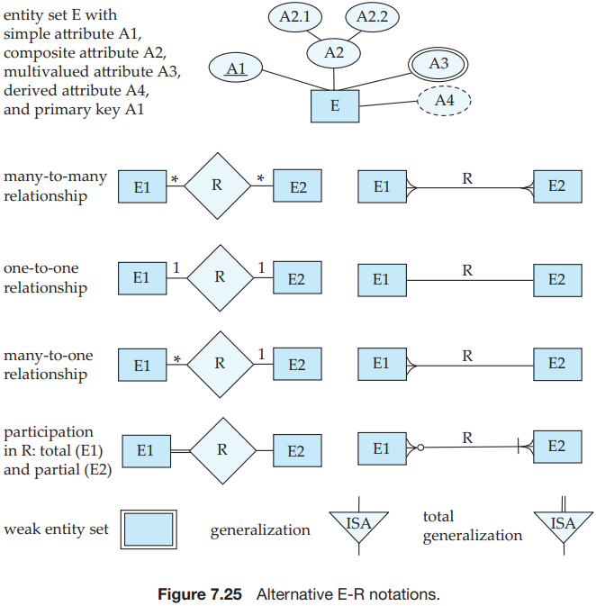
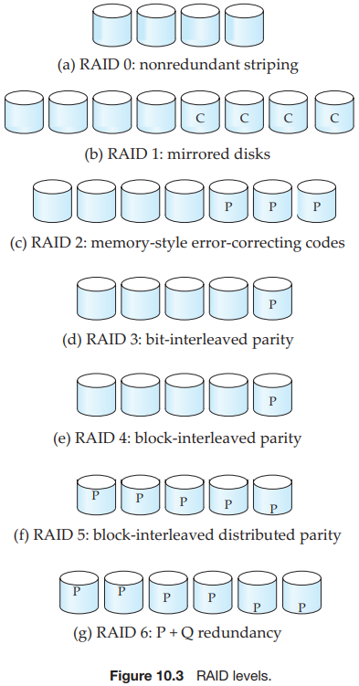

[中文版](README_zh.md) | English

# DB

- [Best Practice](best_practice.md)
- [Relational Model](relational_model.md)
- [SQL Language](sql.md)
- [Terminology](terminology.md)
- [Transaction](transaction.md)

## Storage Hierarchy

## Data Abstraction

- `Physical level`. The lowest level of abstraction describes `how` the data are actually stored. 
- `Logical level`. The next-higher level of abstraction describes `what` data are stored in the database, and what relationships exist among those data. 
- `View level`. The highest level of abstraction describes only part of the entire database.

## System structure

## Relational Model

## E-R Notation

## RAID

