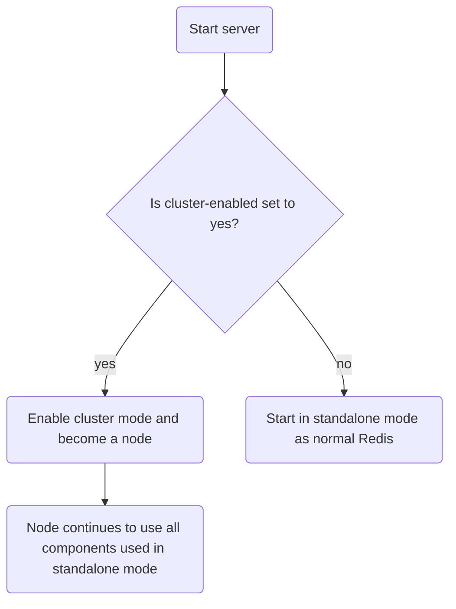
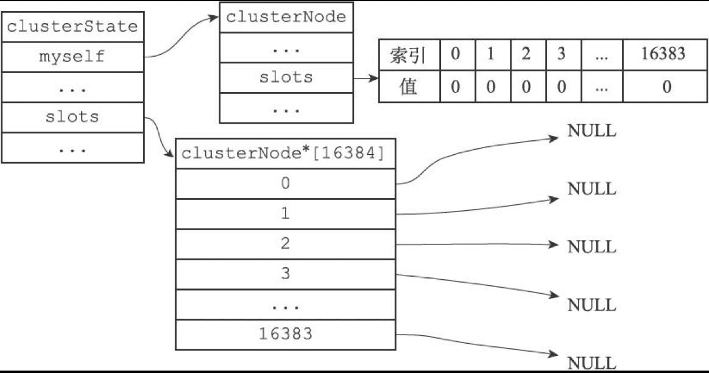
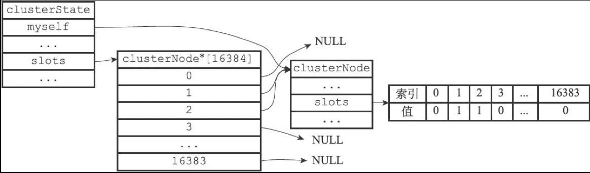
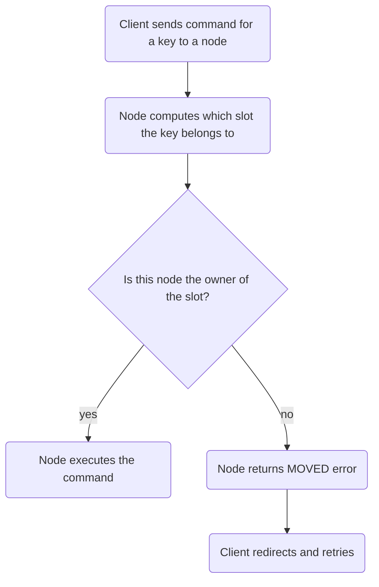
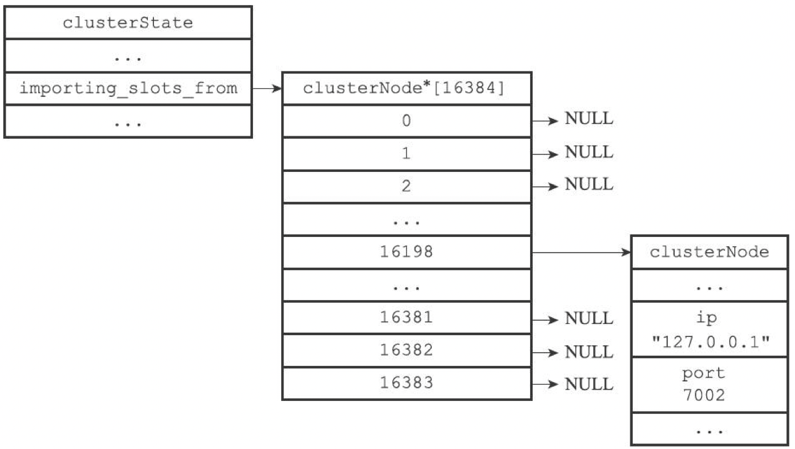
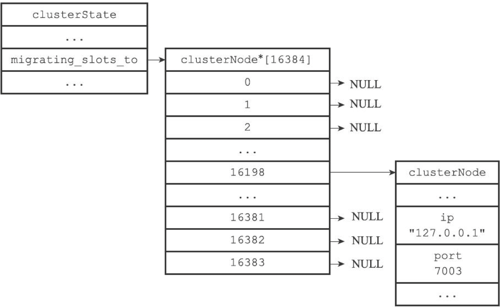
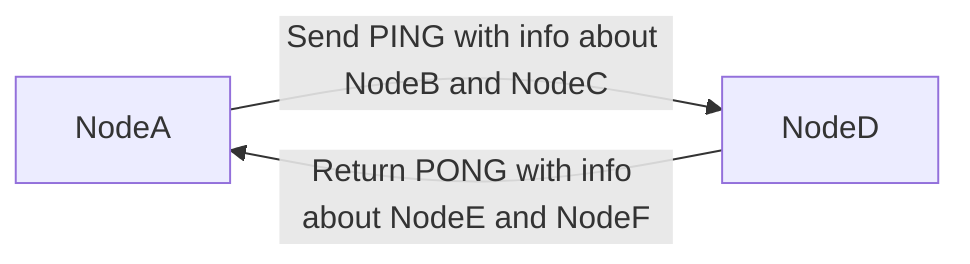
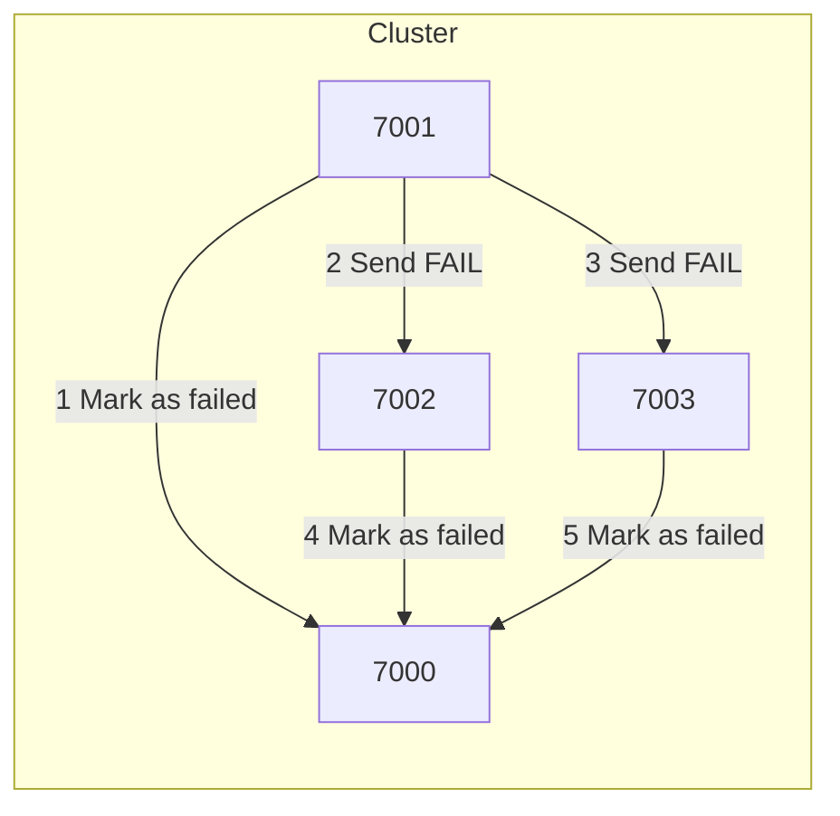
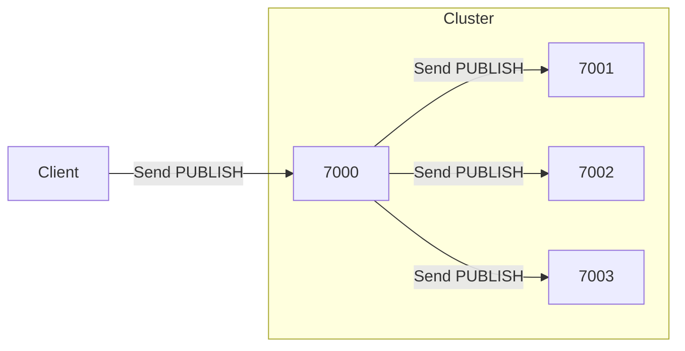
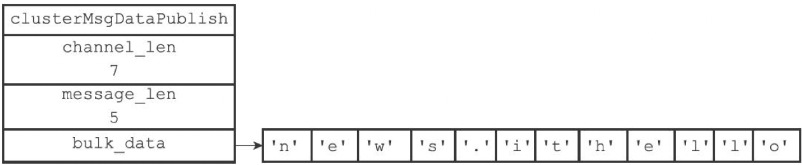

English | [中文版](ansys_cluster_zh.md)

# Redis Source Code Analysis - Cluster

[TOC]


## Nodes

### Definition

```c
/* Information required to connect to a node */
typedef struct clusterLink {
	mstime_t ctime;             /* Time when the connection was created */
	int fd;                     /* Socket descriptor */
	sds sndbuf;                 /* Output buffer */
	sds rcvbuf;                 /* Input buffer */
	struct clusterNode *node;   /* Node associated with this connection, NULL if none */
} clusterLink;

/* Cluster state of the current node */
typedef struct clusterState {
	clusterNode *myself;    /* This node */
	uint64_t currentEpoch;  /* Current configuration epoch (for failover) */
	int state;              /* Current cluster state (REDIS_CLUSTER_OK, REDIS_CLUSTER_FAIL, ...) */
	int size;               /* Number of nodes handling at least one slot */
	dict *nodes;            /* Node dictionary: key=node name, value=node */
	dict *nodes_black_list; /* Nodes we don't re-add for a few seconds. */
	clusterNode *migrating_slots_to[REDIS_CLUSTER_SLOTS];
	clusterNode *importing_slots_from[REDIS_CLUSTER_SLOTS];
	clusterNode *slots[REDIS_CLUSTER_SLOTS];
	zskiplist *slots_to_keys;
	/* The following fields are used to take the slave state on elections. */
	mstime_t failover_auth_time; /* Time of previous or next election. */
	int failover_auth_count;    /* Number of votes received so far. */
	int failover_auth_sent;     /* True if we already asked for votes. */
	int failover_auth_rank;     /* This slave rank for current auth request. */
	uint64_t failover_auth_epoch; /* Epoch of the current election. */
	int cant_failover_reason;   /* Why a slave is currently not able to
								   failover. See the CANT_FAILOVER_* macros. */
	/* Manual failover state in common. */
	mstime_t mf_end;            /* Manual failover time limit (ms unixtime).
								   It is zero if there is no MF in progress. */
	/* Manual failover state of master. */
	clusterNode *mf_slave;      /* Slave performing the manual failover. */
	/* Manual failover state of slave. */
	long long mf_master_offset; /* Master offset the slave needs to start MF
								   or zero if still not received. */
	int mf_can_start;           /* If non-zero signal that the manual failover
								   can start requesting masters vote. */
	/* The following fields are used by masters to take state on elections. */
	uint64_t lastVoteEpoch;     /* Epoch of the last vote granted. */
	int todo_before_sleep; /* Things to do in clusterBeforeSleep(). */
	long long stats_bus_messages_sent;  /* Num of msg sent via cluster bus. */
	long long stats_bus_messages_received; /* Num of msg rcvd via cluster bus.*/
} clusterState;

/* Cluster node */
typedef struct clusterNode {
	mstime_t ctime;                     /* Node creation time */
	char name[REDIS_CLUSTER_NAMELEN];   /* Node name (40 hex chars) */
	int flags;                          /* Node flags (role and state) */
	uint64_t configEpoch;               /* Current configuration epoch (for failover) */
	unsigned char slots[REDIS_CLUSTER_SLOTS/8]; /* slots handled by this node */
	int numslots;   /* Number of slots handled by this node */
	int numslaves;  /* Number of slave nodes, if this is a master */
	struct clusterNode **slaves; /* pointers to slave nodes */
	struct clusterNode *slaveof; /* pointer to the master node. Note that it
									may be NULL even if the node is a slave
									if we don't have the master node in our
									tables. */
	mstime_t ping_sent;      /* Unix time we sent latest ping */
	mstime_t pong_received;  /* Unix time we received the pong */
	mstime_t fail_time;      /* Unix time when FAIL flag was set */
	mstime_t voted_time;     /* Last time we voted for a slave of this master */
	mstime_t repl_offset_time;  /* Unix time we received offset for this node */
	mstime_t orphaned_time;     /* Starting time of orphaned master condition */
	long long repl_offset;      /* Last known repl offset for this node. */
	char ip[REDIS_IP_STR_LEN];  /* Node IP */
	int port;                   /* Node port */
	clusterLink *link;          /* Information required to connect to node */
	list *fail_reports;         /* List of nodes signaling this as failing */
} clusterNode;
```

redisClient vs clusterLink:

Both `redisClient` and `clusterLink` have socket descriptors and input/output buffers. The difference is that `redisClient` sockets/buffers are for client connections, while `clusterLink` sockets/buffers are for node-to-node connections.

### Node Startup

A node is a Redis server running in cluster mode. At startup the server checks the `cluster-enabled` setting to decide whether to enable cluster mode; the flow is:



### Node Handshake

```sh
CLUSTER MEET <ip> <port>
```

This command makes the node perform a handshake with the node at `<ip>:<port>`. On success the peer is added to the cluster.

```sequence
Title: Node handshake
Client->NodeA: Send CLUSTER MEET <ip> <port>
NodeA->NodeB: Send MEET message
NodeB-->NodeA: Reply PONG
NodeA->NodeB: Reply PING
```

Source code:

```c
void clusterCommand(redisClient *c) {
	if (server.cluster_enabled == 0) {
		addReplyError(c,"This instance has cluster support disabled");
		return;
	}
	/* CLUSTER MEET implementation */
	if (!strcasecmp(c->argv[1]->ptr,"meet") && c->argc == 4) {
		long long port;

		if (getLongLongFromObject(c->argv[3], &port) != REDIS_OK) {
			addReplyErrorFormat(c,"Invalid TCP port specified: %s",
								(char*)c->argv[3]->ptr);
			return;
		}
		/* start handshake */
		if (clusterStartHandshake(c->argv[2]->ptr,port) == 0 &&
			errno == EINVAL)
		{
			addReplyErrorFormat(c,"Invalid node address specified: %s:%s",
							(char*)c->argv[2]->ptr, (char*)c->argv[3]->ptr);
		} else {
			addReply(c,shared.ok);
		}
	}
	...
}
```

## Slot Assignment

Redis Cluster shards the keyspace into 16384 slots (`REDIS_CLUSTER_SLOTS`). Each key maps to one slot, and nodes handle zero or more slots.

Assign slots to a node:

```sh
CLUSTER ADDSLOTS <slot> [slot ...]
```

### Source code

```c
/**
 * @brief Add node to slot;
 * @param n Node
 * @param slot Slot id */
int clusterAddSlot(clusterNode *n, int slot) {
	if (server.cluster->slots[slot]) return REDIS_ERR;
	clusterNodeSetSlotBit(n,slot); /* set slot bit */
	server.cluster->slots[slot] = n;
	return REDIS_OK;
}
```

Example: assign slots 1 and 2 to node 7000:

```sh
CLUSTER ADDSLOTS 1 2
```

Before the command the node's `clusterState` looked like:



After the command the node's `clusterState` looks like:



### Executing commands in the cluster



1. Client sends a command to a node.
2. Node computes the key's slot (CRC16).
3. If the current node owns the slot it executes the command.
4. Otherwise the node returns a `MOVED` error telling the client the correct node; the client then redirects and retries.

Compute key slot:

```c++
CLUSTER KEYSLOT "xx"
```

Source:

```c
else if (!strcasecmp(c->argv[1]->ptr,"keyslot") && c->argc == 3) {
		/* CLUSTER KEYSLOT <key> */
		sds key = c->argv[2]->ptr;

		addReplyLongLong(c,keyHashSlot(key,sdslen(key))); /* compute and return key hash slot */
}
```

`MOVED` error format:

```sh
MOVED <slot> <ip>:<port>  # slot: key slot, ip:port: node handling the slot
```

Source:

```c
addReplySds(c,sdscatprintf(sdsempty(),
			"-%s %d %s:%d\r\n",
			(error_code == REDIS_CLUSTER_REDIR_ASK) ? "ASK" : "MOVED",
			hashslot,n->ip,n->port));
```

Use to return keys in a slot:

```sh
CLUSTER GETKEYSINSLOT <slot> <count> # count: max keys to return
```

Source:

```c
else if (!strcasecmp(c->argv[1]->ptr,"getkeysinslot") && c->argc == 4) {
		/* CLUSTER GETKEYSINSLOT <slot> <count> */
		long long maxkeys, slot;
		unsigned int numkeys, j;
		robj **keys;

		if (getLongLongFromObjectOrReply(c,c->argv[2],&slot,NULL) != REDIS_OK)
			return;
		if (getLongLongFromObjectOrReply(c,c->argv[3],&maxkeys,NULL)
			!= REDIS_OK)
			return;
		if (slot < 0 || slot >= REDIS_CLUSTER_SLOTS || maxkeys < 0) {
			addReplyError(c,"Invalid slot or number of keys");
			return;
		}

		keys = zmalloc(sizeof(robj*)*maxkeys);
		numkeys = getKeysInSlot(slot, keys, maxkeys); /* find keys by slot */
		addReplyMultiBulkLen(c,numkeys);
		for (j = 0; j < numkeys; j++) addReplyBulk(c,keys[j]);
		zfree(keys);
}
```


## Resharding

Resharding moves slots from a source node to a target node and migrates the keys belonging to those slots. It can be performed online: source and target can continue to serve requests.

### Implementation principle

Redis provides commands for resharding; the `redis-trib` tool orchestrates the procedure by sending commands to source and target nodes.

Key migration process:

```sequence
Title: Key migration process
redis_trib->Source: 1. Send CLUSTER GETKEYSINSLOT <slot> <count>
Source-->redis_trib: 2. Return up to <count> keys in the slot
redis_trib->Source: 3. For each key send MIGRATE command
Source->Target: 4. Source migrates keys to target as instructed
```

Resharding a slot:

```mermaid
graph TD
Start resharding --> Target prepares to import keys --> Source prepares to migrate keys --> has_keys{Does source still have keys for the slot?}
has_keys -- no --> assign(Assign slot to target)
has_keys -- yes --> migrate(Migrate keys to target) --> assign --> done(Finish resharding)
```

Steps:
1. `redis-trib` sends `CLUSTER SETSLOT <slot> IMPORTING <source_id>` to the target to mark it as importing.
2. `redis-trib` sends `CLUSTER SETSLOT <slot> MIGRATING <target_id>` to the source to mark it as migrating.
3. `redis-trib` uses `CLUSTER GETKEYSINSLOT <slot> <count>` on the source to obtain up to `<count>` keys.
4. For each key, `redis-trib` issues `MIGRATE <target_ip> <target_port> <key> 0 <timeout>` to atomically move the key.
5. Repeat until source has no more keys for the slot.
6. `redis-trib` sends `CLUSTER SETSLOT <slot> NODE <target_id>` to assign the slot to the target; this is propagated across the cluster.

Example `redis-trib` snippet:

```ruby
	def move_slot(source,target,slot,o={})
		o = {:pipeline => MigrateDefaultPipeline}.merge(o)

		if !o[:quiet]
			print "Moving slot #{slot} from #{source} to #{target}: "
			STDOUT.flush
		end

		if !o[:cold]
			target.r.cluster("setslot",slot,"importing",source.info[:name])
			source.r.cluster("setslot",slot,"migrating",target.info[:name])
		end
		while true
			keys = source.r.cluster("getkeysinslot",slot,o[:pipeline])
			break if keys.length == 0
			begin
				source.r.client.call(["migrate",target.info[:host],target.info[:port],"",0,@timeout,:keys,*keys])
			rescue => e
				if o[:fix] && e.to_s =~ /BUSYKEY/
					xputs "*** Target key exists. Replacing it for FIX."
					source.r.client.call(["migrate",target.info[:host],target.info[:port],"",0,@timeout,:replace,:keys,*keys])
				else
					puts ""
					xputs "[ERR] #{e}"
					exit 1
				end
			end
			print "."*keys.length if o[:dots]
			STDOUT.flush
		end

		puts if !o[:quiet]
		if !o[:cold]
			@nodes.each{|n|
				next if n.has_flag?("slave")
				n.r.cluster("setslot",slot,"node",target.info[:name])
			}
		end

		if o[:update] then
			source.info[:slots].delete(slot)
			target.info[:slots][slot] = true
		end
	end
```


## ASK error

Source node decision flow for returning ASK:

```mermaid
graph TD
Client->Source: Send command about key
Source --> is_in_db{Does the key exist on source?}
is_in_db -- yes --> execute(Source executes command)
is_in_db -- no --> is_moving{Is source migrating the slot?}
is_moving -- no --> execute
is_moving -- yes --> return_ask(Return ASK error)
```

### CLUSTER SETSLOT IMPORTING implementation

During resharding send:

```sh
CLUSTER SETSLOT <i> IMPORTING <source_id>
```

This sets `server.cluster->importing_slots_from[i]` to the `clusterNode` represented by `<source_id>`.

Example:

```sh
CLUSTER SETSLOT 16198 IMPORTING 9dfb4c4e016e627d9769e4c9bb0d4fa208e6
```



Source code:

```c
else if (!strcasecmp(c->argv[3]->ptr,"importing") && c->argc == 5) {
			if (server.cluster->slots[slot] == myself) {
				addReplyErrorFormat(c,
					"I'm already the owner of hash slot %u",slot);
				return;
			}
			if ((n = clusterLookupNode(c->argv[4]->ptr)) == NULL) {
				addReplyErrorFormat(c,"I don't know about node %s",
					(char*)c->argv[3]->ptr);
				return;
			}
			server.cluster->importing_slots_from[slot] = n;
}
```

### CLUSTER SETSLOT MIGRATING implementation

Send to source:

```sh
CLUSTER SETSLOT <i> MIGRATING <target_id>
```

This sets `server.cluster->migrating_slots_to[i]` to the `clusterNode` represented by `<target_id>`.

Example:

```sh
CLUSTER SETSLOT 16198 MIGRATING 04579925484ce537d3410d7ce97bd2e260c4
```



Source code:

```c
		if (!strcasecmp(c->argv[3]->ptr,"migrating") && c->argc == 5) {
			if (server.cluster->slots[slot] != myself) {
				addReplyErrorFormat(c,"I'm not the owner of hash slot %u",slot);
				return;
			}
			if ((n = clusterLookupNode(c->argv[4]->ptr)) == NULL) {
				addReplyErrorFormat(c,"I don't know about node %s",
					(char*)c->argv[4]->ptr);
				return;
			}
			server.cluster->migrating_slots_to[slot] = n;
		}
```

### ASK vs MOVED

- `MOVED` indicates the slot ownership has permanently moved to another node.
- `ASK` is a temporary mechanism used while keys are being migrated between nodes.


## Replication and Failover

Cluster nodes are masters and slaves. Masters serve slots; slaves replicate a master and can take over when the master fails.

### Set a slave

```sh
CLUSTER REPLICATE <node_id>
```

Make the node a replica of `<node_id>` and start replication. Implementation:

```c
else if (!strcasecmp(c->argv[1]->ptr,"replicate") && c->argc == 3) {
		clusterNode *n = clusterLookupNode(c->argv[2]->ptr);
		if (!n) {
			addReplyErrorFormat(c,"Unknown node %s", (char*)c->argv[2]->ptr);
			return;
		}
		if (n == myself) {
			addReplyError(c,"Can't replicate myself");
			return;
		}
		if (nodeIsSlave(n)) {
			addReplyError(c,"I can only replicate a master, not a slave.");
			return;
		}
		if (nodeIsMaster(myself) &&
			(myself->numslots != 0 || dictSize(server.db[0].dict) != 0)) {
			addReplyError(c,
				"To set a master the node must be empty and "
				"without assigned slots.");
			return;
		}
		clusterSetMaster(n);
		clusterDoBeforeSleep(CLUSTER_TODO_UPDATE_STATE|CLUSTER_TODO_SAVE_CONFIG);
		addReply(c,shared.ok);
	}
```

### Failure detection

Nodes periodically send `PING` messages to peers. If a `PONG` is not received within the expected time, the sender marks the peer as probably failing (PFAIL).

If a majority of masters report a master `x` as PFAIL, `x` is marked as FAIL. The reporter broadcasts a `FAIL` message and all nodes mark `x` as failed.

```c

```

### Failover

When a slave detects its master is FAIL it starts failover:
1. One slave is selected.
2. Selected slave runs `SLAVEOF no one` to become master.
3. New master revokes failed master's slots and assigns them to itself.
4. New master broadcasts a `PONG` so others know it is now master.
5. New master begins serving commands for its slots.

### Electing a new master

High-level: configuration epochs and voting.
1. Configuration epoch is an increasing counter.
2. On failover the epoch increments.
3. Each master has one vote per epoch; the first slave requesting a vote may get it.
4. A slave broadcasts `CLUSTERMSG_TYPE_FAILOVER_AUTH_REQUEST` to gather votes.
5. Eligible masters reply with `CLUSTERMSG_TYPE_FAILOVER_AUTH_ACK`.
6. A slave that collects `N/2+1` votes (N = voting masters) becomes master.
7. One vote per master per epoch ensures at most one winner.
8. If no winner, a new epoch begins and voting repeats.


## Messages

Nodes exchange:

1. MEET
2. PING
3. PONG
4. FAIL
5. PUBLISH

### Message header

For MEET, PING, PONG messages the receiver inspects two `clusterMsgDataGossip` entries in the payload and either handshakes with unknown nodes or updates known nodes' `clusterNode` info.

PING/PONG example:



### FAIL message

```c
typedef struct {
	char nodename[REDIS_CLUSTER_NAMELEN]; /* Name of the failed node */
} clusterMsgDataFail;
```

FAIL broadcast example:



### PUBLISH message

```c
typedef struct {
	uint32_t channel_len; /* channel length */
	uint32_t message_len; /* message length */
	/* bulk_data[0..channel_len-1]: channel */
	/* bulk_data[channel_len..channel_len+message_len-1]: message */
	unsigned char bulk_data[8]; /* channel and message payload (variable) */
} clusterMsgDataPublish;
```

Node broadcasting PUBLISH example:






## References

[1] Huang Jianhong. Redis Design and Implementation

