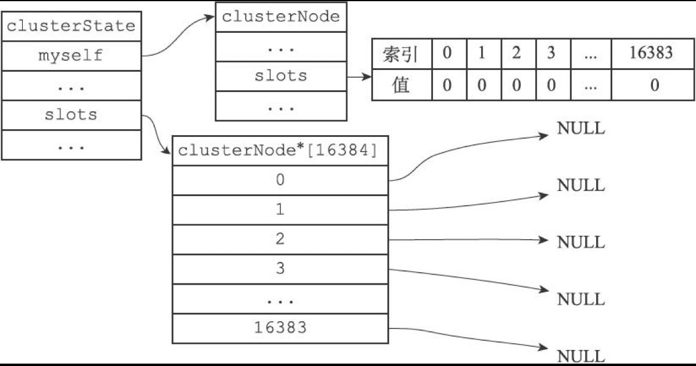

# Redis源码分析-集群

[TOC]


## 节点

### 定义

```c
/* 连接节点所需的有关信息 */
typedef struct clusterLink {
    mstime_t ctime;             /* 连接创建的时间 */
    int fd;                     /* 套接字描述符 */
    sds sndbuf;                 /* 输出缓冲区 */
    sds rcvbuf;                 /* 输入缓冲区 */
    struct clusterNode *node;   /* 与这个连接相关联的节点，如果没有就为NULL */
} clusterLink;

/* 当前节点所在的集群状态 */
typedef struct clusterState {
    clusterNode *myself;    /* 本节点 */
    uint64_t currentEpoch;  /* 集群当钱的配置纪元（用于故障转移） */
    int state;              /* 集群当前的状态（REDIS_CLUSTER_OK, REDIS_CLUSTER_FAIL, ... ）*/
    int size;               /* 集群中至少处理着一个槽的节点的数量 */
    dict *nodes;            /* 节点字典：key:节点名字，value:节点 */
    dict *nodes_black_list; /* Nodes we don't re-add for a few seconds. */
    clusterNode *migrating_slots_to[REDIS_CLUSTER_SLOTS];
    clusterNode *importing_slots_from[REDIS_CLUSTER_SLOTS];
    clusterNode *slots[REDIS_CLUSTER_SLOTS];
    zskiplist *slots_to_keys;
    /* The following fields are used to take the slave state on elections. */
    mstime_t failover_auth_time; /* Time of previous or next election. */
    int failover_auth_count;    /* Number of votes received so far. */
    int failover_auth_sent;     /* True if we already asked for votes. */
    int failover_auth_rank;     /* This slave rank for current auth request. */
    uint64_t failover_auth_epoch; /* Epoch of the current election. */
    int cant_failover_reason;   /* Why a slave is currently not able to
                                   failover. See the CANT_FAILOVER_* macros. */
    /* Manual failover state in common. */
    mstime_t mf_end;            /* Manual failover time limit (ms unixtime).
                                   It is zero if there is no MF in progress. */
    /* Manual failover state of master. */
    clusterNode *mf_slave;      /* Slave performing the manual failover. */
    /* Manual failover state of slave. */
    long long mf_master_offset; /* Master offset the slave needs to start MF
                                   or zero if stil not received. */
    int mf_can_start;           /* If non-zero signal that the manual failover
                                   can start requesting masters vote. */
    /* The followign fields are used by masters to take state on elections. */
    uint64_t lastVoteEpoch;     /* Epoch of the last vote granted. */
    int todo_before_sleep; /* Things to do in clusterBeforeSleep(). */
    long long stats_bus_messages_sent;  /* Num of msg sent via cluster bus. */
    long long stats_bus_messages_received; /* Num of msg rcvd via cluster bus.*/
} clusterState;

/* 集群节点 */
typedef struct clusterNode {
    mstime_t ctime;                     /* 节点创建时间 */
    char name[REDIS_CLUSTER_NAMELEN];   /* 节点名字（由40个十六进制字符组成） */
    int flags;                          /* 节点标识（标记节点的角色和状态） */
    uint64_t configEpoch;               /* 当前的配置纪元（用于故障转移） */
    unsigned char slots[REDIS_CLUSTER_SLOTS/8]; /* slots handled by this node */
    int numslots;   /* Number of slots handled by this node */
    int numslaves;  /* Number of slave nodes, if this is a master */
    struct clusterNode **slaves; /* pointers to slave nodes */
    struct clusterNode *slaveof; /* pointer to the master node. Note that it
                                    may be NULL even if the node is a slave
                                    if we don't have the master node in our
                                    tables. */
    mstime_t ping_sent;      /* Unix time we sent latest ping */
    mstime_t pong_received;  /* Unix time we received the pong */
    mstime_t fail_time;      /* Unix time when FAIL flag was set */
    mstime_t voted_time;     /* Last time we voted for a slave of this master */
    mstime_t repl_offset_time;  /* Unix time we received offset for this node */
    mstime_t orphaned_time;     /* Starting time of orphaned master condition */
    long long repl_offset;      /* Last known repl offset for this node. */
    char ip[REDIS_IP_STR_LEN];  /* 节点IP */
    int port;                   /* 节点端口 */
    clusterLink *link;          /* 保存连接节点所需的有关信息 */
    list *fail_reports;         /* List of nodes signaling this as failing */
} clusterNode;
```

redisClient结构与clusterLink结构的相同和不同之处：

redisClient结构和clusterLink结构都有自己的套接字描述符和输入，输出缓冲区，这两个结构的区别在于，redisClient结构中的套接字和缓冲区是用于连接客户端的，而clusterLink结构中的套接字和缓冲区则是用于连接节点的。

### 启动节点

一个节点就是一个运行在集群模式下的Redis服务器，Redis服务器在启动时会根据配置 `cluster-enabled`是否为yes来决定是否开启服务器的集群模式；流程如下：


### 节点握手

```sh
CLUSTER MEET <ip> <port>
```

该命令可以让node节点与 `<ip>:<port>`所指定的节点进行握手（handshake）；当握手成功时，node节点就会将ip和port所指定的节点添加到node节点当前所在的集群中；

```sequence
Title:节点的握手过程
客户端->节点A: 发送命令 CLUSTER MEET <ip> <port>
节点A->节点B: 发送MEET消息
节点B-->节点A: 返回PONG消息
节点A->节点B: 返回PING消息
```

源码如下：

```c
void clusterCommand(redisClient *c) {
    if (server.cluster_enabled == 0) {
        addReplyError(c,"This instance has cluster support disabled");
        return;
    }
    /* 命令 CLUSTER MEET 的实现 */
    if (!strcasecmp(c->argv[1]->ptr,"meet") && c->argc == 4) {
        long long port;

        if (getLongLongFromObject(c->argv[3], &port) != REDIS_OK) {
            addReplyErrorFormat(c,"Invalid TCP port specified: %s",
                                (char*)c->argv[3]->ptr);
            return;
        }
        /* 与节点握手 */
        if (clusterStartHandshake(c->argv[2]->ptr,port) == 0 &&
            errno == EINVAL)
        {
            addReplyErrorFormat(c,"Invalid node address specified: %s:%s",
                            (char*)c->argv[2]->ptr, (char*)c->argv[3]->ptr);
        } else {
            addReply(c,shared.ok);
        }
    }
    ...
}
```

## 槽指派

Redis集群通过分片的方式来保存数据库中的键值对：集群的整个数据库被分为16384个槽（这个值由`REDIS_CLUSTER_SLOTS`定义），数据库中的每个键都属于这16384个槽中的一个，集群中的每个节点可以处理0或最多16384个槽。

将一个或多个槽指派给节点负责：

```sh
CLUSTER ADDSLOTS <slot> [slot ...]
```

### 源码分析

```c
/**
 * @brief 添加节点到槽位;
 * @param n 节点
 * @param slot 槽位id */
int clusterAddSlot(clusterNode *n, int slot) {
    if (server.cluster->slots[slot]) return REDIS_ERR;
    clusterNodeSetSlotBit(n,slot); /* 设置槽位值 */
    server.cluster->slots[slot] = n;
    return REDIS_OK;
}
```

例，将槽0至槽5000指派给节点7000负责：

```sh
CLUSTER ADDSLOTS 1 2
```

执行上面的命令之前，节点的clusterState结构如下：



执行上面的命令之后，节点的clusterState结构如下：


### 在集群中执行命令


1. 客户端想节点发送命令；
2. 节点计算键属于哪个槽（CRC16算法）；
3. 如果所在的槽正好在当前节点，就指派给当前节点，直接执行这个命令；
4. 如果键所在的槽并没有指派给当前节点，那么节点会向客户端返回一个MOVED错误，指引客户端转向（redirect）至正确的节点，并再次发送之前想要执行的命令；

使用以下语句计算键属于哪个槽：

```c++
CLUSTER KEYSLOT "xx"
```

源码如下：

```c
else if (!strcasecmp(c->argv[1]->ptr,"keyslot") && c->argc == 3) {
        /* CLUSTER KEYSLOT <key> */
        sds key = c->argv[2]->ptr;

        addReplyLongLong(c,keyHashSlot(key,sdslen(key))); /* 计算key的hash值并返回 */
}
```

返回MOVED错误的格式为：

```sh
MOVED <slot> <ip>:<port> # slot:键所在的槽，ip:port:负责处理槽slot的节点的IP地址和端口号
```

源码如下：

```c
addReplySds(c,sdscatprintf(sdsempty(),
            "-%s %d %s:%d\r\n",
            (error_code == REDIS_CLUSTER_REDIR_ASK) ? "ASK" : "MOVED", /* 返回MOVED <slot> <ip>:<port> 或 ASK <slot> <ip>:<port>*/
            hashslot,n->ip,n->port));
```

使用以下命令返回属于槽slot的数据库键：

```sh
CLUSTER GETKEYSINSLOT <slot> <count> # count:键最多个数，slot:槽
```

源码如下：

```c
else if (!strcasecmp(c->argv[1]->ptr,"getkeysinslot") && c->argc == 4) {
        /* CLUSTER GETKEYSINSLOT <slot> <count> */
        long long maxkeys, slot;
        unsigned int numkeys, j;
        robj **keys;

        if (getLongLongFromObjectOrReply(c,c->argv[2],&slot,NULL) != REDIS_OK)
            return;
        if (getLongLongFromObjectOrReply(c,c->argv[3],&maxkeys,NULL)
            != REDIS_OK)
            return;
        if (slot < 0 || slot >= REDIS_CLUSTER_SLOTS || maxkeys < 0) {
            addReplyError(c,"Invalid slot or number of keys");
            return;
        }

        keys = zmalloc(sizeof(robj*)*maxkeys);
        numkeys = getKeysInSlot(slot, keys, maxkeys); /* 根据slot找keys */
        addReplyMultiBulkLen(c,numkeys);
        for (j = 0; j < numkeys; j++) addReplyBulk(c,keys[j]);
        zfree(keys);
} 
```


## 重新分片

Redis集群的重新分片操作可以将任意数量已经指派给某个节点（源节点）的槽改为指派给另一个节点（目标节点），并且相关槽所属的键值对也会从源节点被移动到目标节点。

重新分片操作可以在线（online）进行，在重新分片的过程中，集群不需要下线，并且源节点和目标节点都可以继续处理命令请求。

### 实现原理

Redis集群的重新分片操作是由Redis的集群管理软件redis-trib负责执行的，Redis提供了进行重新分片所需要的所有命令，而redis-trib则通过向源节点和目标节点发送命令来进行重新分片操作。

迁移键的过程：

```sequence
Title:迁移键的过程
redis_trib->源节点: 1.发送命令 CLUSTER GETKEYSINSLOT <slot> <count>
源节点-->redis_trib: 2.返回最多count个属于槽slot的键
redis_trib->源节点: 3.对于每个返回键，向源节点发送一个MIGRATE命令
源节点->目标节点: 4.根据MIGRATE命令的指示将键迁移至目标节点
```

对槽slot进行重新分片的整个过程：


1. redis-trib对目标节点发送 `CLUSTER SETSLOT <slot> IMPORTING <source_id>`命令，让目标节点准备好从源节点导入（import）属于槽slot的键值对。
2. redis-trib对源节点发送 `CLUSTER SETSLOT <slot> MIGRATING <target_id>`命令，让源节点准备好将属于槽slot的键值对迁移（migrate）至目标节点。
3. redis-trib向源节点发送 `CLUSTER GETKEYSINSLOT <slot> <count>`命令，获得最多count个属于槽slot的键值对的键名（key name）。
4. 对于步骤3获得的每个键名，redis-trib都向源节点发送一个 `MIGRATE <target_ip> <target_port> <key_name> 0 <timeout>`命令，将被选中的键原子地从源节点迁移至目标节点。
5. 重复执行步骤3和步骤4，直到源节点保存的所有属于槽slot的键值对都被迁移至目标节点为止。
6. redis-trib向集群中的任意一个节点发送 `CLUSTER SETSLOT <slot> NODE <target_id>`命令，将槽slot指派给目标节点，这一指派信息会通过消息发送至整个集群，最终集群中的所有节点都会知道槽slot已经指派给目标节点。

```ruby
    def move_slot(source,target,slot,o={})
        o = {:pipeline => MigrateDefaultPipeline}.merge(o)

        # We start marking the slot as importing in the destination node,
        # and the slot as migrating in the target host. Note that the order of
        # the operations is important, as otherwise a client may be redirected
        # to the target node that does not yet know it is importing this slot.
        if !o[:quiet]
            print "Moving slot #{slot} from #{source} to #{target}: "
            STDOUT.flush
        end

        if !o[:cold]
            target.r.cluster("setslot",slot,"importing",source.info[:name]) # 让目标节点准备好从源节点导入属于槽slot的键值对
            source.r.cluster("setslot",slot,"migrating",target.info[:name]) # 让源节点准备好将属于槽slot的键值对迁移到目标节点
        end
        # Migrate all the keys from source to target using the MIGRATE command
        while true
            keys = source.r.cluster("getkeysinslot",slot,o[:pipeline]) # 获得属于槽slot的键值对的键名
            break if keys.length == 0
            begin
                source.r.client.call(["migrate",target.info[:host],target.info[:port],"",0,@timeout,:keys,*keys]) # 将被选中的键原子地从源节点迁移至目标节点
            rescue => e
                if o[:fix] && e.to_s =~ /BUSYKEY/
                    xputs "*** Target key exists. Replacing it for FIX."
                    source.r.client.call(["migrate",target.info[:host],target.info[:port],"",0,@timeout,:replace,:keys,*keys])
                else
                    puts ""
                    xputs "[ERR] #{e}"
                    exit 1
                end
            end
            print "."*keys.length if o[:dots]
            STDOUT.flush
        end

        puts if !o[:quiet]
        # Set the new node as the owner of the slot in all the known nodes.
        if !o[:cold]
            @nodes.each{|n|
                next if n.has_flag?("slave")
                n.r.cluster("setslot",slot,"node",target.info[:name]) # 将槽slot指派给目标节点并广播到整个集群
            }
        end

        # Update the node logical config
        if o[:update] then
            source.info[:slots].delete(slot)
            target.info[:slots][slot] = true
        end
    end
```


## ASK错误

源节点判断是否需要向客户端发送ASK错误的整个过程：


### CLUSTER SETSLOT IMPORTING命令的实现

在对集群进行重新分片的时候，向目标节点发送命令：

```sh
CLUSTER SETSLOT <i> IMPORTING <source_id>
```

可以将目标节点`clusterState.importing_slots_from[i]`的值设置为`source_id`所代表节点的`clusterNode`结构；例：

```sh
CLUSTER SETSLOT 16198 IMPORTING 9dfb4c4e016e627d9769e4c9bb0d4fa208e6
```

节点的importing_slots_from数组结构如下：


源码如下：

```c
else if (!strcasecmp(c->argv[3]->ptr,"importing") && c->argc == 5) { /*CLUSTER SETSLOT <i> IMPORTING <source_id> */ /* 将目标节点的值设置为source_id所代表节点的clusterNode结构 */
            if (server.cluster->slots[slot] == myself) {
                addReplyErrorFormat(c,
                    "I'm already the owner of hash slot %u",slot);
                return;
            }
            if ((n = clusterLookupNode(c->argv[4]->ptr)) == NULL) {
                addReplyErrorFormat(c,"I don't know about node %s",
                    (char*)c->argv[3]->ptr);
                return;
            }
            server.cluster->importing_slots_from[slot] = n;
}
```

### CLUSTER SETSLOT MIGRATING命令的实现

在对集群进行重新分片的时候，向源节点发送命令：

```sh
CLUSTER SETSLOT <i> MIGRATING <target_id>
```

可以将源节点`clusterState.migrating_slots_to[i]`的值设置为`target_id`所代表节点的`clusterNode`结构；例：

```sh
CLUSTER SETSLOT 16198 MIGRATING 04579925484ce537d3410d7ce97bd2e260c4
```

节点的clusterState.migrating_slots_to数组结构如下：


源码如下：

```c
        /* CLUSTER SETSLOT <i> MIGRATING <target_id> */ /* 将源节点的值设置为target_id所代表节点的clusterNode结构 */
        if (!strcasecmp(c->argv[3]->ptr,"migrating") && c->argc == 5) {
            if (server.cluster->slots[slot] != myself) {
                addReplyErrorFormat(c,"I'm not the owner of hash slot %u",slot);
                return;
            }
            if ((n = clusterLookupNode(c->argv[4]->ptr)) == NULL) {
                addReplyErrorFormat(c,"I don't know about node %s",
                    (char*)c->argv[4]->ptr);
                return;
            }
            server.cluster->migrating_slots_to[slot] = n;
        }
```

### ASK错误

#### ASKING命令

如果客户端向节点发送一个关于槽i的命令，而槽i又没有指派给这个节点的话，那么节点将向客户端返回一个MOVED错误；

节点判断是否执行客户端命令的过程：


#### ASK错误和MOVED错误的区别

- MOVED错误代表槽的负责权已经从一个节点转移到另一个节点；
- ASK错误只是两个节点在迁移槽的过程中使用的一种临时措施；


## 复制与故障转移

Redis集群中的节点分为主节点（master）和从节点（slave），其中主节点用于处理槽，而从节点则用于复制某个主节点，并在被复制的主节点下线时，代替下线主节点继续处理命令请求；

### 设置从节点

```sh
CLUSTER REPLICATE <node_id>
```

可以让接收到此命令的节点成为`node_id`所指定节点的从节点，并开始对主节点进行复制；此命令的执行过程如下：

```c
/* 命令 CLUSTER REPLICATE <NODE ID> 的实现（让当前节点成为NODE ID的从节点，并开始对主节点进行复制） */
else if (!strcasecmp(c->argv[1]->ptr,"replicate") && c->argc == 3) {
       /* 在自己的clusterState.nodes字典中查找 NODE ID对应的节点 */
        clusterNode *n = clusterLookupNode(c->argv[2]->ptr);
        if (!n) {
            addReplyErrorFormat(c,"Unknown node %s", (char*)c->argv[2]->ptr);
            return;
        }
        /* 不能复制自己 */
        if (n == myself) {
            addReplyError(c,"Can't replicate myself");
            return;
        }
        /* 不能复制一个从节点 */
        if (nodeIsSlave(n)) {
            addReplyError(c,"I can only replicate a master, not a slave.");
            return;
        }
        /*  */
        if (nodeIsMaster(myself) &&
            (myself->numslots != 0 || dictSize(server.db[0].dict) != 0)) {
            addReplyError(c,
                "To set a master the node must be empty and "
                "without assigned slots.");
            return;
        }
        /* 设置主节点 */
        clusterSetMaster(n);
        /* 设置休眠前要做的工作(更新状态|保存配置) */ 
        clusterDoBeforeSleep(CLUSTER_TODO_UPDATE_STATE|CLUSTER_TODO_SAVE_CONFIG);
        addReply(c,shared.ok);
    }
```

### 故障检测

集群中的每个节点都会定期地向集群中的其它节点发送`PING`消息，以此来检测对象是否在线，如果接收`PING`消息的节点没有在规定的时间内，向发送`PING`消息的节点返回`PONG`消息，那么发送`PING`消息的节点就会将接收`PING`消息的节点标记为疑似下线（probable fail, PFAIL）；

如果在一个集群里面，半数以上负责处理槽的主节点都将某个主节点x报告为疑似下线，那么这个主节点x将被标记为已下线（FAIL），将主节点x标记为已下线的节点会向集群广播一条关于主节点x的`FAIL`消息，所有收到这条`FAIL`消息的节点都会立即将主节点x标记为已下线；

```c

```

### 故障转移

当一个从节点发现自己正在复制的主节点进入了已下线状态时，从节点将开始对下线主节点进行故障转移，以下是故障转移的执行步骤：

1. 复制下线主节点的所有从节点里面，会有一个从节点被选中；
2. 被选中的从节点会执行SLAVEOF no one命令，成为新的主节点；
3. 新的主节点会撤销所有对已下线主节点的槽指派，并将这些槽全部指派给自己；
4. 新的主节点向集群广播一条PONG消息，这条PONG消息可以让集群中的其它节点立即知道这个节点已经由从节点变成了主节点，并且这个主节点已经接管了原本由已下线节点负责处理的槽；
5. 新的主节点开始接收和自己负责处理的槽有关的命令请求，故障转移完成；

### 选举新的主节点

集群选举新的主节点方法（Raft算法选举）：

1. 集群的配置纪元是一个自增计数器，它的初始值为0；
2. 当集群里的某个节点开始一次故障转移操作时，集群配置纪元的值会被增一；
3. 对于每个配置纪元，集群里每个负责处理槽的主节点都有一次投票机会，而第一个向主节点要求投票的从节点将获得主节点的投票；
4. 当从节点发现自己正在复制的主节点进入已下线状态时，从节点会想集群广播一条`CLUSTERMSG_TYPE_FAILOVER_AUTH_REQUEST`消息，要求所有收到这条消息，并且具有投票权的主节点向这个从节点投票；
5. 如果一个主节点具有投票权（它正在负责处理槽），并且这个主节点上位投票给其它从节点，那么主节点将向要求投票的从节点返回一条`CLUSTERMSG_TYPE_FAILOVER_AUTH_ACK`消息，表示这个主节点支持从节点成为新的主节点；
6. 每个参与选举的从节点都会接收`CLUSTERMSG_TYPE_FAILOVER_AUTH_ACK`消息，并根据自己收到了多少条这种消息来统计自己获得了多少主节点的支持；
7. 如果集群里有N个具有投票权的主节点，那么当一个从节点收集到大于等于`N/2+1`张支持票时，这个从节点就会当选为新的主节点；
8. 因为在每一个配置纪元里面，每个具有投票权的主节点只能投一次票，所以如果有N个主节点进行投票，那么具有大于等于N/2+1张支持票的从节点只会有一个，这确保了新的主节点只会有一个；
9. 如果在一个配置纪元里面没有从节点能收集到足够多的支持票，那么集群进入一个新的配置纪元，并再次进行选举，知道选出新的主节点为止；


## 消息

节点发送的消息主要为以下几种：

1. MEET
2. PING
3. PONG
4. FAIL
5. PUBLISH

### 消息头

当接收者收到MEET，PING，PONG消息时，接受者会访问消息正文中的两个`clusterMsgDataGossip`结构，并根据自己是否认识clusterMsgDataGossip结构中记录的被选中节点来选择进行哪种操作：

- 如果被选中节点不存在于接受者的已知节点列表，那么说明接收者是第一次接触到被选中节点，接收者将根据结构中记录的IP地址和端口号等信息，与被选中节点进行握手；
- 如果被选中节点已经存在于接受者的已知节点列表，那么说明接收者之前已经被选中节点进行过接触，接收者将根据`clusterMsgDataGossip`结构记录的信息，对被选中节点所对应的`clusterNode`结构进行更新；

一个PING-PONG消息通信示例：


### FAIL消息的实现

```c
typedef struct {
    char nodename[REDIS_CLUSTER_NAMELEN]; /* 已下线节点的名字 */
} clusterMsgDataFail;
```

发送和接收FAIL消息示例：


### PUBLISH消息的实现

```c
typedef struct {
    uint32_t channel_len; /* channel参数的长度 */
    uint32_t message_len; /* message参数的长度 */
    /* （定义为8字节，只是为了对其其它消息结构，实际的长度由保存的内容决定） */
    /* bulk_data[0, channel_len - 1]：channel参数 */
    /* bulk_data[channel_len, channel_len+message_len - 1]：message参数 */
    unsigned char bulk_data[8]; /* 客户端通过PUBLISH发送给节点的channel参数和message参数 */
} clusterMsgDataPublish;
```

接收到PUBLISH命令的节点向集群广播PUBLISH消息示例：


clusterMsgDataPublish结构示例：


## 参考

[1] 黄健宏.Redis设计与实现
