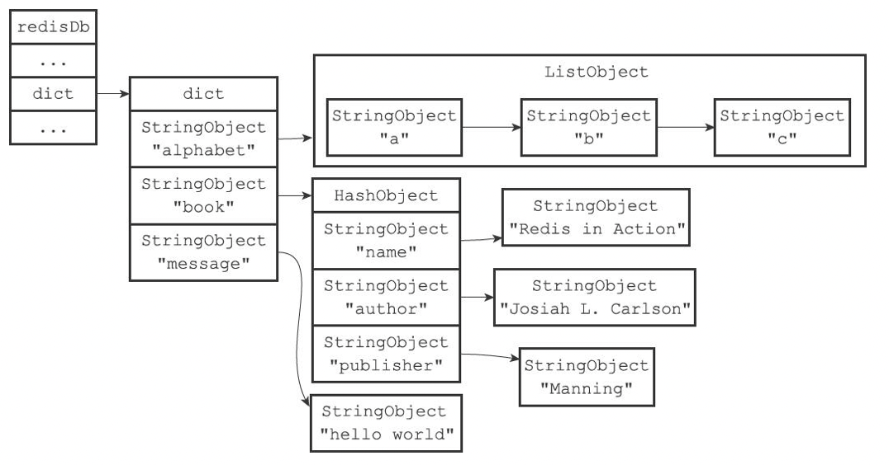
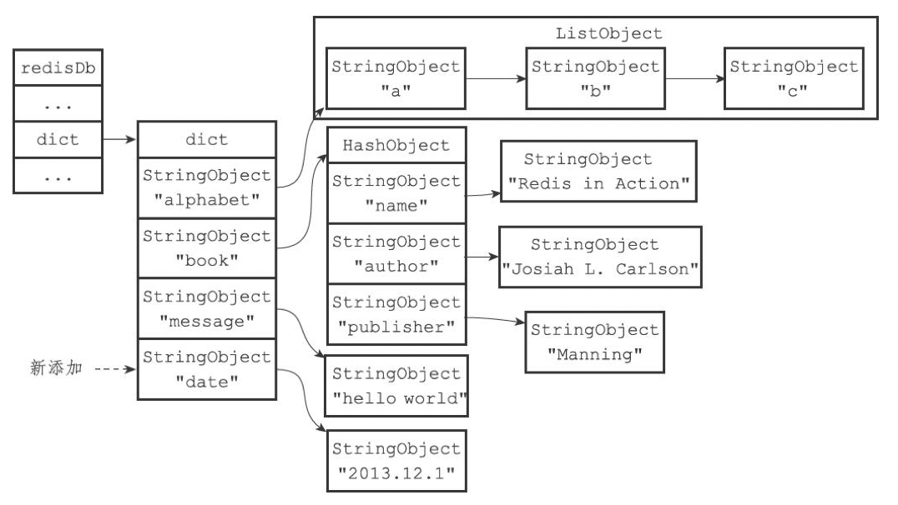
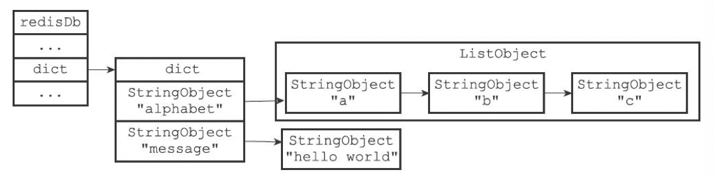
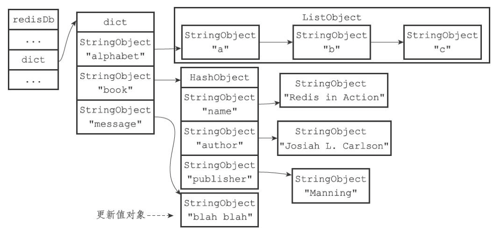
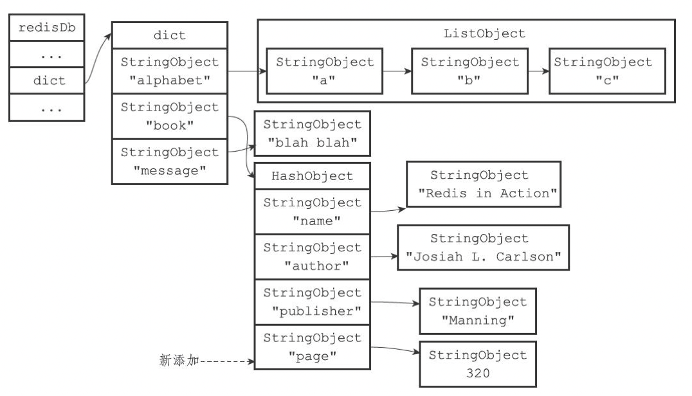
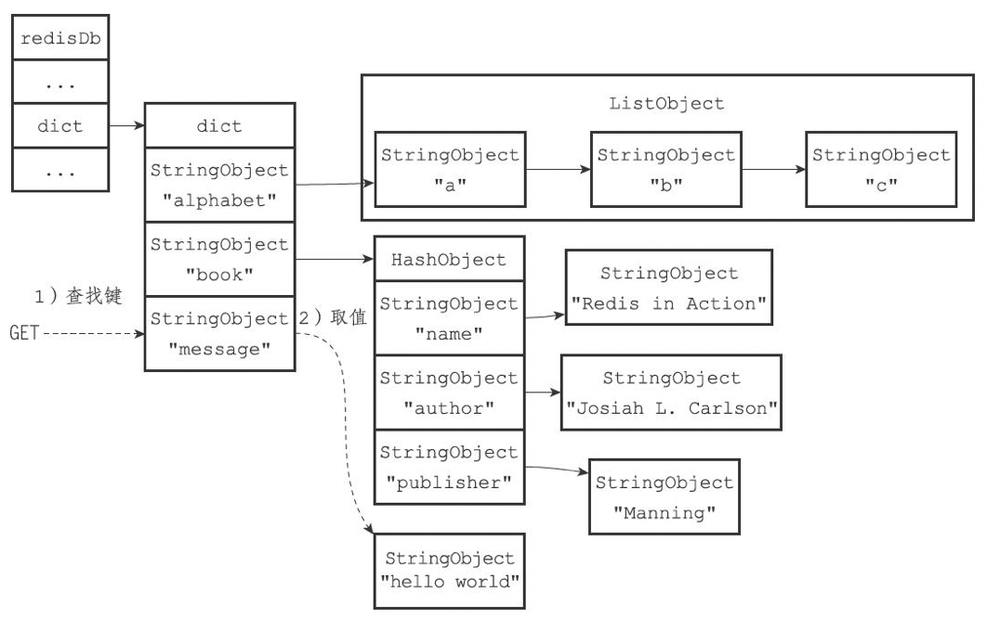
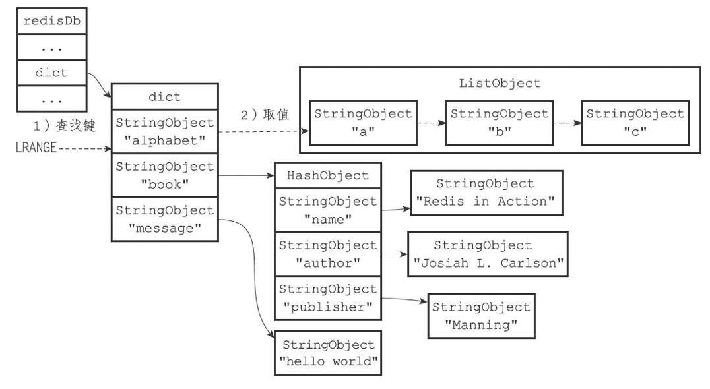

English | [中文版](ansys_db_zh.md)

# Redis Source Code Analysis - Database Implementation

[TOC]


## Definition

### redis server

```c
// redis server
struct redisServer {
	...
	redisDb *db;                /* array of databases */
   ...
	int dbnum;                  /* number of databases, default 16 */
	...
	long long dirty;            /* number of changes since last successful persistence */
	...
	struct saveparam *saveparams;/* parameters for the "save" config <seconds> <changes> */
	...
	time_t lastsave;            /* time of last successful persistence */
	...
	dict *pubsub_channels;      /* pubsub channels dict: key: channel, value: client list */
	list *pubsub_patterns;      /* list of pubsub patterns */
	...
};
```

- `dbnum` is determined by the server configuration option `databases`.

### redis client

```c
/**
 * @brief redis client */
typedef struct redisClient {
	...
	redisDb *db;            /* currently selected database */
   ...
} redisClient;
```

### redis database definition

```c
/**
 * @brief redis database
 */
typedef struct redisDb {
	dict *dict;                 /* keyspace: stores all key-value pairs in the DB */
	dict *expires;              /* expiration dictionary: key -> expire time */
	dict *blocking_keys;        /* Keys with clients waiting for data (BLPOP) */
	dict *ready_keys;           /* Blocked keys that received a PUSH */
	dict *watched_keys;         /* WATCHED keys for MULTI/EXEC CAS */
	struct evictionPoolEntry *eviction_pool;    /* eviction pool of keys */
	int id;                     /* database ID */
	long long avg_ttl;          /* average TTL, for statistics */
} redisDb;
```


## Database switching

1. By default the client targets database 0, but a client can switch target database using the `SELECT` command.
2. Redis does not provide a command to return the client's selected database; it is best to explicitly `SELECT` the desired database before executing other commands.


## Database keyspace

- Keys in the keyspace are string objects.
- Values in the keyspace can be any Redis object type: string, list, hash, set, or sorted set.

Example 1 — add key-value pairs:

```sh
redis> SET message "helloworld"
OK
redis> RPUSH alphabet "a" "b" "c"
(integer) 3
redis> HSET bookname "RedisInAction" "1"
(integer) 1
redis> HSET bookauthor "Josiah L. Carlson" "1"
(integer) 1
redis> HSET bookpublisher "Manning" "1"
(integer) 1
```

The database keyspace structure is shown below:



Example 2 — add a new key:

```sh
redis> SET date "2013.12.1"
OK
```

Keyspace after adding `date`:



Example 3 — delete a key:

```sh
redis> DEL book
(integer) 1
```

Keyspace after deleting `book`:



Example 4 — update a key:

```sh
redis> SET message "blah blah"
OK
```

Keyspace after updating `message`:



Example 5 — update with `HSET`:

```sh
redis> HSET book page 320
(integer) 1
```

Keyspace after updating `page`:



Example 6 — GET operation process:



Example 7 — LRANGE operation process:



### Maintenance operations

When the server executes read/write commands it performs additional maintenance actions on the keyspace:

- After reading a key (both read and write commands read keys), the server updates keyspace hit/miss statistics; viewable via `INFO stats` as `keyspace_hits` and `keyspace_misses`.
- After reading a key, the server updates the key's LRU time; this is used to compute idle time (see `OBJECT idletime`).
- If the server finds a key has expired during a read, it deletes the expired key before continuing.
- If a client is watching a key via `WATCH`, modifying that key marks it as dirty so transactions can detect the change.
- Every modification increments the server-wide `dirty` counter; this counter drives persistence and replication.
- If keyspace notifications are enabled, the server emits configured notifications after modifications.

### Other operations

- `FLUSHDB` — clear the entire database (remove all key-value pairs).
- `RANDOMKEY` — return a random key from the database.
- `DBSIZE` — return the number of keys in the database.
- `EXISTS` TODO
- `RENAME` TODO
- `KEYS` TODO


## Setting TTL / expiration

- `EXPIRE <key> <ttl>`    — set key's TTL in seconds
- `PEXPIRE <key> <ttl>`   — set key's TTL in milliseconds
- `EXPIREAT <key> <timestamp>`  — set expiration to the given UNIX timestamp (seconds)
- `PEXPIREAT <key> <timestamp>` — set expiration to the given UNIX timestamp (milliseconds)
- `TTL <key>`    — return remaining TTL in seconds
- `PTTL <key>`   — return remaining TTL in milliseconds
- `PERSIST <key>` — remove the key's expiration

### Expiration storage

Expiration information in the source:

```c
typedef struct redisDb {
	...
	dict *expires; /* expiration dict: key pointer -> expire time (long long) */
	...
} redisDb;
```

### Determining whether a key is expired

To check if a key is expired:

1. Check whether the key exists in the expiration dict; if present, retrieve its expiration time.
2. Compare current UNIX timestamp to the key's expiration time: if current > expire time, the key is expired; otherwise it is not.


## Expired key deletion strategies

### Timed deletion

(Active) Create a timer when a key's expiration is set; the timer triggers deletion when the expiration time arrives.

### Lazy deletion

(Passive) Do not proactively delete keys. Instead, check a key's expiration when it is accessed; if expired, delete it, otherwise return it.

### Periodic deletion

(Active) Periodically scan the database and delete expired keys.

Challenges of periodic deletion:

1. If runs too frequently or for too long, periodic deletion degenerates into timed deletion and wastes CPU.
2. If it runs too infrequently or too briefly, it behaves like lazy deletion and memory may accumulate.

### Strategy comparison

| Deletion Strategy | Pros & Cons       | Characteristics                      | Summary       |
| ----------------- | ----------------- | ----------------------------------- | ------------- |
| Timed deletion    | Saves memory      | Consumes CPU continuously at high frequency | Time traded for space |
| Lazy deletion     | Higher memory usage | Delayed execution, high CPU utilization | Space traded for time |
| Periodic deletion | Periodic memory cleanup | Uses fixed CPU per second for maintenance | Balanced |


## Redis expiration deletion strategy

Redis uses a combination of lazy deletion and periodic deletion.

Note: Only master nodes are allowed to delete expired keys.

### Implementation of lazy deletion in Redis

```flow
cmd=>start: All DB read/write commands (SET, LRANGE, SADD, HGET, KEYS, etc)
ein=>operation: call expireIfNeeded
getExpire=>operation: get expire time
is_exp_nil=>condition: expire time < 0 ?
is_loading=>condition: loading from disk?
set_now=>operation: set current time
is_master=>condition: current node is master?
is_expire=>condition: is key expired?
propagateExpire=>operation: propagate expire deletion event
notifyKeyspaceEvent=>operation: notify keyspace event
dbDelete=>operation: delete key
return0=>end: return 0
returnexp=>end: return remaining ttl (ms)
return=>end: return

cmd->ein->getExpire->is_exp_nil
is_exp_nil(yes)->return0
is_exp_nil(no)->is_loading
is_loading(yes)->return0
is_loading(no)->set_now->is_master
is_master(no)->returnexp
is_master(yes)->is_expire
is_expire(no)->return0
is_expire(yes)->propagateExpire->notifyKeyspaceEvent->dbDelete->return
```

### Implementation of periodic deletion in Redis

```flow
databasesCron=>start: Redis periodically calls databasesCron
check=>condition: expiration enabled && current node is master?
activeExpireCycle=>operation: start activeExpireCycle in "slow" mode
jump=>end: skip
isDbnTooMuch=>condition: number of DBs to scan > configured DB count?
resetDbn=>operation: reset DB index to scan
dictGetRandomKey=>operation: pick a random key from expires dict
calcTtl=>operation: calculate ttl
activeExpireCycleTryExpire=>operation: call activeExpireCycleTryExpire to check ttl and delete
calcAvgTtl=>operation: calculate average ttl
scanDb=>operation: scan DB
is_finish=>condition: expired keys > ACTIVE_EXPIRE_CYCLE_LOOKUPS_PER_LOOP/4?
return=>end: return

databasesCron->check
check(no)->jump
check(yes)->activeExpireCycle->isDbnTooMuch
isDbnTooMuch(yes)->resetDbn->scanDb
isDbnTooMuch(no)->scanDb
scanDb->dictGetRandomKey->calcTtl->activeExpireCycleTryExpire->calcAvgTtl->is_finish
is_finish(no)->activeExpireCycle
is_finish(yes)->return
```

1. Each `activeExpireCycle` run samples `ACTIVE_EXPIRE_CYCLE_LOOKUPS_PER_LOOP` random keys from the DB and deletes expired ones.
2. A static local variable `current_db` records scan progress across calls.


## Handling of expired keys by AOF, RDB, and replication

### Generating RDB files

1. Expired keys are not saved into newly generated RDB files.

### Loading RDB files

1. If the node is master, expired keys contained in the RDB are ignored during loading.
2. If the node is slave, all keys in the RDB are loaded regardless of expiration.

### AOF writing

1. If a key has expired but hasn't been deleted yet, the AOF will not append a `DEL` command at that moment.
2. When an expired key is deleted, a `DEL` command is appended to the AOF.

### AOF rewrite

1. During AOF rewrite, expired keys are not written to the rewritten AOF file.

### Replication

1. When the master deletes an expired key it explicitly sends a `DEL` command to all slaves so they delete the key.
2. When a slave services client read commands and encounters an expired key, it does not delete the key; slaves are not allowed to delete expired keys.


## Database notifications

Database notifications are of two kinds:

- Key-space notification: notifies which commands were executed on a key
- Key-event notification: notifies which keys were affected by a specific command

Subscribe commands:

```sh
# subscribe to key-space notifications
SUBSCRIBE __keyspace@<dbid>__:<key>
# subscribe to key-event notifications
SUBSCRIBE __keyevent@<dbid>__:<event>
```

### Source implementation

```c
/**
 * @brief send database notification
 * @param type notification type
 * @param event event name
 * @param key the key
 * @param dbid database id where event originated
 **/
void notifyKeyspaceEvent(int type, char *event, robj *key, int dbid) {
	sds chan;
	robj *chanobj, *eventobj;
	int len = -1;
	char buf[24];

	/* If notifications for this class of events are off, return ASAP. */
	if (!(server.notify_keyspace_events & type)) return;

	eventobj = createStringObject(event,strlen(event));

	/* __keyspace@<db>__:<key> <event> notifications. */
	if (server.notify_keyspace_events & REDIS_NOTIFY_KEYSPACE) { /* key-space notification */
		chan = sdsnewlen("__keyspace@",11);
		len = ll2string(buf,sizeof(buf),dbid);
		chan = sdscatlen(chan, buf, len);
		chan = sdscatlen(chan, "__:", 3);
		chan = sdscatsds(chan, key->ptr);
		chanobj = createObject(REDIS_STRING, chan);
		pubsubPublishMessage(chanobj, eventobj);
		decrRefCount(chanobj);
	}

	/* __keyevent@<db>__:<event> <key> notifications. */
	if (server.notify_keyspace_events & REDIS_NOTIFY_KEYEVENT) { /* key-event notification */
		chan = sdsnewlen("__keyevent@",11);
		if (len == -1) len = ll2string(buf,sizeof(buf),dbid);
		chan = sdscatlen(chan, buf, len);
		chan = sdscatlen(chan, "__:", 3);
		chan = sdscatsds(chan, eventobj->ptr);
		chanobj = createObject(REDIS_STRING, chan);
		pubsubPublishMessage(chanobj, key);
		decrRefCount(chanobj);
	}
	decrRefCount(eventobj);
}
```


## Optimization tips

- Keep keys reasonably small; deleting very large keys on expiration can cause significant latency.


## References

[1] Huang Jianhong. Redis Design and Implementation

[2] Keyspace notification (http://redisdoc.com/topic/notification.html)

[3] Redis expired data deletion strategies (https://blog.csdn.net/qq_26417067/article/details/107753597)

