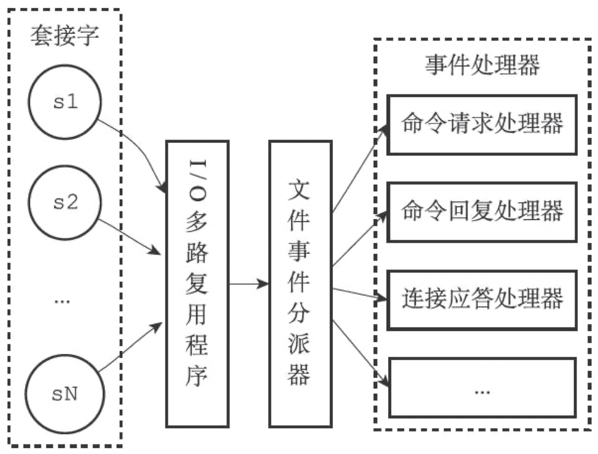
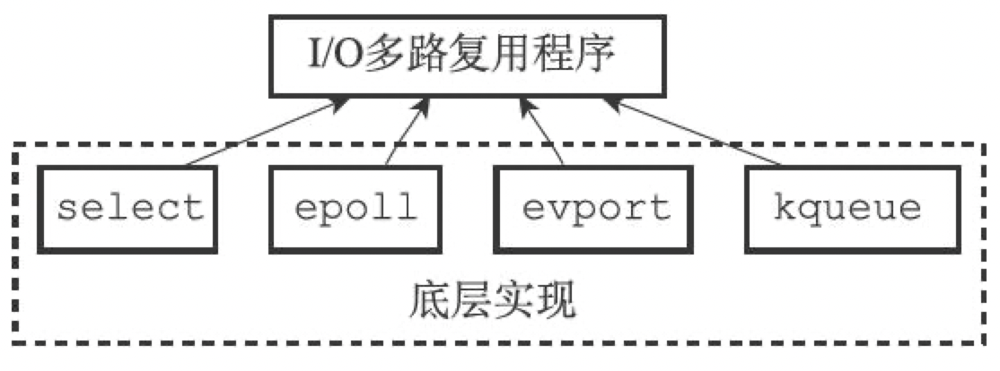
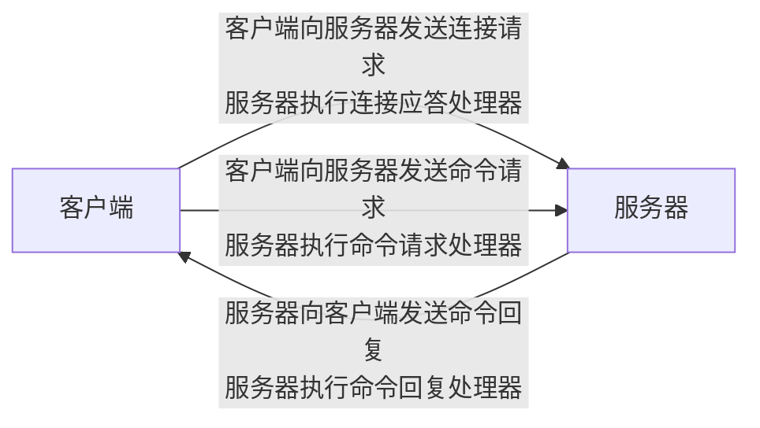
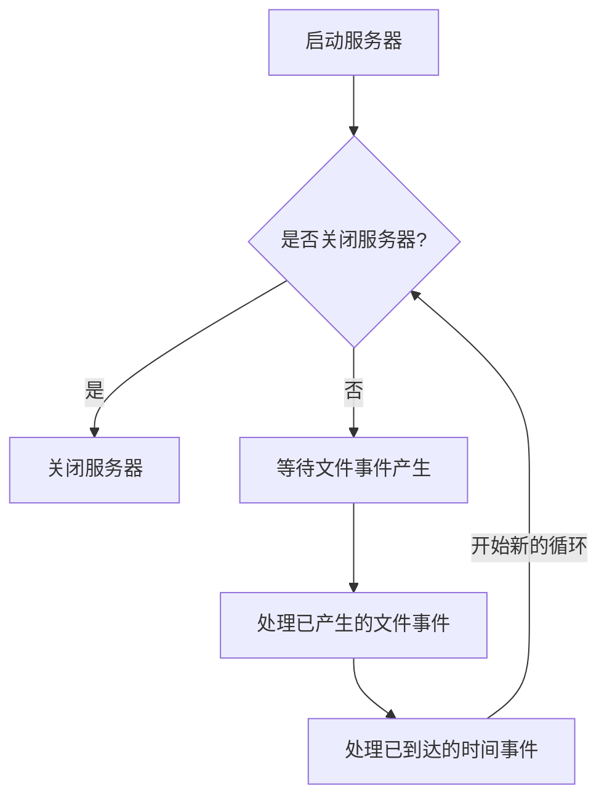

# Redis源码分析-事件

[TOC]


## 文件事件

- 文件事件处理器使用`I/O`多路复用(multiplexing)程序来同时监听多个套接字，并根据套接字目前执行的任务来为套接字关联不同的事件处理器；
- 当被监听的套接字准备好执行连接应答(accept)，读取(read)，写入(write)，关闭(close)等操作时，与操作相对应的文件事件就会产生，这时文件事件处理器就会调用套接字之前关联好的事件处理器来处理这些事件。

### 文件事件处理器的构成



#### I/O多路复用程序的实现



Redis会在编译时自动选择系统中性能最高的I/O多路复用函数库来作为Redis的I/O多路复用程序的底层实现；

#### 事件类型

- `AE_READABLE`：当套接字变得可读时（客户端对套接字执行write操作，或者执行close操作），或者有新的可应答（acceptable）套接字出现时（客户端对服务器的监听套接字执行connect操作），套接字产生AE_READABLE事件。
- `AE_WRITABLE`：当套接字变得可写时（客户端对套接字执行read操作），套接字产生AE_WRITABLE事件。

#### API

- `int aeCreateFileEvent(aeEventLoop *eventLoop, int fd, int mask, aeFileProc *proc, void *clientData)`

  - `eventLoop` 事件循环
  - `fd` 套接字描述符
  - `mask` 事件类型
  - `proc` 事件处理器
  - `clientData` 用户数据
  - 返回值
    - `AE_ERR` 失败
    - `AE_OK` 成功

  监听事件，并对事件与处理器进行关联

- `void aeDeleteFileEvent(aeEventLoop *eventLoop, int fd, int mask)`

  - `eventLoop` 事件循环
  - `fd` 套接字描述符
  - `mask` 事件类型

  取消对套接字事件的监听，解除事件与事件处理器的关联

- `int aeGetFileEvents(aeEventLoop *eventLoop, int fd)`

  - `eventLoop` 事件循环
  - `fd` 套接字描述符
  - 返回值
    - `AE_NONE` 套接字没有任何事件被监听
    - `AE_READABLE` 套接字的读事件正在被监听
    - `AE_WRITABLE` 套接字的写事件正在被监听
    - `AE_READABLE|AE_WRITABLE` 套接字的读和写事件正在被监听

  返回套接字正在被监听的事件类型

- `int aeWait(int fd, int mask, long long milliseconds)`

  - `fd` 套接字描述符
  - `mask` 事件类型
  - `milliseconds` 毫秒数
  - 返回值 产生的套接字事件

  等待在给定的时间内套接字事件的产生（阻塞）

- `static int aeApiPoll(aeEventLoop *eventLoop, struct timeval *tvp)`

  TODO

- `int aeProcessEvents(aeEventLoop *eventLoop, int flags)`

  TODO

- `char *aeGetApiName(void)`

  返回I/O多路复用程序底层所使用的函数库的名称

#### 文件事件的处理器

- `acceptTcpHandler` 连接应答处理器函数

  用于对连接服务器监听套接字的客户端进行应答示例：

  ```mermaid
  graph LR
  客户端 --连接监听套接字--> serv
  subgraph 服务器
  serv(服务器监听套接字产生AE_READABLE事件<br>执行连接应答处理器)
  end
  ```

- `readQueryFromClient` Redis命令请求处理器函数

  用于从套接字中读入客户端发送的命令请求内容示例：

  ```mermaid
  graph LR
  客户端 --发送命令请求--> serv
  subgraph 服务器
  serv(客户端套接字产生AE_READABLE事件,<br>执行命令请求处理器)
  end
  ```

- `sendReplyToClient` Redis命令回复处理器

  用于将服务器执行命令后得到的命令回复通过套接字返回给客户端示例：

  ```mermaid
  graph LR
  subgraph 服务器
  serv(客户端套接字产生AE_WRITABLE事件,<br>执行命令回复处理器)
  end
  serv --发送命令回复--> 客户端
  ```

一次完整的客户端与服务器连接事件示例：




## 时间事件

Redis的时间事件分为以下类别：

- `定时事件` 让一段程序在指定的时间之后执行一次
- `周期性事件` 让一段程序每隔指定时间就执行一次

一个时间事件主要由以下属性组成：

- `id` 服务器为时间事件创建的全局唯一ID（标识号），ID号从小到大的顺序递增；
- `when` 毫秒精度的UNIX时间戳，记录了时间事件的到达（arrive）时间；
- `timeProc` 时间事件处理器，一个函数；当时间事件到达时，服务器就会调用相应的处理器来处理事件。

一个时间事件是定时事件还是周期性事件取决于时间事件处理器的返回值：

- `AE_NOMORE` 定时事件；该事件在到达一次之后就会被删除，之后不再到达。
- 非`AE_NOMORE` 周期性事件；当一个时间事件到达之后，服务器会根据事件处理器返回的值，对时间事件的when属性进行更新，让这个事件在一段时间之后再次到达，并以这种方式一直更新并运行下去。

### API

- `long long aeCreateTimeEvent(aeEventLoop *eventLoop, long long milliseconds, aeTimeProc *proc, void *clientData, aeEventFinalizerProc *finalizerProc)`

  - `eventLoop` 事件循环
  - `milliseconds` 毫秒数
  - `proc` 事件处理器
  - `clientData` 客户端数据
  - `finalizerProc` 事件被删除时的回调函数
  - 返回值
    - `AE_ERR` 失败
    - `时间事件ID` 成功

  将一个新的时间事件添加到服务器，并设置事件处理器为proc；

- 将一个新的时间事件添加到服务器，并设置事件处理器为proc

- `int aeDeleteTimeEvent(aeEventLoop *eventLoop, long long id)`

  - `eventLoop` 事件循环
  - `id` 事件ID
  - 返回值
    - `AE_OK` 成功
    - `AE_ERR` 失败

  删除一个时间事件；

- `static aeTimeEvent *aeSearchNearestTimer(aeEventLoop *eventLoop)`

  - `eventLoop` 事件循环
  - 返回值
    - 成功 最近的时间事件
    - 失败 NULL

  返回到达时间距离当前时间最接近的那个时间事件；

- `static int processTimeEvents(aeEventLoop *eventLoop)`

  - `eventLoop` 事件循环
  - 返回值 已到达的时间事件数量

  遍历所有已到达的时间事件，并调用这些事件的处理器；


## 事件的调度与执行

事件处理角度下的服务器运行流程：



事件的调度和执行规则：

1. `aeApiPoll`函数的最大阻塞事件由到达事件最接近当前时间的时间事件决定，这个方法既可以避免服务器对时间事件进行频繁的轮询（忙等待），也可以确保`aeApiPool`函数不会阻塞过长时间。
2. 因为文件事件是随机出现的，如果等待并处理完一次文件事件之后，仍未有任何时间事件到达，那么服务器将再次等待并处理文件事件。随着文件事件的不断执行，时间会逐渐向时间事件所设置的到达时间逼近，并最终来到到达时间，这时服务器就可以开始处理到达的时间事件了。
3. 对文件事件和时间事件的处理都是同步，有序，原子地执行的，服务器不会中途中断事件处理，也不会对事件进行抢占，因此，不管是文件事件的处理器，还是时间事件的处理器，他们都会尽可能的减少程序的阻塞事件，并在有需要时主动让出执行权，从而降低造成事件饥饿的可能性。
4. 因为时间事件在文件事件之后执行，并且事件之间不会出现抢占，所以时间事件的实际处理时间，通常会比时间事件设定的到达时间稍晚一些。


## 参考

[1] 黄健宏.Redis设计与实现