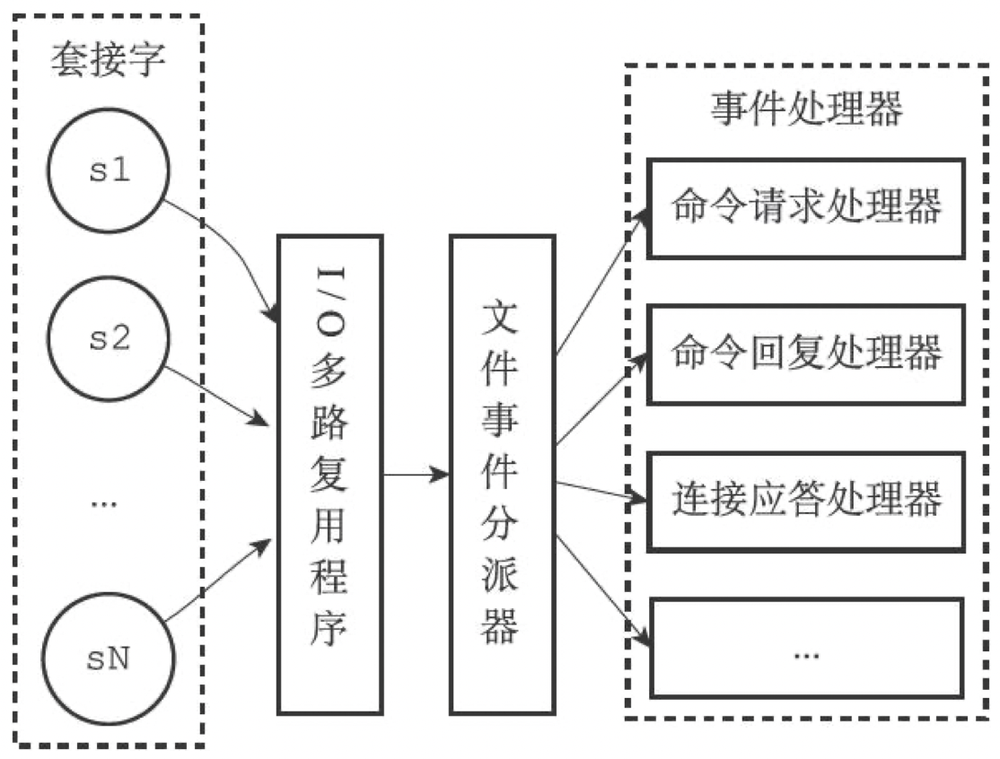
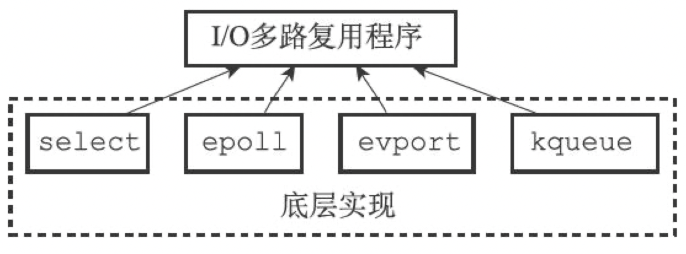
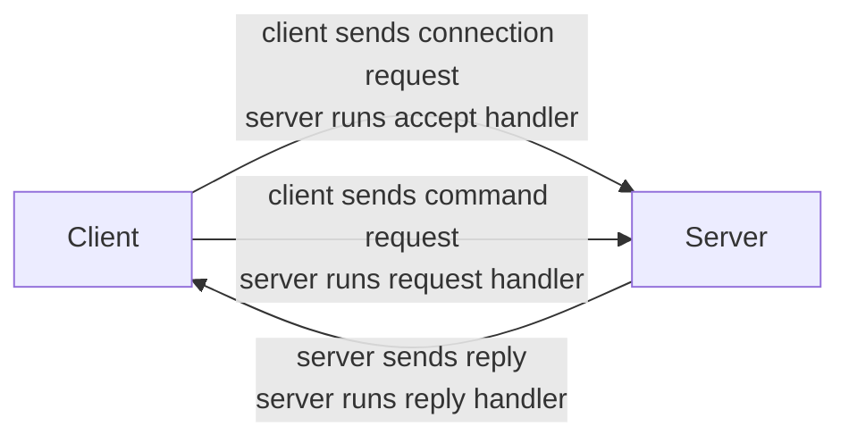

English | [中文版](ansys_event_zh.md)

# Redis Source Code Analysis - Events

[TOC]


## File Events

- The file event subsystem uses I/O multiplexing to listen on many sockets concurrently and associates different event handlers with sockets depending on the operations they will perform.
- When a watched socket becomes ready to accept, read, write, close, etc., the corresponding file event is generated and the event loop invokes the handler previously associated with that socket.

### File event subsystem components



#### I/O multiplexing implementation



Redis chooses the highest-performance I/O multiplexing facility available on the target system at compile time.

#### Event types

- `AE_READABLE`: generated when a socket becomes readable (the client wrote to the socket or closed it), or when a new acceptable connection is available (a client connected to a listening socket).
- `AE_WRITABLE`: generated when a socket becomes writable (the client read from the socket).

#### API

- `int aeCreateFileEvent(aeEventLoop *eventLoop, int fd, int mask, aeFileProc *proc, void *clientData)`

	- `eventLoop` event loop
	- `fd` socket descriptor
	- `mask` event mask
	- `proc` event handler
	- `clientData` user data
	- return:
		- `AE_ERR` failure
		- `AE_OK` success

	Register an event and associate a handler with it.

- `void aeDeleteFileEvent(aeEventLoop *eventLoop, int fd, int mask)`

	- `eventLoop` event loop
	- `fd` socket descriptor
	- `mask` event mask

	Unregister an event and remove its handler association.

- `int aeGetFileEvents(aeEventLoop *eventLoop, int fd)`

	- `eventLoop` event loop
	- `fd` socket descriptor
	- return:
		- `AE_NONE` no events registered
		- `AE_READABLE` read event registered
		- `AE_WRITABLE` write event registered
		- `AE_READABLE|AE_WRITABLE` both read and write registered

	Return the mask of events currently registered for the socket.

- `int aeWait(int fd, int mask, long long milliseconds)`

	- `fd` socket descriptor
	- `mask` event mask
	- `milliseconds` timeout in ms
	- return: generated socket events

	Block waiting for socket events up to the given timeout.

- `static int aeApiPoll(aeEventLoop *eventLoop, struct timeval *tvp)`

	TODO

- `int aeProcessEvents(aeEventLoop *eventLoop, int flags)`

	TODO

- `char *aeGetApiName(void)`

	Return the name of the underlying I/O multiplexing implementation.

#### File event handlers

- `acceptTcpHandler` — accept handler

	Example: handle an incoming connection on the listening socket.

	```mermaid
	graph LR
	Client --connects to listening socket--> serv
	subgraph Server
	serv(Listening socket becomes AE_READABLE\naccept handler runs)
	end
	```

- `readQueryFromClient` — request reader

	Example: read a command request from a client socket when it becomes readable.

	```mermaid
	graph LR
	Client --sends command request--> serv
	subgraph Server
	serv(Client socket becomes AE_READABLE,\ncommand request handler runs)
	end
	```

- `sendReplyToClient` — reply sender

	Example: write a command reply back to the client when the socket becomes writable.

	```mermaid
	graph LR
	subgraph Server
	serv(Client socket becomes AE_WRITABLE,\nreply handler runs)
	end
	serv --sends reply--> Client
	```

Full client-server interaction example:


```mermaid
graph LR
Client --client sends connection request\nserver runs accept handler--> Server
Client --client sends command request\nserver runs request handler--> Server
Server --server sends reply\nserver runs reply handler--> Client
```


## Time Events

Redis time events fall into two categories:

- One-shot events: run once at a specified time
- Periodic events: run repeatedly at fixed intervals

A time event has these main attributes:

- `id` global unique ID assigned by the server (monotonic increasing)
- `when` arrival time as a UNIX timestamp in milliseconds
- `timeProc` handler function invoked when the event arrives

An event is one-shot or periodic depending on the handler's return value:

- `AE_NOMORE`: one-shot — the event is removed after firing once
- non-`AE_NOMORE`: periodic — the handler's return updates the `when` so the event fires again later

### API

- `long long aeCreateTimeEvent(aeEventLoop *eventLoop, long long milliseconds, aeTimeProc *proc, void *clientData, aeEventFinalizerProc *finalizerProc)`

	- `eventLoop` event loop
	- `milliseconds` milliseconds from now or absolute time (API semantics)
	- `proc` handler
	- `clientData` user data
	- `finalizerProc` callback when the event is deleted
	- return:
		- `AE_ERR` failure
		- `time event id` success

	Add a new time event and set its handler to `proc`.

- `int aeDeleteTimeEvent(aeEventLoop *eventLoop, long long id)`

	- `eventLoop` event loop
	- `id` event id
	- return:
		- `AE_OK` success
		- `AE_ERR` failure

	Delete a time event.

- `static aeTimeEvent *aeSearchNearestTimer(aeEventLoop *eventLoop)`

	- `eventLoop` event loop
	- return: the nearest upcoming time event, or NULL

- `static int processTimeEvents(aeEventLoop *eventLoop)`

	- `eventLoop` event loop
	- return: number of processed time events

	Iterate over due time events and invoke their handlers.


## Event scheduling and execution

Server run loop from the event perspective:

```mermaid
graph TD
start Server --> is_close{Server closing?}
is_close --yes--> Close server
is_close --no--> Wait for file events --> Process generated file events --> Process due time events --start next loop--> is_close
```

Scheduling and execution rules:

1. The maximum blocking time for `aeApiPoll` is determined by the nearest time event; this avoids busy-waiting while ensuring `aeApiPoll` doesn't block too long.
2. File events are asynchronous and can appear randomly. If, after processing file events, no time events are due, the server waits again for file events. As file events are handled, time advances toward the next time event and eventually the server will process due time events.
3. File and time event handlers run synchronously, in-order, and atomically — handlers are not preempted. Handlers should minimize blocking and yield when appropriate to avoid starvation.
4. Because time events are processed after file events and there is no preemption, actual handling of a time event may occur slightly after its scheduled arrival time.


## References

[1] Huang Jianhong. Redis Design and Implementation

