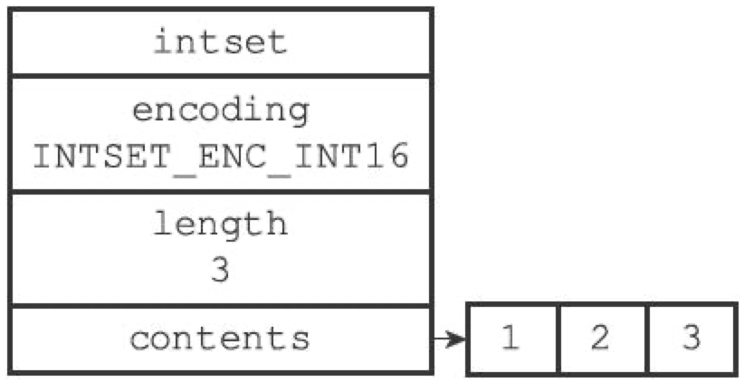
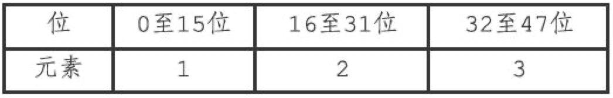
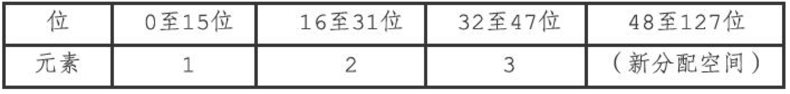
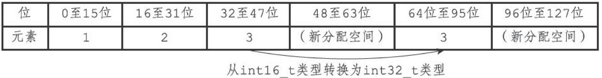
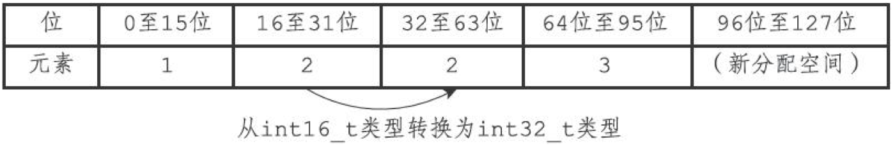
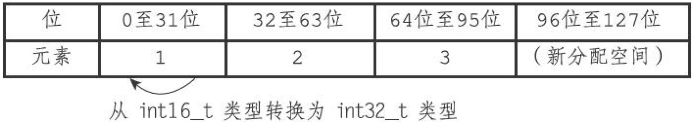
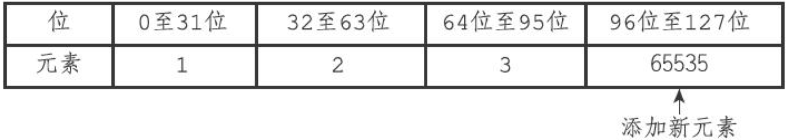
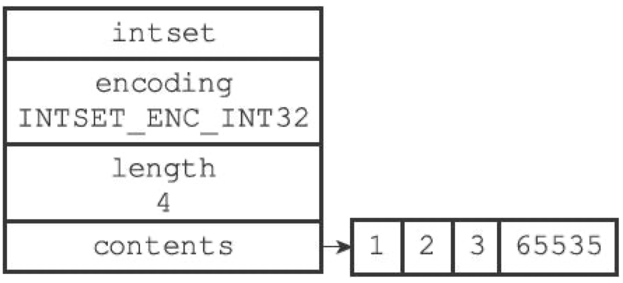

English | [中文版](ansys_intset_zh.md)

# Redis Source Code Analysis - intset

[TOC]


## API

| Function       | Purpose                                 | Time Complexity                                                  |
| -------------- | --------------------------------------- | ---------------------------------------------------------------- |
| intsetNew      | Create a new integer set                | $O(1)$                                                            |
| intsetAdd      | Add the given element into the set      | $O(N)$                                                            |
| intsetRemove   | Remove the given element from the set   | $O(N)$                                                            |
| intsetFind     | Check whether a value exists in the set | Because the underlying array is ordered, binary search is used, so $O(\log N)$ |
| intsetRandom   | Return a random element from the set    | $O(1)$                                                            |
| intsetGet      | Get the element at a given index        | $O(1)$                                                            |
| intsetLen      | Return number of elements in the set    | $O(1)$                                                            |
| intsetBlobLen  | Return memory bytes used by the set     | $O(1)$                                                            |


## Definition

### Integer set

```c
// integer set
typedef struct intset {
	uint32_t encoding; // encoding: INTSET_ENC_INT16, INTSET_ENC_INT32, INTSET_ENC_INT64
	uint32_t length;   // number of elements in the set, length of contents
	int8_t contents[]; // array storing elements in ascending order without duplicates (actual item size depends on encoding)
} intset;
```

### Encodings

```c
#define INTSET_ENC_INT16 (sizeof(int16_t)) // int16_t encoding, [-32768, 32767]
#define INTSET_ENC_INT32 (sizeof(int32_t)) // int32_t encoding, [-2147483648, 2147483647]
#define INTSET_ENC_INT64 (sizeof(int64_t)) // int64_t encoding, [-9223372036854775808, 9223372036854775807]
```


## Upgrade

When adding an element that exceeds the current encoding range, the integer set must be upgraded before inserting the new element.

The upgrade-and-insert process consists of the following steps:

1. Resize the underlying array to fit the new element type and allocate space for the new element.
2. Convert all existing elements in the array to the new element type and place them in the correct positions, maintaining the array's sorted order during placement.
3. Insert the new element into the underlying array.

Example: inserting the int32 value `65535` into an `INTSET_ENC_INT16` set.

















Placement rules after upgrade:

- If the new element is smaller than all existing elements, it is placed at the beginning.
- If the new element is larger than all existing elements, it is placed at the end.

Set before insertion:

| intset | encoding         | length | contents  |
| ------ | ---------------- | ------ | --------- |
|        | INTSET_ENC_INT16 | 3      | `|1|2|3|` |

Set after insertion:

| intset | encoding         | length | contents           |
| ------ | ---------------- | ------ | ------------------ |
|        | INTSET_ENC_INT32 | 4      | `|1|2|3|65535|`    |

### Advantages of upgrade

1. Improved flexibility

   The integer set can automatically upgrade the underlying array to accommodate new elements, so you can insert int16_t, int32_t or int64_t values without type errors.

2. Memory savings


## References

[1] Huang Jianhong. Redis Design and Implementation
