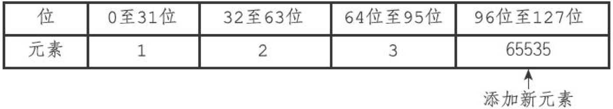

# Redis源码分析-intset


<!-- vim-markdown-toc GFM -->

* [API](#api)
* [定义](#定义)
    - [整数集合](#整数集合)
    - [编码方式](#编码方式)
* [升级](#升级)
    - [升级的优点](#升级的优点)
* [参考](#参考)

<!-- vim-markdown-toc -->


## API

| 函数          | 作用                           | 时间复杂度                                                   |
| ------------- | ------------------------------ | ------------------------------------------------------------ |
| intsetNew     | 创建一个新的压缩列表           | $O(1)$                                                       |
| intsetAdd     | 将给定元素添加到整数集合里面   | $O(N)$                                                       |
| intsetRemove  | 从整数集合中移除给定元素       | $O(N)$                                                       |
| intsetFind    | 检查给定值是否存在于集合       | 因为底层数组有序，查找可以通过二分查找法来进行，所以复杂度为$O(logN)$ |
| intsetRandom  | 从整数集合中随机返回一个元素   | $O(1)$                                                       |
| intsetGet     | 取出底层数组在给定索引上的元素 | $O(1)$                                                       |
| intsetLen     | 返回整数集合包含的元素个数     | $O(1)$                                                       |
| intsetBlobLen | 返回整数集合占用的内存字节数   | $O(1)$                                                       |


## 定义

### 整数集合

```c
// 整数集合
typedef struct intset {
    uint32_t encoding; // 编码方式 INTSET_ENC_INT16,INTSET_ENC_INT32,INTSET_ENC_INT64
    uint32_t length;   // 集合包含的元素数量，contents的长度
    int8_t contents[]; // 保存元素的数组，从小到大排序，不包含重复项(item不一定为int8_t，取决于编码方式)
} intset;
```

### 编码方式

```c
#define INTSET_ENC_INT16 (sizeof(int16_t)) // 编码方式int16_t，[-32768, 32767]
#define INTSET_ENC_INT32 (sizeof(int32_t)) // 编码方式int32_t，[-2147483648, 2147483647]
#define INTSET_ENC_INT64 (sizeof(int64_t)) // 编码方式int64_t，[-9223372036854775808，9223372036854775807]
```


## 升级

当添加元素时，新的元素超出了当前编码方式的元素最大值，整数集合需要先进行升级(upgrade)，然后才能将新元素添加到整数集合里面

升级并添加新元素分为以下步骤：

1. 根据新元素的类型，扩展整数集合底层数组的空间大小，并为新元素分配空间
2. 将底层数组现有的所有元素都转换成与新元素相同的类型，并将类型转换后的元素放置到正确位上，而且在放置元素的过程中，需要继续维持底层数组的有序性质不变
3. 将新元素添加到底层数组里面

例，将int32_t类型的整数65535添加到`INTSET_ENC_INT16`编码的整数集合





升级之后的新元素摆放位置：

- 在新元素小于所有元素的情况下，新元素放在最开头
- 在新元素大于所有元素的情况下，新元素放在最末尾

添加前的整数集合：

| intset | encoding         | length | contents  |
| ------ | ---------------- | ------ | --------- |
|        | INTSET_ENC_INT16 | 3      | `|1|2|3|` |

添加后的整数集合：

| intset | encoding         | length | contents        |
| ------ | ---------------- | ------ | --------------- |
|        | INTSET_ENC_INT32 | 4      | `|1|2|3|65535|` |

### 升级的优点

1. 提升灵活性

   整数集合可以通过自动升级底层数组来适应新元素，所以我们可以随意地将int16_t，int32_t或者int64_t类型的整数添加到集合中，而不必担心出现类型错误。

2. 节约内存


## 参考

[1] 黄健宏.Redis设计与实现
