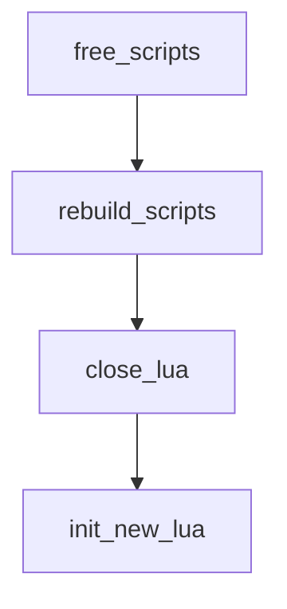
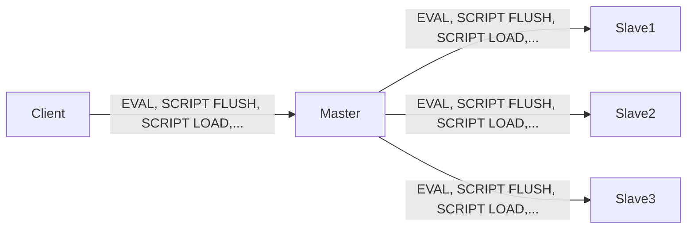
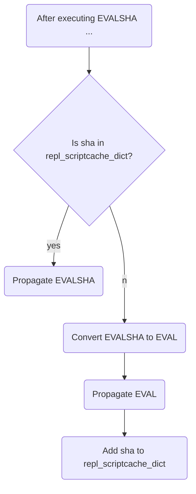

English | [中文版](ansys_lua_zh.md)

# Redis Source Code Analysis - Lua Scripting

[TOC]
 
Redis introduced Lua scripting support starting from version 2.6.

## Creating and preparing the Lua environment

Redis creates and customizes a Lua environment as follows:

1. Create a base Lua state; all subsequent modifications are applied to this state.
2. Load multiple standard and auxiliary libraries into the Lua state so scripts can use them to operate on data.
3. Create a global `redis` table exposing helper functions such as `redis.call` to execute Redis commands from scripts.
4. Replace Lua's built-in side-effecting random functions with Redis-provided deterministic replacements to avoid side effects.
5. Create sorting helper utilities so certain Redis command results can be deterministically ordered.
6. Create an error-wrapper helper for `redis.pcall` to provide richer error reporting.
7. Protect the Lua global environment to prevent user scripts from accidentally introducing new globals.
8. Store the prepared Lua environment on the server state for later use when executing scripts.

### Creating the Lua state

A new Lua state is created using Lua's C API `lua_open`.

### Loading libraries

The server loads the following libraries into the Lua state:

- base library
- table library
- string library
- math library
- debug library
- Lua CJSON library
- struct library
- Lua cmsgpack library

### Creating the global `redis` table

Redis exposes a global `redis` table providing helpers used by scripts:

- `redis.call` and `redis.pcall` — execute Redis commands from Lua
- `redis.log` — log to the Redis log
- `redis.sha1hex` — compute SHA1 checksums
- `redis.error_reply` and `redis.status_reply` — construct replies for errors and status messages

### Replacing Lua random functions

Redis requires that all scripts and functions executed by the server be side-effect free. To help ensure this, Redis replaces Lua's default random functions with server-provided deterministic equivalents.

### Creating sorting helpers

Redis treats the following commands as non-deterministic (their result ordering may vary):

- SINTER, SUNION, SDIFF, SMEMBERS, HKEYS, HVALS, KEYS

Helper sorting functions are provided so script-visible results can be deterministically ordered when needed.

### Error wrapper for `redis.pcall`

Redis installs an internal handler named `__redis__err__handler` to wrap errors produced by `redis.pcall`, improving error messages.

### Protecting the Lua global environment

The server protects the global environment to avoid accidental global variable creation when a script omits `local` declarations.

### Storing the Lua environment on the server

The prepared Lua state is stored on the server `redisServer` structure:

```c
/** @brief redis server */
struct redisServer {
		/* Scripting */
		lua_State *lua;           /* Lua state */
		redisClient *lua_client;  /* pseudo-client for the Lua interpreter */
		redisClient *lua_caller;  /* the client currently running EVAL, or NULL */
		dict *lua_scripts;        /* scripts dictionary: key = SHA1, value = script */
		mstime_t lua_time_limit;  /* script timeout in milliseconds */
		mstime_t lua_time_start;  /* script start time (ms) */
		int lua_write_dirty;      /* true if a write command was called during the script */
		int lua_random_dirty;     /* true if a random command was called during the script */
		int lua_timedout;         /* true if the script reached the time limit */
		int lua_kill;             /* kill the script if true */
};
```


## Lua environment collaborators

### The pseudo-client

When a Lua script calls `redis.call` or `redis.pcall`, the server uses a pseudo-client to execute the requested Redis command on behalf of the script:

```sequence
Title: Steps when a Lua script executes a Redis command
Lua environment->pseudo-client: deliver the command requested by redis.call
pseudo-client-->command executor: forward command for execution
command executor->pseudo-client: return command result
pseudo-client-->Lua environment: return result to Lua
```

1. The Lua environment sends the command requested by `redis.call`/`redis.pcall` to the pseudo-client.
2. The pseudo-client forwards the command to the command executor.
3. The executor runs the command and returns the result to the pseudo-client.
4. The pseudo-client returns the result to the Lua environment.
5. The Lua environment returns the result to the calling `redis.call`/`redis.pcall` wrapper.

### `lua_scripts` dictionary

Redis stores any script executed via `EVAL` or loaded with `SCRIPT LOAD` in `lua_scripts` so the server can implement `SCRIPT EXISTS` and script replication:

```c
/** @brief redis server */
struct redisServer {
		...
		dict *lua_scripts; /* key = script SHA1, value = script */
		...
};
```


## Implementing `EVAL`

Example:

```sh
redis> EVAL "return 'hello world'" 0
```

`EVAL` execution steps:

1. Define a Lua function in the Lua state using the supplied script.
2. Save the script into `lua_scripts` for future reference.
3. Call the defined Lua function to execute the script.

### Defining the script function

Redis defines the function name as `f_` plus the script's SHA1 (40 hex chars); the function body is the script itself.

Example:

```sh
EVAL "return 'hello world'" 0
```

Redis defines in Lua:

```lua
function f_5332031c6b470dc5a0dd9b4bf2030dea6d65de91()
		return 'hello world'
end
```

Benefits of storing the script as a function:

1. Execution is trivial — just call the function.
2. Function local scope keeps the Lua state clean, reduces GC pressure, and avoids globals.
3. If the function exists, the server can execute the script by SHA1 without providing the script body (EVALSHA semantics).

### Saving the script to `lua_scripts`

`EVAL` saves the supplied script into the server `lua_scripts` dictionary for `SCRIPT EXISTS` and replication.

### Executing the script function

Execution flow:

1. Populate `KEYS` and `ARGV` arrays in Lua from the EVAL's key and arg parameters; expose them as global variables to the script.
2. Install a timeout hook into the Lua state so the script can be killed via `SCRIPT KILL` or server shutdown if it overruns.
3. Execute the script function.
4. Remove the timeout hook.
5. Place the result into the client's output buffer for the server to send back.
6. Run garbage collection in the Lua state as needed.


## Implementing `EVALSHA`

`EVALSHA <sha1> <numkeys> [keys..] [args..]` executes a script identified by SHA1.

If the script is not present on a replica, `EVALSHA` may fail; the server handles this during replication (see replication notes) by substituting the full `EVAL` when necessary.


## Script management commands

### `SCRIPT FLUSH`

`SCRIPT FLUSH` clears all script-related state: it frees and recreates `lua_scripts`, closes the current Lua state and reinitializes a fresh one.



### `SCRIPT EXISTS`

`SCRIPT EXISTS` checks whether the provided SHA1s are present in `lua_scripts`. Multiple SHA1s can be checked at once.

### `SCRIPT LOAD`

`SCRIPT LOAD` defines the function in the Lua state and stores the script in `lua_scripts`.

Example:

```sh
redis> SCRIPT LOAD "return 'hi'"
"2f31ba2bb6d6a0f42cc159d2e2dad55440778de3"
```

Lua function created:

```lua
function f_2f31ba2bb6d6a0f42cc159d2e2dad55440778de3()
	return 'hi'
end
```

### `SCRIPT KILL`

If `lua-time-limit` is configured, Redis installs a periodic timeout hook into the Lua state before executing a script. The hook checks script execution time and, if over the limit, inspects whether a `SCRIPT KILL` or `SHUTDOWN` command has arrived; if so it will terminate execution.

Hooked execution flow:

```mermaid
graph TD
start-->IsEnd{Script finished?}
IsEnd --yes--> return
IsEnd --no--> IsTimeout{Has the hook detected a timeout?}
IsTimeout --no--> Continue --> IsEnd
IsTimeout --yes--> IsArrive{Has SCRIPT KILL or SHUTDOWN arrived?}
IsArrive --no--> Continue
IsArrive --yes--> perform kill or shutdown
```


## Script replication

When propagating commands to replicas, the master forwards the executed command (EVAL, SCRIPT FLUSH, SCRIPT LOAD, etc.) to all slaves.



### Replicating `EVAL`, `SCRIPT FLUSH`, and `SCRIPT LOAD`

- `EVAL`: the script executed on the master is also executed on all slaves.
- `SCRIPT FLUSH`: the master propagates `SCRIPT FLUSH` to all slaves.
- `SCRIPT LOAD`: the master propagates `SCRIPT LOAD` to ensure slaves load the same script.

### Replicating `EVALSHA`

Because masters and slaves may not have the same script caches, `EVALSHA` could fail on a slave if the script is missing. To ensure correctness, the master only propagates `EVALSHA` if it is safe — i.e., the master knows the script has already been propagated to all slaves. The master tracks propagated scripts using `repl_scriptcache_dict`:

```c
/** @brief redis server */
struct redisServer {
	...
		/* Replication script cache. */
		dict *repl_scriptcache_dict; /* scripts propagated to slaves: keys = SHA1 */
		list *repl_scriptcache_fifo; /* FIFO LRU eviction */
	...
};
```

Replication rules:

1. The master clears `repl_scriptcache_dict` whenever a new slave is added.
2. When executing `EVALSHA`, the master checks `repl_scriptcache_dict`:
	 - If the SHA1 is present, propagate the `EVALSHA` as-is.
	 - If missing, convert to the equivalent `EVAL` (using the script body from `lua_scripts`), propagate the `EVAL`, and add the SHA1 to `repl_scriptcache_dict`.

Flow:




## References

[1] Huang Jianhong. Redis Design and Implementation

