English | [中文版](ansys_map_zh.md)

# Redis Source Code Analysis - Dictionary

[TOC]

## API

| Function           | Purpose                                                       | Time Complexity                      |
| ------------------ | ------------------------------------------------------------- | ------------------------------------ |
| dictCreate         | Create a new dictionary                                       | $O(1)$                               |
| dictAdd            | Add the given key-value pair to the dictionary                | $O(1)$                               |
| dictReplace        | Add or replace a key-value pair (replace if key exists)       | $O(1)$                               |
| dictFetchValue     | Return the value for a given key                              | $O(1)$                               |
| dictGetRandomKey   | Return a random key-value pair from the dictionary            | $O(1)$                               |
| dictDelete         | Remove the key-value pair for a given key                     | $O(1)$                               |
| dictRelease        | Release the dictionary and all contained entries              | $O(N)$, N = number of entries        |


## Definition

### dictType

```c
typedef struct dictType { // operations for keys/values
	unsigned int (*hashFunction)(const void *key);      // compute hash
	void *(*keyDup)(void *privdata, const void *key);   // duplicate key
	void *(*valDup)(void *privdata, const void *obj);   // duplicate value
	int (*keyCompare)(void *privdata, const void *key1, // compare keys
					  const void *key2);
	void (*keyDestructor)(void *privdata, void *key);   // destroy key
	void (*valDestructor)(void *privdata, void *obj);   // destroy value
} dictType;

typedef struct dict { // dictionary
	dictType *type; // type-specific functions
	void *privdata; // private data
	dictht ht[2];   // two hash tables (for incremental rehash)
	long rehashidx; // rehash index; -1 when not rehashing
	int iterators;  // number of active iterators
} dict;
```

### Hash table

```c
typedef struct dictht { // hash table
	dictEntry **table;      // array of pointers to entries
	unsigned long size;     // size of the table
	unsigned long sizemask; // size mask used to compute indices (always size-1)
	unsigned long used;     // number of used entries
} dictht;
```

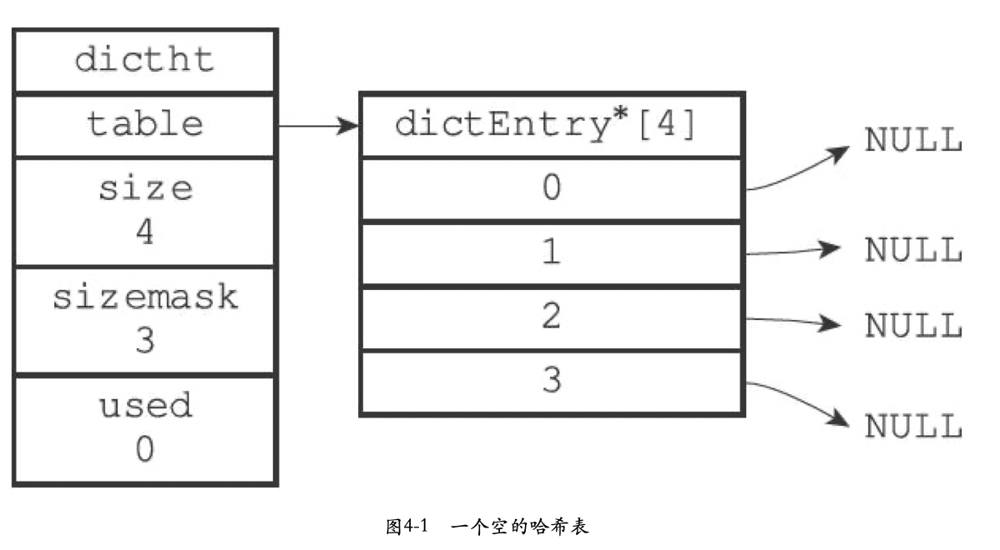

### Hash table entry

```c
typedef struct dictEntry { // hash table node
	void *key;              // key
	union {
		void *val;
		uint64_t u64;
		int64_t s64;
		double d;
	} v;                    // value
	struct dictEntry *next; // next entry in the same bucket (separate chaining)
} dictEntry;
```

Entries with the same index are linked via `next`, e.g., keys k1 and k0:

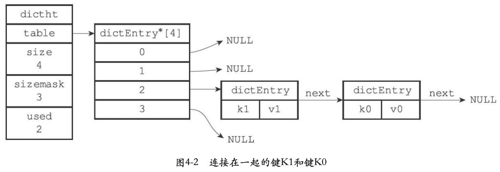


## Hash algorithm

Redis uses MurmurHash2 to compute key hashes.

Inserting into an empty dictionary example:

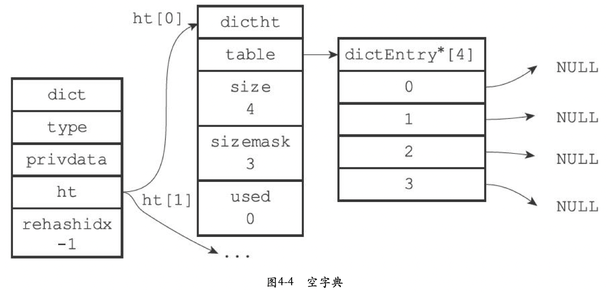

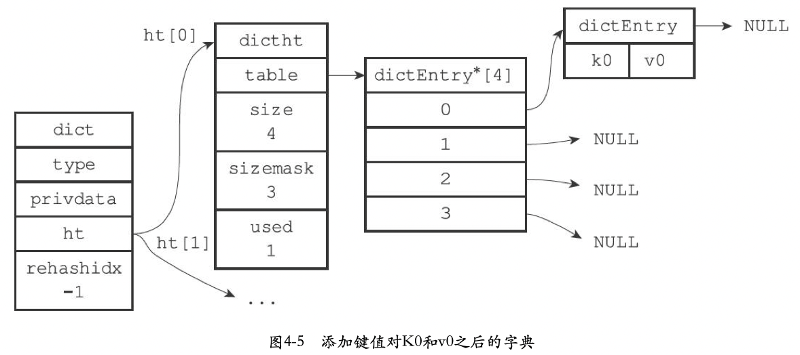


## Collision resolution

Redis uses separate chaining to resolve hash collisions.

Example of a hash table with two entries resolving collisions:

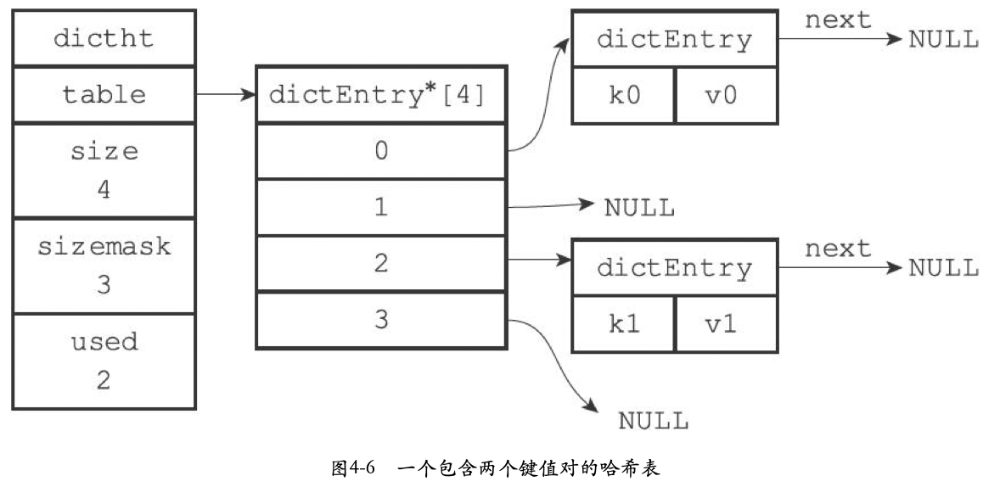

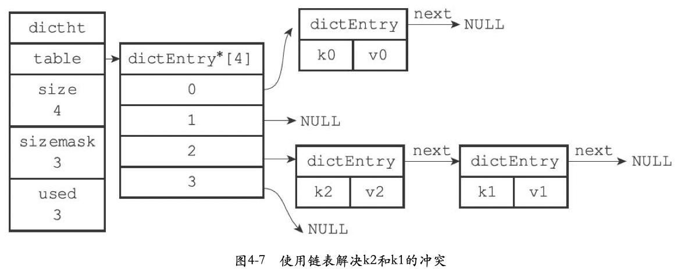


## Rehashing

When the number of entries becomes too large or too small relative to the table size, the hash table is resized (expanded or shrunk) using rehashing.

### Steps

1. Allocate `ht[1]` — the new table. Its size depends on the operation and on `ht[0].used`:
   - For expansion, choose the first power of two >= `ht[0].used * 2`.
   - For shrinking, choose the first power of two >= `ht[0].used`.
2. Rehash all entries from `ht[0]` into `ht[1]`.
3. When all entries have been moved and `ht[0]` becomes empty, free `ht[0]`, set `ht[0] = ht[1]`, and initialize a new empty `ht[1]` for future rehashes.

Expanding example:

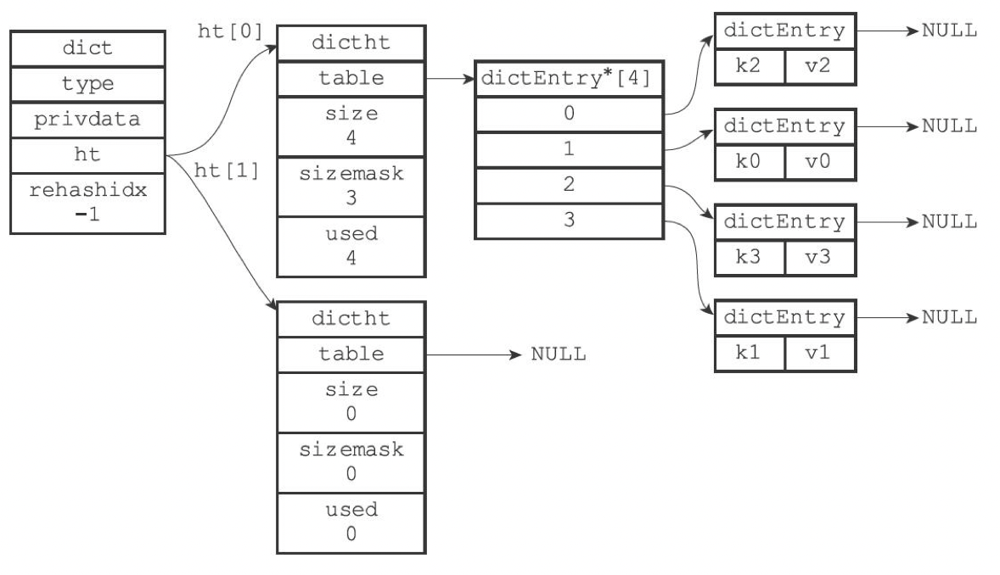

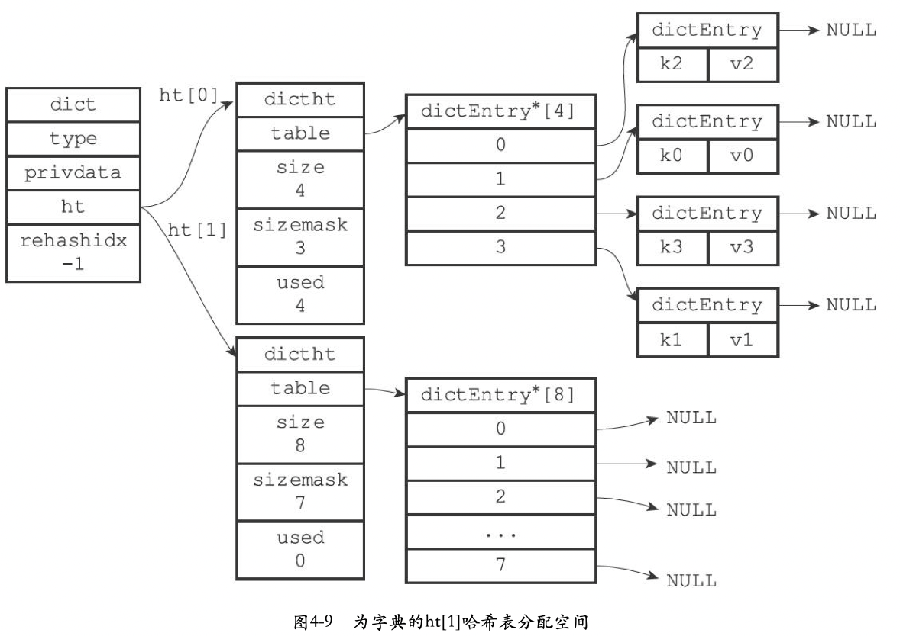

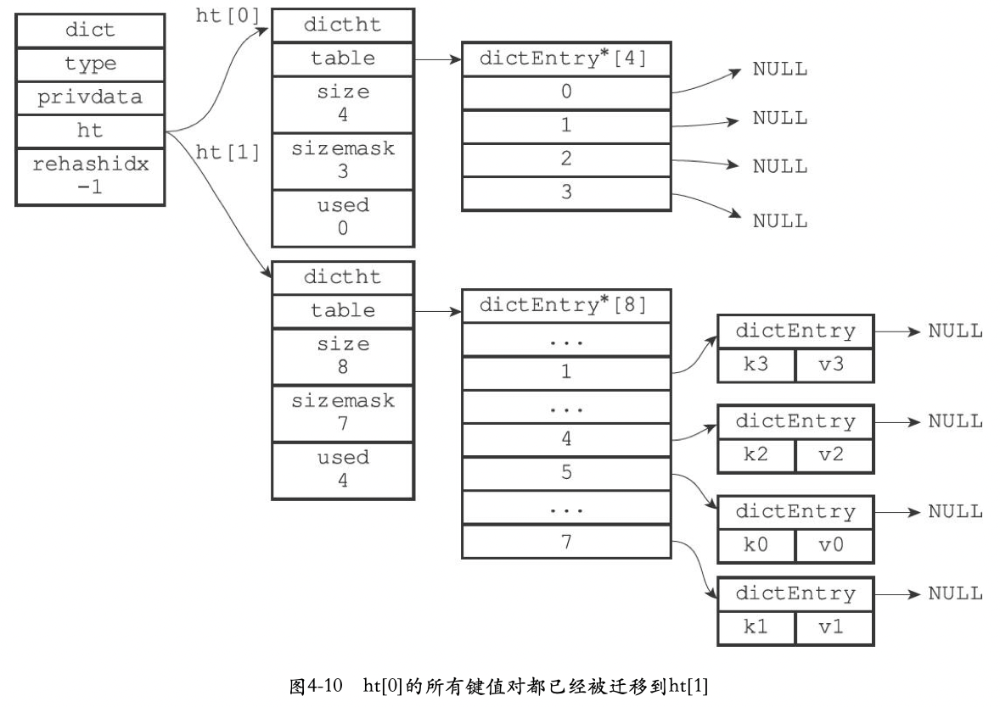

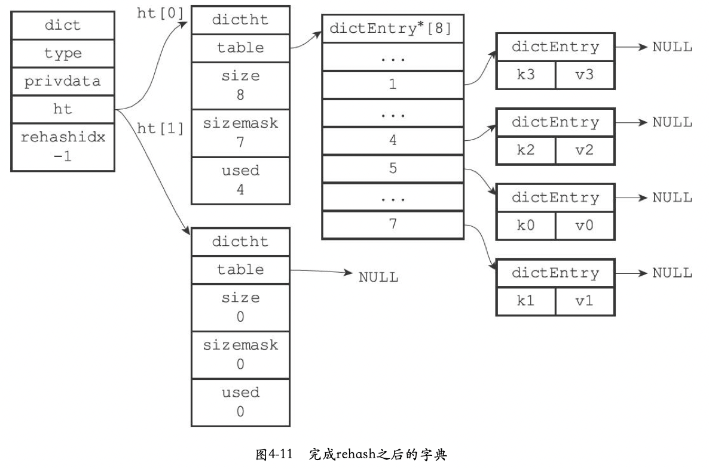

### Trigger conditions

Expansion is triggered when either:

1. The server is not performing `BGSAVE` or `BGREWRITEAOF` and the load factor >= 1.
2. The server is performing `BGSAVE` or `BGREWRITEAOF` and the load factor >= 5.

Shrinking is triggered when load factor < 0.1.


## Progressive (incremental) rehashing

### Steps

1. Allocate `ht[1]` so the dictionary holds both `ht[0]` and `ht[1]`.
2. Set `rehashidx = 0` to indicate rehashing has started.
3. During rehashing, every operation (add/delete/find/update) not only performs the requested action but also migrates entries at the current `rehashidx` from `ht[0]` to `ht[1]`. Increment `rehashidx` as work progresses.
4. Eventually all entries move to `ht[1]`; set `rehashidx = -1` to mark completion.

Progressive rehash example:

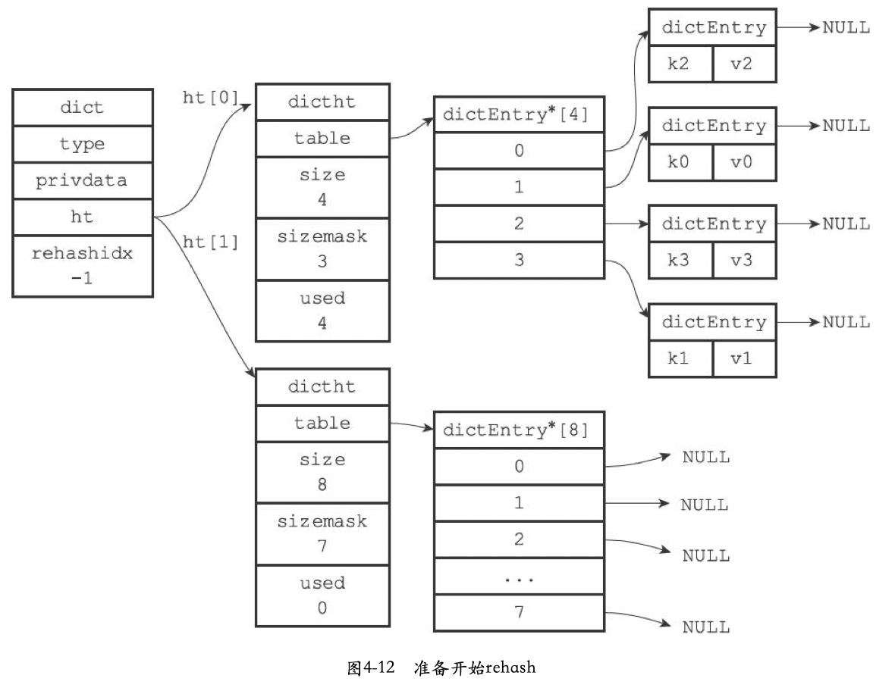

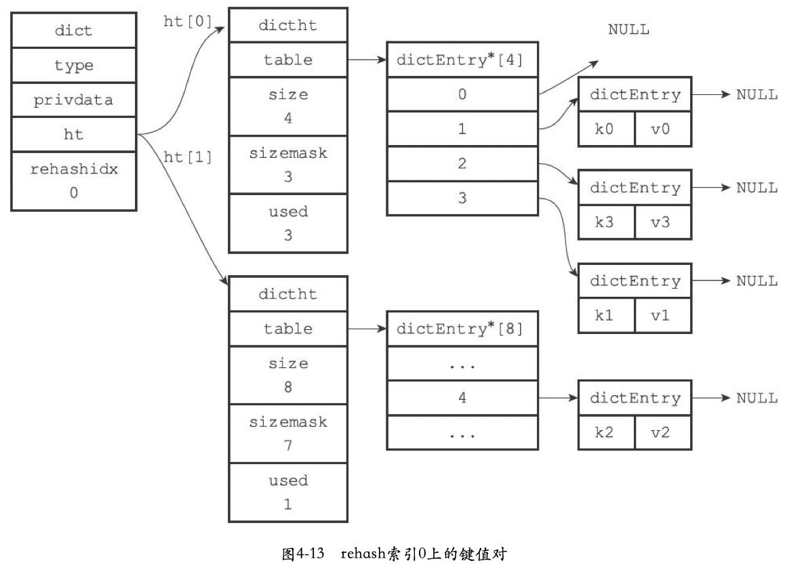

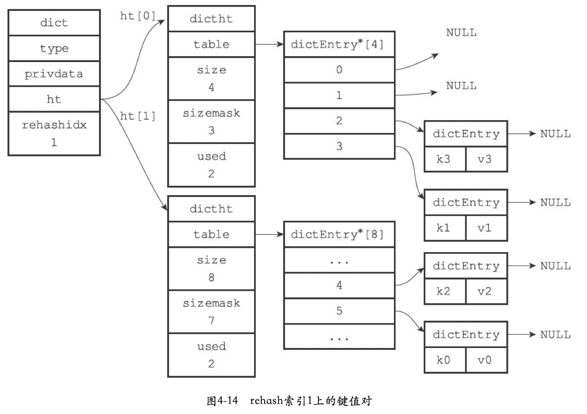

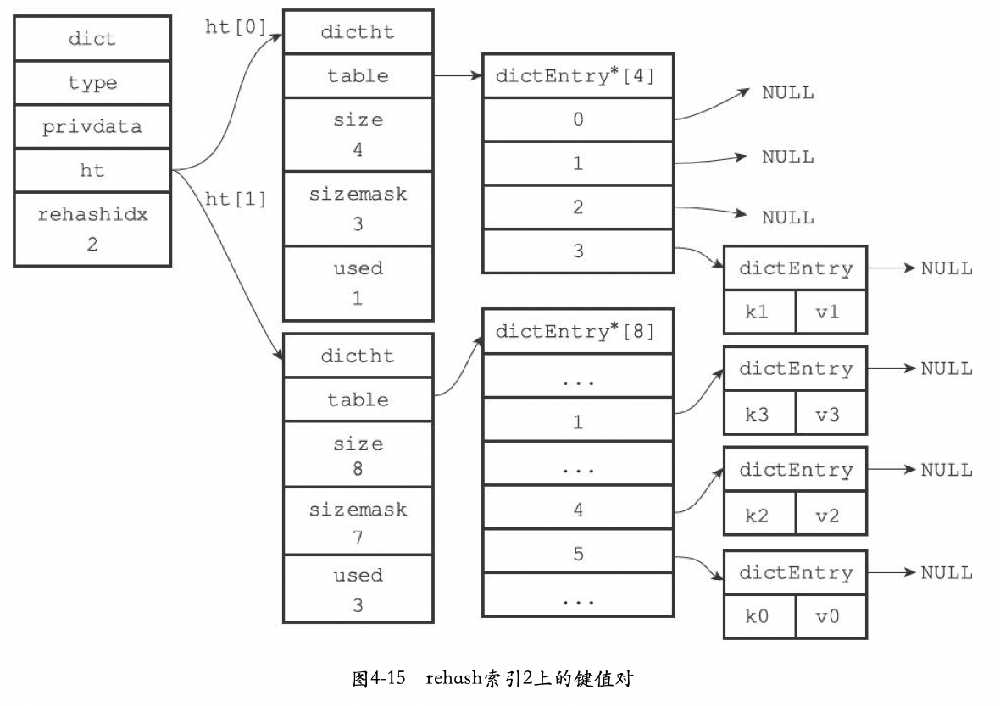

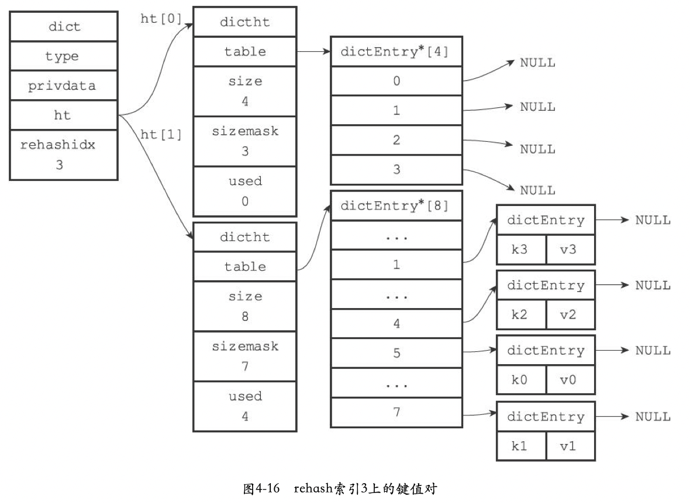

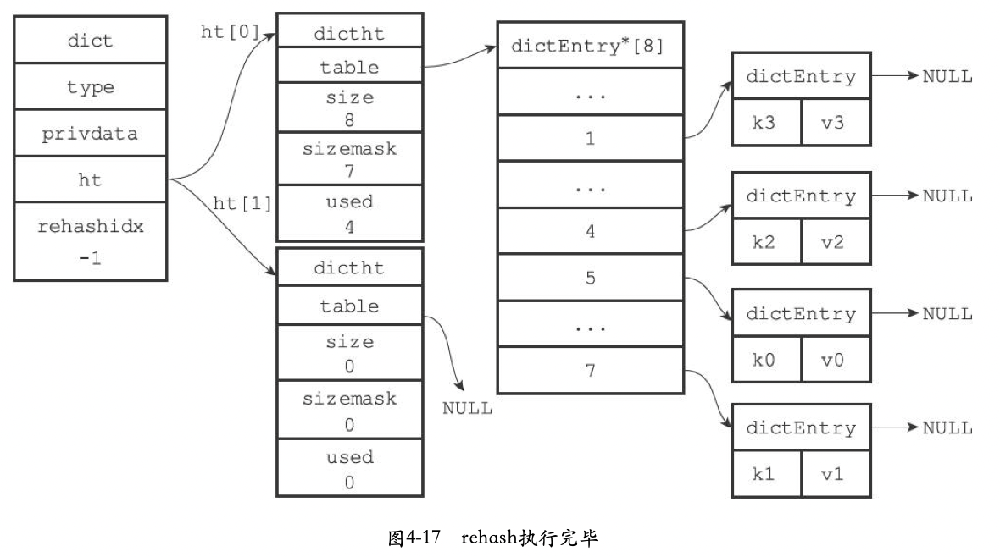


## References

[1] Huang Jianhong. Redis Design and Implementation

