# Redis源码分析-字典


<!-- vim-markdown-toc GFM -->

* [API](#api)
* [定义](#定义)
    - [字典](#字典)
    - [哈希表](#哈希表)
    - [哈希表节点](#哈希表节点)
* [哈希算法](#哈希算法)
* [解决键冲突](#解决键冲突)
* [rehash](#rehash)
    - [步骤](#步骤)
    - [触发条件](#触发条件)
* [渐进式rehash](#渐进式rehash)
    - [步骤](#步骤-1)
* [参考](#参考)

<!-- vim-markdown-toc -->

## API

| 函数             | 作用                                                         | 时间复杂度                      |
| ---------------- | ------------------------------------------------------------ | ------------------------------- |
| dictCreate       | 创建一个新的字典                                             | $O(1)$                          |
| dictAdd          | 将给定的键值对添加到字典里面                                 | $O(1)$                          |
| dictReplace      | 将给定的键值对添加到字典里面，如果键已经存在于字典，那么用新值取代原有的值 | $O(1)$                          |
| dictFetchValue   | 返回给定键的值                                               | $O(1)$                          |
| dictGetRandomKey | 从字典随机返回一个键值对                                     | $O(1)$                          |
| dictDelete       | 从字典中删除给定键所对应的键值对                             | $O(1)$                          |
| dictRelease      | 释放给定字典，以及字典中包含的所有键值对                     | $O(N)$，N为字典包含的键值对数量 |


## 定义

### 字典

```c
typedef struct dictType { // 操作键值对
    unsigned int (*hashFunction)(const void *key);      // 计算哈希值
    void *(*keyDup)(void *privdata, const void *key);   // 复制键
    void *(*valDup)(void *privdata, const void *obj);   // 复制值
    int (*keyCompare)(void *privdata, const void *key1, // 对比键
                      const void *key2);
    void (*keyDestructor)(void *privdata, void *key);   // 销毁键
    void (*valDestructor)(void *privdata, void *obj);   // 销毁值
} dictType;

typedef struct dict {// 字典 
    dictType *type; // 类型特定函数
    void *privdata; // 私有数据
    dictht ht[2];   // 哈希表
    long rehashidx; // 索引，当rehash不在进行时，值为-1
    int iterators;  // 当前正在进行的迭代器数量
} dict;
```

### 哈希表

```c
typedef struct dictht {// hash表
    dictEntry **table;      // hash表数组
    unsigned long size;     // 哈希表大小
    unsigned long sizemask; // 哈希表大小掩码，用于计算索引值，总是=size-1
    unsigned long used;     // 已有节点的数量
} dictht;
```

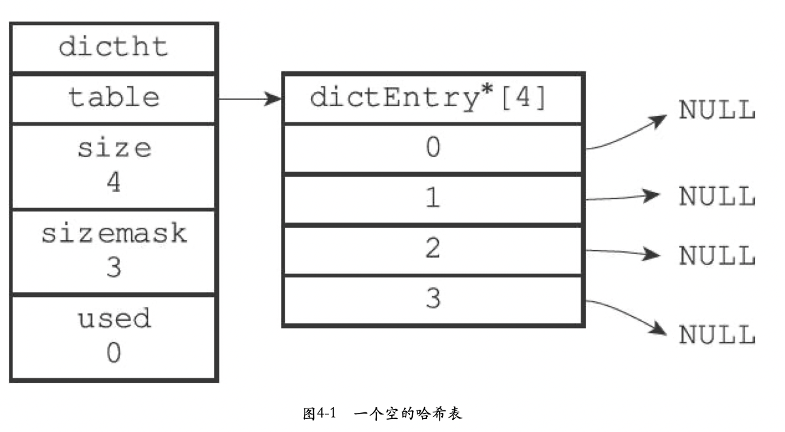

### 哈希表节点

```c
typedef struct dictEntry {// 哈希表节点
    void *key;              // 键
    union {                 
        void *val;
        uint64_t u64;
        int64_t s64;
        double d;
    } v;                    // 值
    struct dictEntry *next; // 指向下一个哈希表节点，形成链表
} dictEntry;
```

通过`next`指针，将两个索引值相同的键k1和k0连接在一起，例:

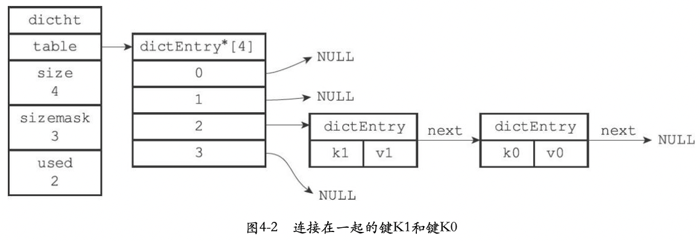


## 哈希算法

redis使用`MurmurHash2`算法来计算键的哈希值。

向空字典添加新的键值对，例：

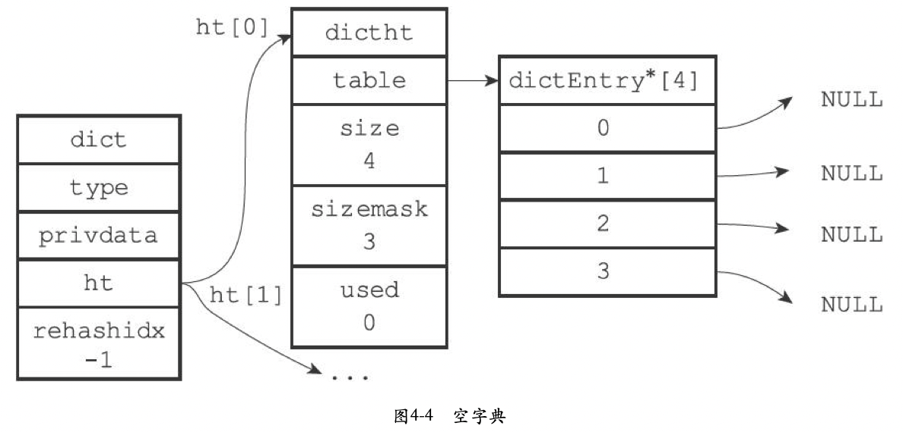

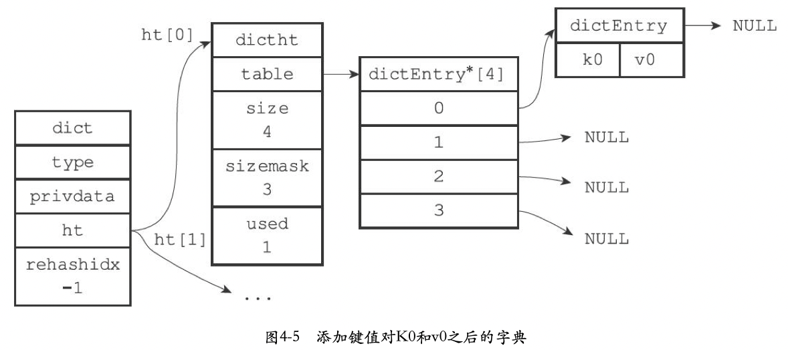


## 解决键冲突

redis的哈希表使用分离链接法(separate chaining)来解决键冲突。

一个包含两个键值对的哈希表如何解决冲突，例：

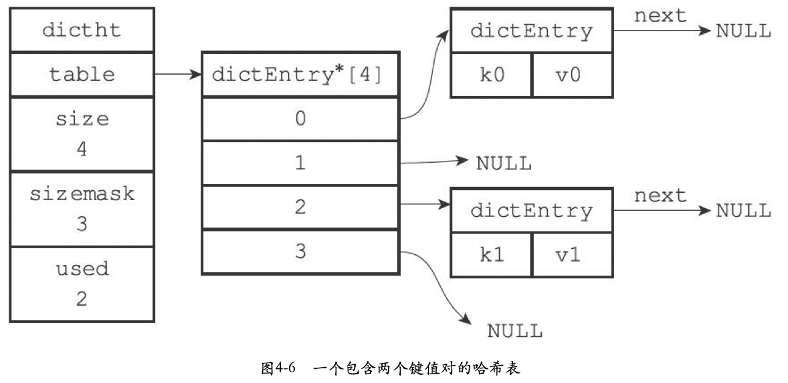

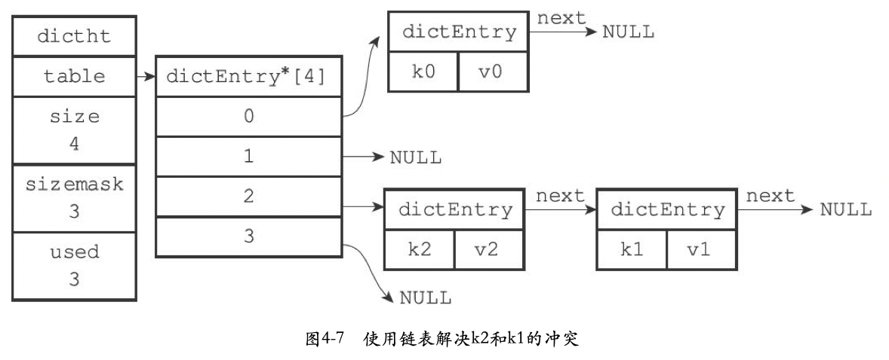


## rehash

当哈希表保存的键值对数量太多或着太少时，需要对哈希表的大小进行相应的扩展或者收缩，该任务通过`rehash(重新散列)`来完成。

### 步骤

1. 为字典的ht[1]哈希表分配空间，这个哈希表的空间大小取决于要执行的操作，以及ht[0]当前包含的键值对数量（即ht[0].used属性的值）：
   - 如果执行扩展操作，那么ht[1]的大小为第一个大于等于`ht[0].used*2的`$2^n$（2的n次方幂）；
   - 如果执行收缩操作，那么ht[1]的大小为第一个大于等于`ht[0].used`的$2^n$（2的n次方幂）;
2. 将保存在ht[0]中的所有键值对rehash到ht[1]上。
3. 当ht[0]包含的所有键值对都迁移到ht[1]之后（ht[0]变为空表），释放ht[0]，将ht[1]设置为ht[0]，并在ht[1]新创建一个空白哈希表，为下一次rehash做准备。

对字典做扩展操作，例：

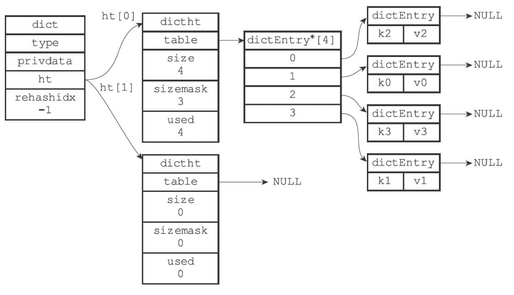

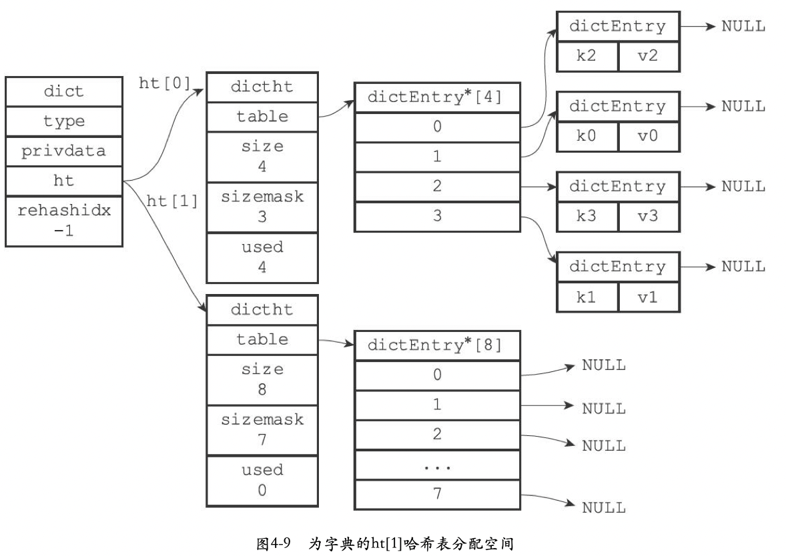

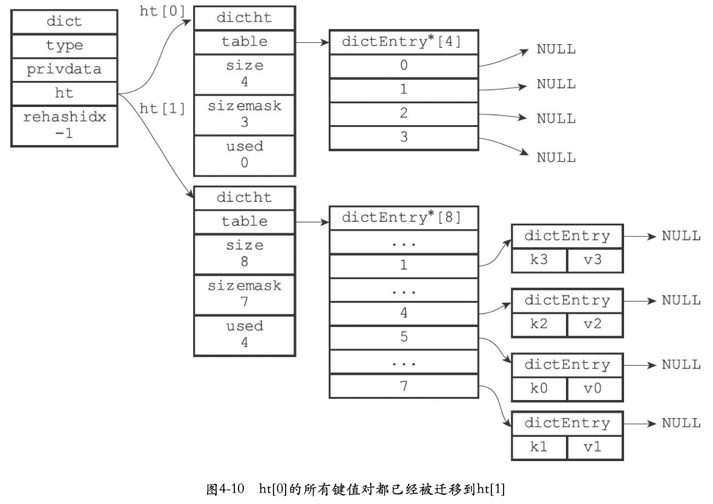

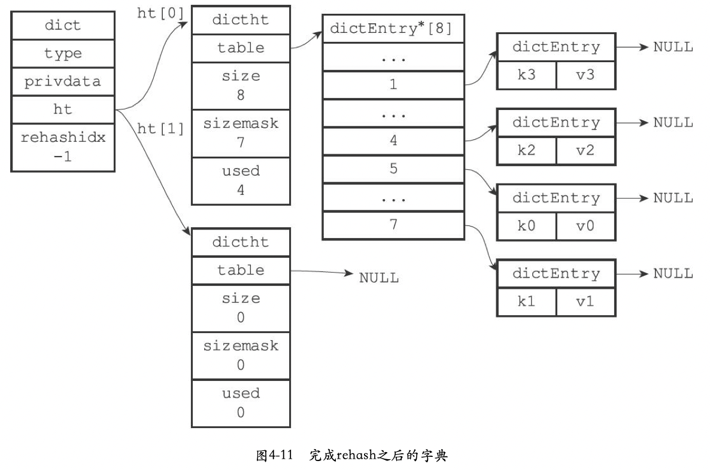

### 触发条件

当满足以下任意条件时，哈希表的扩展操作被触发：

1. 服务器目前没有在执行`BGSAVE`命令或者`BGREWRITEAOF`命令，并且哈希表的负载因子大于等于1.

2. 服务器目前正在执行`BGSAVE`命令或者`BGREWRITEAOF`命令，并且哈希表的负载因子大于等于5.

当满足以下任意条件时，哈希表的收缩操作被触发：

1. 哈希表的负载因子小于0.1


## 渐进式rehash

### 步骤

1. 为ht[1]分配空间，让字典同时持有ht[0]和ht[1]两个哈希表。
2. 在字典中维持一个索引计数器变量rehashidx，并将它的值设置为0，表示rehash工作正式开始。
3. 在rehash进行期间，每次对字典执行添加，删除，查找或者更新操作时，程序除了执行指定的操作以外，还会顺带将ht[0]哈希表在rehashidx索引上的所有键值对rehash到ht[1]，当rehash工作完成后，程序将rehashidx属性的值+1.
4. 随着字典操作的不断执行，最终在某个时间点上，ht[0]的所有键值对都会被rehash到ht[1]，这时程序将rehashidx属性的值设置为-1，表示rehash操作已完成。

渐进式rehash，例：


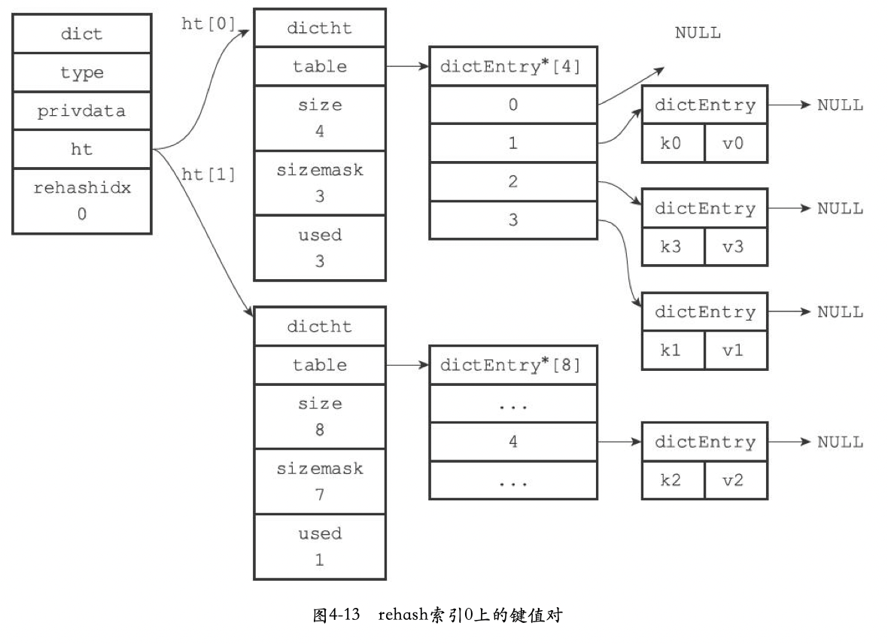

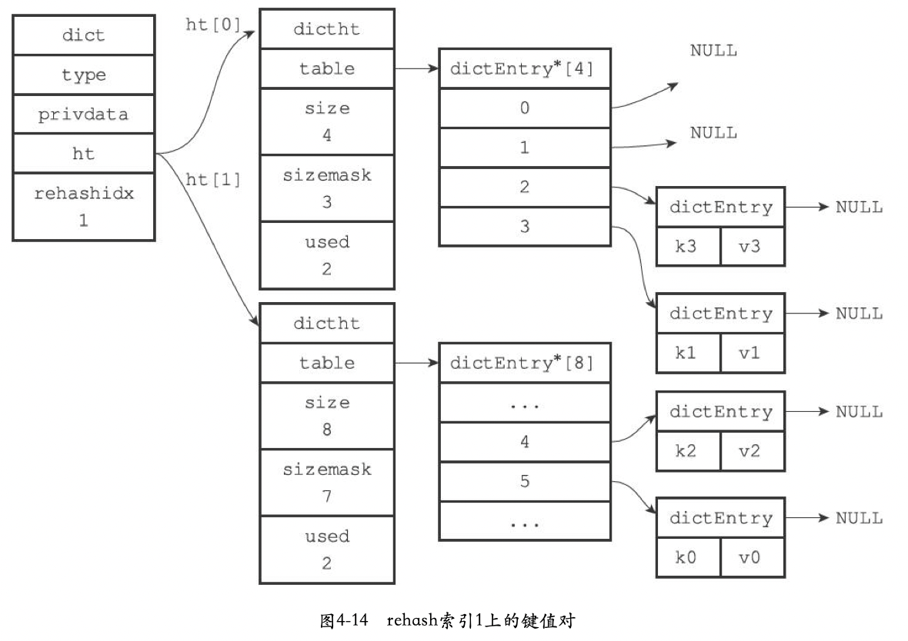

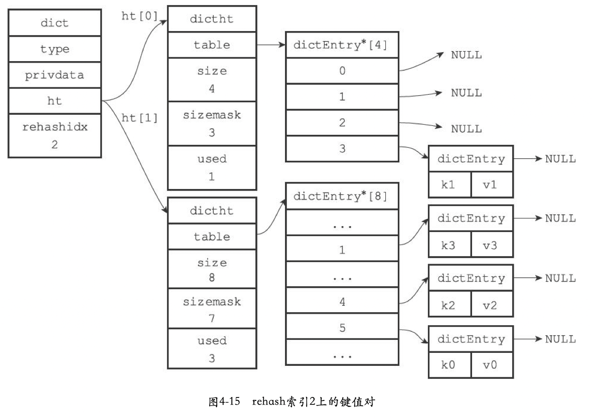

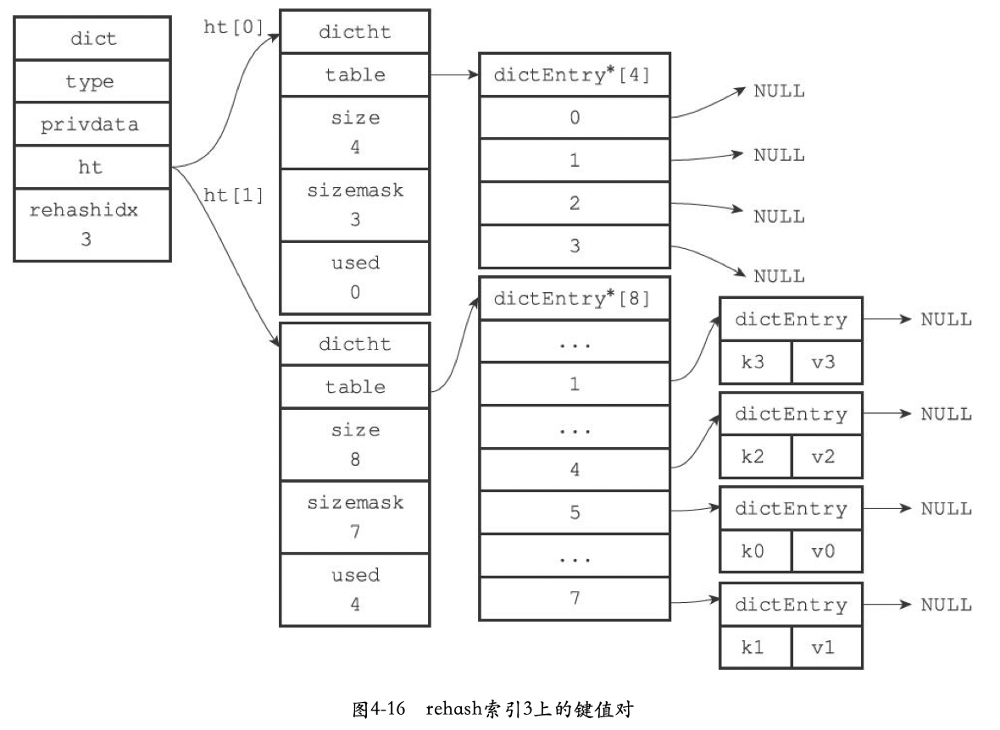

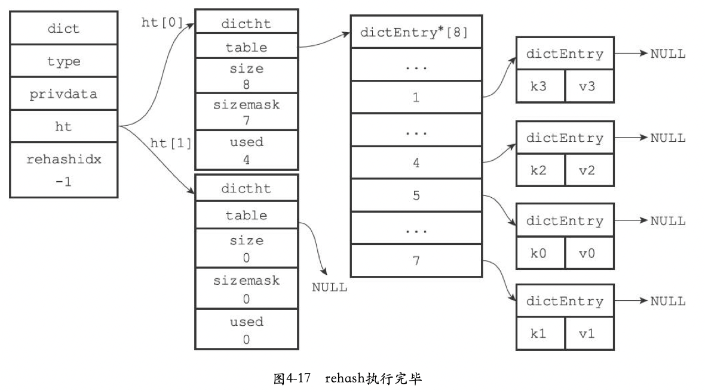


## 参考

[1] 黄健宏.Redis设计与实现
