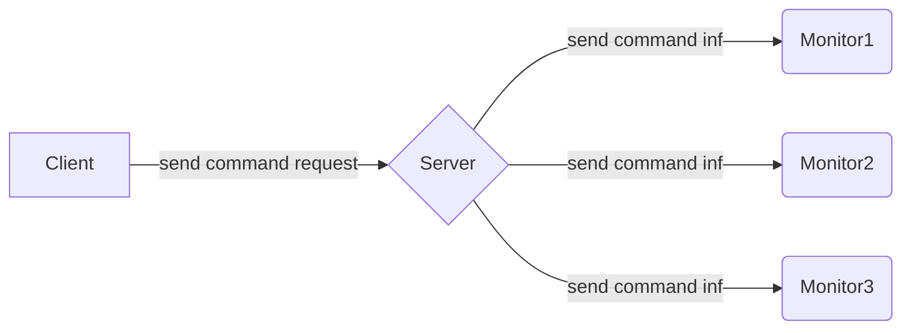

English | [中文版](ansys_moniter_zh.md)

# Redis Source Code Analysis - Monitor

[TOC]


Clients can turn themselves into a monitor to receive and print, in real time, information about commands the server is currently processing.

Use the following command to make a client a monitor:

```sh
MONITOR
```

Command reception and information propagation:




## Becoming a monitor

```c
/** @brief command: monitor */
void monitorCommand(redisClient *c) {
	/* ignore MONITOR if already slave or in monitor mode */
	if (c->flags & REDIS_SLAVE) return; /* slaves are not allowed to become monitors */

	c->flags |= (REDIS_SLAVE|REDIS_MONITOR);
	listAddNodeTail(server.monitors,c); /* add to monitors list */
	addReply(c,shared.ok);
}
```


## Sending command info to monitors

Before processing each command request the server calls `replicationFeedMonitors`, which sends information about the command being processed to all monitors.


## References

[1] Huang Jianhong. Redis Design and Implementation

[2] Monitoring metrics overview (https://zhuanlan.zhihu.com/p/152087914)
