English | [中文版](ansys_oop_zh.md)

# Redis Source Code Analysis - Data Types

[TOC]


## object

Definition of the basic data object:

```c
#define REDIS_LRU_BITS 24
#define REDIS_LRU_CLOCK_MAX ((1<<REDIS_LRU_BITS)-1) /* Max value of obj->lru */
#define REDIS_LRU_CLOCK_RESOLUTION 1000 /* LRU clock resolution in ms */
typedef struct redisObject { // redis basic data object
	unsigned type:4;             // type
	unsigned encoding:4;         // encoding
	unsigned lru:REDIS_LRU_BITS; // last access time (LRU clock)
	int refcount;                // reference count for memory management
	void *ptr;                   // pointer to underlying data structure
} robj;
```

- `type`

  Records the object type (the five main Redis types):

  | Object        | `type` value     | Value | TYPE command output |
  | ------------- | ---------------- | ----- | ------------------- |
  | String object | REDIS_STRING     | 0     | "string"           |
  | List object   | REDIS_LIST       | 1     | "list"             |
  | Hash object   | REDIS_HASH       | 4     | "hash"             |
  | Set object    | REDIS_SET        | 2     | "set"              |
  | ZSet object   | REDIS_ZSET       | 3     | "zset"             |

- `encoding`

  Object encoding:

  | Encoding constant           | Value | Underlying data structure           |
  | --------------------------- | ----- | ----------------------------------- |
  | REDIS_ENCODING_INT          | 1     | long integer                        |
  | REDIS_ENCODING_EMBSTR       | 8     | embstr-encoded simple dynamic string|
  | REDIS_ENCODING_RAW          | 0     | simple dynamic string               |
  | REDIS_ENCODING_ZIPMAP       | 3     | zipmap                              |
  | REDIS_ENCODING_HT           | 2     | dictionary (hash table)             |
  | REDIS_ENCODING_LINKEDLIST   | 4     | linked list                         |
  | REDIS_ENCODING_ZIPLIST      | 5     | ziplist                             |
  | REDIS_ENCODING_INTSET       | 6     | intset                              |
  | REDIS_ENCODING_SKIPLIST     | 7     | skiplist + dict                     |

  Encodings by data type:

  | Data type    | Encodings                                                           |
  | ------------ | -------------------------------------------------------------------- |
  | REDIS_STRING | REDIS_ENCODING_INT, REDIS_ENCODING_EMBSTR, REDIS_ENCODING_RAW        |
  | REDIS_LIST   | REDIS_ENCODING_ZIPLIST, REDIS_ENCODING_LINKEDLIST                   |
  | REDIS_HASH   | REDIS_ENCODING_ZIPLIST, REDIS_ENCODING_HT                           |
  | REDIS_SET    | REDIS_ENCODING_INTSET, REDIS_ENCODING_HT                            |
  | REDIS_ZSET   | REDIS_ENCODING_ZIPLIST, REDIS_ENCODING_SKIPLIST                    |


### LRU algorithm

TODO


## string

### Encodings

- `int`

  Stores integers that fit in a `long`.

- `raw`

  Stores strings longer than `REDIS_ENCODING_EMBSTR_SIZE_LIMIT` bytes (before 3.2 the limit was 39, later 44).

  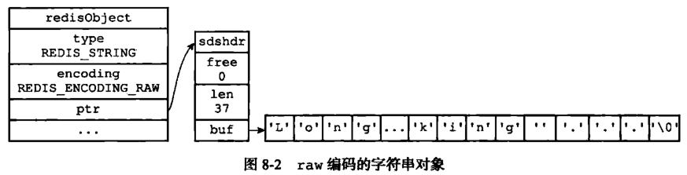

- `embstr`

  Stores short strings (<= `REDIS_ENCODING_EMBSTR_SIZE_LIMIT`) in a compact `embstr` allocation.

  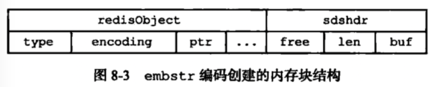

String creation chooses `embstr` or `raw` based on length:

```c
#define REDIS_ENCODING_EMBSTR_SIZE_LIMIT 39 // threshold
robj *createStringObject(char *ptr, size_t len) {       // create generic string object
	if (len <= REDIS_ENCODING_EMBSTR_SIZE_LIMIT)
		return createEmbeddedStringObject(ptr,len);     // embstr
	else
		return createRawStringObject(ptr,len);          // raw
}

robj *createStringObjectFromLongLong(long long value) { // create integer-encoded string
	robj *o;
	if (value >= 0 && value < REDIS_SHARED_INTEGERS) {
		incrRefCount(shared.integers[value]);
		o = shared.integers[value];
	} else {
		if (value >= LONG_MIN && value <= LONG_MAX) {   // fits in long
			o = createObject(REDIS_STRING, NULL);
			o->encoding = REDIS_ENCODING_INT;
			o->ptr = (void*)((long)value);
		} else {
			o = createObject(REDIS_STRING,sdsfromlonglong(value)); // long long -> string
		}
	}
	return o;
}
```


## list

### Encodings

- `ziplist`

  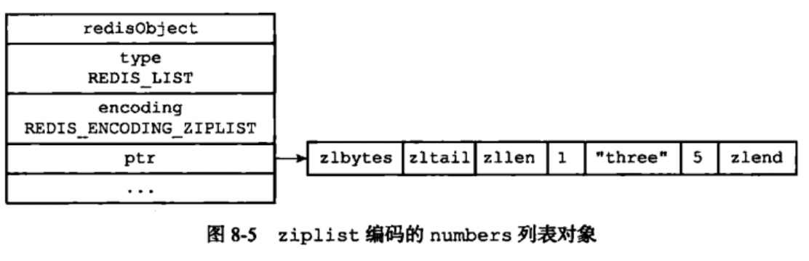

  ```c
  robj *createZiplistObject(void) { // create ziplist-encoded list
	  unsigned char *zl = ziplistNew();
	  robj *o = createObject(REDIS_LIST,zl);
	  o->encoding = REDIS_ENCODING_ZIPLIST;
	  return o;
  }
  ```

- `linkedlist`

  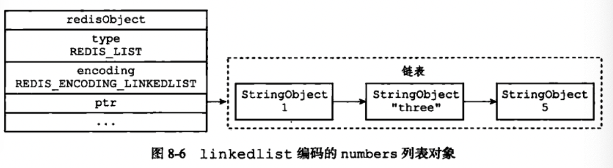

  ```c
  robj *createListObject(void) { // create generic list
	  list *l = listCreate();
	  robj *o = createObject(REDIS_LIST,l);
	  listSetFreeMethod(l,decrRefCountVoid);
	  o->encoding = REDIS_ENCODING_LINKEDLIST;
	  return o;
  }
  ```

Default uses `linkedlist`. `ziplist` is used when:

1. Number of entries < `REDIS_LIST_MAX_ZIPLIST_ENTRIES` (config `list-max-ziplist-entries`).
2. Each entry length < `REDIS_LIST_MAX_ZIPLIST_VALUE` (config `list-max-ziplist-value`).


## hash

### Encodings

- `ziplist`

  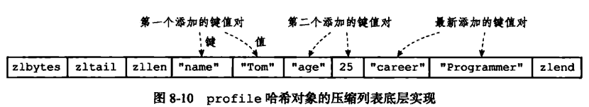

  ```c
  robj *createHashObject(void) { // create ziplist-encoded hash
	  unsigned char *zl = ziplistNew();
	  robj *o = createObject(REDIS_HASH, zl);
	  o->encoding = REDIS_ENCODING_ZIPLIST;
	  return o;
  }
  ```

- `hashtable`

  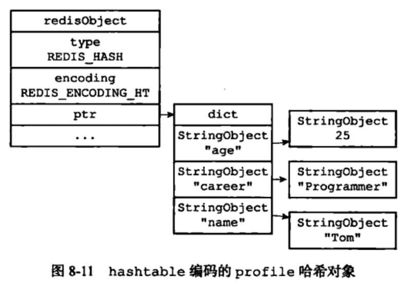


## set

### Encodings

- `intset`

  Uses an integer set as the underlying representation when all elements are integers.

  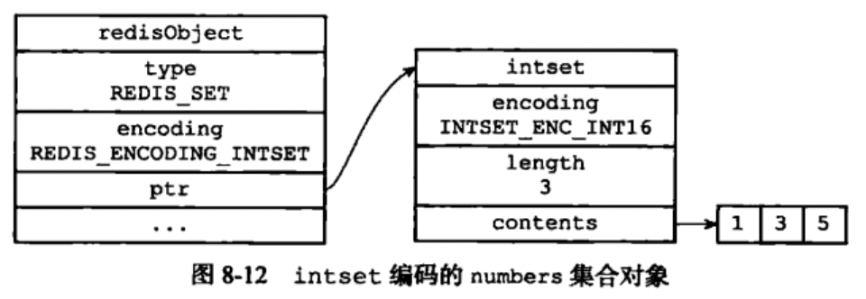

  ```c
  intset *intsetNew(void) { // create intset
	  intset *is = zmalloc(sizeof(intset));
	  is->encoding = intrev32ifbe(INTSET_ENC_INT16);
	  is->length = 0;
	  return is;
  }
  
  robj *createIntsetObject(void) { // create intset-encoded set object
	  intset *is = intsetNew();
	  robj *o = createObject(REDIS_SET,is);
	  o->encoding = REDIS_ENCODING_INTSET;
	  return o;
  }
  ```

- `hash table`

  Uses a dictionary where each key is a string object representing a set member and the values are NULL.

  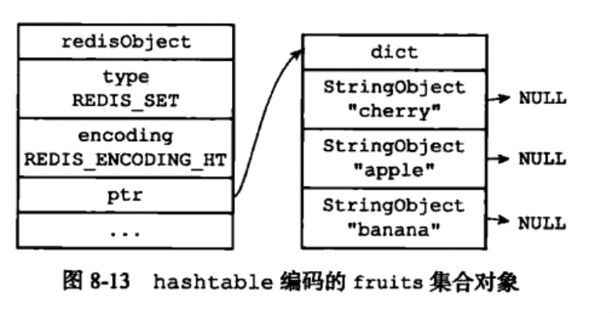

  ```c
  robj *createSetObject(void) { // create set (hashtable)
	  dict *d = dictCreate(&setDictType,NULL);
	  robj *o = createObject(REDIS_SET,d);
	  o->encoding = REDIS_ENCODING_HT;
	  return o;
  }
  ```

Default uses `hash table`. Use `intset` when:

1. All elements are integers.
2. Number of elements <= `REDIS_SET_MAX_INTSET_ENTRIES` (config `set-max-intset-entries`).

Example selection in code:

```c
if (len > server.set_max_intset_entries) {
	o = createSetObject();
	if (len > DICT_HT_INITIAL_SIZE)
		dictExpand(o->ptr,len);
} else {
	o = createIntsetObject();
}
```


## zset

### Encodings

- `ziplist`

  Uses a ziplist: each element is represented by two consecutive ziplist entries — member and score — sorted by score ascending.

  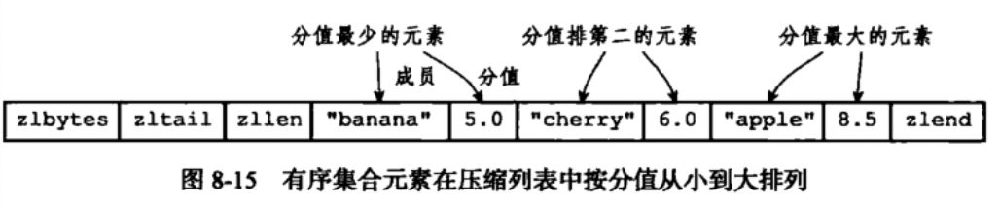

- `skiplist`

  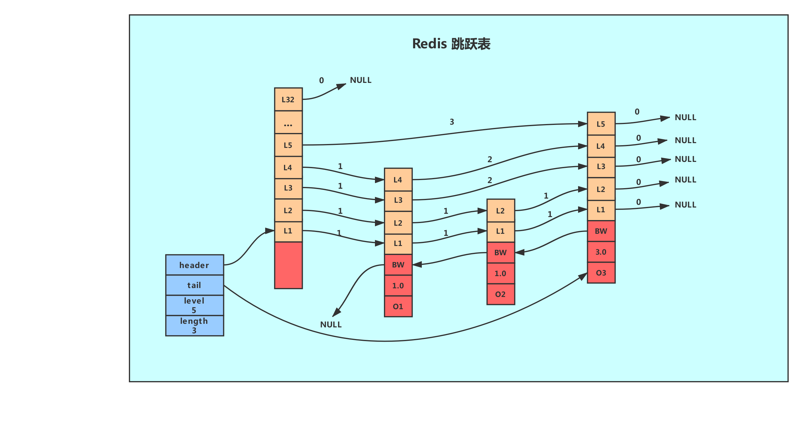

  ```c
  /* skiplist node */
  typedef struct zskiplistNode {
	  robj *obj;                          // member object
	  double score;                       // score
	  struct zskiplistNode *backward;     // backward pointer
	  struct zskiplistLevel {
		  struct zskiplistNode *forward;  // forward pointer
		  unsigned int span;              // span between nodes
	  } level[];                          // levels (random 1..32)
  } zskiplistNode;
  
  typedef struct zskiplist {
	  struct zskiplistNode *header, *tail;
	  unsigned long length;
	  int level;
  } zskiplist;
  
  typedef struct zset {
	  dict *dict;
	  zskiplist *zsl;
  } zset;
  ```

  `zset` uses a dictionary for fast lookup/deduplication and a skiplist for ordered access/search (space for time).

Skiplist search and insertion illustrations:

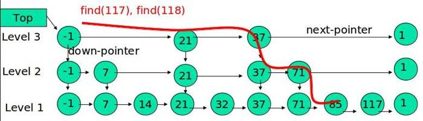

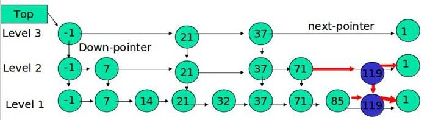

Insertion (excerpt):

```c
zskiplistNode *zslInsert(zskiplist *zsl, double score, robj *obj) {
	zskiplistNode *update[ZSKIPLIST_MAXLEVEL], *x;
	unsigned int rank[ZSKIPLIST_MAXLEVEL];
	int i, level;
    
	redisAssert(!isnan(score));
	x = zsl->header;
	for (i = zsl->level-1; i >= 0; i--) {
		rank[i] = i == (zsl->level-1) ? 0 : rank[i+1];
		while (x->level[i].forward &&
			(x->level[i].forward->score < score ||
				(x->level[i].forward->score == score &&
				compareStringObjects(x->level[i].forward->obj,obj) < 0))) {
			rank[i] += x->level[i].span;
			x = x->level[i].forward;
		}
		update[i] = x;
	}
	level = zslRandomLevel();
	if (level > zsl->level) {
		for (i = zsl->level; i < level; i++) {
			rank[i] = 0;
			update[i] = zsl->header;
			update[i]->level[i].span = zsl->length;
		}
		zsl->level = level;
	}
	x = zslCreateNode(level,score,obj);
	for (i = 0; i < level; i++) {
		x->level[i].forward = update[i]->level[i].forward;
		update[i]->level[i].forward = x;
		x->level[i].span = update[i]->level[i].span - (rank[0] - rank[i]);
		update[i]->level[i].span = (rank[0] - rank[i]) + 1;
	}
	for (i = level; i < zsl->level; i++) {
		update[i]->level[i].span++;
	}
	x->backward = (update[0] == zsl->header) ? NULL : update[0];
	if (x->level[0].forward)
		x->level[0].forward->backward = x;
	else
		zsl->tail = x;
	zsl->length++;
	return x;
}
```

Default uses skiplist+dict; `ziplist` used when:

1. Number of elements < `REDIS_ZSET_MAX_ZIPLIST_ENTRIES`.
2. All element lengths < `REDIS_ZSET_MAX_ZIPLIST_VALUE` bytes.


## Memory management

Redis implements reference counting for object memory management.

### API

| Function         | Description                                                       |
| ---------------- | ----------------------------------------------------------------- |
| `incrRefCount`   | increment object reference count                                  |
| `decrRefCount`   | decrement reference count; free object when count reaches 0       |
| `resetRefCount`  | set reference count to 0 without freeing (used when resetting)     |

### Reference count changes

- New objects are created with `refcount = 1`.
- When an object is retained by a new user, increment the refcount.
- When an object is no longer used by a user, decrement the refcount.
- When refcount reaches 0 the object's memory is freed.


## References

[1] Huang Jianhong. Redis Design and Implementation

[2] Redis LRU algorithm implementation (https://segmentfault.com/a/1190000017555834)

