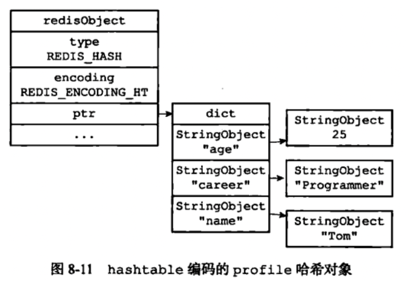

# Redis源码分析-数据类型


<!-- vim-markdown-toc GFM -->

* [object](#object)
    - [LRU算法](#lru算法)
* [string](#string)
    - [编码方式](#编码方式)
* [list](#list)
    - [编码方式](#编码方式-1)
* [hash](#hash)
    - [编码](#编码)
* [set](#set)
    - [编码](#编码-1)
* [zset](#zset)
    - [编码](#编码-2)
* [内存回收](#内存回收)
    - [API](#api)
    - [引用计数变更条件](#引用计数变更条件)
* [参考](#参考)

<!-- vim-markdown-toc -->


## object

基本数据类型对象的定义：

```c
#define REDIS_LRU_BITS 24
#define REDIS_LRU_CLOCK_MAX ((1<<REDIS_LRU_BITS)-1) /* Max value of obj->lru */
#define REDIS_LRU_CLOCK_RESOLUTION 1000 /* LRU clock resolution in ms */
typedef struct redisObject { // redis基本数据对象
    unsigned type:4;             // 类型；
    unsigned encoding:4;         // 编码; 
    unsigned lru:REDIS_LRU_BITS; // 最后一次被程序访问的时间
    int refcount;                // 引用计数,用来进行内存回收
    void *ptr;                   // 指向底层数据结构的指针
} robj;
```

- type

  记录了对象的类型，即五大数据类型：

  | 对象         | 对象type属性的值 | 值   | TYPE命令输出 |
  | ------------ | ---------------- | ---- | ------------ |
  | 字符串对象   | REDIS_STRING     | 0    | "string"     |
  | 列表对象     | REDIS_LIST       | 1    | "list"       |
  | 哈希对象     | REDIS_HASH       | 4    | "hash"       |
  | 集合对象     | REDIS_SET        | 2    | "set"        |
  | 有序集合对象 | REDIS_ZSET       | 3    | "set"        |

- encoding

  对象的编码方式

  | 编码常量                  | 值   | 编码所对应的底层数据结构   |
  | ------------------------- | ---- | -------------------------- |
  | REDIS_ENCODING_INT        | 1    | long类型的整数             |
  | REDIS_ENCODING_EMBSTR     | 8    | embstr编码的简单动态字符串 |
  | REDIS_ENCODING_RAW        | 0    | 简单动态字符串             |
  | REDIS_ENCODING_ZIPMAP     | 3    | 压缩map                    |
  | REDIS_ENCODING_HT         | 2    | 字典                       |
  | REDIS_ENCODING_LINKEDLIST | 4    | 双端链表                   |
  | REDIS_ENCODING_ZIPLIST    | 5    | 压缩列表                   |
  | REDIS_ENCODING_INTSET     | 6    | 整数集合                   |
  | REDIS_ENCODING_SKIPLIST   | 7    | 跳表和字典                 |

  不同数据类型对应的编码方式

  | 数据类型     | 编码                                                         |
  | ------------ | ------------------------------------------------------------ |
  | REDIS_STRING | - REDIS_ENCODING_INT<br>- REDIS_ENCODING_EMBSTR<br>- REDIS_ENCODING_RAW |
  | REDIS_LIST   | - REDIS_ENCODING_ZIPLIST<br>- REDIS_ENCODING_LINKEDLIST      |
  | REDIS_HASH   | - REDIS_ENCODING_ZIPLIST<br>- REDIS_ENCODING_HT              |
  | REDIS_SET    | - REDIS_ENCODING_INTSET<br>- REDIS_ENCODING_HT               |
  | REDIS_ZSET   | - REDIS_ENCODING_ZIPLIST<br>- REDIS_ENCODING_SKIPLIST        |


### LRU算法

TODO


## string

### 编码方式

- int

  保存可以用long类型表示的整数值

- raw

  保存长度大于`REDIS_ENCODING_EMBSTR_SIZE_LIMIT`字节的字符串（3.2版本之前n=39，之后n=44）

  

- embstr

  保存长度小于`REDIS_ENCODING_EMBSTR_SIZE_LIMIT`字节的字符串（3.2版本之前n=39，之后n=44）

  

根据字符串的长度来决定用raw方式还是embstr方式

```c
#define REDIS_ENCODING_EMBSTR_SIZE_LIMIT 39 // 字符串长度分界线
robj *createStringObject(char *ptr, size_t len) {       // 创建普通字符串对象
    if (len <= REDIS_ENCODING_EMBSTR_SIZE_LIMIT)
        return createEmbeddedStringObject(ptr,len);     // embstr方式
    else
        return createRawStringObject(ptr,len);          // raw方式
}

robj *createStringObjectFromLongLong(long long value) { // 创建整数型字符串对象
    robj *o;
    if (value >= 0 && value < REDIS_SHARED_INTEGERS) {
        incrRefCount(shared.integers[value]);
        o = shared.integers[value];
    } else {
        if (value >= LONG_MIN && value <= LONG_MAX) {   // 有效的长整型
            o = createObject(REDIS_STRING, NULL);
            o->encoding = REDIS_ENCODING_INT;
            o->ptr = (void*)((long)value);
        } else {
            o = createObject(REDIS_STRING,sdsfromlonglong(value)); // longlong类型转string
        }
    }
    return o;
}
```


## list

### 编码方式

- ziplist编码

  

  

  ```c++
  robj *createZiplistObject(void) { // 创建ziplist编码的list
      unsigned char *zl = ziplistNew();
      robj *o = createObject(REDIS_LIST,zl);
      o->encoding = REDIS_ENCODING_ZIPLIST;
      return o;
  }
  ```

- linkedlist编码

  

  ```c++
  robj *createListObject(void) { // 创建普通list
      list *l = listCreate();
      robj *o = createObject(REDIS_LIST,l);
      listSetFreeMethod(l,decrRefCountVoid);
      o->encoding = REDIS_ENCODING_LINKEDLIST;
      return o;
  }
  ```

默认使用`linkedlist`编码，当满足以下条件时，使用`ziplist`编码：

1. 列表保存元素个数小于`REDIS_LIST_MAX_ZIPLIST_ENTRIES`，这个值可以在redis.conf的`list-max-ziplist-value`中配置
2. 每个元素长度小于`REDIS_LIST_MAX_ZIPLIST_VALUE`，这个值可以在redis.conf的`list-max-ziplist-entries`中配置


## hash

### 编码

- ziplist

  

  ```c++
  robj *createHashObject(void) { // 创建ziplist编码的hash
      unsigned char *zl = ziplistNew();
      robj *o = createObject(REDIS_HASH, zl);
      o->encoding = REDIS_ENCODING_ZIPLIST;
      return o;
  }
  ```

- hashtable

  


## set

### 编码

- intset

  使用整数集合作为底层实现，集合对象包含的所有元素都被保存在整数集合中。

  

  ```c++
  intset *intsetNew(void) { // 创建int集合
      intset *is = zmalloc(sizeof(intset));
      is->encoding = intrev32ifbe(INTSET_ENC_INT16);
      is->length = 0;
      return is;
  }
  
  robj *createIntsetObject(void) { // 创建intset编码的对象
      intset *is = intsetNew();
      robj *o = createObject(REDIS_SET,is);
      o->encoding = REDIS_ENCODING_INTSET;
      return o;
  }
  ```

- hash table

  使用字典作为底层实现，字典的每一个键都是一个字符串对象，这里的每个字符串对象就是一个集合中的元素，而字典的值则全部设置为null。

  

  ```c++
  robj *createSetObject(void) { // 创建set
      dict *d = dictCreate(&setDictType,NULL);
      robj *o = createObject(REDIS_SET,d);
      o->encoding = REDIS_ENCODING_HT;
      return o;
  }
  ```

默认使用`hash table`，当满足以下条件时，使用`intset`编码：

1. 集合对象中所有元素都是整数
2. 集合对象所有元素数量不超过`REDIS_SET_MAX_INTSET_ENTRIES`，可以通过配置文件的`set-max_intset-entries`进行配置

```c
if (len > server.set_max_intset_entries) {
            o = createSetObject();
            /* It's faster to expand the dict to the right size asap in order
             * to avoid rehashing */
            if (len > DICT_HT_INITIAL_SIZE)
                dictExpand(o->ptr,len);
        } else {
            o = createIntsetObject();
        }
```


## zset

### 编码

- ziplist

  使用压缩列表作为底层实现，每个集合元素使用两个紧靠着的压缩列表节点来保存，第一个节点保存元素的成员，第二个节点保存元素的分值。并且压缩列表内的集合元素按分值从小到大的顺序进行排列，小的放在靠近表头的位置，大的放置在靠近表尾的位置

  

  

- skiplist

  

  ```c++
  /* 跳表节点 */
  typedef struct zskiplistNode {
      robj *obj;                          // 成员对象
      double score;                       // 分值
      struct zskiplistNode *backward;     // 后退指针BW（方向表头，指向上一个节点）
      struct zskiplistLevel {
          struct zskiplistNode *forward;  // 前进指针（方向表尾）
          unsigned int span;              // 前进指针和当前节点的距离
      } level[]; 						 // 层高，随机[1,32]
  } zskiplistNode;
  
  typedef struct zskiplist { // 跳表
      struct zskiplistNode *header, *tail; // 表头，表尾
      unsigned long length;                // 节点数量（不算表头）
      int level;                           // 最大层级
  } zskiplist;
  
  typedef struct zset {
      dict *dict;     // 字典
      zskiplist *zsl; // 跳表
  } zset;
  ```

  zset使用字典和跳表一起来实现，字典用来查找和去重，跳表用来快速搜索和排序（以空间换时间）；

  跳表的查找：

  

  跳表的插入：

  

  ```c++
  zskiplistNode *zslInsert(zskiplist *zsl, double score, robj *obj) { // 插入节点
      zskiplistNode *update[ZSKIPLIST_MAXLEVEL], *x;
      unsigned int rank[ZSKIPLIST_MAXLEVEL];
      int i, level;
  
      redisAssert(!isnan(score));
      x = zsl->header;
      for (i = zsl->level-1; i >= 0; i--) {
          /* 向表尾移动（如果下一个分数小于插入的分数｜｜（下一个分数等于插入的分数&&字符串长度<插入的字符串长度）） */
          rank[i] = i == (zsl->level-1) ? 0 : rank[i+1];
          while (x->level[i].forward &&
              (x->level[i].forward->score < score ||
                  (x->level[i].forward->score == score &&
                  compareStringObjects(x->level[i].forward->obj,obj) < 0))) {
              rank[i] += x->level[i].span;
              x = x->level[i].forward;
          }
          update[i] = x;
      }
      /* 
       * 随机一个层级level，在[1,level]的每一层插入元素，
       * 
       */
      level = zslRandomLevel(); // 真随机一个要占据的层数
      if (level > zsl->level) { // 层级不够，扩充层级
          for (i = zsl->level; i < level; i++) {
              rank[i] = 0;
              update[i] = zsl->header;
              update[i]->level[i].span = zsl->length;
          }
          zsl->level = level;
      }
      x = zslCreateNode(level,score,obj);
      for (i = 0; i < level; i++) {
          x->level[i].forward = update[i]->level[i].forward;
          update[i]->level[i].forward = x; // 记录位置
  
          /* update span covered by update[i] as x is inserted here */
          x->level[i].span = update[i]->level[i].span - (rank[0] - rank[i]);
          update[i]->level[i].span = (rank[0] - rank[i]) + 1;
      }
  
      /* 增加距离 */
      for (i = level; i < zsl->level; i++) {
          update[i]->level[i].span++;
      }
  
      x->backward = (update[0] == zsl->header) ? NULL : update[0];
      if (x->level[0].forward)
          x->level[0].forward->backward = x; // 插入元素
      else
          zsl->tail = x;
      zsl->length++;
      return x;
  }
  ```

  默认使用`跳表+字典`的方式，当满足以下条件时，使用`ziplist`:

  1. 保存的元素数量小于`REDIS_ZSET_MAX_ZIPLIST_ENTRIES`
  2. 保存的所有元素长度都小于`REDIS_ZSET_MAX_ZIPLIST_VALUE`字节

  

## 内存回收

Redis在自己的对象系统中构建了一个引用计数（reference counting）技术实现的内存回收机制，通过这一机制，程序可以通过跟踪对象的引用计数信息，在适当的时候自动释放对象并进行内存回收。

### API

| 函数            | 说明                                                         |
| --------------- | ------------------------------------------------------------ |
| `incrRefCount`  | 对象的引用计数+1                                             |
| `decrRefCount`  | 对象的引用计数-1，当对象的引用计数==0时，释放对象            |
| `resetRefCount` | 将对象的引用计数值设置为0，但不释放对象，这个函数通常在需要重新设置对象的引用计数值时使用 |

### 引用计数变更条件

- 在创建一个新对象时，引用计数会被初始化为1
- 当对象被一个新程序使用时，引用计数-1
- 当对象不再被一个程序使用时，引用计数-1
- 当对象的引用计数变为0时，对象所占的内存会被释放


## 参考

[1] 黄健宏.Redis设计与实现

[2] [【Redis源码分析】Redis中的LRU算法实现](https://segmentfault.com/a/1190000017555834)
