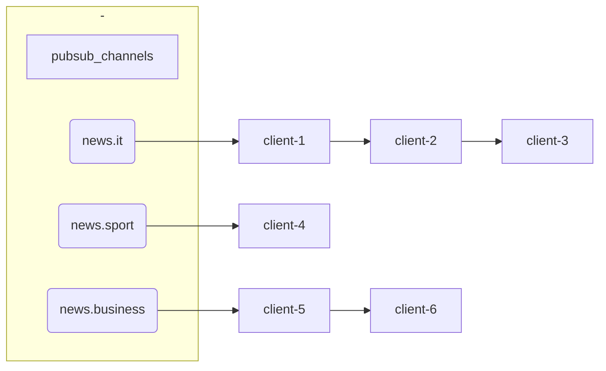
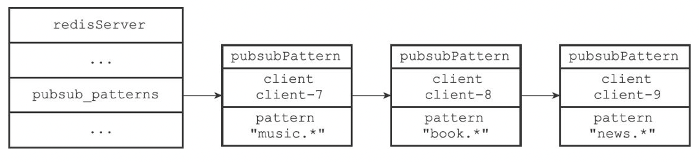
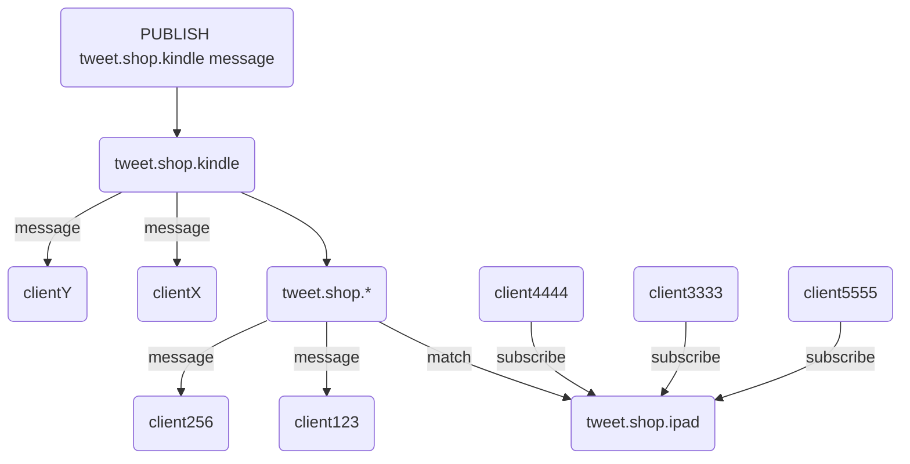

English | [中文版](ansys_pub_sub_zh.md)

# Redis Source Code Analysis - Pub/Sub

[TOC]


## Definition

### Client

```c
typedef struct redisClient {
	...
} redisClient;
```

### Subscription dictionary

```c
struct redisServer {
  ...
  dict *pubsub_channels; // dictionary mapping channel -> list of subscribed clients
  ...
}
```

Example structure of `pubsub_channels`:


```mermaid
graph LR
subgraph -
pubsub_channels
b("news.it")
c("news.sport")
d("news.business")
end
b-->client-1-->client-2-->client-3
c-->client-4
d-->client-5-->client-6
```

### Pattern subscription relationship

```c
typedef struct pubsubPattern {
	redisClient *client; // client
	robj *pattern;       // subscribed pattern
} pubsubPattern;

struct redisServer {
  ...
  dict *pubsub_channels;      /* dictionary of subscribed clients: key: channel, value: client list */
  list *pubsub_patterns;      /* list of pattern subscription relationships */
  ...
}
```

Example `pubsub_patterns` structure:




## Persistence

Normally Redis writes only commands that modify the dataset into the AOF file and replicates them to replicas. If a command does not modify the dataset it is considered read-only and is not written to AOF nor replicated.

However, PUBSUB commands are an exception: although PUBSUB commands do not modify the dataset, they have side effects because they send messages to all subscribers of a channel and therefore change the state of all receiving clients. For this reason the server sets the `REDIS_FORCE_AOF` flag and forces PUBSUB commands to be written to the AOF file.


## Subscribe

```sh
SUBSCRIBE <channel> <client-id>
```

- If the channel already has subscribers, add the client to the subscribers list.
- If the channel has no subscribers, create a subscribers list and add the client.

### Implementation

```c
/* Subscribe to a channel. Returns 1 on success, 0 if already subscribed */
int pubsubSubscribeChannel(redisClient *c, robj *channel) {
	dictEntry *de;
	list *clients = NULL;
	int retval = 0;

	/* Add the channel as a key */
	if (dictAdd(c->pubsub_channels,channel,NULL) == DICT_OK) {
		retval = 1;
		incrRefCount(channel);
		/* Find client list by key */
		de = dictFind(server.pubsub_channels,channel);
		if (de == NULL) { /* If no subscribers list exists, create one */
			clients = listCreate();
			dictAdd(server.pubsub_channels,channel,clients);
			incrRefCount(channel);
		} else {
			clients = dictGetVal(de);
		}
		listAddNodeTail(clients,c); // add to client list
	}
	/* Notify the client */
	addReply(c,shared.mbulkhdr[3]);
	addReply(c,shared.subscribebulk);
	addReplyBulk(c,channel);
	addReplyLongLong(c,clientSubscriptionsCount(c));
	return retval;
}
```


## Unsubscribe

```sh
UNSUBSCRIBE <channel> <client-id>
```

1. Find the subscribers list for the channel and remove the client id from that list.
2. If the subscribers list becomes empty after removing the client, delete the channel entry.


## Publish message

```c
/* Publish a message */
int pubsubPublishMessage(robj *channel, robj *message) {
	int receivers = 0;
	dictEntry *de;
	listNode *ln;
	listIter li;

	/* Find client list by channel */
	de = dictFind(server.pubsub_channels,channel);
	if (de) {
		list *list = dictGetVal(de);
		listNode *ln;
		listIter li;

		listRewind(list,&li);
		while ((ln = listNext(&li)) != NULL) { // iterate list and send message
			redisClient *c = ln->value;

			addReply(c,shared.mbulkhdr[3]);
			addReply(c,shared.messagebulk);
			addReplyBulk(c,channel);
			addReplyBulk(c,message);
			receivers++;
		}
	}
	/* Send to clients listening to matching patterns */
	if (listLength(server.pubsub_patterns)) {
		listRewind(server.pubsub_patterns,&li);
		channel = getDecodedObject(channel);
		while ((ln = listNext(&li)) != NULL) {
			pubsubPattern *pat = ln->value;

			if (stringmatchlen((char*)pat->pattern->ptr,
								sdslen(pat->pattern->ptr),
								(char*)channel->ptr,
								sdslen(channel->ptr),0)) {
				addReply(pat->client,shared.mbulkhdr[4]);
				addReply(pat->client,shared.pmessagebulk);
				addReplyBulk(pat->client,pat->pattern);
				addReplyBulk(pat->client,channel);
				addReplyBulk(pat->client,message);
				receivers++;
			}
		}
		decrRefCount(channel);
	}
	return receivers;
}
```


## Pattern subscription

Subscribe to channels using pattern matching.

```sh
PSUBSCRIBE <pattern>
```

1. Create a new `pubsubPattern` structure, set its `pattern` to the subscribed pattern and `client` to the subscribing client.
2. Append the `pubsubPattern` structure to the end of `pubsub_patterns` list.

Example: the pattern `tweet.shop.*` matches `tweet.shop.kindle` and `tweet.shop.ipad`. When a message is published to `tweet.shop.kindle`, clients subscribed to `tweet.shop.*` such as `client123` and `client256` will also receive it.


```mermaid
graph TD
a(PUBLISH tweet.shop.kindle message)
b1(tweet.shop.kindle)
b2(tweet.shop.ipad)
c1(clientY)
c2(clientX)
c3(tweet.shop.*)
c4(client4444)
c5(client3333)
c6(client5555)
d1(client256)
d2(client123)

a-->b1
b1--message-->c1
b1--message-->c2
b1-->c3
c3--message-->d1
c3--message-->d2
c3--match-->b2
c4--subscribe-->b2
c5--subscribe-->b2
c6--subscribe-->b2
```

### Implementation

```c
/** @brief Add a pattern subscription */
int pubsubSubscribePattern(redisClient *c, robj *pattern) {
	int retval = 0;

	if (listSearchKey(c->pubsub_patterns,pattern) == NULL) { // if not present, create a fuzzy key
		retval = 1;
		pubsubPattern *pat;
		listAddNodeTail(c->pubsub_patterns,pattern);
		incrRefCount(pattern);
		pat = zmalloc(sizeof(*pat));
		pat->pattern = getDecodedObject(pattern);
		pat->client = c;
		listAddNodeTail(server.pubsub_patterns,pat); // append to tail
	}
	/* Notify the client */
	addReply(c,shared.mbulkhdr[3]);
	addReply(c,shared.psubscribebulk);
	addReplyBulk(c,pattern);
	addReplyLongLong(c,clientSubscriptionsCount(c));
	return retval;
}
```


## Unsubscribe pattern

Unsubscribe from a pattern-matched channel.

```sh
PUNSUBSCRIBE <pattern>
```

1. Find and remove the `pubsubPattern` node from `pubsub_patterns` where `pattern` equals the unsubscribed pattern and `client` equals the client issuing the unsubscribe.

### Implementation

```c
/**
 * @brief Unsubscribe from a pattern
 */
int pubsubUnsubscribePattern(redisClient *c, robj *pattern, int notify) {
	listNode *ln;
	pubsubPattern pat;
	int retval = 0;

	incrRefCount(pattern); /* Protect the object. May be the same we remove */
	if ((ln = listSearchKey(c->pubsub_patterns,pattern)) != NULL) {
		retval = 1;
		listDelNode(c->pubsub_patterns,ln);
		pat.client = c;
		pat.pattern = pattern;
		ln = listSearchKey(server.pubsub_patterns,&pat);
		listDelNode(server.pubsub_patterns,ln);
	}
	/* Notify the client */
	if (notify) {
		addReply(c,shared.mbulkhdr[3]);
		addReply(c,shared.punsubscribebulk);
		addReplyBulk(c,pattern);
		addReplyLongLong(c,dictSize(c->pubsub_channels)+
					   listLength(c->pubsub_patterns));
	}
	decrRefCount(pattern);
	return retval;
}
```


## Sending messages

### Publish to channel subscribers

```sh
PUBLISH <channel> <message>
```

1. Find the channel in `pubsub_channels`.
2. Iterate the channel's subscribers list and send the message.

Implementation: (see `pubsubPublishMessage` above)


### Publish to pattern subscribers

1. Find channels matching subscribed patterns.
2. Send the message to clients subscribed to those channels.


### Message backlog (buffering)

PUB/SUB has a characteristic: Redis creates an output buffer for each consumer. If message backlog causes Redis' output buffer to exceed the configured `client-output-buffer-limit`, Redis will disconnect the consumer.

```c
void asyncCloseClientOnOutputBufferLimitReached(redisClient *c) {
	...
	if (checkClientOutputBufferLimits(c)) { /* output buffer limits exceeded */
		sds client = catClientInfoString(sdsempty(),c);
		freeClientAsync(c);
		redisLog(REDIS_WARNING,"Client %s scheduled to be closed ASAP for overcoming of output buffer limits.", client);
		sdsfree(client); /* kick the redis client */
	}
}

/**
 * @brief Check whether the client's output buffer memory usage exceeds limits;
 *
 * @return 0 if not exceeded, 1 if exceeded
 **/
int checkClientOutputBufferLimits(redisClient *c) {
	int soft = 0, hard = 0, class;
	unsigned long used_mem = getClientOutputBufferMemoryUsage(c);

	class = getClientType(c);
	if (server.client_obuf_limits[class].hard_limit_bytes &&
		used_mem >= server.client_obuf_limits[class].hard_limit_bytes)
		hard = 1;
	if (server.client_obuf_limits[class].soft_limit_bytes &&
		used_mem >= server.client_obuf_limits[class].soft_limit_bytes)
		soft = 1;

	/* We need to check if the soft limit is reached continuously for the
	 * specified amount of seconds. */
	if (soft) {
		if (c->obuf_soft_limit_reached_time == 0) {
			c->obuf_soft_limit_reached_time = server.unixtime;
			soft = 0; /* First time we see the soft limit reached */
		} else {
			time_t elapsed = server.unixtime - c->obuf_soft_limit_reached_time;

			if (elapsed <=
				server.client_obuf_limits[class].soft_limit_seconds) {
				soft = 0; /* The client did not yet reach the configured number of
							 seconds for the soft limit to be considered reached. */
			}
		}
	} else {
		c->obuf_soft_limit_reached_time = 0;
	}
	return soft || hard;
}
```


## Inspecting subscriptions

### List matching channels

```sh
PUBSUB CHANNELS [pattern]
```

- Without `pattern` argument, the command returns all channels currently subscribed on the server.
- With `pattern` argument, the command returns the channels that match the `pattern` among currently subscribed channels.


### Subscribers count for channels

```sh
PUBSUB NUMSUB [channel1 ... channelN]
```

Returns the number of subscribers for the specified channels.


### Number of subscribed patterns

```sh
PUBSUB NUMPAT
```

Returns the number of patterns currently subscribed on the server.


## References

[1] Huang Jianhong. Redis Design and Implementation
