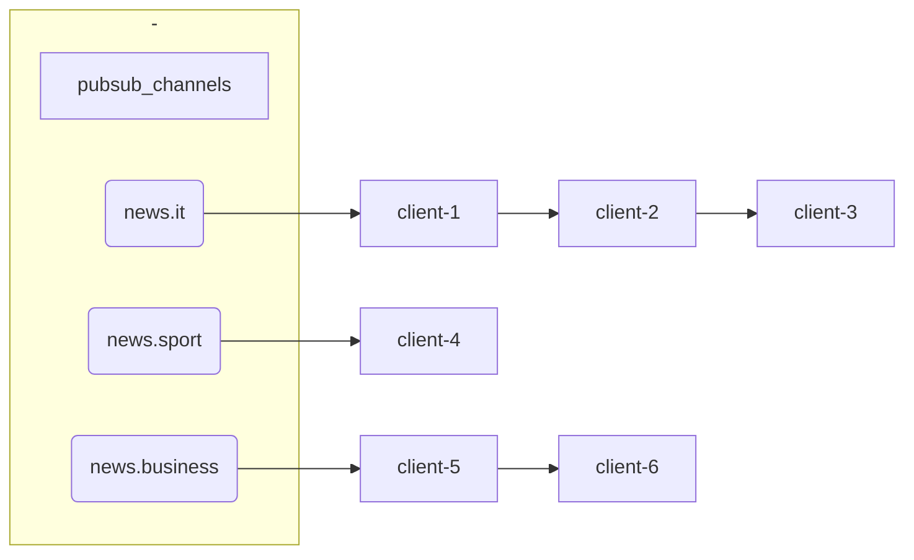
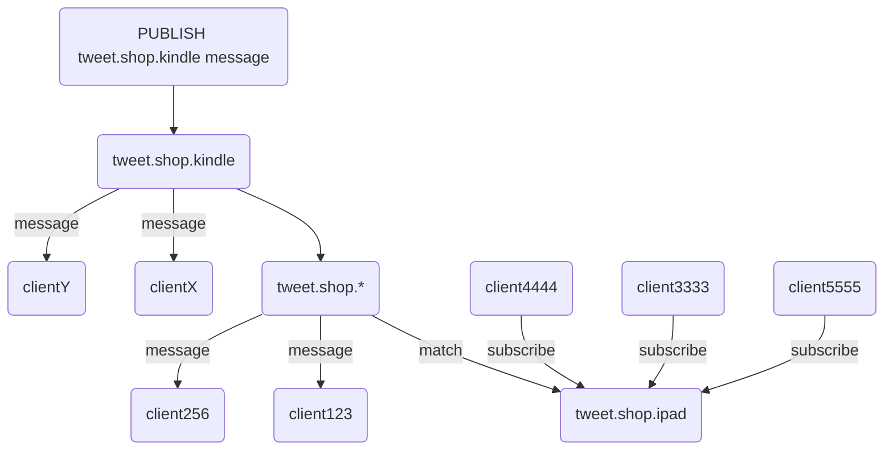

# Redis源码分析-发布订阅


<!-- vim-markdown-toc GFM -->

* [定义](#定义)
    - [客户端](#客户端)
    - [订阅字典](#订阅字典)
    - [模式订阅关系](#模式订阅关系)
* [持久化](#持久化)
* [订阅](#订阅)
    - [实现](#实现)
* [退订](#退订)
* [发布消息](#发布消息)
* [订阅模式](#订阅模式)
    - [实现](#实现-1)
* [退订模式](#退订模式)
    - [实现](#实现-2)
* [发送消息](#发送消息)
    - [发送消息给频道订阅者](#发送消息给频道订阅者)
        + [实现](#实现-3)
    - [发送消息给模式订阅者](#发送消息给模式订阅者)
    - [消息积压](#消息积压)
* [查看订阅消息](#查看订阅消息)
    - [查看匹配频道](#查看匹配频道)
    - [查看订阅者数量](#查看订阅者数量)
    - [查看被订阅模式的数量](#查看被订阅模式的数量)
* [参考](#参考)

<!-- vim-markdown-toc -->


## 定义

### 客户端

```c
typedef struct redisClient {
	...
} redisClient;
```

### 订阅字典

```c
struct redisServer {
  ...
  dict *pubsub_channels; // 订阅"频道-客户端列表“字典
  ...
}
```

例，pubsub_channels结构：



### 模式订阅关系

```c
typedef struct pubsubPattern {
    redisClient *client; // 客户端
    robj *pattern;       // 被订阅的模式
} pubsubPattern;

struct redisServer {
  ...
  dict *pubsub_channels;      /* 订阅的客户端字典：key:频道，value:客户端列表 */
  list *pubsub_patterns;      /* 订阅关系列表 */
  ...
}
```

例，pubs_patterns结构：


## 持久化

通常情况下，Redis只会将哪些对数据库进行了修改的命令写入到AOF文件，并复制到各个从服务器；如果一个命令没有对数据库进行任何修改，那么它就会被认为是只读命令，这个命令不会被写入到AOF文件，也不会被复制到从服务器。

**但是：PUBSUB命令是个例外；PUBSUB命令虽然没有修改数据库，但PUBSUB命令向频道所有订阅者发送消息这一行为带有副作用，接收到消息的所有客户端的状态都会因此而改变；因此，服务器会使用`REDIS_FORCE_AOF`标志，强制将PUBSUB命令写入AOF文件。**


## 订阅

```sh
SUBSCRIBE 频道名 客户端ID
```

- 如果频道已经有其他订阅者，将客户端添加到订阅者列表
- 如果频道没有任何订阅者，创建一个订阅者列表，再将客户端添加到列表

### 实现

```c++
/* 订阅频道，返回1表示成功，0表示已经订阅过了
 */
int pubsubSubscribeChannel(redisClient *c, robj *channel) {
    dictEntry *de;
    list *clients = NULL;
    int retval = 0;

    /* 添加一个频道作为key */
    if (dictAdd(c->pubsub_channels,channel,NULL) == DICT_OK) {
        retval = 1;
        incrRefCount(channel);
        /* 根据key找客户端list */
        de = dictFind(server.pubsub_channels,channel);
        if (de == NULL) { // 不存在订阅者列表就创建
            clients = listCreate();
            dictAdd(server.pubsub_channels,channel,clients);
            incrRefCount(channel);
        } else {
            clients = dictGetVal(de);
        }
        listAddNodeTail(clients,c); // 加到客户端list
    }
    /* 通知客户端 */
    addReply(c,shared.mbulkhdr[3]);
    addReply(c,shared.subscribebulk);
    addReplyBulk(c,channel);
    addReplyLongLong(c,clientSubscriptionsCount(c));
    return retval;
}
```


## 退订

```sh
UNSUBSCRIBE 频道 客户端ID
```

1. 根据频道找到订阅者列表，从订阅者列表中删除客户端ID
2. 删除客户端ID后，如果订阅者列表为空，删除当前频道

## 发布消息

```c
/* 发布消息 */
int pubsubPublishMessage(robj *channel, robj *message) {
    int receivers = 0;
    dictEntry *de;
    listNode *ln;
    listIter li;

    /* 根据频道找到客户端list */
    de = dictFind(server.pubsub_channels,channel);
    if (de) {
        list *list = dictGetVal(de);
        listNode *ln;
        listIter li;

        listRewind(list,&li);
        while ((ln = listNext(&li)) != NULL) { // 遍历链表，发送消息
            redisClient *c = ln->value;

            addReply(c,shared.mbulkhdr[3]);
            addReply(c,shared.messagebulk);
            addReplyBulk(c,channel);
            addReplyBulk(c,message);
            receivers++;
        }
    }
    /* Send to clients listening to matching channels */
    if (listLength(server.pubsub_patterns)) {
        listRewind(server.pubsub_patterns,&li);
        channel = getDecodedObject(channel);
        while ((ln = listNext(&li)) != NULL) {
            pubsubPattern *pat = ln->value;

            if (stringmatchlen((char*)pat->pattern->ptr,
                                sdslen(pat->pattern->ptr),
                                (char*)channel->ptr,
                                sdslen(channel->ptr),0)) {
                addReply(pat->client,shared.mbulkhdr[4]);
                addReply(pat->client,shared.pmessagebulk);
                addReplyBulk(pat->client,pat->pattern);
                addReplyBulk(pat->client,channel);
                addReplyBulk(pat->client,message);
                receivers++;
            }
        }
        decrRefCount(channel);
    }
    return receivers;
}
```


## 订阅模式

通过模糊匹配的方式订阅频道

```sh
PSUBSCRIBE 模式名
```

1. 新建一个`pubsubPattern`结构，将结构的`pattern`属性设置为被订阅模式，`client`属性设置为订阅模式的客户端。
2. 将`pubsubPattern`结构添加到pubs_patterns链表的尾部。

例，`tweet.shop.*`模式匹配了`tweet.shop.kindle`和`tweet.shop.ipad`，当有`message`发布到`tweet.shop.kindle`时，`client123`和`client256`也会收到：



### 实现

```c
/** @brief 添加模式匹配 */
int pubsubSubscribePattern(redisClient *c, robj *pattern) {
    int retval = 0;

    if (listSearchKey(c->pubsub_patterns,pattern) == NULL) { // 不存在就新建一个模糊key
        retval = 1;
        pubsubPattern *pat;
        listAddNodeTail(c->pubsub_patterns,pattern);
        incrRefCount(pattern);
        pat = zmalloc(sizeof(*pat));
        pat->pattern = getDecodedObject(pattern);
        pat->client = c;
        listAddNodeTail(server.pubsub_patterns,pat); // 添加到尾部
    }
    /* Notify the client */
    addReply(c,shared.mbulkhdr[3]);
    addReply(c,shared.psubscribebulk);
    addReplyBulk(c,pattern);
    addReplyLongLong(c,clientSubscriptionsCount(c));
    return retval;
}
```


## 退订模式

退订模糊匹配的频道

```sh
PUNSUBSCRIBE 模式名
```

1. 在`pubsub_patterns`链表中查找并删除`pattern`属性为被退订模式，并且`client`属性为执行退订命令的客户端的`pubsubPattern`结构

### 实现

```c
/**
 * @brief 取消模式订阅 */
int pubsubUnsubscribePattern(redisClient *c, robj *pattern, int notify) {
    listNode *ln;
    pubsubPattern pat;
    int retval = 0;

    incrRefCount(pattern); /* Protect the object. May be the same we remove */
    if ((ln = listSearchKey(c->pubsub_patterns,pattern)) != NULL) {
        retval = 1;
        listDelNode(c->pubsub_patterns,ln);
        pat.client = c;
        pat.pattern = pattern;
        ln = listSearchKey(server.pubsub_patterns,&pat);
        listDelNode(server.pubsub_patterns,ln);
    }
    /* Notify the client */
    if (notify) {
        addReply(c,shared.mbulkhdr[3]);
        addReply(c,shared.punsubscribebulk);
        addReplyBulk(c,pattern);
        addReplyLongLong(c,dictSize(c->pubsub_channels)+
                       listLength(c->pubsub_patterns));
    }
    decrRefCount(pattern);
    return retval;
}
```


## 发送消息

### 发送消息给频道订阅者

```sh
PUBLISH 频道名 消息
```

1. 在`pubsub_channels`中查找频道名
2. 遍历频道名对应的订阅者列表，发送消息

#### 实现

```c
/** @brief 发布消息 @param channel 频道名 @param message 消息 */
int pubsubPublishMessage(robj *channel, robj *message) {
    int receivers = 0;
    dictEntry *de;
    listNode *ln;
    listIter li;

    /* 根据频道找到客户端list */
    de = dictFind(server.pubsub_channels,channel);
    if (de) {
        list *list = dictGetVal(de);
        listNode *ln;
        listIter li;

        listRewind(list,&li);
        while ((ln = listNext(&li)) != NULL) { /* 遍历链表，发送消息 */
            redisClient *c = ln->value;

            addReply(c,shared.mbulkhdr[3]);
            addReply(c,shared.messagebulk);
            addReplyBulk(c,channel);
            addReplyBulk(c,message);
            receivers++;
        }
    }
    /* Send to clients listening to matching channels */
    if (listLength(server.pubsub_patterns)) {
        listRewind(server.pubsub_patterns,&li);
        channel = getDecodedObject(channel);
        while ((ln = listNext(&li)) != NULL) {
            pubsubPattern *pat = ln->value;

            if (stringmatchlen((char*)pat->pattern->ptr,
                                sdslen(pat->pattern->ptr),
                                (char*)channel->ptr,
                                sdslen(channel->ptr),0)) {
                addReply(pat->client,shared.mbulkhdr[4]);
                addReply(pat->client,shared.pmessagebulk);
                addReplyBulk(pat->client,pat->pattern);
                addReplyBulk(pat->client,channel);
                addReplyBulk(pat->client,message);
                receivers++;
            }
        }
        decrRefCount(channel);
    }
    return receivers;
}
```

### 发送消息给模式订阅者

1. 根据订阅模式找到匹配的频道
2. 然后把消息发送给订阅这些频道的客户端

### 消息积压

PUB/SUB有一个特性，Redis会为每一个消费者创建一个输出缓冲区，当消息积压导致Redis缓冲区超过配置`client-output-buffer-limit`的阈值时，Redis会把消费者踢下线。

```c
void asyncCloseClientOnOutputBufferLimitReached(redisClient *c) {
    ...
    if (checkClientOutputBufferLimits(c)) { /* 超出了输出缓冲区容量限制 */
        sds client = catClientInfoString(sdsempty(),c);
        freeClientAsync(c);
        redisLog(REDIS_WARNING,"Client %s scheduled to be closed ASAP for overcoming of output buffer limits.", client);
        sdsfree(client); /* 把redis客户端踢下线 */
    }
}

/**
 * @brief 检测客户端输出缓冲区内存是否超出限制；
 * 
 *
 * @return 未超出：0，超出：1
 **/
int checkClientOutputBufferLimits(redisClient *c) {
    int soft = 0, hard = 0, class;
    unsigned long used_mem = getClientOutputBufferMemoryUsage(c);

    class = getClientType(c);
    if (server.client_obuf_limits[class].hard_limit_bytes &&
        used_mem >= server.client_obuf_limits[class].hard_limit_bytes)
        hard = 1;
    if (server.client_obuf_limits[class].soft_limit_bytes &&
        used_mem >= server.client_obuf_limits[class].soft_limit_bytes)
        soft = 1;

    /* We need to check if the soft limit is reached continuously for the
     * specified amount of seconds. */
    if (soft) {
        if (c->obuf_soft_limit_reached_time == 0) {
            c->obuf_soft_limit_reached_time = server.unixtime;
            soft = 0; /* First time we see the soft limit reached */
        } else {
            time_t elapsed = server.unixtime - c->obuf_soft_limit_reached_time;

            if (elapsed <=
                server.client_obuf_limits[class].soft_limit_seconds) {
                soft = 0; /* The client still did not reached the max number of
                             seconds for the soft limit to be considered
                             reached. */
            }
        }
    } else {
        c->obuf_soft_limit_reached_time = 0;
    }
    return soft || hard;
}
```


## 查看订阅消息

### 查看匹配频道

```sh
PUBSUB CHANNELS [pattern]
```

- 如果不给定pattern参数，那么命令返回服务器当前被订阅的所有频道。
- 如果给定pattern参数，那么命令返回服务器当前被订阅的频道中那些与pattern模式相匹配的频道。

查看匹配的频道。

### 查看订阅者数量

```sh
PUBSUB NUMSUB [Channel1 ... ChannelN]
```

查看指定频道的订阅者数量。

### 查看被订阅模式的数量

```sh
PUBSUB NUMPAT
```

查看服务器当前被订阅的模式的数量


## 参考

[1] 黄健宏.Redis设计与实现
