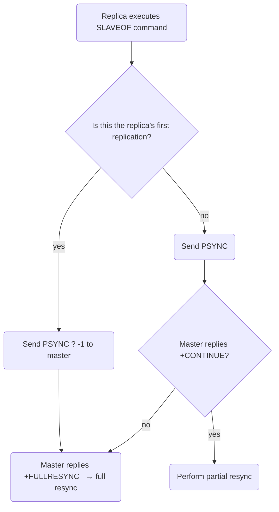
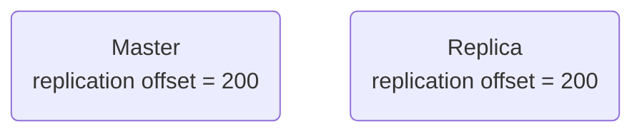
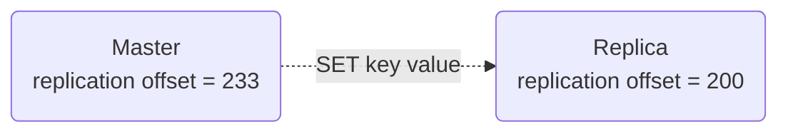
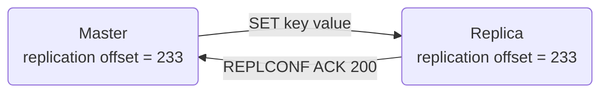

English | [中文版](ansys_replication_zh.md)

# Redis Source Code Analysis - Replication

[TOC]


Database state consistency: during replication the master and its replicas keep the same dataset.


## Legacy replication behavior

### Synchronization

Synchronization (`SYNC`) updates the replica's dataset to match the master's current dataset.

```sequence
Title: Example
Replica->Master: send SYNC command
Master-->Replica: send RDB file
Master-->Replica: send all write commands buffered since the RDB generation
```

1. Replica sends `SYNC` to the master.
2. Master executes `BGSAVE` to create an RDB file in background and starts buffering all write commands executed after that moment.
3. When `BGSAVE` finishes, the master sends the generated RDB file to the replica; the replica loads it and updates its dataset to the master's state at the time of the `BGSAVE`.
4. The master then sends the buffered write commands to the replica; the replica executes them to reach the master's current dataset state.

### Command propagation

Command propagation is used to replay write commands on replicas when the master modifies its dataset so replicas stay consistent with the master.


## Shortcomings of legacy replication

There are two main replication cases for a replica:

- Initial sync: the replica has never replicated before or is connecting to a different master than previously.
- Partial resync after disconnection: replication was interrupted during command propagation due to network issues; the replica reconnects and continues replicating.

### `SYNC` is expensive

Each `SYNC` triggers these expensive operations on the master and replica:

1. The master runs `BGSAVE` to generate an RDB file — this consumes significant CPU, memory and disk I/O on the master.
2. The master transfers the RDB file to the replica — this consumes network bandwidth and can delay the master's responsiveness to client requests.
3. The replica must load the RDB file; while loading, the replica is blocked and cannot serve requests.


## Modern replication (PSYNC)

`PSYNC` supports both full resynchronization and partial resynchronization:

- Full resynchronization: used for initial syncs. The master creates and sends an RDB file and then sends buffered write commands.
- Partial resynchronization: used when a replica reconnects after a short disconnection; the master sends only the write commands executed during the downtime.


### Partial resynchronization

Partial resynchronization avoids sending a full RDB on reconnection. The process:

```sequence
Title: Partial resynchronization
Replica->Master: PSYNC
Master-->Replica: +CONTINUE
Master-->Replica: send write commands executed during the disconnection
```

Both master and replica maintain a replication offset:

1. Each time the master transmits N bytes to a replica, the master's offset increases by N.
2. Each time the replica receives N bytes, the replica's offset increases by N.
3. When master and replica are synchronized, their offsets are equal.

The master keeps a fixed-size FIFO buffer called the replication backlog (default 1MB):

1. If the data after the replica's offset (i.e. starting at offset+1) is still present in the backlog, the master can perform partial resynchronization.
2. If the required data is no longer in the backlog, the master falls back to full resynchronization.
3. Minimum backlog size can be estimated as $second \times write\_size\_per\_second$:

	- `second`: average time (s) the replica needs to reconnect after disconnection;
	- `write_size_per_second`: average number of bytes of write commands generated by the master per second (in protocol format).

	Example: if writes average 1MB/s and reconnection takes on average 5s, the backlog minimum size is 5 * 1 = 5MB.

Each Redis server (master or replica) has a `runid` generated at startup consisting of `REDIS_RUN_ID_SIZE` random hex characters. Purpose:

- If the replica's saved `runid` matches the master's current `runid`, the replica was previously attached to this same master and partial resynchronization can be attempted.
- If the `runid`s differ, the replica previously replicated a different master and full resynchronization is required.


## `PSYNC` workflow




## Replication implementation steps

1. Run `SLAVEOF <IP> <PORT>` to set the master address and port.
2. Establish a socket connection to the master.
3. Send `PING` and handle the reply.

	```mermaid
	graph TD
	ping(Replica sends PING to master) --> is_return_pong{Master returns PONG}
	is_return_pong -- yes --> next(Proceed to next step)
	is_return_pong -- no --> read(Read timeout or error) --> disconnect(Disconnect and retry)
	```

	- If the replica times out while reading the master's reply, the network is unreliable; the replica disconnects and reconnects.
	- If the master returns an error, it cannot handle the replica request right now; the replica disconnects and retries.
	- If the replica reads `PONG`, the connection is healthy and the next step proceeds.

4. Authentication

	If the replica has `masterauth` configured, perform authentication; otherwise skip. Flow:

	```mermaid
	graph TD
	auth(Enter auth phase) --> is_master_slave_setauth{Neither master nor replica configured with a password?}
	is_master_slave_setauth -- yes, no auth required --> next(Proceed with replication)
	is_master_slave_setauth -- no, perform auth --> is_same_passwd{Passwords equal?}
	is_same_passwd -- yes, auth success --> next
	is_same_passwd -- no --> detail(Master and replica have different password setups) --> retry(Retry)
	```

	- If the master has no `requirepass` and the replica has no `masterauth`, replication proceeds.
	- If the replica's `AUTH` password matches the master's `requirepass`, replication proceeds; otherwise the master replies `invalid password`.
	- If the master requires a password but the replica has no `masterauth`, the master replies `NOAUTH`.
	- If the master has no password but the replica has `masterauth`, the master replies `no password is set`.

5. Send the replica's listening port to the master.

6. Synchronize data; master and replica act as clients for each other when sending buffered commands:

	- Full resync: the master becomes a client of the replica to send the buffered write commands.
	- Partial resync: the master becomes a client to send missing data from the replication backlog.

7. Command propagation.


## Heartbeat (ACK) and monitoring

During command propagation, the replica by default sends `REPLCONF ACK <replica_offset>` once per second. Purposes:

- Detect network health between master and replica.
- Assist `min-slaves` implementation.
- Detect lost commands.


### Assisting `min-slaves` configuration

These options prevent masters from performing unsafe writes:

- `min-slaves-to-write`: minimum number of replicas required.
- `min-slaves-max-lag`: maximum allowed lag for replicas.


### Detecting lost commands

Before Redis 2.8 there was no missing-command detection; after 2.8 this feature was added.

If the master loses some write commands on the way to the replica, when the replica sends `REPLCONF ACK` its offset will be smaller than the master's offset; the master can locate the missing data in the replication backlog and resend it. Example:

1. Master and replica are synchronized:



2. Master advanced, replica behind:



3. Master resends missing data and replica catches up:




## References

[1] Huang Jianhong. Redis Design and Implementation

[2] Redis source analysis: "Redis master-slave full resynchronization flow" (blog)
