English | [中文版](ansys_sentinel_zh.md)

# Redis Source Code Analysis - Sentinel

[TOC]


Sentinel is Redis' high availability solution. A Sentinel node is essentially a Redis server running in a special mode.


## Principles

1. Sentinel system monitors servers

	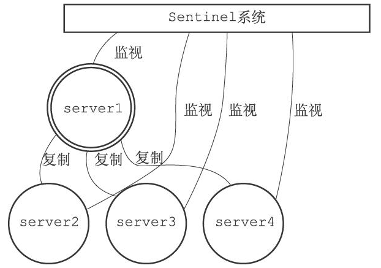

2. Master goes offline

	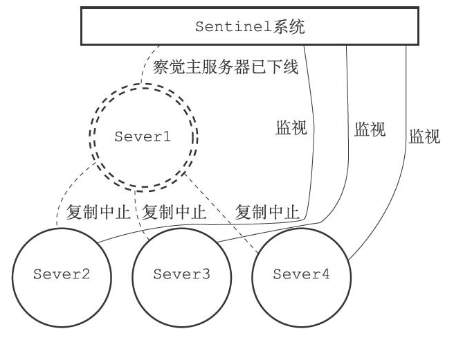

3. Failover

	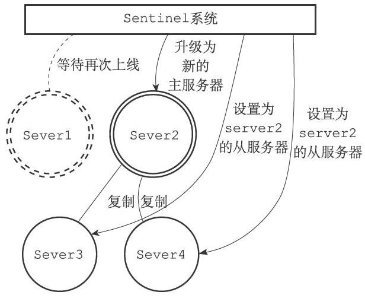

4. Master demotion/reconnect

	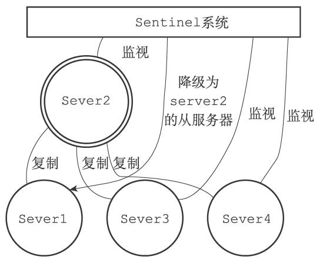


## Starting and initializing Sentinel

1. Start

	Start Sentinel using either:

	```sh
	redis-sentinel <sentinel.conf>
	```

	or

	```sh
	redis-server <sentinel.conf> --sentinel
	```

2. Initialization

	Sentinel's responsibilities differ from a normal Redis server. In Sentinel mode, many Redis features are unused or used only internally:

	- Database/key commands (e.g. `SET`, `DEL`, `FLUSHDB`): not used
	- Transaction commands (`MULTI`, `WATCH`): not used
	- Script commands (`EVAL`): not used
	- RDB persistence commands (`SAVE`, `BGSAVE`): not used
	- AOF commands (`BGREWRITEAOF`): not used
	- Replication commands (`SLAVEOF`): used internally by Sentinel but not exposed to clients
	- Pub/Sub commands: `SUBSCRIBE`, `PSUBSCRIBE`, `UNSUBSCRIBE`, `PUNSUBSCRIBE` are available both internally and to clients; `PUBLISH` is used only internally
	- File event handlers (responsible for sending commands and processing replies): used internally, with different handlers than standard Redis
	- Time event handler (`serverCron`): used, and it calls `sentinel.c`/`sentinelTimer` which implements all Sentinel periodic tasks

	Clients can execute the following commands against Sentinel:

	1. `PING`
	2. `SENTINEL` (various subcommands)
	3. `INFO`
	4. `SUBSCRIBE`
	5. `UNSUBSCRIBE`
	6. `PSUBSCRIBE`
	7. `PUNSUBSCRIBE`

3. Sentinel-specific code

	- Sentinel uses `sentinel.c/REDIS_SENTINEL_PORT` as its service port instead of the standard `REDIS_SERVERPORT`.
	- Sentinel uses `sentinel.c/sentinelcmds` as its command table instead of `redis.c/redisCommandTable`.
	- Sentinel's `INFO` command is implemented by `sentinel.c/sentinelInfoCommand` rather than the standard `redis.c/infoCommand`.

4. Initialize sentinel state

	The server initializes a `sentinelState` structure to hold all Sentinel-related state:

	```c
	/* Sentinel state */
	struct sentinelState {
		 uint64_t current_epoch;     /* current epoch used for failover */
		 dict *masters;              /* all masters monitored by this Sentinel;
												  key: master name
												  value: pointer to sentinelRedisInstance */
		 int tilt;                   /* TILT mode flag */
		 int running_scripts;        /* number of user scripts currently running */
		 mstime_t tilt_start_time;   /* TILT mode start time */
		 mstime_t previous_time;     /* last time the timer ran */
		 list *scripts_queue;        /* FIFO queue of user scripts to run */
		 char *announce_ip;          /* sentinel IP */
		 int announce_port;          /* sentinel port */
	} sentinel;
	```

5. Initialize `masters` field

	Each `sentinelRedisInstance` represents a monitored Redis instance (master or replica):

	```c
	/* Monitored master instance object */
	typedef struct sentinelRedisInstance {
		 ...
	} sentinelRedisInstance;
	```

6. Create connections to masters

	For each monitored master the Sentinel creates two asynchronous connections:

	- a command connection used to send commands and receive replies;
	- a Pub/Sub subscription connection used to subscribe to the `__sentinel__:hello` channel.


## Obtaining master information

Sentinel queries each monitored master every 10 seconds (by default) using the command connection and the `INFO` command, parsing the reply to extract information such as:

- Master info: `runid`, `role`, etc.
- Replicas info: `ip`, `port`, `state`, `offset`, `lag`.

Illustration:

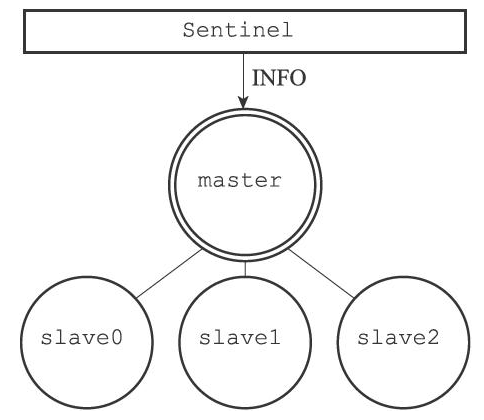


## Obtaining replica information

When Sentinel discovers a new replica of a monitored master it creates an instance structure and opens command and subscription connections to that replica as well.

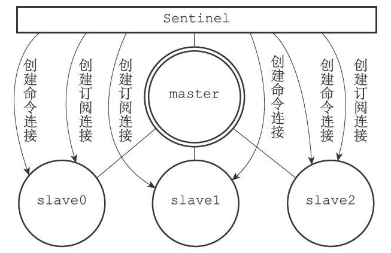

Sentinel polls replicas every 10s with `INFO` and extracts fields such as `runid`, `role`, `master_host`, `master_port`, `master_link_status`, `slave_repl_offset`, and `slave_priority`.


## Announcing Sentinel info to monitored servers

Every 2 seconds (by default) Sentinel publishes a message on the monitored servers:

```sh
PUBLISH __sentinel__:hello "<s_ip>,<s_port>,<s_runid>,<s_epoch>,<m_name>,<m_ip>,<m_port>,<m_epoch>"
```

Parameters:

| param     | meaning                                   |
|-----------|-------------------------------------------|
| `s_ip`    | Sentinel IP                               |
| `s_port`  | Sentinel port                             |
| `s_runid` | Sentinel runid                            |
| `s_epoch` | Sentinel configuration epoch              |
| `m_name`  | monitored master's name                   |
| `m_ip`    | monitored master's IP                     |
| `m_port`  | monitored master's port                   |
| `m_epoch` | monitored master's configuration epoch    |


## Receiving channel messages from masters and replicas

After opening a subscription connection Sentinel sends `SUBSCRIBE __sentinel__:hello`. The subscription remains until the connection closes.

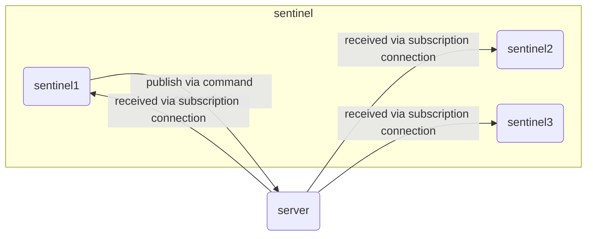

When a Sentinel receives a `__sentinel__:hello` message from another Sentinel:

- If the runid in the message equals the receiving Sentinel's runid, the message is from itself and is ignored.
- Otherwise the message is from a different Sentinel monitoring the same master; the receiver updates its view of that master and adds or updates the source Sentinel in its `sentinels` dictionary.

### Updating the `sentinels` dictionary

- If the source Sentinel already exists in the `sentinels` dictionary, update its instance structure.
- If it does not exist, create a new instance and insert it.

### Creating command connections to other Sentinels

When discovering another Sentinel, a Sentinel creates a command connection to it (but not a subscription connection).

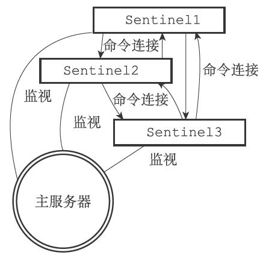


## Subjective down (SDOWN) detection

Sentinels send `PING` to all instances once per second and determine their subjective status from the replies:

- Valid replies: `+PONG`, `-LOADING`, `-MASTERDOWN`.
- Invalid replies: any other reply or no reply within `down-after-milliseconds`.


## Objective down (ODOWN) check

After marking a master as subjectively down, a Sentinel queries other Sentinels to confirm objective down status.

### `SENTINEL is-master-down-by-addr` command

Sentinel issues:

```
SENTINEL is-master-down-by-addr <ip> <port> <current_epoch> <runid>
```

- `ip`, `port`: address of the master suspected to be down
- `current_epoch`: current configuration epoch used to elect the leader Sentinel
- `runid`: either `*` or the runid of the Sentinel requesting election
  - `*` indicates the request is only for checking ODOWN
  - a runid signals an election request

Other Sentinels respond with:

| field       | meaning                                                                 |
|-------------|-------------------------------------------------------------------------|
| `down_state`| whether the responding Sentinel considers the master down (1 yes, 0 no) |
| `leader_runid` | either `*` or the runid of the local leader candidate                |
| `leader_epoch`| epoch of the local leader candidate (0 if `leader_runid` is `*`)     |

Objective down is reached when the number of Sentinels that agree the master is down exceeds the `quorum` configured in `sentinel monitor ... <quorum>`.


## Electing a leader Sentinel

When a master is considered objectively down, monitored Sentinels perform an election to choose a leader Sentinel which will coordinate failover.

### Election rules

1. All online Sentinels may be elected leader.
2. After each election attempt, successful or not, all Sentinels increment their configuration epoch.
3. In each epoch every Sentinel may cast exactly one vote.
4. When a Sentinel sends `SENTINEL is-master-down-by-addr` with its runid (not `*`), it requests votes.
5. The first candidate requesting a vote from a target Sentinel receives its vote; subsequent requests are rejected.
6. The target Sentinel replies with its local `leader_runid` and `leader_epoch` information.
7. The requesting Sentinel checks replies; if a candidate receives a majority of local leader votes, it becomes the global leader.
8. There is only one leader Sentinel.
9. If no leader is elected within a timeout, a new election is attempted later.


## Failover procedure

The leader Sentinel performs failover steps:

1. Choose a replica to promote to master using these rules:

	- Exclude replicas that are subjectively down or disconnected.
	- Exclude replicas that failed to reply to the leader's `INFO` within the last 5 seconds.
	- Exclude replicas disconnected from the (down) master for more than `down-after-milliseconds * 10` ms.
	- Prefer replicas with the highest `slave-priority` (lower numeric value indicates higher priority in Redis semantics).
	- If priorities are equal, prefer the replica with the highest replication offset.
	- If both priority and offset are equal, prefer the replica with the smallest runid.

2. Reconfigure the other replicas to replicate the newly promoted master.
3. Reconfigure the old master (when it comes back) to replicate the new master.

Illustrative steps:

1. `server1` goes down

	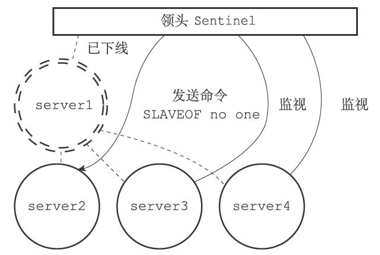

2. `server2` is promoted to master

	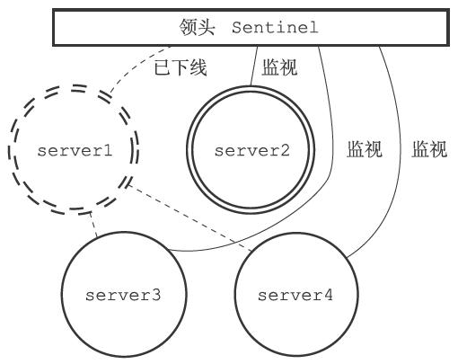

3. Reconfigure remaining replicas to follow the new master

	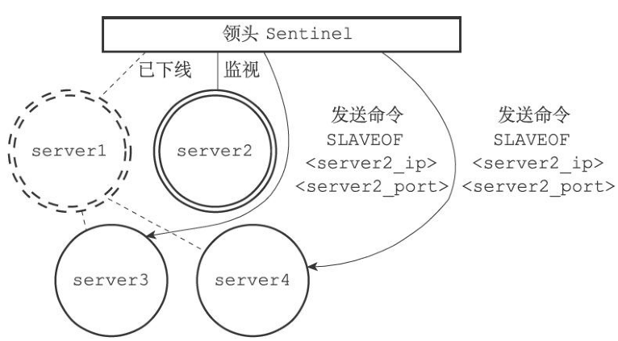

4. Remaining replicas become slaves of the new master

	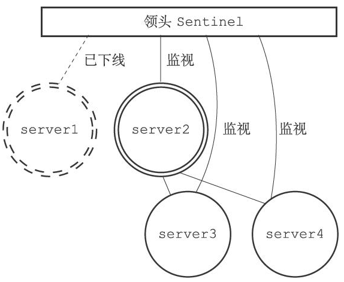

5. Configure the old master to replicate the new master

	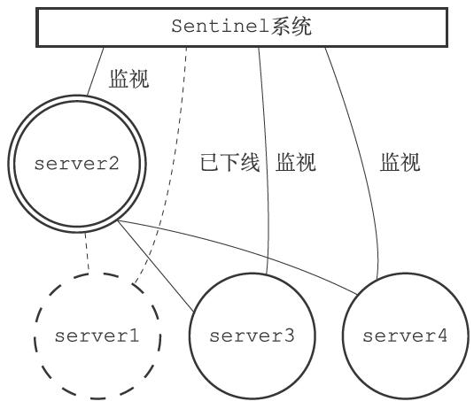

6. Old master returns and becomes a replica

	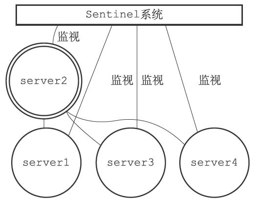


## References

[1] Huang Jianhong. Redis Design and Implementation
