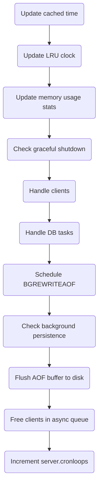

English | [中文版](ansys_server_zh.md)

# Redis Source Code Analysis - Server

[TOC]


## Command execution flow

### Key fields of `redisCommand`

```c
struct redisCommand { /* Redis command */
		char *name;             /* command name */
		redisCommandProc *proc; /* command callback */
		int arity;              /* number of arguments */
		char *sflags;           /* string flags (human readable) */
		int flags;              /* parsed binary flags */
		redisGetKeysProc *getkeys_proc; /* function to extract key arguments from argv */
		int firstkey;                   /* position of first key (0 = no keys) */
		int lastkey;                    /* position of last key (may be negative: argc+lastkey) */
		int keystep;                    /* step between first and last key */
		long long microseconds, calls;  /* total microseconds spent and call count */
};
```

- `name`: command name (lookup is case-insensitive)
- `proc`: pointer to the implementation function
- `arity`: used to validate argument count (negative value -N indicates >= N args)
- `sflags`: human-readable flags

	| flag | binary flag constant       | meaning                                                                 | example commands                               |
	| ---- | -------------------------- | ----------------------------------------------------------------------- | ---------------------------------------------- |
	| `w`  | `REDIS_CMD_WRITE`         | write command (may modify dataset)                                       | `SET`, `RPUSH`, `DEL`                          |
	| `r`  | `REDIS_CMD_READONLY`      | read-only command                                                        | `GET`, `STRLEN`, `EXISTS`                      |
	| `m`  | `REDIS_CMD_DENYOOM`       | may use a lot of memory; check OOM before executing                      | `SET`, `APPEND`, `RPUSH`, `LPUSH`, `SADD`      |
	| `a`  | `REDIS_CMD_ADMIN`         | administrative command                                                   | `SAVE`, `BGSAVE`, `SHUTDOWN`                   |
	| `p`  | `REDIS_CMD_PUBSUB`        | pub/sub related command                                                  | `PUBLISH`, `SUBSCRIBE`, `PUBSUB`               |
	| `s`  | `REDIS_CMD_NOSCRIPT`      | not allowed inside Lua scripts                                           | `BRPOP`, `BLPOP`, `SPOP`                       |
	| `R`  | `REDIS_CMD_RANDOM`        | non-deterministic: same args on same dataset may return different result | `SPOP`, `SRANDMEMBER`, `RANDOMKEY`             |
	| `S`  | `REDIS_CMD_SORT_FOR_SCRIPT`| sort output when used in Lua scripts to make results deterministic      | `SINTER`, `SMEMBERS`, `KEYS`                   |
	| `l`  | `REDIS_CMD_LOADING`       | allowed while server is loading data                                     | `INFO`, `SHUTDOWN`, `PUBLISH`                  |
	| `t`  | `REDIS_CMD_STALE`         | allowed on replicas with stale data                                      | `SLAVEOF`, `PING`, `INFO`                      |
	| `M`  | `REDIS_CMD_SKIP_MONITOR`  | not auto-propagated in `MONITOR` mode                                    | `EXEC`                                         |
	| `k`  | `REDIS_CMD_ASKING`        | (internal use)                                                           |                                                |
	| `F`  | `REDIS_CMD_FAST`          | (internal use)                                                           |                                                |

- `flags`: binary flags derived from `sflags`
- `getkeys_proc`: function to extract keys from argv
- `firstkey`, `lastkey`, `keystep`: describe key positions
- `calls`, `microseconds`: command statistics


## `serverCron`

`serverCron` runs every 100ms by default and manages server resources and maintenance tasks.

### Overview flow



Main tasks include:

1. Update cached server time
2. Update LRU clock
3. Update commands-per-second counters
4. Update memory peak records
5. Handle SIGTERM
6. Manage client resources
7. Manage database resources
8. Run deferred BGREWRITEAOF if scheduled
9. Check background persistence status (`rdb_child_pid != -1 || aof_child_pid != -1`)
10. Flush AOF buffer to AOF file
11. Close clients scheduled for asynchronous close
12. Increment `server.cronloops`

Decision flow for persistence tasks:

```flow
no_persistent=>operation: No background persistence running
is_delay=>condition: Is BGREWRITEAOF delayed?
is_autosave=>condition: Are autosave conditions met?
exec_bgrewriteaof=>operation: Execute BGREWRITEAOF
exec_bgsave=>operation: Execute BGSAVE
is_aofrewrite=>condition: Is AOF rewrite needed?
do_nothing=>operation: Do nothing

no_persistent->is_delay
is_delay(yes)->exec_bgrewriteaof
is_delay(no)->is_autosave
is_autosave(yes)->exec_bgsave
is_autosave(no)->is_aofrewrite
is_aofrewrite(yes)->exec_bgrewriteaof
is_aofrewrite(no)->do_nothing
```


## Server initialization

1. Initialize server state structure
2. Load configuration options
3. Initialize internal data structures
4. Restore dataset state (load RDB/AOF as configured)
5. Start the event loop


## References

[1] Huang Jianhong. Redis Design and Implementation

[2] Redis5 design and source analysis — Chapter 9: command processing lifecycle
