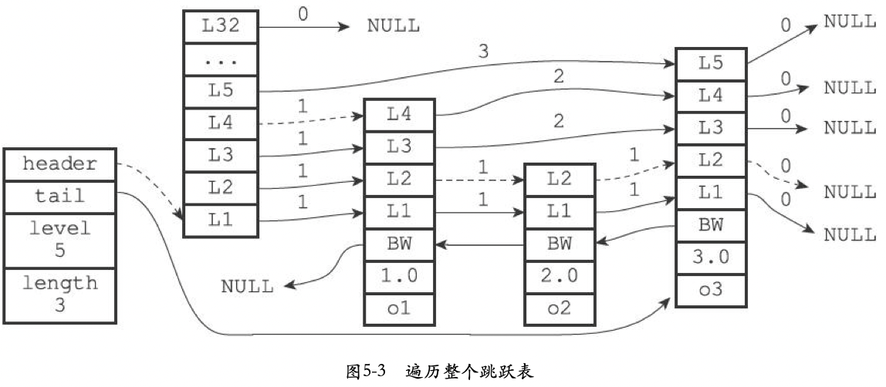

English | [中文版](ansys_skiplist_zh.md)

# Redis Source Code Analysis - Skiplist

[TOC]


## Summary

Redis uses a `skiplist` as the underlying data structure for `zset` (sorted sets) and similar features.


## API

| Function                  | Purpose                                                          | Time Complexity                                           |
| ------------------------: | ---------------------------------------------------------------- | --------------------------------------------------------- |
| `zslCreate`               | Create a new skiplist                                             | $O(1)$                                                     |
| `zslFree`                 | Free a skiplist node with a specific score                        | -                                                           |
| `zslInsert`               | Insert a new node with given score and member                     | Average $O(\log N)$, worst $O(N)$                         |
| `zslDelete`               | Delete a node with given score and member                         | Average $O(\log N)$, worst $O(N)$                         |
| `zslGetRank`              | Return the rank of a node with given member and score             | Average $O(\log N)$, worst $O(N)$                         |
| `zslGetElementByRank`     | Return the node at a given rank                                   | Average $O(\log N)$, worst $O(N)$                         |
| `zslIsInRange`            | Test whether any element falls into a given score range          | $O(1)$ using header and tail                               |
| `zslFirstInRange`         | Return the first node in a given score range                      | Average $O(\log N)$, worst $O(N)$                         |
| `zslLastInRange`          | Return the last node in a given score range                       | Average $O(\log N)$, worst $O(N)$                         |
| `zslDeleteRangeByScore`   | Delete all nodes within a given score range                       | $O(N)$ where N is number of deleted nodes                  |
| `zslDeleteRangeByRank`    | Delete all nodes within a given rank range                        | $O(N)$ where N is number of deleted nodes                  |


## Implementation

### Structures

```c
/* Skiplist node */
typedef struct zskiplistNode {
	robj *obj;                          /* member object */
	double score;                       /* score */
	struct zskiplistNode *backward;     /* backward pointer (toward header) */
	struct zskiplistLevel {
		struct zskiplistNode *forward;  /* forward pointer (toward tail) */
		unsigned int span;              /* span distance to next node */
	} level[];                          /* levels, random [1,32] */
} zskiplistNode;

/* Skiplist */
typedef struct zskiplist {
	struct zskiplistNode *header, *tail; /* header and tail */
	unsigned long length;                /* number of nodes (excluding header) */
	int level;                           /* max level */
} zskiplist;
```


### Traversing a skiplist



Find the first node in a given score range:

```c
zskiplistNode *zslFirstInRange(zskiplist *zsl, zrangespec *range) {
	zskiplistNode *x;
	int i;

	/* If everything is out of range, return early. */
	if (!zslIsInRange(zsl,range)) return NULL;

	x = zsl->header;
	for (i = zsl->level-1; i >= 0; i--) {
		/* Go forward while *OUT* of range. */
		while (x->level[i].forward &&
			!zslValueGteMin(x->level[i].forward->score,range))
				x = x->level[i].forward;
	}

	/* This is an inner range, so the next node cannot be NULL. */
	x = x->level[0].forward;
	redisAssert(x != NULL);

	/* Check if score <= max. */
	if (!zslValueLteMax(x->score,range)) return NULL;
	return x;
}
```

Find the last node in a given score range:

```c
zskiplistNode *zslLastInRange(zskiplist *zsl, zrangespec *range) {
	zskiplistNode *x;
	int i;

	/* If everything is out of range, return early. */
	if (!zslIsInRange(zsl,range)) return NULL;

	x = zsl->header;
	for (i = zsl->level-1; i >= 0; i--) {
		/* Go forward while *IN* range. */
		while (x->level[i].forward &&
			zslValueLteMax(x->level[i].forward->score,range))
				x = x->level[i].forward;
	}

	/* This is an inner range, so this node cannot be NULL. */
	redisAssert(x != NULL);

	/* Check if score >= min. */
	if (!zslValueGteMin(x->score,range)) return NULL;
	return x;
}
```


### Rank (get rank of a node)

Find the rank of a node with score `3.0` and object `o3`, for example.

```c
/**
 * @brief Return the rank of the node with given score and object. Returns 0 if not found.
 */
unsigned long zslGetRank(zskiplist *zsl, double score, robj *o) {
	zskiplistNode *x;
	unsigned long rank = 0;
	int i;

	x = zsl->header;
	for (i = zsl->level-1; i >= 0; i--) {
		while (x->level[i].forward &&
			(x->level[i].forward->score < score ||
				(x->level[i].forward->score == score &&
				compareStringObjects(x->level[i].forward->obj,o) <= 0))) {
			rank += x->level[i].span;
			x = x->level[i].forward;
		}

		/* x might be equal to zsl->header, so test if obj is non-NULL */
		if (x->obj && equalStringObjects(x->obj,o)) {
			return rank;
		}
	}
	return 0;
}
```


### Random level generation

Pick a random level in `[1, 32]`:

```c
/**
 * @brief Generate a random level
 */
int zslRandomLevel(void) {
	int level = 1;
	while ((random() & 0xFFFF) < (ZSKIPLIST_P * 0xFFFF))
		level += 1;
	return (level < ZSKIPLIST_MAXLEVEL) ? level : ZSKIPLIST_MAXLEVEL; /* cap at 32 */
}
```


## References

[1] Huang Jianhong. Redis Design and Implementation
