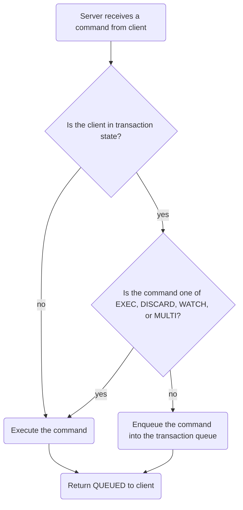
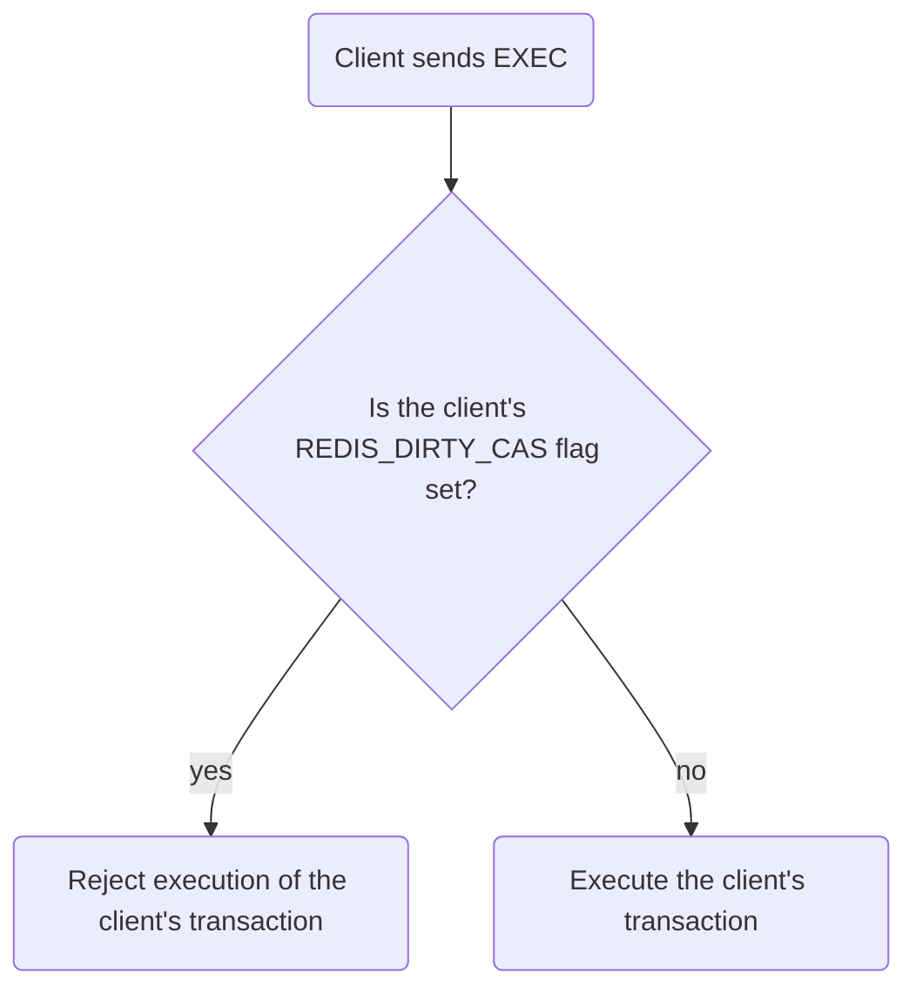

English | [中文版](ansys_transaction_zh.md)

# Redis Source Code Analysis - Transactions

[TOC]

## Transaction implementation

The `MULTI` command switches the client that issued it from non-transactional state to transactional state by setting the `REDIS_MULTI` flag in the client's `flags`.

The server decides whether to execute or enqueue an incoming command with the following logic:

## WATCH (optimistic locking)

`WATCH` provides optimistic locking. It lets a client watch any number of keys and, at `EXEC` time, the server checks whether any watched key was modified. If at least one watched key was modified, the transaction is aborted and the server returns a null reply representing a failed transaction.

Server decision flow for `EXEC` when `WATCH` is used:

## ACID properties of Redis transactions

ACID — Atomicity, Consistency, Isolation, Durability.

### Atomicity

All commands queued in a transaction are either executed all together or none are executed.

Redis does not support rollback. If an error occurs while executing one of the commands in a transaction, the server continues executing the remaining commands. There is no automatic rollback of previously executed commands in the same transaction.

### Consistency

If the dataset is consistent before a transaction, it should remain consistent after the transaction, regardless of success or failure.

Scenarios that might affect consistency:

1. Enqueue-time errors

	If an error occurs while queuing a command into a transaction (for example the command does not exist or the command arguments are invalid), Redis will reject the transaction.

2. Execution-time errors

	Execution-time errors are those that cannot be detected when enqueuing and only occur during command execution. If such an error occurs while executing the transaction, Redis will not abort the transaction; it continues executing the remaining commands. The results of already executed commands are not undone by subsequent errors.

3. Server crash during transaction

	Behavior depends on the configured persistence mode:

	- No persistence: after restart the dataset is empty, which remains consistent.
	- RDB: `BGSAVE` snapshots occur under configured conditions; an interrupted transaction will not leave the dataset inconsistent because restoration is based on the last snapshot. If no snapshot is available, the restarted dataset is empty (consistent).
	- AOF: the AOF file can be used to restore the dataset; if an AOF file is available the dataset will be restored consistently. If not, the restarted dataset is empty (consistent).

### Isolation

Transactions are isolated in the sense that concurrent transactions do not interfere and the results are equivalent to some serial execution.

### Durability

Durability depends on the persistence configuration:

- No persistence: transactions are not durable; a server restart loses all data including transaction results.
- RDB: snapshots are created only under specific `save` conditions; because `BGSAVE` is asynchronous, transactions are not guaranteed to be written immediately to disk and thus are not durable.
- AOF with `appendfsync always`: commands are synced to disk after each write, so transactions are durable.
- AOF with `appendfsync everysec`: commands are fsynced at most once per second; a crash during that window may lose up to one second of commands, so transactions are not fully durable.
- AOF with `appendfsync no`: durability depends on the OS flush policy and is not guaranteed.

Effect of `no-appendfsync-on-rewrite`:

- If `no-appendfsync-on-rewrite` is enabled, even AOF `always` mode may lose durability during AOF rewrites, so transactions are not durable in that case.
- `no-appendfsync-on-rewrite` is disabled by default.

## References

[1] Huang Jianhong. Redis Design and Implementation

[2] Database System Implementation, Chapter 6
