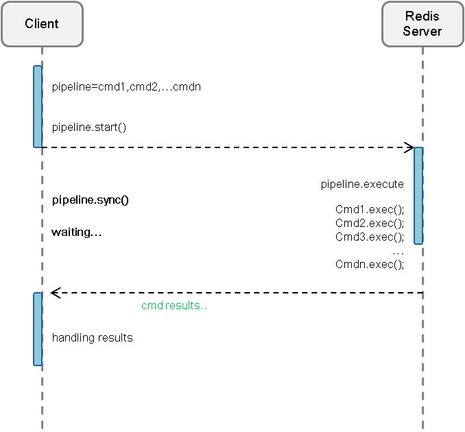

English | [中文版](pipeline_zh.md)

# Redis Pipeline

[TOC]

## Summary
Clients are allowed to send multiple requests to the server sequentially without waiting for each reply; the client reads the responses later in one batch. The main purpose is to increase throughput.

## Drawbacks
1. The pipeline mechanism can optimize throughput, but it does not provide atomicity/transaction guarantees — which can be achieved via Redis `MULTI`/`EXEC` commands.
2. Some read/write operations have dependencies and cannot be safely executed using a pipeline.
