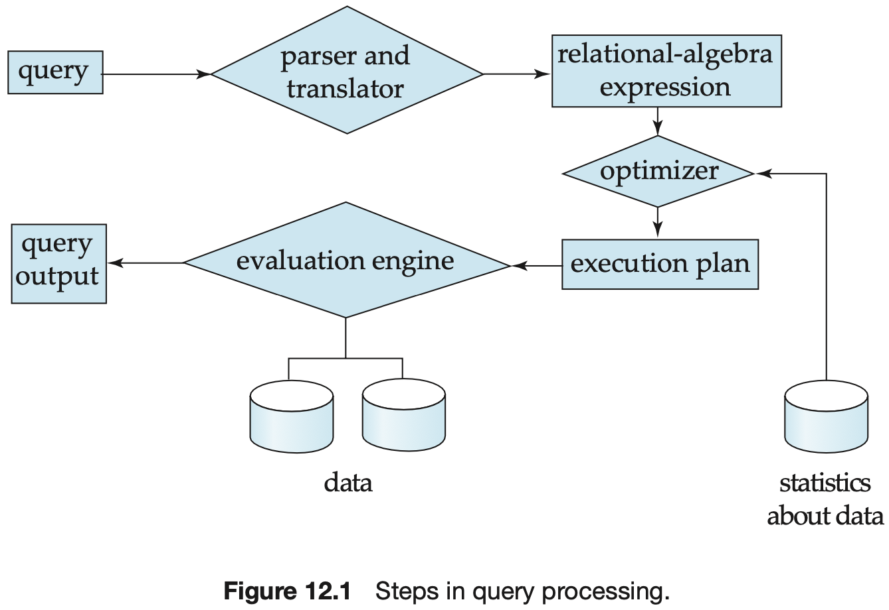
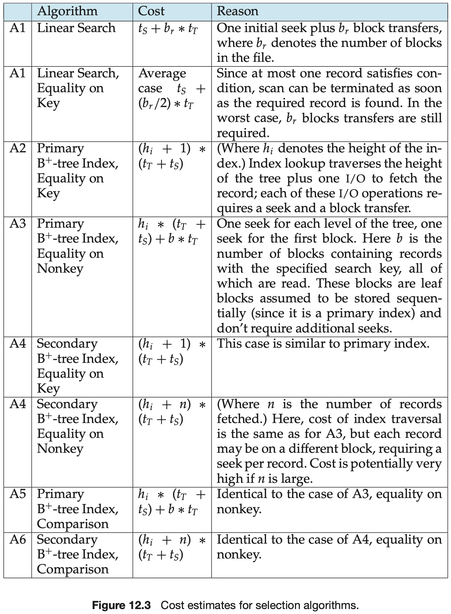

# Database Best Practice

[TOC]

## Performance

There are two main measures of performance of a database system:

1. `throughput`. The number of tasks that can be completed in a given time interval.
2. `response time`. The amount of time it takes to complete a single task from the time it is submitted.

## Indices

There are two basic kinds of indices:

- Ordered indices. Based on a sorted ordering of the values.
- Hash indices. Based on a uniform distribution of values across a range of buckets. The bucket to which a value is assigned is determined by a function, called a `hash function`.

## Query

The response time of a query-evaluation plan is very hard to estimate without actually executing the plan, for the following reasons:

1. The response time depends on the contents of the buffer when the query begins execution; this information is not available when the query is optimized and is hard to account for, even if it were available.
2. In a system with multiple disks, the response time depends on how accesses are distributed among disks, which is hard to estimate without detailed knowledge of the data layout on the disk.

, As a result, instead of trying to minimize the response time, optimizers generally try to minimize the total `resource consumption` of a query plan.

