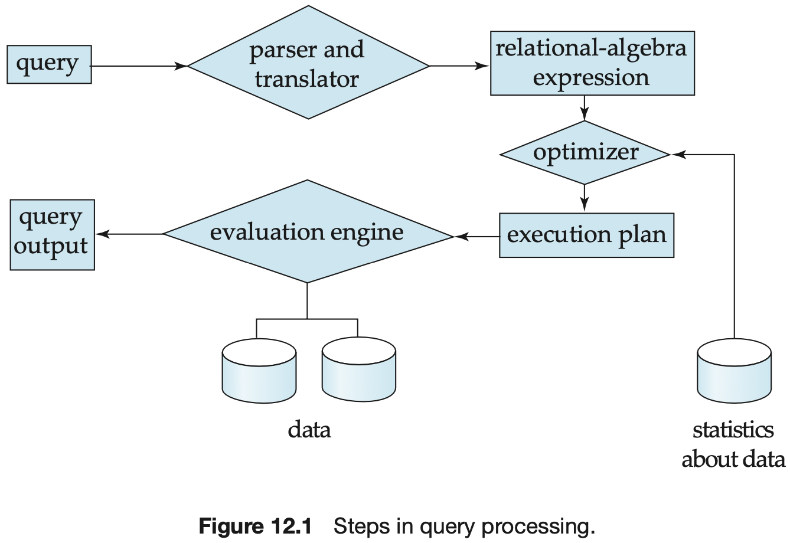
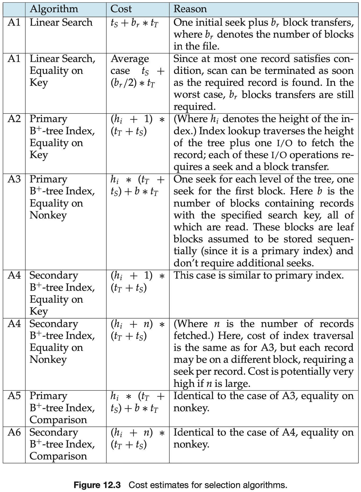

# Database Best Practice

[TOC]


## Performance

There are two main measures of performance of a database system:

1. `throughput`. The number of tasks that can be completed in a given time interval.
2. `response time`. The amount of time it takes to complete a single task from the time it is submitted.

---


## Indices

There are two basic kinds of indices:

- Ordered indices. Based on a sorted ordering of the values.
- Hash indices. Based on a uniform distribution of values across a range of buckets. The bucket to which a value is assigned is determined by a function, called a `hash function`.

---


## Query



The response time of a query-evaluation plan is very hard to estimate without actually executing the plan, for the following reasons:

1. The response time depends on the contents of the buffer when the query begins execution; this information is not available when the query is optimized and is hard to account for, even if it were available.
2. In a system with multiple disks, the response time depends on how accesses are distributed among disks, which is hard to estimate without detailed knowledge of the data layout on the disk.

, As a result, instead of trying to minimize the response time, optimizers generally try to minimize the total `resource consumption` of a query plan.



`Query optimization` is the process of selecting the most efficient query-evaluation plan from among the many strategies usually possible for processing a given query, especially if the query is complex.

Following best practices for writing efficient SQL queries helps improve database performance and ensures optimal use of system resources:

- Reduces query execution time and improves overall performance;
- Minimizes resource consumption while avoiding locking and blocking problems.

### Use Index Wisely

Indexes help the database find data faster without scanning the whole table. 

Example:

```sql
CREATE INDEX idx_orders_customer_id ON orders(customer_id);
```

NOTE: 

- Index columns used often in `WHERE`, `JOIN`, or `ORDER BY` clauses;
- Avoid too many indexes--they slow down `INSERT`, `UPDATE` and `DELETE`;
- Check and monitor index usage regularly to keep queries fast.

### Avoid `SELECT *`: Choose Only Required Columns

Using `SELECT *` can make queries slow, especially on large tables or when joining multiple tables. This is because the database retrieves all columns, even the ones you don't need. It uses more memory, takes longer to transfer data, and makes the query harder for the database to optimize. 

Example:

```sql
SELECT * FROM products # avoid this

SELECT product_id FROM products; # recommand
```

### Limit Rows with WHERE and LIMIT

Fetching too many rows can make your query slow. Even if your app needs only 10 rows, the database might return thousands. Use WHERE to filter data and LIMIT to get only the rows you need.

Example:

```sql
SELECT name FROM tbl1 WHERE country = 'china' LIMIT 10;
```

### Write Efficient WHERE Clauses

The `WHERE` clause filters rows in a query, but how you write it affects performance. Using functions or calculations on columns can stop the database from using indexes, which makes the query slower.

Poor Example:

```sql
SELECT id FROM employees WHERE YEAR(date) = 2022;
```

Optimized Example:

```sql
SELECT id FROM employees WHERE date >= '2022-01-01' AND date < '2023-01-01';
```

### Use Joins Smartly

Join only the tables you need and filter data before joining. Use `INNER JOIN` instead of `OUTER JOIN` if you don't need unmatched rows.

Example:

```sql
SELECT u.name FROM users u JOIN orders o ON u.user_id = o.user_id WHERE o.amount > 100;
```

### Avoid N + 1 Query Problems

N+1 happens when you run one query to get a list, then run extra queries for each item. Fetch related data in a single query using JOINs instead.

Poor Example:

```sql
SELECT * FROM users; 

FOR u IN users
	SELECT name FROM orders WHERE uer_id = u.user_id;
```

Optimized Example:

```sql
SELECT u.name FROM users u JOIN orders o ON u.user_id = o.user_id;
```

### Use EXISTS instead of IN (for subqueries)

When you want to check whether a specific record exists in a table, using the EXISTS operator is often faster than using IN. This is particularly true when the subquery returns a large number of rows, because `EXISTS` stops searching as soon as it finds the first matching record, whereas `IN` has to process all the results before making the comparison.

Poor Example:

```sql
SELECT name FROM customers WHERE customer_id IN (SELECT customer_id FROM orders);
```

Optimized Example:

```sql
SELECT name FROM customers WHERE EXISTS(SELECT 1 FROM orders WHERE orders.customer_id = customers.customer_id);
```

### Avoid Wildcards at the Start of LIKE

Don't start a LIKE pattern with % because it disables index use and causes a full table scan.

Poor Example:

```sql
SELECT id FROM users WHERE name LIKE '%harry';
```

Optimized Example:

```sql
SELECT id FROM users WHERE name LIKE 'harry%';
```

### Use Query Execution Plan

Check how the database runs your query using `EXPLAIN` to see slow parts.

Example:

```sql
EXPLAIN SELECT name FROM ORDERS where id=1;
```

### Use UNION ALL Instead of UNION if possible

`UNION` removes duplicates, which adds sorting overhead. Use `UNION ALL` if duplicates don't matter.

Poor Example:

```sql
SELECT col FROM tbl1 UNION SELECT col FROM tbl2;
```

Optimized Example:

```sql
SELECT col FROM tbl1 UNION ALL SELECT col FROM tbl2;
```

---


## Partitioning

Database partitioning is the process of dividing a database table into smaller segments, called partitions. Instead of having all the data in one  large table, partitioning organizes the data into multiple smaller tables while still treating them as a single table logically.

Partitioning can offer several significant performance benefits:

- Enhanced Query Performance;
- Simplified Maintenance;
- Efficient Data Management;
- Improved Resource Utilization.

There are some data-partitioning strategies:

- `Range Partitioning`: Divides data based on ranges of values for a given column

  for example:

  ```sql
  CREATE TABLE sales(
  	id INT,
      sale_data DATE,
      amount DECIMAL(10, 2)
  )
  PARTITION BY RANGE(YEAR(sale_date))(
    PARTITION p0 VALUES LESS THAN (2020),
    PARTITION p1 VALUES LESS THAN (2021),
    PARTITION p2 VALUES LESS THAN (2022)
  )
  ```

- `List Partitioning`: Segregates data based on a predefined list of values

  for example:

  ```sql
  CREATE TABLE orders (
    order_id INT,
    country VARCHAR(50)
  )
  PARTITION BY LIST COLUMNS(country) (
    PARTITION p_us VALUES IN ('USA'),
    PARTITION p_uk VALUES IN ('UK'),
    PARTITION p_other VALUES IN ('India', 'China', 'Germany')
  );
  ```

- `Hash Partitioning`: Distributes data across partitions using a hash function, ensuring even distribution

  for example:

  ```sql
  CREATE TABLE logs (
    log_id INT,
    log_date DATE
  )
  PARTITION BY HASH(YEAR(log_date))
  PARTITIONS 4;
  ```

- `Composite Partitioning`: This hybrid partitioning approach combines two or more partitioning methods.

### Start with clear Partitioning Criteria

- Clear criteria help ensure that partitions are logically organized and aligned with your business needs;
- Analyze query patterns to determine which partitioning strategy best supports your most common and performance-critical queries;
- Choosing the wrong partition criteria can lead to uneven storage use and degraded performance.

### Choose the right Partitioning Strategy

- Select a partitioning method that aligns with your data characteristics and access patterns (for example, use range partitioning for time-series data or hash partitioning for evenly distributed data).
- Consider combining multiple strategies, like composite partitioning, to address complex data requirements and optimized performance further.

### Optimize Partition Size

- Balance partition sizes to avoid having too many small partitions or a few very large ones. Optimal partition sizes ensure efficient query performance and manageable maintenance tasks.
- Monitor and adjust partition sizes based on data growth and query performance to maintain an optimal balance.

### Leverage Partition Pruning

- Design queries to take advantage of partition pruning, where the database engine automatically skips irrelevant partitions. This significantly reduces query execution time by limiting the data scanned.
- Ensure that partition keys are used in `WHERE` clauses to maximize the benefits of partition pruning.

### Implement Maintenance Automation

- Automation reduces the risk of human error and ensures consistency in partition management.
- Schedule regular maintenance windows to perform partition-related tasks without disrupting normal database operations.

### Monitor and Tune Partition Performance

- Monitor helps identify performance bottlenecks and areas for improvement.
- Regularly review partition performance metrics and make necessary adjustments to maintain optimal database performance.

### Ensure Data Integrity and Consistency

- Data integrity is crucial for maintaining reliable query results and overall database health.
- Use validation scripts and automated tests to verify partition boundaries and data consistency regularly.

### Plan for Scalability

- Ensure that your partitioning scheme can scale seamlessly as your data volume increases.
- Reevaluate and adjust your partitioning strategy periodically to accommodate changes in data patterns and business requirements.

---


## Cluster

TODO

---


## Safety

### Logging

TODO

### Parameterized Query

In `SQL injection` attacks, the attacker manages to get an application to execute an SQL query created by the attacker. The primary defense against SQL injection is to use parameterized queries (prepared statements) everywhere never build SQL with string concatenation.


## Reference

[1] Abraham Silberschatz; Henry F. Korth; S. Sudarshan . Database System Concepts . 6ED

[2] [SQL Query Optimizations](https://www.geeksforgeeks.org/sql/best-practices-for-sql-query-optimizations/)

[3] [MySQL Partitioning for Performance Optimization](https://www.datacamp.com/doc/mysql/mysql-partitioning)

[4] [Partitioning Strategies: Optimizing Database Performance](https://solvaria.com/database-partitioning-strategies/)
