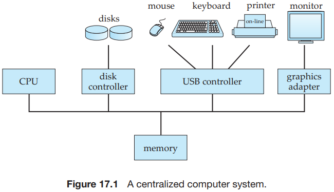
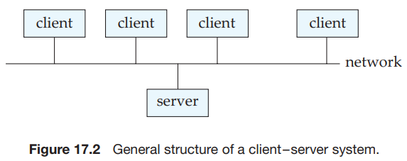
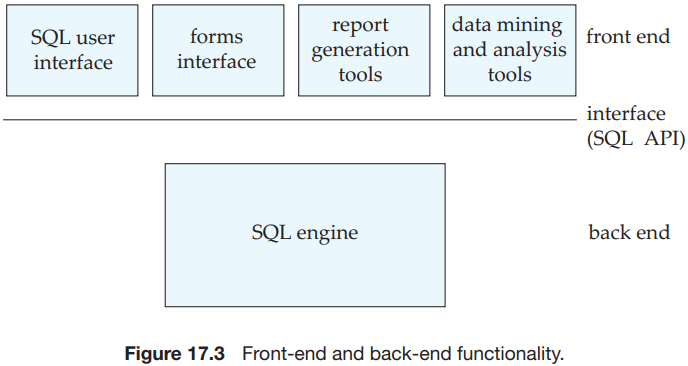
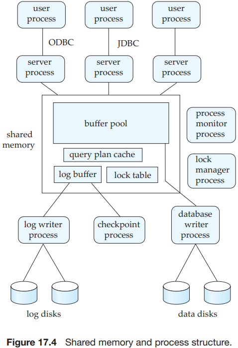
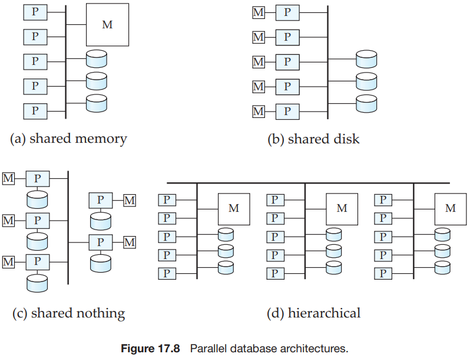
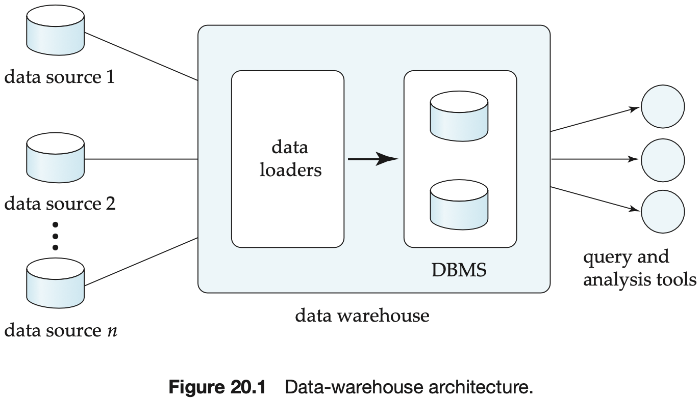

[中文版](design_zh.md) | English

# Database Design

[TOC]

## Relational Database Design

We can use the following three rules to find logically implied functional dependencies:

- `Reflexivity rule`. If $\alpha$ is a set of attributes and $\beta \subseteq \alpha$, then $\alpha \rightarrow \beta$ holds.
- `Augmentation rule`. If $\alpha \rightarrow \beta$ holds and $r$ is a set of attributes, then $r \alpha \rightarrow r \beta$ holds.
- `Transitivity rule`. If $\alpha \rightarrow \beta$ holds and $\beta \rightarrow r$ holds, then $\alpha \rightarrow r$ holds.

## Database System Architectures

## Parallel Databases

We present three basic data-partitioning strategies. Assume that there are $n$ disks, $D_0, D_1, \cdots, d_{n-1}$, across which the data are to be partitioned:

- `Round-robin`. This strategy scans the relation in any order and sends the $i$th tuple to disk number $D_{i\ mod\ n}$. The round-robin scheme ensures an even distribution of tuples across disks; that is, each disk has approximately the same number of tuples as the others.
- `Hash partitioning`. This declustering strategy designates one or more attributes from the given relation's schema as the partitioning attributes. A hash function is chosen whose range is $\{0, 1, \cdots, n - 1\}$. Each tuple of the original relation is hashed on the partitioning attributes. If the hash function returns $i$, then the tuple is placed on disk $D_i$.
- `Range partitioning`. This strategy distributes tuples by assigning contiguous attribute-value ranges to each disk. It chooses a partitioning attribute, A, and a `partitioning vector` $[v_0, v_1, \cdots, v_{n-2}]$, such that, if $i < j$, then $v_i < v_j$. The relation is partitioned as follows: Consider a tuple $t$ such that $t[A] = x$. If $x < v_0$, then $t$ goes on disk $D_0$ If $x \geq v_{n-2}$, then $t$ goes on disk $D_{n-1}$. If $v_i \leq x < v_{i+1}$, then $t$ goes on disk $D_{i + 1}$.

## Distributed Databases

A distributed database system consists of a collection of sites, each of which maintains a local database system. Each site is able to process local transactions: those transactions that access data in only that single site. In addition, a site may participate in the execution of global transactions requires communication among the sites.

In a `homogeneous distributed database` system, all sites have identical database management system software, are aware of one another, and agree to cooperate in processing users’ requests.

In a `heterogeneous distributed database`, different sites may use different schemas and different database management systems software.

## Data Warehouse

A `data warehouse` is a repository (or archive) of information gathered from multiple sources, stored under a unified schema at a single site. Once gathered, the data are stored for a long time, permitting access to historical data.

## Reference

[1] Abraham Silberschatz, Henry F. Korth, S. Sudarshan . Database System Concepts . 6 Edition