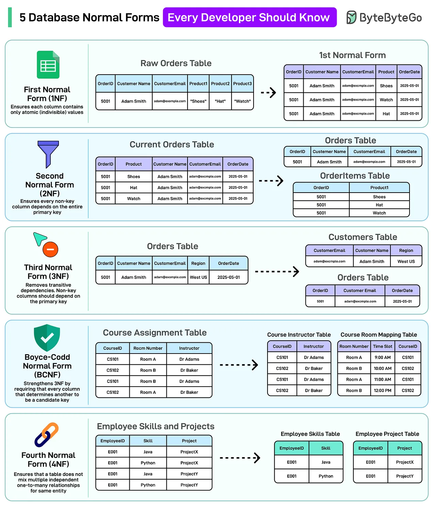
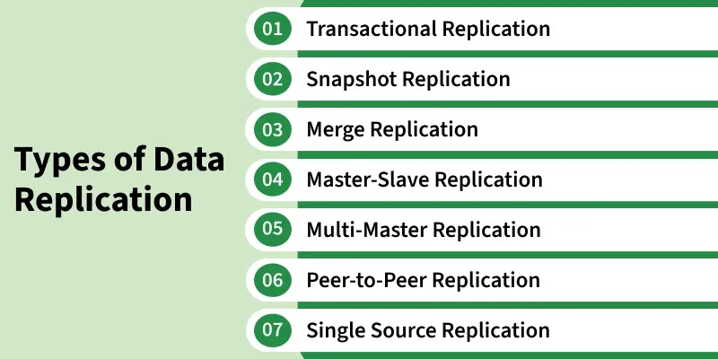
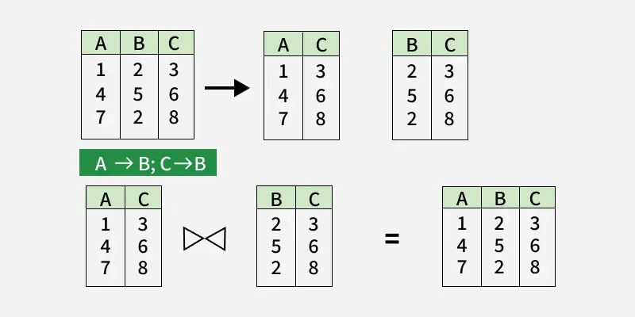

# Normalization

[TOC]

Normalization is an important process in database design that helps improve the database's efficiency, consistency, and accuracy.

## Features

- Elimination of Data Redundancy: One of the main features of normalization is to eliminate the data redundancy that can occur in a database. Data redundancy refers to the repetition of data in different parts of the database. Normalization helps in reducing or eliminating this redundancy, which can improve the efficiency and consistency of the database.

- Ensuring Data Consistency: Normalization helps in ensuring that the data in the database is consistent and accurate. By eliminating redundancy, normalization helps in preventing inconsistencies and contradictions that can arise due to different versions of the same data.

- Simplification of Data Management: Normalization simplifies the process of managing data in a database. By breaking down a complex data structure into simpler tables, normalization makes it easier to manage the data, update it, and retrieve it.

- Improved Database Design: Normalization helps in improving the overall design of the database. By organizing the data in a structured and systematic way, normalization makes it easier to design and maintain the database. It also makes the database more flexible and adaptable to changing business needs.

- Standardization: Normalization helps in standardizing the data in the database. By organizing the data into tables and defining relationships between them, normalization helps ensure that the data is stored in a consistent and uniform manner.

## Normal Forms

| Normal Forms                  | Description of Normal Forms                                  |
| :---------------------------- | :----------------------------------------------------------- |
| First Normal Form (1NF)       | A relation is in first normal form if every attribute in that relation is a single-valued attribute. |
| Second Normal Form (2NF)      | A relation that is in First Normal Form and every non-primary-key attribute is fully functionally dependent on the primary key, then the relation is in Second Normal Form (2NF). |
| Third Normal Form (3NF)       | A relation is in the third normal form if there is no transitive dependency for non-prime attributes, and it is also in the second normal form. A relation is in 3NF if at least one of the following conditions holds in every non-trivial function dependency `X –> Y`. `X` is a super key. `Y` is a prime attribute (each element of `Y` is part of some candidate key). |
| Boyce-Codd Normal Form (BCNF) | For BCNF, the relation should satisfy the below conditionsThe relation should be in the 3rd Normal Form. `X` should be a super-key for every functional dependency (FD) `X−>Y` in a given relation. |
| Fourth Normal Form (4NF)      | A relation R is in 4NF if and only if the following conditions are satisfied: It should be in the Boyce-Codd Normal Form (BCNF). The table should not have any multi-valued dependencies. |
| Fifth Normal Form (5NF)       | A relation R is in 5NF if and only if it satisfies the following conditions: R should be already in 4NF. It cannot be further non-loss decomposed (join dependency) |

### Domain Key Normal Form

The Domain-Key Normal Form (DKNF) is the highest possible normal form in database normalization. In simpler terms, Domain constraints define the valid set of values an attribute can take & Key constraints ensure that each record in the table is uniquely identifiable. Thus, in a DKNF relation:

- There are no remaining anomalies or irregular dependencies.
- All business rules can be expressed using just domain and key constraints.

|       Feature        |                Domain-Key Normal Form (DKNF)                 |
| :------------------: | :----------------------------------------------------------: |
|      Definition      | A relation is in DKNF if all constraints are expressible using domain and key constraints only. |
|         Goal         | Eliminate all possible anomalies and irregular dependencies. |
| Dependencies Allowed |               Only domain and key constraints.               |
|   Practical Usage    |               Very limited due to complexity.                |
|      Advantage       |               Ensures maximum data integrity.                |
|     Disadvantage     |             Difficult to implement and maintain.             |

**Notice**:

1. A relation is said to be in Domain-Key Normal Form if all constraints and dependencies in the database can be enforced solely by enforcing domain constraints and key constraints.
2. While DKNF aims for maximum data integrity, not all constraints can be expressed purely using domains and keys, limiting its practical use.

## Anomalies

The primary objective for normalizing the relations is to eliminate the following anomalies. Failure to reduce anomalies results in data redundancy, which may threaten data integrity and cause additional issues as the database increases.

### Insertion Anomaly

Insertion anomalies occur when it is not possible to insert data into a database because the required fields are missing or because the data is incomplete.

### Deletion Anomaly

Deletion anomalies occur when deleting a record from a database and can result in the unintentional loss of data.

### Updation Anomaly

Updation anomalies occur when modifying data in a database and can result in inconsistencies or errors.

## Denormalization

Denormalization is a database optimization technique where redundant data is intentionally added to one or more tables to reduce the need for complex joins and improve query performance. It is not the opposite of normalization, but rather an optimization applied after normalization.

### Advantages and Disadvantages 

Advantages:

- Improved Query Performance

  Denormalization can improve query performance by reducing the number of joins required to retrieve data.

- Reduced Complexity

  By combining related data into fewer tables, denormalization can simplify the database schema and make it easier to manage.

- Easier Maintenance and Updates

  Denormalization can make it easier to update and maintain the database by reducing the number of tables.

- Improved Read Performance

  Denormalization can improve read performance by making it easier to access data.

- Better Scalability

  Denormalization can improve the scalability of a database system by reducing the number of tables and improving the overall performance.

Disadvantages:

- Reduced Data Integrity

  By adding redundant data, denormalization can reduce data integrity and increase the risk of inconsistencies.

- Increased Complexity

  While denormalization can simplify the database schema in some cases, it can also increase complexity by introducing redundant data.

- Increased Storage Requirements

  By adding redundant data, denormalization can increase storage requirements and increase the cost of maintaining the database.

- Increased Update and Maintenance Complexity

  Denormalization can increase the complexity of updating and maintaining the database by introducing redundant data.

- Limited Flexibility

  Denormalization can reduce the flexibility of a database system by introducing redundant data and making it harder to modify the schema.

## Data Replication

Data Replication in DBMS refers to the process of storing copies of the same data at multiple sites or nodes within a distributed database system. The main purpose of replication is to improve data availability, reliability, performance, and fault tolerance. 

In a distributed database environment, data replication ensures that:

- Users can access relevant data locally,
- The system remains operational even if some sites fail.
- The workload is balanced across servers.

### Transactional Replication

Involves sending an initial full copy of the database to subscribers, followed by real-time updates as changes occur at the publisher.

- Changes are propagated in the same order as they happen, ensuring transactional consistency.
- It is ideal for server-to-server environments that require high accuracy and reliability.

### Snapshot Replication

Copies and distributes data exactly as it exists at a specific point in time, without tracking changes.

- It sends the entire dataset to subscribers periodically.
- Suitable for databases where data changes infrequently.

### Merge Replication

Allows both the publisher and subscriber to make changes independently.

- Changes are later merged into a single database.
- It is complex but useful in mobile or client-server environments, where users work offline and synchronize later.

### Master-Slave Replication

In this architecture:

- One database server is designated as the master and
- One or more servers are designated as slaves.

### Multi-Master Replication

All servers act as masters, meaning that updates can occur at any node and changes are replicated across all other nodes.

- Suitable for large distributed systems that require high availability and update flexibility.
- However, it requires conflict detection and resolution mechanisms.

### Peer-to-Peer Replication

Every server acts as both a master and a slave, with data replicated in a peer-to-peer manner.

- Commonly used in distributed databases where each node can handle both reads and writes.
- Ensures redundancy and high availability.

### Single Source Replication

In this type, a single source database replicates data to multiple target databases.

- Ideal for centralized data control with distributed read access.
- Simplifies consistency but increases load on the source server.

## Decomposition

### Dependency Preserving Decomposition

A decomposition of a relation $R$ into $R_₁, R_₂, …, R_ₙ$ is dependency preserving if the union of functional dependencies on the decomposed relations is equivalent to the original set of functional dependencies $F$.

A decomposition $D= \{R1, R2,...,Rn\}$ of $R$ is dependency preserving with respect to a set of functional dependencies $F$ if: $(F_1 \cup F_2 \cup ... \cup F_n)^{+} = F^{+}$​. 

Consider a relation $R → F$ with some functional dependencies.

If $R$ is decomposed into $R_1$ with $FD \{f1\}$ and $R_2$ with $FD \{f2\}$, then there are three cases:

- $f_1 \cup f_2 f_2 = F \rightarrow \text{Dependency preserving}$
- $f_1 \cup f_2 \subset F \rightarrow \text{Not dependency preserving}$
- $f_1 \cup f_2 \supset F \rightarrow \text{Not possible}$

### Lossless Decomposition

A lossless decomposition is a process of decomposing a relation schema into multiple relations in such a way that it preserves the information contained in the original relation.

- Joining the decomposed tables gives back the original table.
- No extra or missing rows are created.

Conditions for Lossless Decomposition:

- After decomposition, the union of attributes of $X_1$ and $X_2$ must be equal to the attributes of the original relation $X$.
- $X_1$ and $X_2$ must have at least one common attribute (intersection should not be NULL).
- The common attribute must be a super key in at least one of the decomposed relations ($X_1$ or $X_2$ ) and also should have unique values to ensure a lossless join.

### Armstrong’s Axioms and Lossless Decomposition

Armstrong’s Axioms are a set of simple rules used to derive all possible functional dependencies (FDs) from a given set. These dependencies help in analyzing whether a database decomposition is lossless. Armstrong’s Axioms themselves do not directly prove that a decomposition is lossless; instead, they are used to find attribute closures and check dependency conditions, which then help in determining losslessness.

The three core axioms are:

- Reflexivity: If $Y \subseteq X$, then $X \rightarrow Y$
- Augmentation: If $X \rightarrow Y$, then $XZ \rightarrow YZ$ for any $Z$
- Transitivity: If $X \rightarrow Y$ and $Y \rightarrow Z$, then $X \rightarrow Z$

Using these rules, you can determine the closure of attribute sets, which helps verify if $(R_1 \cap R_2)^{+}$ covers $R_1$ or $R_2$.

## Reference

[1] Abraham Silberschatz; Henry F. Korth; S. Sudarshan. Database System Concepts. 6th Edition

[2] [Introduction to Database Normalization](https://www.geeksforgeeks.org/dbms/introduction-of-database-normalization/)

[3] [Normal Forms in DBMS](https://www.geeksforgeeks.org/dbms/normal-forms-in-dbms/)

[4] [Dependency Preserving Decomposition - DBMS](https://www.geeksforgeeks.org/dbms/data-base-dependency-preserving-decomposition/)

[5] [Lossless Decomposition in DBMS](https://www.geeksforgeeks.org/dbms/lossless-decomposition-in-dbms/)

[6] [Domain Key Normal Form in DBMS](https://www.geeksforgeeks.org/dbms/domain-key-normal-form-in-dbms/)

[7] [Denormalization in Databases](https://www.geeksforgeeks.org/dbms/denormalization-in-databases/)

[8] [Database Schema Design Simplified: Normalization vs Denormalization](https://blog.bytebytego.com/p/database-schema-design-simplified)
