# Relational Model

[TOC]

## ER Model

The Entity-Relationship Model (ER Model) is a conceptual model for designing a database. This model represents the logical structure of a database, including entities, their attributes, and relationships between them.

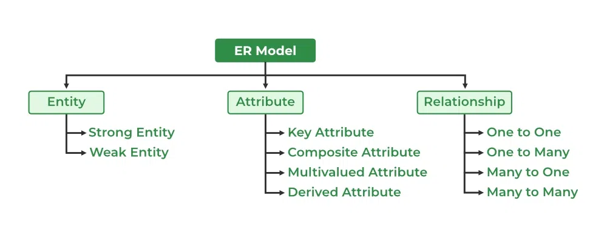

- `Entity`: An object that is stored as data.
- `Attribute`: Properties that describe an entity.
- `Relationship`: A connection between entities.

### ER Diagrams

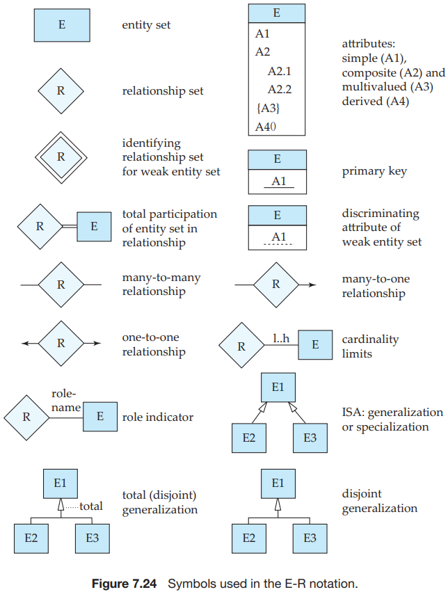

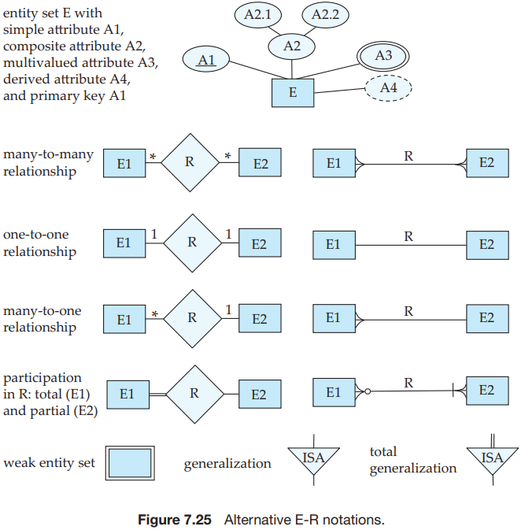

### Entity

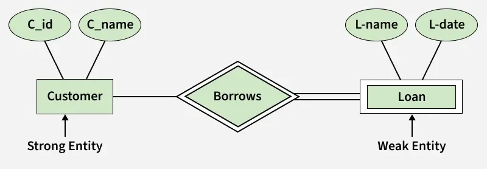

#### Strong Entity

A Strong Entity does not depend on any other Entity in the Schema for its identification. It has a primary key that ensures its uniqueness and is represented by a rectangle in an ER diagram.

#### Weak Entity

A weak entity is associated with an identifying entity (strong entity), which helps in its identification. A weak entity are represented by a double rectangle.

### Attribute

#### Key Attribute

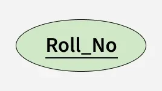

The attribute which uniquely identifies each entity in the entity set is called the key attribute.

#### Composite Attribute

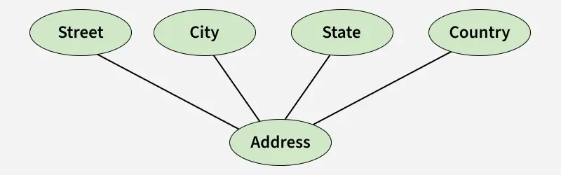

An attribute composed of many other attributes is called a composite attribute.

#### Multivalued Attribute

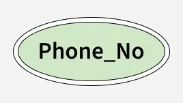

An attribute consisting of more than one value for a given entity.

#### Derived Attribute

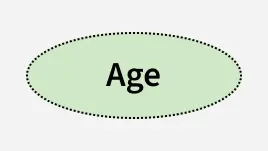

An attribute that can be derived from other attributes of the entity type is known as a derived attribute. e.g.; Age (can be derived from DOB).

### Relationship

#### One-to-One

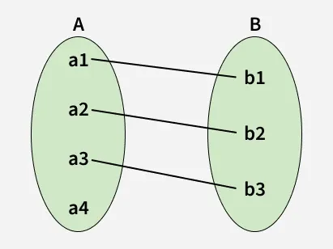

When each entity in each entity set can take part only once in the relationship, the cardinality is one-to-one.

#### One-to-Many

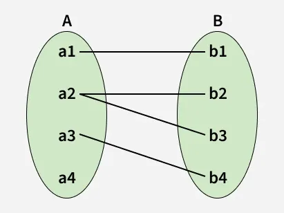

In a one-to-many relationship, one entity can be associated with multiple entities.

#### Many-to-One

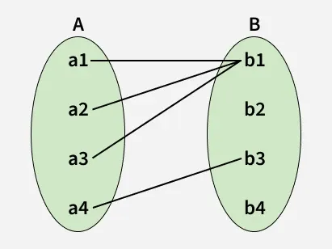

When entities in one entity set can take part only once in the relationship set and entities in other entity sets can take part more than once in the relationship set, cardinality is many to one.

#### Many-to-Many

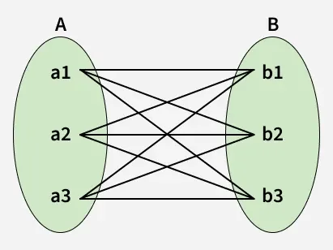

When entities in all entity sets can take part more than once in the relationship cardinality is many to many.

### Generalization

Process of extracting common properties from a set of entities and creating a generalized entity from it. It is a bottom-up approach in which two or more entities can be generalized to a higher-level entity if they have some attributes in common.

### Specialization

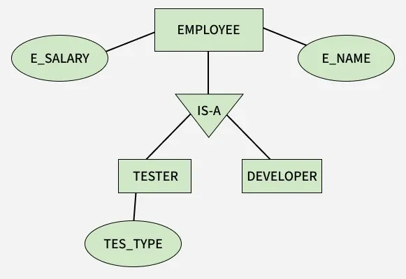

In specialization, an entity is divided into sub-entities based on its characteristics. It is a top-down approach where the higher-level entity is specialized into two or more lower-level entities.

### Aggregation

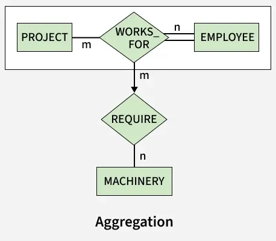

Aggregation is an abstraction through which we can represent relationships as higher-level entity sets.

## Enhanced ER Model

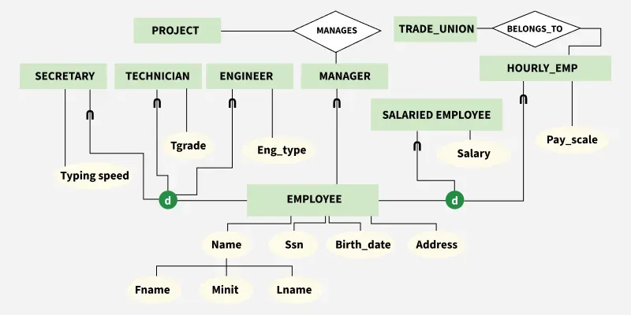

The Enhanced ER (EER) Model is an extension of the traditional ER model used to represent complex database requirements. As data complexity increases, the basic ER model becomes insufficient.

### Superclass and Subclass

Superclass is a higher-level entity set that has common attributes. 

Subclass is a lower-level entity set that inherits attributes and relationships from its superclass but also has its own specific attributes or relationships.

### Generalization and Specialization

Generalization and Specialization are common relationships added as enhancements to the classical ER model. A subclass (specialized class) inherits from a superclass (generalized class), similar to object-oriented concepts.

### Category or Union Type

A Category (or Union Type) is a subclass that is derived from two or more superclasses that may not be related. It allows the model to represent an entity that can be a member of more than one entity set.

### Attribute and Relationship Inheritance

In the EER model, subclasses inherit all attributes and relationships of their superclasses. This supports reusability and data consistency, as common attributes don’t need to be redefined. An entity can be a subclass of multiple entity types; such entities are subclasses of multiple entities and have multiple superclasses. In multiple inheritance, attributes of a subclass are the union of attributes of all superclasses. 

## Generalization, Specialization, Inheritance, and Aggregation in the ER Model

### Generalization

### Specialization

### Inheritance

### Aggregation

## Summary

### Strong Entity vs Weak Entity

|                      **Strong Entity**                       |                       **Weak Entity**                        |
| :----------------------------------------------------------: | :----------------------------------------------------------: |
|           Strong entity always has a primary key.            |     While a weak entity has a partial discriminator key.     |
|     Strong entity is not dependent on any other entity.      |            Weak entity depends on strong entity.             |
|     Strong entity is represented by a single rectangle.      |      Weak entity is represented by a double rectangle.       |
| Two strong entity's relationship is represented by a single diamond. | While the relation between one strong and one weak entity is represented by a double diamond. |
| Strong entities have either total participation or partial participation. |     A weak entity has a total participation constraint.      |

## References

[1] Abraham Silberschatz, Henry F. Korth, and S. Sudarshan. Database System Concepts.

[2] [Introduction of ER Model](https://www.geeksforgeeks.org/dbms/introduction-of-er-model/)

[3] [Enhanced ER Model](https://www.geeksforgeeks.org/dbms/enhanced-er-model/)

[4] [Generalization, Specialization and Aggregation in ER Model](https://www.geeksforgeeks.org/dbms/generalization-specialization-and-aggregation-in-er-model/)
