# SQL

[TOC]


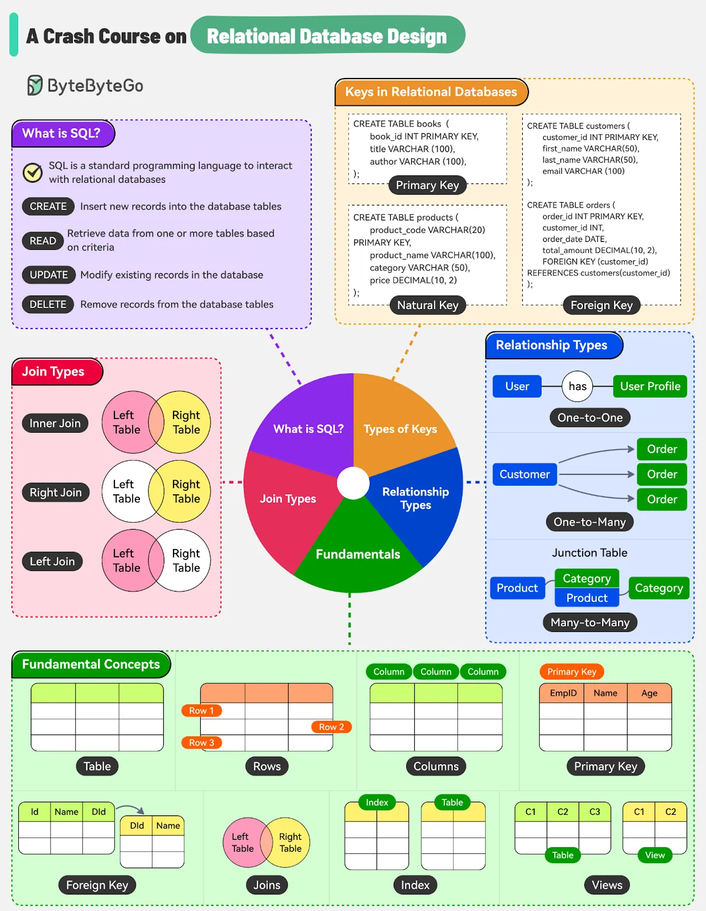

Structured Query Language (SQL) is the standard language used to interact with relational databases.

## Basic

### Data Types

#### Exact Numeric

| **Data Type** |                    **Description**                     |                        **Range**                        |
| :-----------: | :----------------------------------------------------: | :-----------------------------------------------------: |
|    BIGINT     |                 Large integer numbers                  | -9,223,372,036,854,775,808 to 9,223,372,036,854,775,807 |
|      INT      |                Standard integer values                 |             -2,147,483,648 to 2,147,483,647             |
|   SMALLINT    |                     Small integers                     |                    -32,768 to 32,767                    |
|    TINYINT    |                  Very small integers                   |                        0 to 255                         |
|    DECIMAL    | Exact fixed-point numbers (e.g., for financial values) |                 -10^38 + 1 to 10^38 - 1                 |
|    NUMERIC    |      Similar to DECIMAL, used for precision data       |                 -10^38 + 1 to 10^38 - 1                 |

#### Approximate Numeric

| **Data Type** |              **Description**              |        **Range**        |
| :-----------: | :---------------------------------------: | :---------------------: |
|     FLOAT     |        Approximate numeric values         | -1.79E+308 to 1.79E+308 |
|     REAL      | Similar to FLOAT, but with less precision |  -3.40E+38 to 3.40E+38  |

#### Character and String

| **Data Type** |                       **Description**                        |
| :-----------: | :----------------------------------------------------------: |
|     CHAR      | Stores fixed-length non-Unicode characters with a maximum length of 8000 characters |
|    VARCHAR    | Stores variable-length non-Unicode characters with a maximum length of 8000 characters |
| VARCHAR(MAX)  | Stores variable-length non-Unicode data with a maximum size of 2³¹ − 1 characters (introduced in SQL Server 2005) |
|     TEXT      | Stores variable-length non-Unicode data with a maximum size of 2,147,483,647 characters |

#### Unicode Character String

| **Data Type** |                       **Description**                        |
| :-----------: | :----------------------------------------------------------: |
|     Nchar     | The maximum length of 4000 characters. (Fixed-Length Unicode Characters) |
|   Nvarchar    | The maximum length is 4000 characters. (Variable-Length Unicode Characters) |
| Nvarchar(max) | The maximum length of 2^31 - 1 characters(SQL Server 2005 only). (Variable Length Unicode data) |

#### Date and Time

| Data Type |                         Description                          | Storage Size |
| :-------: | :----------------------------------------------------------: | :----------: |
|   DATE    |          Stores the data of date (year, month, day)          |   3 Bytes    |
|   TIME    |        Stores the data of time (hour, minute, second)        |   3 Bytes    |
| DATETIME  | Stores both the data and time (year, month, day, hour, minute, second) |   8 Bytes    |

#### Binary

| **Data Type** |        **Description**        |   **Max Length**    |
| :-----------: | :---------------------------: | :-----------------: |
|    Binary     |   Fixed-length binary data.   |     8000 bytes      |
|   VarBinary   | Variable-length binary data.  |     8000 bytes      |
|     Image     | Stores binary data as images. | 2,147,483,647 bytes |

### Commands

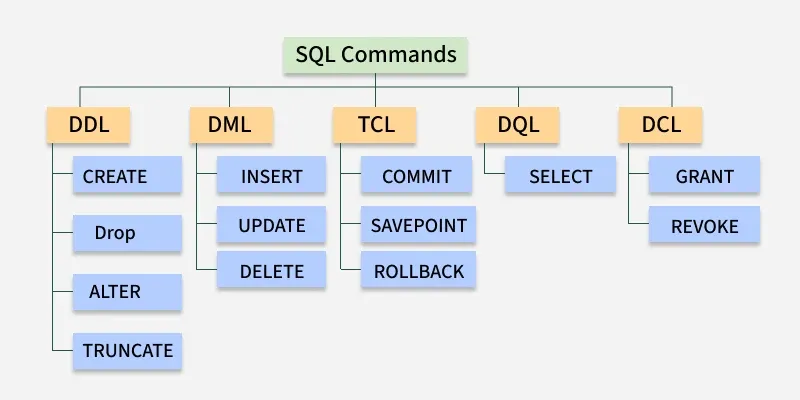

SQL commands are fundamental building blocks used to perform given operations on a database.

#### DDL (Data Definition Language)

DDL consists of SQL commands that can be used for defining, altering, and deleting the database structures, such as tables, indexes, and schemas.

| **Command** |                       **Description**                        |                          **Syntax**                          |
| :---------: | :----------------------------------------------------------: | :----------------------------------------------------------: |
|   CREATE    | Create database or its objects (table, index, function, views, store procedure, and triggers) | `CREATE TABLE table_name (column1 data_type, column2 data_type, ...);` |
|    DROP     |               Delete objects from the database               |                   `DROP TABLE table_name;`                   |
|    ALTER    |             Alter the structure of the database              |  `ALTER TABLE table_name ADD COLUMN column_name data_type;`  |
|  TRUNCATE   | Remove all records from a table, including all spaces allocated for the records. |                 `TRUNCATE TABLE table_name;`                 |
|   COMMENT   |             Add comments to the data dictionary              |       `COMMENT ON TABLE table_name IS 'comment_text';`       |
|   RENAME    |          Rename an object existing in the database           |       `RENAME TABLE old_table_name TO new_table_name;`       |

#### DQL (Data Query Language)

DQL is used to fetch data from the database. The main command is `SELECT`, which retrieves records based on the query. The output is returned as a result set (a temporary table) that can be viewed or used in applications.

| Command  |                         Description                          |                            Syntax                            |
| :------: | :----------------------------------------------------------: | :----------------------------------------------------------: |
|  SELECT  |        It is used to retrieve data from the database         | `SELECT column1, column2, ...FROM table_name WHERE condition;` |
|   FROM   |     Indicates the table(s) from which to retrieve data.      |              `SELECT column1 FROM table_name;`               |
|  WHERE   |       Filters rows before any grouping or aggregation        |      `SELECT column1 FROM table_name WHERE condition;`       |
| GROUP BY | Groups rows that have the same values in specified columns.  | `SELECT column1, AVG_FUNCTION(column2) FROM table_name GROUP BY column1;` |
|  HAVING  |              Filters the results of `GROUP BY`.              | `SELECT column1, AVG_FUNCTION(column2) FROM table_name GROUP BY column1 HAVING condition;` |
| DISTINCT |         Removes duplicate rows from the result set.          |   `SELECT DISTINCT column1, column2, ... FROM table_name;`   |
| ORDER BY |         Sorts the result set by one or more columns.         | `SELECT column1 FROM table_name ORDER BY column1 [ASC | DESC];` |
|  LIMIT   | Used to restrict the number of rows returned in a `SELECT` query (commonly supported in MySQL and PostgreSQL). |           `SELECT * FROM table_name LIMIT number;`           |

#### DML (Data Manipulation Language)

DML commands are used to manipulate the data stored in database tables. With DML, you can insert new records, update existing ones, delete unwanted data, or retrieve information.

| **Command** |           **Description**            |                          **Syntax**                          |
| :---------: | :----------------------------------: | :----------------------------------------------------------: |
|   INSERT    |       Insert data into a table       | `INSERT INTO table_name (column1, column2, ...) VALUES (value1, value2, ...);` |
|   UPDATE    | Update existing data within a table  | `UPDATE table_name SET column1 = value1, column2 = value2 WHERE condition;` |
|   DELETE    | Delete records from a database table |          `DELETE FROM table_name WHERE condition;`           |

#### DCL (Data Control Language)

DCL includes commands such as `GRANT` and `REVOKE,` which mainly deal with the rights, permissions, and other controls of the database system. These commands are used to control access to data in the database by granting or revoking permissions.

| **Command** |                       **Description**                        |                          **Syntax**                          |
| :---------: | :----------------------------------------------------------: | :----------------------------------------------------------: |
|    GRANT    | Assigns new privileges to a user account, allowing access to specific database objects, actions, or functions. | `GRANT privilege_type [(column_list)] ON [object_type] object_name TO user [WITH GRANT OPTION];` |
|   REVOKE    | Removes previously granted privileges from a user account, taking away their access to certain database objects or actions. | `REVOKE [GRANT OPTION FOR] privilege_type [(column_list)] ON [object_type] object_name FROM user [CASCADE];` |

#### TCL (Transaction Control Language)

Transactions group a set of tasks into a single execution unit. Each transaction begins with a specific task and ends when all the tasks in the group are successfully completed. If any of the tasks fail, the transaction fails. Therefore, a transaction has only two results: success or failure.

|    **Command**    |                  **Description**                   |               **Syntax**                |
| :---------------: | :------------------------------------------------: | :-------------------------------------: |
| BEGIN TRANSACTION |              Starts a new transaction              | `BEGIN TRANSACTION [transaction_name];` |
|      COMMIT       |   Saves all changes made during the transaction    |                `COMMIT;`                |
|     ROLLBACK      |   Undoes all changes made during the transaction   |               `ROLLBACK;`               |
|     SAVEPOINT     | Creates a savepoint within the current transaction |       `SAVEPOINT savepoint_name;`       |

### Operators

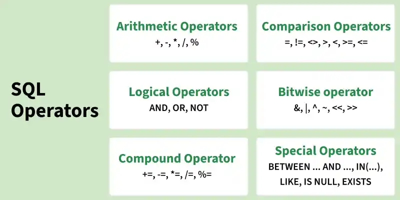

#### Arithmetic Operators

Arithmetic operators in SQL are used to perform mathematical operations on numeric data types in SQL queries.

#### Comparison Operators

Comparison Operators in SQL are used to compare one expression's value to other expressions.

#### Logical Operators

Logical Operators in SQL are used to combine or manipulate conditions in SQL queries to retrieve or manipulate data based on specified criteria.

#### Bitwise Operators

Bitwise operators in SQL are used to perform bitwise operations on binary values in SQL queries, manipulating individual bits to perform logical operations at the bit level.

#### Compound Operators

Compound operators combine an operation with assignment. These operators modify the value of a column and store the result in the same column in a single step.

#### Special Operators

SQL also provides several special operators that serve specific functions such as filtering data based on a range, checking for existence, and comparing sets of values.

---


## Database Operations

### SHOW DATABASES

```sql
SHOW DATABASES;
```

### CREATE DATABASE

```sql
CREATE DATABASE database_name;
```

### DROP DATABASE

```sql
DROP DATABASE IF EXISTS Database_Name;
```

### RENAME DATABASE

```sql
-- SQL Server
CREATE DATABASE Test;
ALTER DATABASE Test MODIFY NAME = Example

-- MySQL
CREATE DATABASE new_database_name;
CREATE DATABASE old_database_name;
RENAME TABLE old_database_name.table1 TO new_database_name.table1;

-- PostgreSQL
CREATE DATABASE current_database_name;
ALTER DATABASE current_database_name RENAME TO new_database_name;
```

### SELECT DATABASE

```sql
USE database_name;
```

---


## Table Operations

### SHOW TABLES

Syntax:

```sql
SHOW TABLES;
```

### CREATE TABLE

Syntax:

```sql
CREATE table table_name
(
Column1 datatype (size),
column2 datatype (size),
.
.
columnN datatype (size)
);
```

- `table_name` The name you assign to the new table.
- `column1, column2, ...`: The names of the columns in the table.
- `datatype(size)`: Defines the data type and size of each column.

Examples:

```sql
-- Create a table
CREATE TABLE Products
(
  prod_id    CHAR(10)      NOT NULL,
  vend_id    CHAR(10)      NOT NULL DEFAULT "a",
  prod_name  CHAR(254)     NULL,
  prod_price DECIMAL(8, 2) ,
  prod_desc  VARCHAR(1000)
);

-- Create Table from existing table
CREATE TABLE Products1 AS 
SELECT prod_id, vend_id, prod_name, prod_price, prod_desc
FROM Products;
```

**Notice**:

1. Primary keys uniquely identify rows and cannot be NULL.

2. The `CREATE TABLE` statement can also define constraints like `NOT NULL`, `UNIQUE`, and `DEFAULT`.

3. If you attempt to create a table that already exists, SQL will throw an error. To avoid this, you can use the IF NOT EXISTS clause

   ```sql
   CREATE TABLE IF NOT EXISTS Customer (...);
   ```

4. Always define appropriate data types for each column (e.g., `VARCHAR(50)` for names and `INT` for IDs) to optimize performance and storage.

5. After creating a table, use the following command to view the structure of your table

   ```sql
   DESC table_name;
   ```

### DROP TABLE

Syntax:

```sql
DROP TABLE table_name;
```

Examples:

```sql
DROP TABLE Products;
```

**Notice**:

1. The `DROP TABLE` statement permanently removes a table from the database along with all its associated data and objects, including its data, indexes, triggers, constraints, and permissions.

2. Once a table is dropped, it cannot be recovered, so this command should be used with caution.

3. Using DROP TABLE IF EXISTS prevents errors by ensuring the table is dropped only if it exists

   ```sql
   DROP TABLE IF EXISTS Products;
   ```

4. When a partitioned table is dropped, the table definition, all partitions, their data, and partition metadata are removed. The partitioning scheme is also deleted if it is not used by other tables.

5. Temporary tables can be dropped using the TEMPORARY keyword

   ```sql
   DROP TEMPORARY TABLE temp_table_name;
   ```

6. To verify whether a table has been dropped, use commands like `SHOW TABLES` (MySQL) or query `INFORMATION_SCHEMA.TABLES`. If the table no longer exists, `DESCRIBE` or `DESC` will return an error

   ```sql
   SHOW TABLES; 
   ```

### INSERT TABLE

Examples:

```sql
DROP TABLE IF EXISTS Customer;
CREATE TABLE Customer
(
  CustomerID    INT(10)      NOT NULL,
  FirstName    	CHAR(10)     NOT NULL DEFAULT "a",
  LastName      CHAR(254)    NOT NULL,
  Country  			CHAR(254)    NOT NULL,
  Age  					INT(3),
  Phone 				CHAR(10)
);

INSERT INTO Customer (CustomerID, FirstName, LastName, Country, Age, Phone)
VALUES 
(1, 'Luca', 'Bianchi', 'Italy', 23, 'xxxxxxxxxx'),
(2, 'Aiko', 'Tanaka', 'Japan', 21, 'xxxxxxxxxx');
```

### TRUNCATE TABLE

Syntax:

```sql
TRUNCATE TABLE table_name;
```

Examples:

```sql
DROP TABLE IF EXISTS Customer;
CREATE TABLE Customer
(
  CustomerID    INT(10)      NOT NULL,
);

TRUNCATE TABLE Customer;
```

### COPY TABLE

Syntax:

- Simple Cloning

  ```sql
  CREATE TABLE clone_table SELECT * FROM original_table;
  ```

- Shallow Cloning

  ```sql
  CREATE TABLE clone_table LIKE original_table;
  ```

- Deep Cloning

  ```sql
  CREATE TABLE clone_table LIKE original_table;
  INSERT INTO clone_table SELECT * FROM original_table;
  ```

Examples;

```sql
DROP TABLE IF EXISTS Customer;
CREATE TABLE Customer
(
  CustomerID    INT(10)      NOT NULL
);
INSERT INTO Customer (CustomerID) VALUES (2);

-- simple cloning
CREATE TABLE Customer1 SELECT * FROM Customer;

-- shallow cloning
CREATE TABLE Customer2 LIKE Customer;

-- deep cloning
CREATE TABLE Customer3 LIKE Customer;
INSERT INTO Customer3 SELECT * FROM Customer;
```

**Notice**:

1. Simple cloning in SQL lacks preservation of unique constraints and auto-increment properties, potentially leading to data integrity issues.

### TEMP TABLE

A temporary table in SQL is a special table used to store data temporarily during query execution. It helps hold intermediate results without affecting permanent tables.

Syntax:

- Create a local temporary table

  ```sql
  -- MySQL
  CREATE TEMPORARY TABLE table_name (column_name data_type, ...)
  -- SQL Server
  CREATE TABLE #table_name (column_name data_type, ...)
  ```

- Create a global temporary table

  ```sql
  -- MySQL
  CREATE TEMPORARY TABLE table_name (column_name data_type, ...)
  -- SQL Server
  CREATE TABLE ##table_name (column_name data_type, ...)
  ```

Examples:

```sql
-- create a temporary table
CREATE TEMPORARY TABLE EmpDetails
(
	id INT,
  name VARCHAR(25)
);

-- insert values into temporary table
INSERT INTO EmpDetails VALUES (01, 'James'), (02, 'Mike');

-- select columns
SELECT * FROM EmpDetails;
SHOW TABLES;
```

### ALTER TABLE

Syntax:

- ADD

  ```sql
  -- Adding a new column
  ALTER TABLE table_name ADD column_name datatype;
  ```

- RENAME

  ```sql
  -- Renaming a table
  ALTER TABLE table_name RENAME TO new_table_name;
  
  -- Renaming a column
  ALTER TABLE table_name RENAME COLUMN old_column_name TO new_column_name;
  ```

- MODIFY

  ```sql
  -- Modifying a column data type
  ALTER TABLE table_name MODIFY COLUMN column_name new_datatype;
  
  -- Modifying a column default value
  ALTER TABLE table_name ALTER COLUMN column_name SET DEFAULT default_value;
  ```
  
- DROP

	```sql
	-- Drop a column
	ALTER TABLE table_name DROP COLUMN column_name;
	```
	

Examples:

```sql
DROP TABLE IF EXISTS Student;
CREATE TABLE Student
(
  name    VARCHAR(25)      NOT NULL,
  age     INT(10)
);

-- Rename a Column
ALTER TABLE Student RENAME Column name TO FIRST_NAME;

-- Rename a table
ALTER TABLE Student RENAME TO Student_Details;

-- Add a new column
ALTER TABLE Student_Details ADD marks INT;

-- Modify a column data type
ALTER TABLE Student_Details MODIFY COLUMN marks Decimal(5, 2);

-- Removing a column
ALTER TABLE Student_Details DROP COLUMN marks;

-- Changing a column's default value
ALTER TABLE Student_Details ALTER COLUMN age SET DEFAULT 18;
```

**Notice**:

1. Ideally, avoid altering tables that already contain data; design ahead to reduce structural changes.
2. Most DBMS allow adding columns with limitations on type, `NULL`, and `DEFAULT` usage.
3. Many DBMS do not allow deleting or changing columns easily.
4. Most DBMS allow renaming columns.
5. DBMS often restricts changing columns that contain data; less restriction on empty columns.

### Constraints

#### NOT NULL Constraints

Syntax:

- During table creation

  ```sql
  CREATE TABLE table_Name
  (
  column1 data_type(size) NOT NULL,
  column2 data_type(size) NOT NULL,
  ....
  );
  ```

- Modifying an existing table

  ```sql
  ALTER TABLE table_name MODIFY column_name data_type(size) NOT NULL;
  ```

Examples:

```sql
DROP TABLE IF EXISTS Emp;
CREATE TABLE Emp (
    EmpID INT NOT NULL PRIMARY KEY,
    Name VARCHAR(50),
    Country VARCHAR(50),
    Age INT(2),
    Salary INT(10)
);

-- Insert valid rows (EmpID has values, so inserts succeed)
INSERT INTO Emp (EmpID, Name, Country, Age, Salary) VALUES
(1, 'John', 'USA', 28, 35000),
(2, 'Emma', 'Canada', 32, 55000),
(3, 'Lucas', 'Germany', 26, 42000);

-- Attempt to insert a row with NULL in NOT NULL column (this will throw an error)
-- ❌ERROR: Column 'EmpID' cannot be NULL
INSERT INTO Emp (EmpID, Name, Country, Age, Salary) VALUES
(NULL, 'Oliver', 'France', 30, 50000);
```

#### Primary Key Constraints

The `PRIMARY KEY` constraint in SQL uniquely identifies each record in a table and ensures strong data integrity. It prevents duplicate and `NULL` values, making it essential for reliable relational database design.

Syntax:

- SQL primary key syntax with `CREATE TABLE` statement is

  ```sql
  CREATE TABLE table_name (
      column1 data_type,
      column2 data_type,
      . . . . ,
      PRIMARY KEY (column1, column2)
  );
  ```

- SQL primary key syntax with `ALTER TABLE` statement is

  ```sql
  ALTER TABLE table_name ADD CONSTRAINT constraint_name PRIMARY KEY (column1, column2, . . . . , Column_n);
  ```

Examples:

```sql
DROP TABLE IF EXISTS Persons;
CREATE TABLE Persons (
  PersonID INT PRIMARY KEY,
  LastName varchar(255) ,
  FirstName varchar(255),
  Age INT
);

INSERT INTO Persons VALUES
 (1, 'Johnson', 'Emily', 25),
 (2, 'Walker', 'James', 30);
 
-- ❌ERROR! Duplicate primary key value (PersonID = 1 already exists)
INSERT INTO Persons VALUES (1, 'Brown', 'Olivia', 27);
-- ❌ERROR! NULL not allowed in primary key column
INSERT INTO Persons VALUES (NULL, 'Miller', 'Ethan', 32);
```

#### Foreign Key Constraints

A `FOREIGN KEY` constraint is a concept in SQL that enforces a valid relationship between two tables by ensuring that the values stored in the child table correspond to existing values in the parent table. This constraint protects the database from inconsistent or invalid relational data.

Syntax:

- Create a foreign key in `CREATE TABLE` statement

  ```sql
  CREATE TABLE table_name (  
    column1 datatype,  
    column2 datatype,
    . . . ,
    CONSTRAINT fk_constraint_name 
      FOREIGN KEY (column1, column2, ...)
      REFERENCES parent_table(column1, column2, ...)
  );
  ```

- Add a foreign key with `ALTER TABLE` statement

  ```sql
  ALTER TABLE table_name
  ADD CONSTRAINT fk_constraint_name
     FOREIGN KEY (column1, column2, ...)
     REFERENCES parent_table(column1, column2, ...);
  ```

Examples:

```sql
DROP TABLE IF EXISTS Orders;
DROP TABLE IF EXISTS Persons;
CREATE TABLE Persons (
  PersonID INT PRIMARY KEY,
  LastName VARCHAR(255),
  FirstName VARCHAR(255),
  Age INT
);

INSERT INTO Persons (PersonID, LastName, FirstName, Age) VALUES
  (1, 'Johnson', 'Emily', 25),
  (2, 'Walker', 'James', 30);
  
CREATE TABLE Orders (
  OrderID INT PRIMARY KEY,
  PersonID INT,
  OrderDate DATE,
  Amount DECIMAL(10,2),
  CONSTRAINT fk_orders_person
  FOREIGN KEY (PersonID)
  REFERENCES Persons(PersonID)
  ON UPDATE CASCADE
  ON DELETE RESTRICT
);

INSERT INTO Orders (OrderID, PersonID, OrderDate, Amount) VALUES
(1001, 1, '2026-04-20', 49.99),
(1002, 2, '2026-04-21', 79.50);

-- ❌ERROR! Cannot add or update a child row: a foreign key constraint fails
INSERT INTO Orders (OrderID, PersonID, OrderDate, Amount) VALUES (1003, 999, '2026-04-22', 10.00);

-- ❌ERROR! PersonID=1 has child rows in Orders, so this should fail:
DELETE FROM Persons WHERE PersonID = 1;
```

#### Composite Key Constraints

Syntax:

```sql
CREATE TABLE table_name (
    column1 datatype,
    column2 datatype,
    column3 datatype,
    ...,
    PRIMARY KEY (column1, column2)
);
```

- Use `PRIMARY KEY` (column1, column2) to define a composite key using multiple columns.
- The listed columns together must form a unique combination for every row.

Examples:

```sql
DROP TABLE IF EXISTS student;
CREATE TABLE student(
  id VARCHAR(10), 
  name VARCHAR(30), 
  class VARCHAR(30), 
  section VARCHAR(1), 
  mobile VARCHAR(10),
  PRIMARY KEY (id, mobile)
);

INSERT INTO student (id, name, class, section, mobile) VALUES
 ("1", "ADAM","FOURTH", "B", "123456789"),
 ("2", "JAMES","FIRST", "A", "123456789");

-- ✅OK
INSERT INTO student (id, name, class, section, mobile) VALUES 
("123456789", "ADAM","FOURTH", "B", "2");

-- ✅OK
INSERT INTO student (id, name, class, section, mobile) VALUES 
("2", "ADAM","FOURTH", "B", "000000000");

-- ❌ERROR: Duplicate entry '2-123456789' for key 'student.PRIMARY'
INSERT INTO student (id, name, class, section, mobile) VALUES 
("2", "ADAM","FOURTH", "B", "123456789");
```

#### Unique Constraints

Syntax:

```sql
CREATE TABLE table_name (
 column1 datatype UNIQUE,
 column2 datatype,
 ...
);
```

Examples:

```sql
-- Creating a table with `UNIQUE` constraints
DROP TABLE IF EXISTS Customers;
CREATE TABLE Customers (
    CustomerID INT PRIMARY KEY,
    Name VARCHAR(100),
    Email VARCHAR(100) UNIQUE,
    Country VARCHAR(50)
);

-- ✅ Insert data into Customers table
INSERT INTO Customers (CustomerID, Name, Email, Country) VALUES 
  (1, 'John Doe', 'john.doe@example.com', 'USA'),
  (2, 'Jane Smith', 'jane.smith@example.com', 'Canada');
  
-- ❌ERROR! This will fail because 'john.doe@example.com' already exists 
INSERT INTO Customers (CustomerID, Name, Email, Country) VALUES
 (3, 'Alice Johnson', 'john.doe@example.com', 'UK');
 
-- Using `UNIQUE` with mutiple columns
DROP TABLE IF EXISTS Orders;
CREATE TABLE Orders (
  OrderID INT PRIMARY KEY,
  CustomerID INT,
  ProductID INT,
  OrderDate DATE,
  UNIQUE (CustomerID, ProductID)
);

-- ✅OK Insert data into Orders table
INSERT INTO Orders (OrderID, CustomerID, ProductID, OrderDate) VALUES
(1, 101, 501, '2024-01-10'),
(2, 102, 501, '2024-01-12');

-- ❌ERROR! This will fail: duplicate CustomerID–ProductID pair
INSERT INTO Orders (OrderID, CustomerID, ProductID, OrderDate) VALUES
(3, 101, 501, '2024-01-15'); 
```

#### Alternate Key Constraints

Syntax:

```sql
CREATE TABLE CustomerInfo (
    colum_1 datatype PRIMARY KEY,   -- Primary Key
    column_2 datatype ,
    column_3 datatype UNIQUE,    -- Alternate Key
    column_4 datatype UNIQUE,    -- Alternate Key
    . . . ,
);
```

**Notice**:

1. A candidate key should be a column that can uniquely identify any row in a table, and any of them are eligible to be selected as the Primary Key.

#### CHECK Constraints

Syntax:

- Using `CHECK` with `CREATE TABLE`

  ```sql
  CREATE TABLE table_name (
      column1 datatype,
      column2 datatype CHECK (condition),
      ...
  );
  ```

- Using `CHECK` with `ALTER TABLE`

  ```sql
  ALTER TABLE table_name ADD CONSTRAINT constraint_name CHECK (condition);
  ```

Examples:

```sql
-- Applying CHECK on a single column
DROP TABLE IF EXISTS Customers;
CREATE TABLE Customers (
    CustomerID INT PRIMARY KEY,
    Name VARCHAR(50),
    Age INT CHECK (Age >= 18 AND Age <= 120)
);

-- ✅OK
INSERT INTO Customers (CustomerID, Name, Age) VALUES (1, 'John Doe', 25);

-- ❌ERROR! Invalid insert
-- This will fail due to the CHECK constraint
INSERT INTO Customers (CustomerID, Name, Age) VALUES (2, 'Jane Smith', 15);  

-- `CHECK` constraint with multiple columns
DROP TABLE IF EXISTS Employee;
CREATE TABLE Employee (
    EmployeeID INT PRIMARY KEY,
    Name VARCHAR(50),
    Age INT,
    Salary DECIMAL(10, 2),
    CHECK (Age >= 18 AND Salary > 0)
);

-- ✅OK
INSERT INTO Employee (EmployeeID, Name, Age, Salary) VALUES 
 (1, 'Alice Johnson', 30, 50000),
 (2, 'Bob Lee', 27, 47000);
 
-- ❌ERROR! Invalid insert (age < 18)
INSERT INTO Employee (EmployeeID, Name, Age, Salary) VALUES (2, 'Bob Lee', 16, 45000);  

-- Adding a `CHECK` constraint with `ALTER TABLE`
ALTER TABLE Employee ADD CONSTRAINT chk_salary CHECK (Salary >= 30000);
```

#### DEFAULT Constraints

Syntax:

- Set `DEFAULT` constraint

  ```sql
  CREATE TABLE table_name (
    column1 datatype DEFAULT default_value,
    column2 datatype DEFAULT default_value
  );
  ```

- Dropping the `DEFAULT` constraint

  ```sql
  ALTER TABLE tablename
  ALTER COLUMN columnname
   DROP DEFAULT;
  ```

---


## SELECT

SELECT clause order:

| Clause     | Description                      | Required?                            |
| ---------- | -------------------------------- | ------------------------------------ |
| `SELECT`   | Columns or expressions to return | Yes                                  |
| `FROM`     | Tables to retrieve data from     | Used only when selecting from tables |
| `WHERE`    | Row-level filtering              | No                                   |
| `GROUP BY` | Grouping specification           | Used only with grouped aggregates    |
| `HAVING`   | Group-level filtering            | No                                   |
| `ORDER BY` | Output sort order                | No                                   |

Syntax:

- Retrieve a single column

  ```sql
  SELECT column_name FROM table_name;
  ```

- Retrieve multiple columns

  ```sql
  SELECT column_name1, column_name2 FROM table_name;
  ```

- Retrieve all columns

  ```sql
  SELECT * FROM table_name;
  ```

  **Note: selecting unused columns can reduce query and application performance.**

- Retrieve distinct values

  ```sql
  SELECT DISTINCT column_name FROM table_name;
  ```

- Limit results

  ```sql
  -- MySQL, MariaDB, PostgreSQL, SQLite
  SELECT column_name FROM table_name LIMIT 5;
  SELECT column_name FROM table_name LIMIT 5 OFFSET 2; -- start from row 2
  
  -- SQL Server, Access
  SELECT TOP 5 column_name FROM table_name;
  
  -- DB2
  SELECT column_name FROM table_name FETCH FIRST 5 ROWS ONLY;
  
  -- Oracle
  SELECT column_name FROM table_name WHERE ROWNUM <= 5;
  ```

### Ordering

Syntax:

- Sort results

  ```sql
  SELECT column_name FROM table_name ORDER BY column_name;
  ```

- Sort by multiple columns

  ```sql
  SELECT column_name1, column_name2 FROM table_name ORDER BY column_name1, column_name2;
  ```

- Sort by column position

  ```sql
  SELECT column_name1, column_name2, column_name3 FROM table_name ORDER BY 2, 3; -- first by column_name2, then by column_name3
  ```

- Specify sort direction

  ```sql
  SELECT column_name1, column_name2, column_name3 FROM table_name ORDER BY column_name2 DESC; -- descending
  
  SELECT column_name1, column_name2, column_name3 FROM table_name ORDER BY column_name2 DESC, column_name3; -- column_name3 defaults to ascending
  ```

### Filtering

WHERE operators:

| Operator | Meaning       | Operator  | Meaning                      |
| -------- | ------------- | --------- | ---------------------------- |
| `=`      | Equal         | `>`       | Greater than                 |
| `<>`     | Not equal     | `>=`      | Greater than or equal        |
| `!=`     | Not equal     | `!>`      | Not greater than             |
| `<`      | Less than     | `BETWEEN` | Between two specified values |
| `<=`     | Less or equal | `IS NULL` | Is NULL                      |
| `!<`     | Not less than |           |                              |

Syntax:

- Filter by a condition

  ```sql
  SELECT column_name1, column_name2 FROM table_name WHERE column_name2 = ...;
  ```

  **Note: `ORDER BY` must appear after `WHERE` when both are used.**

- Check a single condition

  ```sql
  SELECT column_name1, column_name2 FROM table_name WHERE column_name2 < ...;
  SELECT column_name1, column_name2 FROM table_name WHERE column_name2 > ...;
  ```

- Not equal checks

  ```sql
  SELECT column_name1, column_name2 FROM table_name WHERE vend_id <> ...;
  SELECT column_name1, column_name2 FROM table_name WHERE vend_id != ...;
  ```

  **Note: `!=` and `<>` are generally interchangeable.**

- Range check

  ```sql
  SELECT column_name1, column_name FROM Products WHERE column_name2 BETWEEN 5 AND 10;
  ```

- NULL check

  ```sql
  SELECT prod_name FROM Products WHERE prod_price IS NULL;
  ```

- Multiple conditions

  ```sql
  SELECT prod_id, prod_price, prod_name FROM Products WHERE vend_id = 'DLL01' AND prod_price <= 4;
  ```

- Match any condition

  ```sql
  SELECT prod_name, prod_price FROM Products WHERE vend_id = 'DLL01' OR vend_id = 'BRS01';
  ```

- Specify order of evaluation

  ```sql
  SELECT prod_name, prod_price FROM Products WHERE (vend_id = 'DLL01' OR vend_id = 'BRS01') AND prod_price >= 10; -- parentheses precedence
  ```

- Specify a set

  ```sql
  SELECT prod_name, prod_price FROM Products WHERE vend_id IN ('DLL01', 'BRS01') ORDER BY prod_name;
  SELECT prod_name, prod_price FROM Products WHERE vend_id = 'DLL01' OR vend_id = 'BRS01' ORDER BY prod_name; -- equivalent
  ```

  Advantages of `IN`:

  1. Clearer syntax when many valid options exist;
  2. Easier precedence management when combined with `AND`/`OR`;
  3. Often faster than multiple `OR` conditions;
  4. `IN` can include another `SELECT`, making WHERE more dynamic.

- Negation

  ```sql
  SELECT prod_name FROM Products WHERE NOT vend_id = 'DLL01' ORDER BY prod_name;
  SELECT prod_name FROM Products WHERE vend_id <> 'DLL01' ORDER BY prod_name; -- equivalent
  ```

### Wildcards

Wildcard usage tips:

1. Avoid overusing wildcards; use other operators when possible;
2. Avoid leading wildcards when possible (slow search);
3. Pay attention to wildcard placement to get intended matches;

- `%`

  ```sql
  SELECT prod_id, prod_name FROM Products WHERE prod_name LIKE 'Fish%'; -- starts with 'Fish'
  SELECT prod_id, prod_name FROM Products WHERE prod_name LIKE '%bean bag%'; -- contains 'bean bag'
  SELECT prod_name FROM Products WHERE prod_name LIKE 'F%y'; -- starts with F and ends with y
  ```

  Note: `%` does not match NULL values.

- `_`

  ```sql
  SELECT prod_id, prod_name FROM Products WHERE prod_name LIKE '__ inch teddy bear'; -- matches a two-digit number
  ```

  Note 1: DB2 may not support `_`.
  Note 2: Microsoft Access uses `?` instead of `_`.

- `[]`

  ```sql
  SELECT cust_contact FROM Customers WHERE cust_contact LIKE '[JM]%' ORDER BY cust_contact; -- matches values starting with 'J' or 'M'
  
  SELECT cust_contact FROM Customers WHERE cust_contact LIKE '[^JM]%' ORDER BY cust_contact; -- matches values not starting with 'J' or 'M'
  SELECT cust_contact FROM NOT cust_contact LIKE '[JM]%' ORDER BY cust_contact; -- equivalent to '[^JM]%'
  ```

For more details, see [LIKE](#LIKE).

### Subquery

Syntax:

```sql
SELECT column_name
FROM table_name
WHERE column_name expression operator (SELECT column_name FROM table_name WHERE ...);
```

Examples:

```sql
DROP TABLE IF EXISTS Employees;
CREATE TABLE Employees (
    EmployeeID INT PRIMARY KEY,
    Name VARCHAR(50),
    Salary INT,
  	DepartmentID INT
);
INSERT INTO Employees (EmployeeID, Name, Salary, DepartmentID) VALUES
(1, 'Alice', 10000, 10),
(2, 'Bob', 16000, 10),
(3, 'Charlie', 17000, 20),
(4, 'Diana', 18000, 20),
(5, 'Evan', 19000, 20);

DROP TABLE IF EXISTS Departments;
CREATE TABLE Departments (
    DepartmentID INT PRIMARY KEY,
    DepartmentName VARCHAR(50),
    Location VARCHAR(50)
);
INSERT INTO Departments (DepartmentID, DepartmentName, Location) VALUES
(10, 'HR', 'New York'),
(20, 'Engineering', 'Chicage'),
(30, 'Sales', 'New York');

-- single-row subquery
SELECT * FROM Employees WHERE Salary = (SELECT MAX(Salary) FROM Employees);

-- multi-row subquery
SELECT * FROM Employees WHERE DepartmentID IN (SELECT DepartmentID FROM Departments WHERE Location = 'New York');

-- correlated subquery
SELECT e.Name, e.Salary FROM Employees e WHERE e.Salary > (SELECT AVG(Salary) FROM Employees WHERE DepartmentID = e.DepartmentID);
```

**Notice**:

1. Subqueries do not have a single fixed syntax, as they can be used in different clauses like `SELECT`, `WHERE`, `FROM` and `HAVING`.

### Correlated Subquery

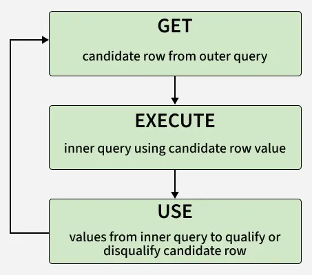

A correlated subquery is a subquery that depends on values from the outer query.

Syntax:

```sql
SELECT column1, column2, ... FROM table1 t1 WHERE column1 operator(SELECT column FROM table2 WHERE expr1 = t1.expr2);
```

Examples:

```sql
DROP TABLE IF EXISTS employees;
CREATE TABLE employees (
    employee_id INT PRIMARY KEY,
    last_name VARCHAR(50),
    salary INT,
  	department_id INT
);
INSERT INTO Employees (employee_id, last_name, salary, department_id) VALUES
(1, 'Alice', 10000, 10),
(2, 'Bob', 16000, 10),
(3, 'Charlie', 17000, 20),
(4, 'Diana', 18000, 20),
(5, 'Evan', 19000, 20);

DROP TABLE IF EXISTS departments;
CREATE TABLE departments (
    department_id INT PRIMARY KEY,
    department_name VARCHAR(50),
    location VARCHAR(50)
);
INSERT INTO departments (department_id, department_name, location) VALUES
(10, 'HR', 'New York'),
(20, 'Engineering', 'Chicage'),
(30, 'Sales', 'New York');

-- outer
SELECT last_name, salary, department_id
FROM employees AS e
WHERE salary > (
    SELECT AVG(salary)
    FROM employees
    WHERE department_id = e.department_id
);

UPDATE employees AS e
JOIN (
    SELECT department_id, ROUND(AVG(salary), 2) AS avg_salary
    FROM employees
    GROUP BY department_id
) AS d
ON d.department_id = e.department_id
SET e.salary = d.avg_salary
WHERE e.department_id = 10;

DELETE e
FROM employees AS e
JOIN (
    SELECT employee_id
    FROM employees
    WHERE department_id = 10
) AS t
ON t.employee_id = e.employee_id;

SELECT e.employee_id, e.last_name, e.salary, e.department_id
FROM employees e
WHERE EXISTS (
    SELECT 1
    FROM employees sub
    WHERE sub.department_id = 10
);

SELECT d.department_id, d.department_name
FROM departments d
WHERE NOT EXISTS (
    SELECT 1
    FROM employees e
    WHERE e.department_id = d.department_id
);
```


---


## INSERT INTO

### Inserting Data into All Columns

Syntax:

```sql
INSERT INTO table_name VALUES (value1, value2, value3, ...); 
```

- table_name: name of the table where data will be inserted
- value1, value2... : values that correspond to each column in order.

Examples:

```sql
INSERT INTO Student VALUES (5, 'Isabella', 'Rome', 'xxxxxxxxxx', 19);
```

### Inserting Data Into Specific Columns

Syntax:

```sql
INSERT INTO table_name (column1, column2, column3, ...) VALUES (value1, value2, value3, ...); 
```

Examples:

```sql
INSERT INTO Student (ROLL_NO, NAME, AGE) VALUES (6, 'Hiroshi', 19);
```

### Insert multiple rows at once

Syntax:

```sql
INSERT INTO table_name (column1, column2, ...) VALUES (value1, value2, ...), (value1, value2, ...), (value1, value2, ...);
```

Examples:

```sql
INSERT INTO Student (ROLL_NO, NAME, ADDRESS, PHONE, AGE) 
VALUES
(7, 'Mateo Garcia', 'Madrid', 'xxxxxxxxxx', 15),
(8, 'Hana Suzuki', 'Osaka', 'xxxxxxxxxx', 18),
(9, 'Oliver Jensen', 'Copenhagen', 'xxxxxxxxxx', 17),
(10, 'Amelia Brown', 'London', 'xxxxxxxxxx', 17);
```

### Inserting data from one table into another table

Syntax:

- Insert all columns from another table:

  ```sql
  INSERT INTO target_table SELECT * FROM source_table;
  ```

- Insert Specific columns from another table:

  ```sql
  INSERT INTO target_table (col1, col2, ...) SELECT col1, col2, ... FROM source_table;
  ```
  
- Insert specific rows based on condition

	```sql
	INSERT INTO target_table SELECT * FROM source_table WHERE condition;
	```

Examples:

```sql
INSERT INTO Student SELECT * FROM OldStudent;

INSERT INTO Student (Name, Age) SELECT Name, Age FROM OldStudent;

INSERT INTO Student SELECT * FROM OldStudent WHERE Age > 20;
```

### Inserting data using transactions

When inserting large amounts of data, you can use SQL [Transactions](#Transactions) to ensure that all rows are inserted correctly.

Examples:

```sql
DROP TABLE IF EXISTS Employees;
CREATE TABLE Employees (
    EmployeeID INT PRIMARY KEY,
    EmployeeName VARCHAR(50),
    Age INT,
  	Department VARCHAR(50)
);
INSERT INTO Employees (EmployeeID, EmployeeName, Age, Department) VALUES (1, 'Alice', 30, 'HR');

BEGIN TRANSACTION;
    INSERT INTO Employees (EmployeeID, EmployeeName, Age, Department)
    VALUES (10, 'Jack Brown', 29, 'HR');
    
    INSERT INTO Employees (EmployeeID, EmployeeName, Age, Department)
    VALUES (11, 'Amelia Wilson', 34, 'Finance');
COMMIT;
```

---


## UPDATE and DELTE

### UPDATE

Syntax:

```sql
UPDATE table_name SET column1 = value1, column2 = value2,... WHERE condition;
-- The SET keyword assigns new values to columns, while the WHERE clause selects which rows to update. Without WHERE, all rows will be updated. 
```

- `able_name`: Name of the table you want to update.
- `SET`: The column(s) you want to update and their new values.
- `WHERE`: Filters the specific rows you want to update.

Examples:

```sql
DROP TABLE IF EXISTS Customers;
CREATE TABLE Customers (
    cust_id INT PRIMARY KEY,
    cust_email VARCHAR(50),
    cust_contact VARCHAR(50)
);
INSERT INTO Customers (cust_id, cust_email, cust_contact)
    VALUES (1, 'xxx@qq.com', 'xx');

UPDATE Customers SET cust_email = 'abc@qq.com' WHERE cust_id = 1;

UPDATE Customers SET cust_contact = 'abc', cust_email = 'abc@qq.com' WHERE cust_id = 1;

UPDATE Customers SET cust_email = NULL WHERE cust_id = 1;
```

### DELETE

Examples:

```sql
DROP TABLE IF EXISTS Customers;
CREATE TABLE Customers (
    cust_id INT PRIMARY KEY,
    cust_email VARCHAR(50),
    cust_contact VARCHAR(50)
);
INSERT INTO Customers (cust_id, cust_email, cust_contact)
    VALUES (1, 'xxx@qq.com', 'xx');
    
DELETE FROM Customers WHERE cust_id = 1;
```

### DELETE ROLLBACK

The `DELETE` statement is a DML operation; it can be rolled back when executed in a statement. If you accidentally delete records or need to repeat the process, you can use the `ROLLBACK` command.

Examples:

```sql
DROP TABLE IF EXISTS Employees;
CREATE TABLE Employees (
    EmployeeID INT PRIMARY KEY,
    EmployeeName VARCHAR(50),
    Age INT,
  	Department VARCHAR(50)
);
INSERT INTO Employees (EmployeeID, EmployeeName, Age, Department) VALUES (1, 'Alice', 30, 'HR');

START TRANSACTION;
DELETE FROM Employees WHERE EmployeeID = 1;
ROLLBACK;

SELECT * FROM Employees WHERE EmployeeID = 1;
```

### DELETE DUMPLICATE ROWS

Syntax:

- Using `GROUP BY` and `COUNT()`

  ```sql
  DELETE FROM Employees
  WHERE EmployeeID NOT IN (
      SELECT MIN(EmployeeID)
      FROM Employees
      GROUP BY Name, Department
  );
  
  SELECT * FROM Employees;
  ```

- Using `ROW_NUMBER()`

  ```sql
  WITH CTE AS (
      SELECT EmployeeID, Name, Department,
             ROW_NUMBER() OVER (PARTITION BY Name, Department ORDER BY EmployeeID) AS RowNum
      FROM Employees
  )
  DELETE FROM Employees
  WHERE EmployeeID IN (SELECT EmployeeID FROM CTE WHERE RowNum > 1);
  ```

- Using common table expressions (CTEs)

  ```sql
  WITH CTE AS (
      SELECT EmployeeID,
             ROW_NUMBER() OVER (PARTITION BY Name, Department ORDER BY EmployeeID) AS RowNum
      FROM Employees
  )
  DELETE FROM Employees
  WHERE EmployeeID IN (
      SELECT EmployeeID
      FROM CTE
      WHERE RowNum > 1
  );
  ```

- Using temporary tables

  ```sql
  DROP TEMPORARY TABLE IF EXISTS DistinctEmployees;
  
  CREATE TEMPORARY TABLE DistinctEmployees AS
  SELECT * FROM Employees e
  WHERE e.EmployeeID IN (
      SELECT MIN(EmployeeID)
      FROM Employees
      GROUP BY Name, Department
  );
  
  DELETE FROM Employees;
  
  INSERT INTO Employees
  SELECT *
  FROM DistinctEmployees;
  
  DROP TEMPORARY TABLE DistinctEmployees;
  ```

- Using `DISTINCT` with `INSERT INTO`

  ```sql
  WITH DistinctEmployees AS (
      SELECT DISTINCT Name, Department
      FROM Employees
  )
  DELETE FROM Employees;
  INSERT INTO Employees (Name, Department)
  SELECT Name, Department
  FROM DistinctEmployees;
  ```

### Summary

1. Never run `UPDATE` or `DELETE` without `WHERE` unless you intend to change all rows;
2. Ensure each table has a primary key and use it in `WHERE` when possible;
3. Test `WHERE` with a `SELECT` before `UPDATE`/`DELETE` to avoid mistakes;
4. Use referential integrity to prevent deleting rows referenced by other tables;
5. Some DBMS allow preventing `UPDATE`/`DELETE` without `WHERE` — use such features if available.

---


## Clauses

|   Clause   |                         Description                          |
| :--------: | :----------------------------------------------------------: |
|  `WHERE`   | The WHERE clause is used to filter records based on specific conditions. It is typically used in SELECT, UPDATE, and DELETE queries to restrict the data that is affected by these statements. For example, retrieving all employees with a salary above 50,000. |
| `ORDER BY` | The ORDER BY clause is used to sort the query results in either ascending or descending order. It is commonly used with numeric, date, and text fields to organize data meaningfully, such as sorting employees by their joining date. |
| `GROUP BY` | The GROUP BY clause groups records with the same values in specified columns and is used with aggregate functions like COUNT(), SUM(), AVG(), etc. For example, calculating total sales per region. |
|  `HAVING`  | The HAVING clause is similar to WHERE but is used to filter grouped records. It is used with GROUP BY to apply conditions on aggregated results, such as filtering groups where the total revenue exceeds a certain amount. |
|  `LIMIT`   | The LIMIT clause restricts the number of rows returned in a query result. This is especially useful in large databases where retrieving all records could be inefficient. For example, fetching the top 5 highest-paid employees. |
|   `TOP`    | The TOP clause, similar to LIMIT, is used in SQL Server to limit the number of rows returned. It helps in retrieving a specific subset of records efficiently. |
|   `LIKE`   | The LIKE clause filters results using pattern matching with wildcards (`%` for multiple characters and `_` for a single character). It is useful for searching partial matches in text fields, such as finding all customers whose names start with 'J'. |
|   `FROM`   | The FROM clause specifies the database table from which records will be retrieved. It is a fundamental part of SQL queries as it defines the source of data for SELECT, DELETE, and UPDATE statements. |
|   `AND`    | The AND clause is used to combine multiple conditions in a query, ensuring that all conditions must be met. It is useful in complex filtering scenarios, such as retrieving employees who work in a specific department and have a salary above 60,000. |
|    `OR`    | The OR clause is used to combine multiple conditions where at least one must be true. It is useful when searching for multiple criteria, such as retrieving customers from either New York or Los Angeles. |

### WHERE

Syntax:

```sql
SELECT column_name FROM table_name WHERE condition;
```

### WITH

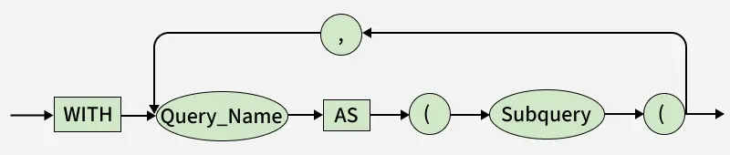

The SQL `WITH` clause (Common Table Expression or CTE) defines a temporary result set that cna be used within a query. It simpliefies complex SQL statements, making them easier to read, manage and reuse.

Syntax:

```sql
WITH cte_name (column1, column2, ...)
AS (
    SELECT column1, column2, ...
    FROM table_name
    WHERE condition
)
SELECT *
FROM cte_name;
```

- `cte_name` is the name of the Common Table Expression.
- The query inside parentheses defines the temporary result set.
- The main query uses this CTE as if it were a table.

Examples:

```sql
DROP TABLE IF EXISTS Employees;
CREATE TABLE Employees (
    EmployeeID INT PRIMARY KEY,
    Name VARCHAR(50),
    Salary INT,
  	Department VARCHAR(50)
);
INSERT INTO Employees (EmployeeID, Name, Salary, Department) VALUES 
	(1, 'Alice', 30, 'HR'),
	(2, 'Bob', 10, 'Engineer');

-- Finding Employees with avove-average salary
WITH AvgSalaryCTE (averageValue) AS (
    SELECT AVG(Salary)
    FROM Employees
)
SELECT 
    EmployeeID,
    Name, 
    Salary 
FROM 
    Employees 
WHERE 
    Salary > (SELECT averageValue FROM AvgSalaryCTE);
    
-- Finding Employees with the lowest salary
WITH MinSalaryCTE (min_salary) AS (
    -- 1. Calculate the single lowest salary value
    SELECT MIN(Salary)
    FROM Employees
)
SELECT 
    e.EmployeeID,
    e.Name, 
    e.Salary 
FROM 
    Employees e
WHERE 
    e.Salary = (SELECT min_salary FROM MinSalaryCTE);
    
-- Nested (chained) WITH clauses
WITH DeptAvg AS (
    SELECT Department, AVG(Salary) AS AvgSalary
    FROM Employees
    GROUP BY Department
),
RankedEmployees AS (
    SELECT e.EmployeeID, e.Name, e.Department, e.Salary,
           RANK() OVER (PARTITION BY e.Department ORDER BY e.Salary DESC) AS SalaryRank
    FROM Employees e
    JOIN DeptAvg d ON e.Department = d.Department
)
SELECT * FROM RankedEmployees WHERE SalaryRank = 1;
```

### HAVING

The SQL `HAVING` clause filters the results of grouped data after using the `GROUP BY` clause. It is used with aggregate functions such as `SUM()`, `COUNT()`, or `AVG()` to display only those groups that meet specific conditions.

Syntax:

```sql
SELECT column_name, AGGREGATE_FUNCTION(column_name) FROM table_name GROUP BY column_name HAVING condition;
```

Examples:

```sql
DROP TABLE IF EXISTS Employees;
CREATE TABLE Employees (
    EmployeeID INT PRIMARY KEY,
    Name VARCHAR(50),
    Salary INT,
  	Department VARCHAR(50)
);
INSERT INTO Employees (EmployeeID, Name, Salary, Department) VALUES 
	(1, 'Alice', 30, 'HR'),
	(2, 'Bob', 10, 'Engineer');
	
-- Filter total salary
SELECT SUM(Salary) AS Total_Salary FROM Employees GROUP BY (SELECT 1) HAVING SUM(Salary) >= 10;

-- Filter average salary
SELECT Department, AVG(Salary) AS AverageSalary FROM Employees GROUP BY Department HAVING AVG(Salary) > 10;

-- Filter maximum salary
SELECT MAX(Salary) AS Max_Salary FROM Employees HAVING MAX(Salary) > 10;

-- Filter minimum experience
SELECT MIN(Salary) AS Min_Salary FROM Employees HAVING MIN(Salary) < 30;

-- Multiple conditions
SELECT SUM(Salary) AS Total_Salary, AVG(Salary) AS Average_Salary FROM Employees HAVING SUM(Salary) >= 10 AND AVG(Salary) > 10;
```

**Notice**:

1. `GROUP BY` (`SELECT` 1) is database-specific and may not work in all SQL databases. So alternatively, you can omit `GROUP BY` and use `HAVING` directly with aggregate functions.

### ORDER BY

SQL `ORDER BY` is used to sort the result set of a query in either ascending (ASC) or descending (DESC) order. By default, `ORDER BY` sorts in ascending order. Sorting can be applied to one or more columns, which helps organize and analyze data effectively.

Syntax:

```sql
SELECT * FROM table_name ORDER BY column_name ASC | DESC; 
```

- table_name: name of the table.
- column_name: name of the column according to which the data is needed to be arranged.
- ASC: to sort the data in ascending order.
- DESC: to sort the data in descending order.

Examples:

```sql
DROP TABLE IF EXISTS students;
CREATE TABLE students (
    name VARCHAR(50),
    age INT
);
INSERT INTO students (name, age) VALUES 
	('Alice', 30), 
	('Bob', 31),
	('KIK', 30);

-- Sort by a single column
SELECT * FROM students ORDER BY age DESC;

-- Sort by multiple columns
SELECT * FROM students ORDER BY age ASC, name DESC; 
```

### GROUP BY

The SQL `GROUP BY` clause is used to arrange identical data into groups based on one or more columns. It is commonly used with aggregate functions like `COUNT()`, `SUM()`, `AVG()`, `MAX()` and `MIN()` to perform calculations on each group of data.

Syntax:

```sql
SELECT column1, aggregate_function(column2) FROM table_name WHERE condition GROUP BY column1, column2;
```

- `aggregate_function`: function used for aggregation, e.g., `SUM()`, `AVG()`, `COUNT()`.
- `table_name`: name of the table from which data is selected.
- `condition`: Optional condition to filter rows before grouping (used with `WHERE`).
- `column1, column2`: Columns on which the grouping is applied.

Examples:

```sql
DROP TABLE IF EXISTS Student;
CREATE TABLE Student (
    name VARCHAR(50),
    age INT,
  	subject VARCHAR(10),
  	year INT
);
INSERT INTO Student (name, age, subject, year) VALUES 
	('Alice', 20, 'MATH', 2020), 
	('Bob', 21, 'ENGLISH', 2021),
	('LILY', 28, 'ENGLISH', 2021),
	('KIK', 20, 'CS', 2022);
	
-- Group by single column
SELECT subject, COUNT(*) AS Student_Count FROM Student GROUP BY subject;

-- Group by multiple columns
SELECT subject, year, COUNT(*) FROM Student GROUP BY subject, year;

-- Grouped sorting
SELECT subject, COUNT(*) AS Student_Count FROM Student GROUP BY subject HAVING COUNT(*) >= 2 ORDER BY Student_Count;

-- `HAVING` to filter groups
SELECT subject, COUNT(*) AS Student_Count FROM Student GROUP BY subject HAVING COUNT(*) >= 2;

SELECT subject, COUNT(*) AS Student_Count FROM Student WHERE year >= 2021 GROUP BY subject HAVING COUNT(*) >= 2;
```

**Notice**:

1. `GROUP BY` may include any number of columns to nest grouping;
2. Nested grouping will aggregate on the last specified grouping;
3. Every non-aggregate expression in `SELECT` must appear in `GROUP BY` (use same expression, not alias);
4. Many SQL implementations disallow grouping on variable-length types (e.g., `TEXT`);
5. Aside from aggregate expressions, every `SELECT` column must be listed in `GROUP BY`;
6. NULLs in grouping columns form a single group;
7. `GROUP BY` appears after `WHERE` and before `ORDER BY`.

### LIMIT

Syntax:

- Basic usage

  ```sql
  SELECT column1, column2, ... FROM table_name WHERE condition ORDER BY column LIMIT [offset,] row_count; 
  ```

  - `offset`: number of rows to skip before returning the result set.
  - `row_count`: number of rows to return in the result set.

- LIMIT with OFFSET

  ```sql
  SELECT * FROM table_name ORDER BY column_name LIMIT X OFFSET Y; 
  -- or
  SELECT * FROM table_name ORDER BY column_name LIMIT Y,X; 
  ```

  - `X`: Number of rows to return.
  - `Y`: Number of rows to skip.

- Using LIMIT to get the nth highest or lowest value

  ```sql
  SELECT column_list FROM table_name ORDER BY expression [ASC | DESC] LIMIT n-1, 1;
  ```

Examples:

```sql
DROP TABLE IF EXISTS Student;
CREATE TABLE Student (
    name VARCHAR(50),
    age INT,
  	subject VARCHAR(10),
  	year INT
);
INSERT INTO Student (name, age, subject, year) VALUES 
	('Alice', 20, 'MATH', 2020), 
	('Bob', 21, 'ENGLISH', 2021),
	('LILY', 28, 'ENGLISH', 2021),
	('KIK', 20, 'CS', 2022);
	
-- Basic limit usage
SELECT * FROM Student LIMIT 3;

-- Limit with order by clause
SELECT * FROM Student ORDER BY age DESC LIMIT 3;

-- Limit with offset
SELECT * FROM Student ORDER BY age LIMIT 2 OFFSET 2;

SELECT age FROM Student ORDER BY age DESC LIMIT 2, 1; 
```

**Notice**:

1. The `LIMIT` clause cannot be used when defining a view.
2. It is not allowed in nested `SELECT` statements, except when used inside subqueries in the `FROM` clause (table expressions).
3. LIMIT cannot be used in embedded `SELECT` statements that act as expressions in singleton SELECTs within SPL routines.

### DISTINCT

Syntax:

```sql
SELECT DISTINCT column1, column2 FROM table_name;
```

- column1, column2: Names of the fields of the table.
- Table_name: Table from where we want to fetch the records.

Examples:

```sql
DROP TABLE IF EXISTS Student;
CREATE TABLE Student (
    name VARCHAR(50),
    age INT,
  	subject VARCHAR(10),
  	year INT
);
INSERT INTO Student (name, age, subject, year) VALUES 
	('Alice', 20, 'MATH', 2020), 
	('Bob', 21, 'ENGLISH', 2021),
	('LILY', 28, 'ENGLISH', 2021),
	('KIK', 20, 'CS', 2022);
	
-- Fetch unique columns
SELECT DISTINCT name FROM Student; 

-- Fetch unique combinations of multile columns
SELECT DISTINCT name, age FROM Student;

-- Using DISTINCT with ORDER BY clause
SELECT DISTINCT age FROM Student ORDER BY age; 

-- Using DISTINCT with aggregate functions
SELECT COUNT(DISTINCT age) FROM Student;

-- DISTINCT with NULL values
INSERT INTO Student (name, age, subject, year) VALUES 
('John Doe', NULL, 'CHINESE', 2023),
('James Brown', NULL, 'CHEMICAL', 2024);

SELECT DISTINCT age FROM Student;
```

**Notice**:

1. If used on multiple columns, `DISTINCT` returns unique combinations of values across those columns.

### TOP

Syntax:

```sql
SELECT column1, column2, ... TOP count FROM table_name [WHERE conditions] [ORDER BY expression [ ASC | DESC ]];
```

- `column1, column2`: names of columns.
- `count`: number of records to be fetched.
- `WHERE conditions`: Optional. Filters the data based on conditions.
- `ORDER BY expression`: Optional. Sorts the result set in ascending or descending order.

Examples:

```sql
-- SQL Server
-- Using SELECT TOP clause in sql
SELECT TOP 4 * FROM Employees;

-- SQL Server
-- SELECT TOP with ORDER BY clause
SELECT TOP 4* FROM Employees ORDER BY Salary DESC;

-- SQL Server
-- SELECT TOP clause with WHERE clause
SELECT TOP 2* FROM Employees WHERE Salary>2000 ORDER BY Salary;

-- SQL Server
-- SELECT TOP PERCENT clause
SELECT TOP 50 PERCENT* FROM Employees;

-- SQL Server
-- TOP PERCENT with WHERE clause
SELECT TOP 50 PERCENT* FROM Employees WHERE Salary<50000;
```

### ALIASES

There are two types of aliases:

1. Column Aliases

   ```sql
   SELECT column_name AS alias_name FROM table_name;
   ```

   - column_name: column on which we are going to create an alias name.
   - alias_name: temporary name that we are going to assign for the column. 
   - AS: It is optional. If you have not specified it, there is no effect on the query execution. 

2. Table Aliases

   ```sql
   SELECT alias_name.column_name FROM table_name AS alias_name;
   ```

   - column_name.
   - alias_name: temporary name that we are going to assign to the table. 
   - AS: It is optional. If you have not specified it, there is no effect on the query execution. 

Examples:

```sql
DROP TABLE IF EXISTS Customer;
CREATE TABLE Customer (
    name VARCHAR(50),
    age INT,
    country VARCHAR(50)
);
INSERT INTO Customer (name, age, country) VALUES 
	('Alice', 20, 'JAPAN'), 
	('Bob', 21, 'CHINA');
	
SELECT c.name AS Name, c.country AS Location FROM Customer AS c WHERE c.age >= 21;
```

---


## Operators

### AND

Syntax:

```sql
SELECT * FROM table_name WHERE condition1 AND condition2;
```

### LIKE

Syntax:

```sql
SELECT column1, column2, ... FROM table_name WHERE column_name LIKE pattern;
```

- column_name: The column to be searched.
- pattern: The pattern to search for, which can include wildcard characters.

Pattern summary:

| **Pattern** |                         **Meaning**                          |
| :---------: | :----------------------------------------------------------: |
|    'a%'     |              Match strings that start with 'a'               |
|    '%a'     |               Match strings that end with 'a'                |
|    'a%t'    | Match strings that contain the start with 'a' and end with 't'. |
|   '%wow%'   | Match strings that contain the substring 'wow' in them at any position. |
|   '_wow%'   | Match strings that contain the substring 'wow' in them at the second position. |
|    '_a%'    |    Match strings that contain 'a' at the second position.    |
|   'a_ _%'   | Match strings that start with 'a and contain at least 2 more characters. |

Examples:

```sql
DROP TABLE IF EXISTS Supplier;
CREATE TABLE Supplier (
    Name VARCHAR(50),
  	Address VARCHAR(50)
);
INSERT INTO Supplier (Name, Address) VALUES 
	('Caca', 'xxx'), 
	('Lily', '123abc'),
	('Bin', 'abc1234abc'),
	('Fox', '1abc');
	
-- Match starting with
SELECT * FROM Supplier WHERE Name LIKE 'Ca%';

-- Match containing with
SELECT * FROM Supplier WHERE Address LIKE '%abc%';

-- Match appears in the second position
SELECT * FROM Supplier WHERE Address LIKE '_abc%';

-- Using LIKE with AND for complex conditions
SELECT * FROM Supplier WHERE Address LIKE '%1234%' AND Name LIKE 'B%';

-- Using NOT LIKE for exclusion
SELECT * FROM Supplier WHERE Name NOT LIKE '%Ca%';
```

### IN

Syntax:

```sql
SELECT column_name  FROM table_name WHERE column_name IN (value1, value2, .....);
```

Examples:

```sql
DROP TABLE IF EXISTS Employees;
CREATE TABLE Employees (
    EmployeeID INT PRIMARY KEY,
    Name VARCHAR(50),
    Salary INT,
  	Ssn VARCHAR(50),
  	Address VARCHAR(50)
);
INSERT INTO Employees (EmployeeID, Name, Salary, Ssn, Address) VALUES 
	(1, 'Alice', 30, '123', 'Tokyo, Japan'),
	(2, 'Bob', 10, '456', 'Paris, France'),
	(3, 'KIK', 10, '789', 'London, UK');
	
DROP TABLE IF EXISTS Managers;
CREATE TABLE Managers (
    EmployeeID INT PRIMARY KEY,
  	Ssn VARCHAR(50)
);
INSERT INTO Managers (EmployeeID, Ssn) VALUES 
	(1, '123');

-- Basic usage
SELECT * FROM Employee WHERE Address IN ('Tokyo, Japan', 'Paris, France');

-- IN and NOT IN 
SELECT * FROM Employee WHERE Address NOT IN ('Tokyo, Japan', 'London, UK');

-- IN operator with subquery
SELECT * FROM Employees WHERE Ssn IN (SELECT Ssn FROM Managers);
```

### NOT

Syntax:

```sql
SELECT column1, column2, … FROM table_name WHERE NOT condition; 
```

Examples:

```sql
DROP TABLE IF EXISTS Employees;
CREATE TABLE Employees (
    EmployeeID INT PRIMARY KEY,
    Name VARCHAR(50),
    Salary INT,
  	Ssn VARCHAR(50),
  	Address VARCHAR(50)
);
INSERT INTO Employees (EmployeeID, Name, Salary, Ssn, Address) VALUES 
	(1, 'Alice', 30, '123', 'Tokyo, Japan'),
	(2, 'Bob', 10, '456', 'Paris, France'),
	(3, 'KIK', 10, '789', 'London, UK');
	
-- Using NOT operator to exclude a specific value
SELECT * FROM Employees WHERE NOT Name = 'Alice';

-- Using NOT with IN operator
SELECT * FROM Employees WHERE NOT Name IN ('Alice', 'Bob');

-- Using NOT with LIKE operator
SELECT * FROM Employees WHERE NOT Name LIKE 'A%';

-- Using NOT with NULL values
SELECT * FROM Employees WHERE NOT Name IS NULL;

-- Using NOT with AND operator
SELECT * FROM Employees WHERE NOT Name = 'Alice' AND NOT Address = 'Beijing, China';
```

### NOT EQUAL

Syntax:

```sql
SELECT * FROM table_name WHERE column_name != value;
```

Examples:

```sql
DROP TABLE IF EXISTS Employees;
CREATE TABLE Employees (
    EmployeeID INT PRIMARY KEY,
    Name VARCHAR(50),
    Salary INT,
  	Ssn VARCHAR(50),
  	Address VARCHAR(50)
);
INSERT INTO Employees (EmployeeID, Name, Salary, Ssn, Address) VALUES 
	(1, 'Alice', 30, '123', 'Tokyo, Japan'),
	(2, 'Bob', 10, '456', 'Paris, France'),
	(3, 'KIK', 10, '789', 'London, UK');
	
-- Basic usage
SELECT * FROM Employees WHERE Name != 'Alice';

-- NOT EQUAL with multiple condition
SELECT * FROM Employees WHERE Salary != 30 AND Ssn != '456';

-- NOT EQUAL with GROUP BY clause
SELECT Ssn, Name, COUNT(*) AS cnt FROM Employees WHERE Salary <> 30 GROUP BY Ssn, Name;
```

**Notice**:

1. The `NOT EQUAL` comparison is case-sensitive for strings. Meaning "geeks" and "GEEKS" are two different strings for the `NOT EQUAL` operator.
1. `<>` and `!=` perform the same operation i.e. check inequality. The only difference between `<>` and `!=` is that `<>` follows the ISO standard but `!=` does not. So it is recommended to use `<>` for `NOT EQUAL` Operator.

### OR

Syntax:

```sql
SELECT * 
FROM employee 
WHERE emp_city = 'London' OR emp_country = 'USA';
```

### IS NULL

Syntax:

```sql
SELECT column_name FROM table_name WHERE column_name IS NULL;
```

Examples:

```sql
DROP TABLE IF EXISTS Employees;
CREATE TABLE Employees (
    EmployeeID INT PRIMARY KEY,
    Name VARCHAR(50),
    Salary INT,
  	Ssn VARCHAR(50),
  	Address VARCHAR(50)
);
INSERT INTO Employees (EmployeeID, Name, Salary, Ssn, Address) VALUES 
	(1, 'Alice', 30, '123', NULL),
	(2, 'Bob', 10, NULL, 'Paris, France'),
	(3, 'KIK', 10, NULL, 'London, UK');
	
-- `IS NULL` with `WHERE` clause
SELECT * FROM Employees WHERE Address IS NULL;

-- `IS NULL` on multiple columns
SELECT * FROM Employees WHERE Address IS NULL OR Ssn IS NULL;

-- `IS NULL` with `COUNT()` function
SELECT COUNT(*) AS cnt FROM Employees WHERE Ssn IS NULL;

-- `IS NULL` with `UPDATE` statement
UPDATE Employees SET Address = 'TOKYO, JAPAN' WHERE Address IS NULL;

-- `IS NULL` with `DELETE` statement
DELETE FROM Employees WHERE Ssn IS NULL;
```

### UNION

Syntax:

```sql
SELECT column_name FROM table1 UNION SELECT column_name FROM table2;
```

Examples:

```sql
SELECT Country FROM Emp1 UNION SELECT Country FROM Emp2 ORDER BY Country;
```

### UNION ALL

Syntax:

```sql
SELECT columns FROM table1 UNION ALL SELECT columns FROM table2;
```

Examples:

```sql
DROP TABLE IF EXISTS Students;
CREATE TABLE Students (
    ID INT PRIMARY KEY,
    Name VARCHAR(50)
);
INSERT INTO Students (ID, Name) VALUES (1, 'Alice');

DROP TABLE IF EXISTS VIP;
CREATE TABLE VIP (
    ID INT PRIMARY KEY,
    StudentID INT,
  	Memo VARCHAR(50)
);
INSERT INTO VIP (ID, StudentID, Memo) VALUES (1, 1, 'xxxxx');
	
-- Single field
SELECT ID FROM Students UNION ALL SELECT StudentID FROM VIP;

-- Different field
SELECT ID AS Identifier FROM Students UNION ALL SELECT ID AS Identifier FROM VIP;
```

### EXCEPT

Syntax:

```sql
SELECT column1, column2, ... FROM table1 EXCEPT SELECT column1, column2, ... FROM table2;
```

Examples:

```sql
DROP TABLE IF EXISTS Students;
CREATE TABLE Students (
    ID INT PRIMARY KEY,
    Name VARCHAR(50)
);
INSERT INTO Students (ID, Name) VALUES 
	(1, 'Alice'),
	(2, 'Bob');
	
DROP TABLE IF EXISTS VIP;
CREATE TABLE VIP (
    ID INT PRIMARY KEY,
    StudentID INT,
  	Memo VARCHAR(50)
);
INSERT INTO VIP (ID, StudentID, Memo) VALUES (1, 1, 'xxxxx');

-- filter
SELECT ID FROM Students EXCEPT SELECT StudentID FROM VIP;

-- Retaining duplicates with EXCEPT ALL
SELECT ID FROM Students EXCEPT ALL SELECT Name FROM Teaching_Assistant;
```

**Notice**:

1. `EXCEPT ALL` is supported in databases like PostgreSQL and Oracle, but is not supported in SQLite and MySQL.
2. The two `SELECT` queries must return the same number of columns, and the data types must be compatible.

### BETWEEN

Syntax:

```sql
SELECT column_name(s) FROM table_name WHERE column_name BETWEEN value1 AND value2;
```

Examples:

```sql
DROP TABLE IF EXISTS Employees;
CREATE TABLE Employees (
    EmployeeID INT PRIMARY KEY,
    Name VARCHAR(50),
    Salary INT,
  	CreateTime DATETIME,
  	Address VARCHAR(50)
);
INSERT INTO Employees (EmployeeID, Name, Salary, CreateTime, Address) VALUES 
	(1, 'A', 30, '2023-01-01 00:00:00', NULL),
	(2, 'B', 10, '2023-01-02 00:00:00', 'Paris, France'),
	(3, 'C', 10, '2023-01-03 00:00:00', 'London, UK');
	
-- `NOT BETWEEN` text values
SELECT * FROM Employees WHERE Name NOT BETWEEN 'B' AND 'S';

-- `BETWEEN` dates
SELECT * FROM Employees WHERE CreateTime BETWEEN '2023-01-02' AND '2023-01-03';

-- `NOT BETWEEN`
SELECT * FROM Employees WHERE Salary NOT BETWEEN 0 AND 20;

-- `BETWEEN` with `IN`
SELECT * FROM Employees WHERE CreateTime BETWEEN '2023-01-02' AND '2023-01-03' AND EmployeeID IN(3, 4);
```

### ALL

Syntax:

```sql
SELECT column_name(s) FROM table_name WHERE column_name comparison_operator ALL
  (SELECT column_name FROM table_name WHERE condition(s));
```

- comparison_operator: This is the comparison operator that can be one of =, >, <, >=, <=, <>, etc.
- subquery:A query that returns the set of values to be compared with the column in the outer query.

Examples:

```sql
DROP TABLE IF EXISTS Employees;
CREATE TABLE Employees (
    EmployeeID INT PRIMARY KEY,
    Name VARCHAR(50),
    Salary INT,
  	CreateTime DATETIME,
  	Address VARCHAR(50)
);
INSERT INTO Employees (EmployeeID, Name, Salary, CreateTime, Address) VALUES 
	(1, 'A', 30, '2023-01-01 00:00:00', NULL),
	(2, 'B', 10, '2023-01-02 00:00:00', 'Paris, France'),
	(3, 'C', 10, '2023-01-03 00:00:00', 'London, UK');
	
-- Retrieve all
SELECT ALL Name FROM Employees WHERE TRUE;

-- Retrieve if all
SELECT *
FROM Employees
WHERE EmployeeID IN (
  SELECT EmployeeID
  FROM Employees
  WHERE Salary IN (30, 10)
);

-- Retrieve AVG
SELECT *
FROM Employees
WHERE Salary > (SELECT AVG(Salary) FROM Employees);
```

### ANY

Syntax:

```sql
SELECT column_name(s) FROM table_name WHERE column_name comparison_operator ANY (SELECT column_name FROM table_name WHERE condition(s));
```

Examples:

```sql
DROP TABLE IF EXISTS Students;
CREATE TABLE Students (
    ID INT PRIMARY KEY,
    Name VARCHAR(50)
);
INSERT INTO Students (ID, Name) VALUES 
	(1, 'Alice'),
	(2, 'Bob');
	
DROP TABLE IF EXISTS VIP;
CREATE TABLE VIP (
    ID INT PRIMARY KEY,
    StudentID INT,
  	Memo VARCHAR(50)
);
INSERT INTO VIP (ID, StudentID, Memo) VALUES (1, 1, 'xxxxx');

SELECT DISTINCT Name FROM Students WHERE ID = ANY (SELECT StudentID FROM VIP);
```

### INTERSECT

Syntax:

```sql
SELECT column1 , column2 .... FROM table1 WHERE condition INTERSECT SELECT column1 , column2 .... FROM table2 WHERE condition
```

Examples:

```sql
DROP TABLE IF EXISTS Students;
CREATE TABLE Students (
    ID INT PRIMARY KEY,
    Name VARCHAR(50)
);
INSERT INTO Students (ID, Name) VALUES 
	(1, 'Alice'),
	(2, 'Bob');
	
DROP TABLE IF EXISTS VIP;
CREATE TABLE VIP (
    ID INT PRIMARY KEY,
    StudentID INT,
  	StudentName VARCHAR(50),
  	Memo VARCHAR(50)
);
INSERT INTO VIP (ID, StudentID, StudentName, Memo) VALUES (1, 1, 'Alice', 'xxxxx');
	
-- Basic `INTERSECT` query
SELECT ID FROM Students INTERSECT SELECT StudentID FROM VIP;

-- Using `INTERSECT` with `BETWEEN` operator
SELECT ID FROM Students WHERE ID BETWEEN 0 AND 3 INTERSECT SELECT StudentID FROM VIP;

-- Using `INTERSECT` with `LIKE` operator
SELECT Name FROM Students WHERE Name LIKE 'A%' INTERSECT SELECT StudentName FROM VIP;
```

**Notice**:

1. Both `SELECT` queries must return the same number of compatible columns.
2. Can be slower on large datasets; indexing helps.
3. Treats `NULL` values as equal.
4. In databases without `INTERSECT`, use `INNER JOIN` as an alternative.

### EXISTS

Syntax:

```sql
SELECT column_name(s) FROM table_name WHERE EXISTS ( SELECT column_name(s) FROM subquery_table WHERE condition);
```

- EXISTS: The boolean operator that checks if a subquery returns rows.
- Subquery: A nested SELECT query that returns data for evaluation.
- Condition: The condition applied to the subquery.

Examples:

```sql
DROP TABLE IF EXISTS Customers;
CREATE TABLE Customers (
    customer_id INT PRIMARY KEY,
    website VARCHAR(50),
  	name VARCHAR(50)
);
INSERT INTO Customers (customer_id, website, name) VALUES 
	(1, 'www.google.com', 'harry'),
	(2, 'www.google.com', 'bob');
	
DROP TABLE IF EXISTS Orders;
CREATE TABLE Orders (
    order_id INT PRIMARY KEY,
    customer_id INT
);
INSERT INTO Orders (order_id, customer_id) VALUES 
	(1, 1);
	
-- Using `EXISTS` with `SELECT`
SELECT c1.* FROM Customers c1 WHERE EXISTS (SELECT 1 FROM Customers c2 WHERE c2.website = c1.website AND c2.customer_id <> c1.customer_id);

-- Using `NOT` with `EXISTS`
SELECT * FROM Customers c WHERE NOT EXISTS (SELECT 1 FROM Orders o WHERE o.customer_id = c.customer_id);

-- Using `EXISTS` condition with `DELETE` statement
DELETE FROM Orders WHERE EXISTS (SELECT 1 FROM Customers c WHERE c.customer_id = Orders.customer_id AND c.website = 'www.google.com');

-- Using `EXISTS` condition with `UPDATE` statement
UPDATE Customers c
SET c.name = 'KIK'
WHERE EXISTS (
  SELECT 1
  FROM (
    SELECT customer_id
    FROM Customers
    WHERE customer_id = 2
  ) x
  WHERE x.customer_id = c.customer_id
);
```

### CASE

Syntax:

```sql
CASE case_value
    WHEN value1 THEN result1
    WHEN value2 THEN result2
    ...
    ELSE result
END
```

- Compares a column or expression with fixed values.
- Returns the result of the first matching value.

```sql
CASE
    WHEN condition1 THEN result1
    WHEN condition2 THEN result2
    ...
    ELSE result
END
```

- Evaluates multiple logical conditions.
- Returns the result of the first true condition.

Examples:

```sql
DROP TABLE IF EXISTS Customers;
CREATE TABLE Customers (
    CustomerName VARCHAR(50) PRIMARY KEY,
  	Country VARCHAR(50),
  	Age INT
);
INSERT INTO Customers (CustomerName, Country, Age) VALUES 
	('Alice', 'United Kingdom', 23),
	('Bob', 'Australia', 28),
	('Harry', 'Japan', 29),
	('KIK', 'Spain', 30);

-- Simple `CASE` expression
SELECT CustomerName, Country, Age,
CASE
    WHEN Country = 'United Kingdom' THEN 'British'
    WHEN Country = 'Australia' THEN 'Australian'
    WHEN Country = 'Japan' THEN 'Japanese'
    WHEN Country = 'Austria' THEN 'Austrian'
    WHEN Country = 'Spain' THEN 'Spanish'
    ELSE 'Other'
END AS Nationality
FROM Customers;

-- `CASE` when multiple conditions
SELECT CustomerName, Age,
CASE
    WHEN Age = 21 THEN 'Age is 21'
    WHEN Age = 22 THEN 'Age is 22'
    WHEN Age > 22 THEN 'Age is greater than 22'
    ELSE 'Age is below 21'
END AgeDescription
FROM Customers;

-- `CASE` statement with `ORDER BY` clause
SELECT
    CustomerName,
    Country,
    CASE
        WHEN Country = 'Japan' THEN 0
        ELSE 1
    END AS SortPriority
FROM Customers
ORDER BY SortPriority, Country;
```

---


## Joins

### INNER JOIN

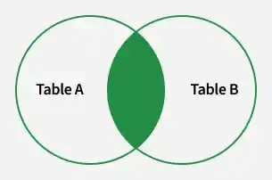

Syntax:

```sql
ELECT columns FROM table1
INNER JOIN table2
ON table1.column_name = table2.column_name;
```

- `columns`: specific columns we want to retrieve.
- `table1 and table2`: tables being joined.
- `column_name`: columns used for matching values.

Examples:

```sql
DROP TABLE IF EXISTS professor;
CREATE TABLE professor (
    ID INT PRIMARY KEY,
    Name VARCHAR(50),
    Salary INT );
    
INSERT INTO professor (ID, Name, Salary) VALUES
(1, 'Rohan Kumar', 57000),
(2, 'Hiroshi Tanaka', 45000),
(3, 'Maria Fernandez', 60000),
(4, 'Ahmed Hassan', 50000),
(5, 'Elena Petrova', 55000);

DROP TABLE IF EXISTS teacher;
CREATE TABLE teacher (
    course_id INT,
    prof_id INT,
    course_name VARCHAR(50) );

INSERT INTO teacher (course_id, prof_id, course_name) VALUES
(1, 1, 'English'),
(1, 3, 'Physics'),
(2, 4, 'Chemistry'),
(2, 5, 'Mathematics');

SELECT teacher.course_id, teacher.prof_id, professor.Name, professor.Salary
FROM professor 
INNER JOIN teacher ON professor.ID = teacher.prof_id;

+-----------+---------+-----------------+--------+
| course_id | prof_id | Name            | Salary |
+-----------+---------+-----------------+--------+
|         1 |       1 | Rohan Kumar     |  57000 |
|         1 |       3 | Maria Fernandez |  60000 |
|         2 |       4 | Ahmed Hassan    |  50000 |
|         2 |       5 | Elena Petrova   |  55000 |
+-----------+---------+-----------------+--------+
```

### OUTER JOIN

#### LEFT JOIN (LEFT OUTER JOIN)

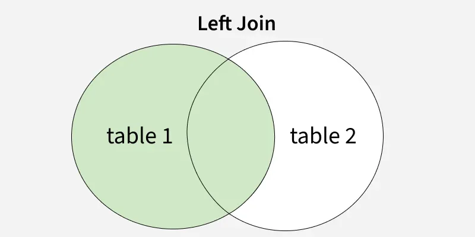

Syntax:

```sql
SELECT table1.column1, table1.column2, table2.column1, ... FROM table1 LEFT JOIN table2 ON table1.matching_column = table2.matching_column;
```

Examples:

```sql
DROP TABLE IF EXISTS professor;
CREATE TABLE professor (
    ID INT PRIMARY KEY,
    Name VARCHAR(50),
    Salary INT );
    
INSERT INTO professor (ID, Name, Salary) VALUES
(1, 'Rohan Kumar', 57000),
(2, 'Hiroshi Tanaka', 45000),
(3, 'Maria Fernandez', 60000),
(4, 'Ahmed Hassan', 50000),
(5, 'Elena Petrova', 55000);

DROP TABLE IF EXISTS teacher;
CREATE TABLE teacher (
    course_id INT,
    prof_id INT,
    course_name VARCHAR(50) );

INSERT INTO teacher (course_id, prof_id, course_name) VALUES
(1, 1, 'English'),
(1, 3, 'Physics'),
(2, 4, 'Chemistry'),
(2, 5, 'Mathematics');

SELECT teacher.course_id, teacher.prof_id, professor.Name, professor.Salary
FROM professor 
LEFT JOIN teacher ON professor.ID = teacher.prof_id;

+-----------+---------+-----------------+--------+
| course_id | prof_id | Name            | Salary |
+-----------+---------+-----------------+--------+
|         1 |       1 | Rohan Kumar     |  57000 |
|      NULL |    NULL | Hiroshi Tanaka  |  45000 |
|         1 |       3 | Maria Fernandez |  60000 |
|         2 |       4 | Ahmed Hassan    |  50000 |
|         2 |       5 | Elena Petrova   |  55000 |
+-----------+---------+-----------------+--------+
```

#### RIGHT JOIN (RIGHT OUTER JOIN)

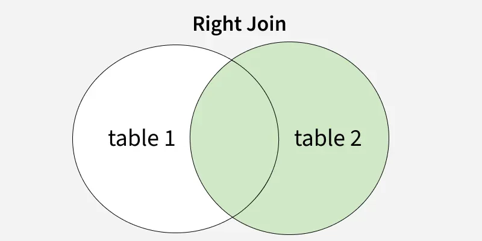

Syntax:

```sql
SELECT table1.column1, table1.column2, table2.column1, ... FROM table1 RIGHT JOIN table2 ON table1.matching_column = table2.matching_column;
```

Examples:

```sql
DROP TABLE IF EXISTS professor;
CREATE TABLE professor (
    ID INT PRIMARY KEY,
    Name VARCHAR(50),
    Salary INT );
    
INSERT INTO professor (ID, Name, Salary) VALUES
(1, 'Rohan Kumar', 57000),
(2, 'Hiroshi Tanaka', 45000),
(3, 'Maria Fernandez', 60000),
(4, 'Ahmed Hassan', 50000),
(5, 'Elena Petrova', 55000);

DROP TABLE IF EXISTS teacher;
CREATE TABLE teacher (
    course_id INT,
    prof_id INT,
    course_name VARCHAR(50) );

INSERT INTO teacher (course_id, prof_id, course_name) VALUES
(1, 1, 'English'),
(1, 3, 'Physics'),
(2, 4, 'Chemistry'),
(2, 5, 'Mathematics');

SELECT teacher.course_id, teacher.prof_id, professor.Name, professor.Salary
FROM professor 
RIGHT JOIN teacher ON professor.ID = teacher.prof_id;

+-----------+---------+-----------------+--------+
| course_id | prof_id | Name            | Salary |
+-----------+---------+-----------------+--------+
|         1 |       1 | Rohan Kumar     |  57000 |
|         1 |       3 | Maria Fernandez |  60000 |
|         2 |       4 | Ahmed Hassan    |  50000 |
|         2 |       5 | Elena Petrova   |  55000 |
+-----------+---------+-----------------+--------+
```

#### FULL OUTER JOIN

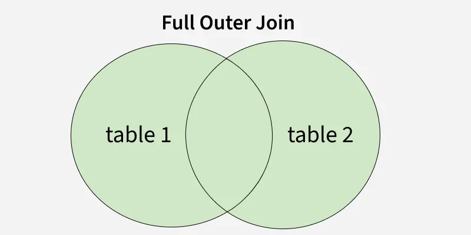

Syntax:

```sql
SELECT columns FROM table1 FULL JOIN table2 ON table1.column = table2.column;
```

- `SELECT` columns: Specifies the columns to retrieve.
- `FROM` table1: The first table to be joined.
- `FULL JOIN` table2: Specifies the second table to join with the first table using a FULL JOIN.
- `ON` table1.column= table2.column: Defines the condition to match rows between the two tables

Examples:

```sql
DROP TABLE IF EXISTS Customers;
DROP TABLE IF EXISTS Orders;

CREATE TABLE Customers (
  customer_id INT PRIMARY KEY,
  name VARCHAR(50)
);

CREATE TABLE Orders (
  order_id INT PRIMARY KEY,
  customer_id INT,
  amount DECIMAL(10,2)
);

INSERT INTO Customers (customer_id, name) VALUES
  (1, 'Harry'),
  (2, 'Bob'),
  (3, 'Alice');

INSERT INTO Orders (order_id, customer_id, amount) VALUES
  (101, 1, 99.99),
  (102, 1, 49.50),
  (103, 4, 20.00);

SELECT
  c.customer_id,
  c.name,
  o.order_id,
  o.amount
FROM Customers c
	LEFT JOIN Orders o
ON c.customer_id = o.customer_id

UNION ALL

SELECT
  c.customer_id,
  c.name,
  o.order_id,
  o.amount
FROM Customers c
  RIGHT JOIN Orders o
ON c.customer_id = o.customer_id
WHERE c.customer_id IS NULL

ORDER BY customer_id, order_id;

+-------------+-------+----------+--------+
| customer_id | name  | order_id | amount |
+-------------+-------+----------+--------+
|        NULL | NULL  |      103 |  20.00 |
|           1 | Harry |      101 |  99.99 |
|           1 | Harry |      102 |  49.50 |
|           2 | Bob   |     NULL |   NULL |
|           3 | Alice |     NULL |   NULL |
+-------------+-------+----------+--------+
```

### Cross Join

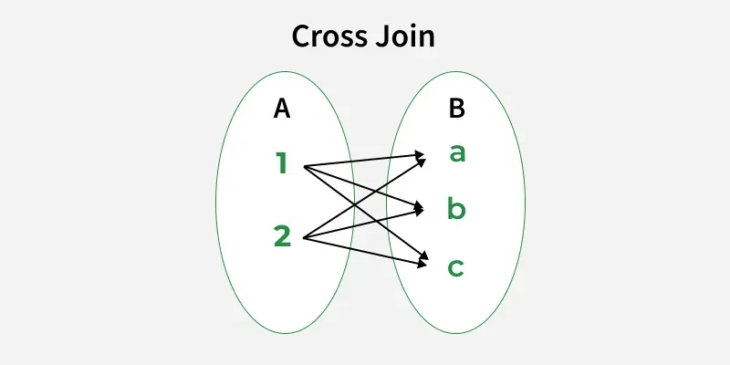

Syntax:

```sql
SELECT * FROM table1 CROSS JOIN table2;
```

Examples:

```sql
DROP TABLE IF EXISTS Sizes;
DROP TABLE IF EXISTS Colors;

CREATE TABLE Sizes (
  size_code VARCHAR(10) PRIMARY KEY
);
CREATE TABLE Colors (
  color_name VARCHAR(20) PRIMARY KEY
);
INSERT INTO Sizes (size_code) VALUES
  ('S'),
  ('M'),
  ('L');
INSERT INTO Colors (color_name) VALUES
  ('Red'),
  ('Blue');

SELECT
  s.size_code,
  c.color_name
FROM Sizes s
CROSS JOIN Colors c
ORDER BY s.size_code, c.color_name;

+-----------+------------+
| size_code | color_name |
+-----------+------------+
| L         | Blue       |
| L         | Red        |
| M         | Blue       |
| M         | Red        |
| S         | Blue       |
| S         | Red        |
+-----------+------------+
```

### Self Join

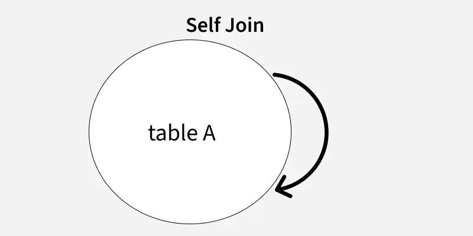

Syntax:

```sql
SELECT columns FROM table AS alias1 JOIN table AS alias2 ON alias1.column = alias2.related_column;
```

- columns: Columns to retrieve in the result.
- alias1: First reference (alias) of the table.
- alias2: Second reference (alias) of the same table.
- related_column: condition that links rows within same table (e.g., Employee.ManagerID = Manager.EmployeeID).

Examples:

```sql
DROP TABLE IF EXISTS Employees;
CREATE TABLE Employees (
  emp_id INT PRIMARY KEY,
  emp_name VARCHAR(50) NOT NULL,
  manager_id INT NULL
);

INSERT INTO Employees (emp_id, emp_name, manager_id) VALUES
  (1, 'CEO', NULL),
  (2, 'Alice', 1),
  (3, 'Bob', 1),
  (4, 'Carol', 2),
  (5, 'David', 2),
  (6, 'Eve', 3);

-- Self join: employee row joins manager row in the same table
SELECT
  e.emp_id,
  e.emp_name AS employee,
  m.emp_id AS manager_id,
  m.emp_name AS manager
FROM Employees e
  LEFT JOIN Employees m
ON e.manager_id = m.emp_id
ORDER BY e.emp_id;

+--------+----------+------------+---------+
| emp_id | employee | manager_id | manager |
+--------+----------+------------+---------+
|      1 | CEO      |       NULL | NULL    |
|      2 | Alice    |          1 | CEO     |
|      3 | Bob      |          1 | CEO     |
|      4 | Carol    |          2 | Alice   |
|      5 | David    |          2 | Alice   |
|      6 | Eve      |          3 | Bob     |
+--------+----------+------------+---------+
```

### UPDATE with JOIN

Syntax:

```sql
UPDATE target_table
SET target_table.column_name = source_table.column_name,
    target_table.column_name2 = source_table.column_name2
FROM target_table
INNER JOIN source_table
ON target_table.column_name = source_table.column_name
WHERE condition;
```

- `target_table`: The table whose records you want to update.
- `source_table`: The table containing the data you want to use for the update.
- `SET`: Specifies the columns in the target table that will be updated.
- `INNER JOIN`: Ensures only matching rows from both tables are considered.
- `ON`: The condition that specifies how the tables are related.
- `WHERE`: An optional clause to filter which rows to update.

Examples:

```sql
DROP TABLE IF EXISTS Geeks1;
CREATE TABLE Geeks1 (
  col1 INT,
  col2 INT,
  col3 INT,
  memo VARCHAR(50)
);
INSERT INTO Geeks1 (col1, col2, col3, memo) VALUES
  (1, 1, 1, 'GEEK1-COL1'),
  (2, 2, 2, 'GEEK1-COL2'),
  (3, 3, 3, 'GEEK1-COL3');

DROP TABLE IF EXISTS Geeks2;
CREATE TABLE Geeks2 (
  col1 INT,
  col2 INT,
  col3 INT,
  memo VARCHAR(50)
);
INSERT INTO Geeks2 (col1, col2, col3, memo) VALUES
  (1, 10, 10, 'GEEK2-COL1'),
  (2, 20, 20, 'GEEK2-COL2'),
  (3, 30, 30, 'GEEK2-COL3');

UPDATE Geeks1 g1
JOIN Geeks2 g2
  ON g1.col1 = g2.col1
SET
  g1.col2 = g2.col2,
  g1.col3 = g2.col3
WHERE g1.col1 IN (0, 2);

SELECT * FROM Geeks1;
+------+------+------+------------+
| col1 | col2 | col3 | memo       |
+------+------+------+------------+
|    1 |    1 |    1 | GEEK1-COL1 |
|    2 |   20 |   20 | GEEK1-COL2 |
|    3 |    3 |    3 | GEEK1-COL3 |
+------+------+------+------------+
```

### DELETE JOIN

Syntax:

```sql
DELETE table1 
FROM table1 
JOIN table2 
ON table1.attribute_name = table2.attribute_name
WHERE condition;
```

- table1: The primary table from which rows will be deleted
- table2: The table used for comparison or condition.
- ON: Specifies the condition for the JOIN.
- WHERE: Optional; filters which rows to delete.

Example:

```sql
DROP TABLE IF EXISTS Orders;
DROP TABLE IF EXISTS Customers;

CREATE TABLE Customers (
  customer_id INT PRIMARY KEY,
  name VARCHAR(50) NOT NULL
);

CREATE TABLE Orders (
  order_id INT PRIMARY KEY,
  customer_id INT NOT NULL,
  amount DECIMAL(10,2) NOT NULL
);

INSERT INTO Customers (customer_id, name) VALUES
(1, 'Harry'),
(2, 'Bob'),
(3, 'Alice'),
(4, 'Eve');

INSERT INTO Orders (order_id, customer_id, amount) VALUES
(101, 1, 120.00),
(102, 1, 80.00),
(103, 3, 50.00);

DELETE c
FROM Customers c
LEFT JOIN Orders o
  ON c.customer_id = o.customer_id
WHERE o.order_id IS NULL;

SELECT * FROM Customers ORDER BY customer_id;

+-------------+-------+
| customer_id | name  |
+-------------+-------+
|           1 | Harry |
|           3 | Alice |
+-------------+-------+
```

### Recursive Join

Syntax:

```sql
WITH RECURSIVE cte_name AS (
    -- Anchor Query: Select the root or starting point
    SELECT columns
    FROM table
    WHERE condition
    
    UNION ALL
    
    -- Recursive Query: Join the CTE with the table to fetch related data
    SELECT t.columns
    FROM table t
    INNER JOIN cte_name cte ON t.column = cte.column
)
```

Examples:

```sql
DROP TABLE IF EXISTS employees;
CREATE TABLE employees (
  employee_id INT PRIMARY KEY,
  employee_name VARCHAR(100) NOT NULL,
  manager_id INT NULL,
  age INT NOT NULL
);
INSERT INTO employees (employee_id, employee_name, manager_id, age) VALUES
(1, 'Michael', NULL, 45),
(2, 'Sarah',   1,    38),
(3, 'David',   1,    35),
(4, 'Emma',    2,    30),
(5, 'James',   2,    29),
(6, 'Olivia',  3,    31),
(7, 'Daniel',  3,    28),
(8, 'Sophia',  4,    26);

WITH RECURSIVE employee_hierarchy AS (
  -- Anchor: start at Michael
  SELECT
    employee_id,
    employee_name,
    manager_id,
    age,
    0 AS level,
    CAST(employee_name AS CHAR(500)) AS path
  FROM employees
  WHERE employee_id = 1

  UNION ALL

  -- Recursive part: direct reports of previous level
  SELECT
    e.employee_id,
    e.employee_name,
    e.manager_id,
    e.age,
    eh.level + 1 AS level,
    CONCAT(eh.path, ' -> ', e.employee_name) AS path
  FROM employees e
  INNER JOIN employee_hierarchy eh
    ON e.manager_id = eh.employee_id
)

SELECT * FROM employee_hierarchy ORDER BY level, employee_id;
```

---


## Functions

### String functions

Common text functions:

| Function                           | Description                                                  |
| ---------------------------------- | ------------------------------------------------------------ |
| `ASCII()`                          | Returns the ASCII value of a single character.               |
| `CONCAT()`                         | concatenates two or more strings into one string.            |
| `CONCAT_WS()`                      | Concatenate with separator.                                  |
| `CHAR_LENGTH()/CHARACTER_LENGTH()` | Return the length of a string in characters.                 |
| `FIND_IN_SET()`                    | Returns the position of a value within a comma-separated list. |
| `FORMAT()`                         | Format a number as a string in a specific way.               |
| `INSTR()`                          | Find the position of the first occurrence of a substring within a string. |
| `LCASE()`                          | Converts all characters in a string to lowercase.            |
| `LEFT()`                           | Return left-most characters.                                 |
| `LENGTH()`                         | Return string length.                                        |
| `LOCATE()`                         | Find the nth occurrence of a substring in a string.          |
| `LOWER()`                          | Convert to lowercase.                                        |
| `LPAD()`                           | Pad a string to a certain lenght by adding characters to the left side of the original string. |
| `LTRIM()`                          | Trim left spaces.                                            |
| `MID()`                            | Extracts a substring starting from a given position in a string and for a specified length. |
| `POSITION()`                       | Finds the position of the first occurrence of a specified character in a string. |
| `REPEAT()`                         | Repeats a string a specified number of times.                |
| `REPLACE()`                        | Replaces occurrences of a substring within a string with another substring. |
| `REVERSE()`                        | Reverses the characters in a string.                         |
| `RIGHT()`                          | Return right-most chars.                                     |
| `RPAD()`                           | Pads the right side of a string with specified characters to a fixed length. |
| `RTRIM()`                          | Trim right spaces.                                           |
| `SOUNDEX()`                        | Return SOUNDEX value.                                        |
| `STRCMP()`                         | Compares two strings and returns an integer value based on their lexicographical comparison. |
| `SPACE()`                          | Generates a string consisting of a specified number of spaces. |
| `SUBSTRING()/SUBSTR()`             | Extract a substring from a string, starting from a specified position. |
| `TRIM()`                           | Removes leading and trailing spaces from a string.           |
| `UPPER()`                          | Convert to uppercase.                                        |

Examples:

```sql
SELECT CONCAT('John', ' ', 'Doe') AS FullName; -- John Doe
SELECT LENGTH('Hello') AS LengthInBytes; -- 5
SELECT CHAR_LENGTH('Hello') AS StringLength; -- 5
SELECT UPPER('hello') AS UpperCase; -- HELLO
SELECT LOWER('HELLO') AS LowerCase; -- hello
SELECT REPLACE('Hello World', 'World', 'SQL') AS UpdatedString; -- Hello SQL
SELECT SUBSTRING('Hello World', 1, 5) AS SubStringExample; -- Hello
SELECT LEFT('Hello World', 5) AS LeftString; -- Hello
SELECT RIGHT('Hello World', 5) AS RightString; -- World
SELECT INSTR('Hello World', 'World') AS SubstringPosition; -- 7
SELECT TRIM(' ' FROM '  Hello World  ') AS TrimmedString; -- Hello World
SELECT RTRIM('geeks   '); -- ‘geeks’
SELECT REVERSE('Hello') AS ReversedString; -- olleH
SELECT ascii('t'); -- 116
SELECT CONCAT_WS('_', 'geeks', 'for', 'geeks'); -- geeks_for_geeks
SELECT FIND_IN_SET('b', 'a, b, c, d, e, f'); -- 2
SELECT FORMAT(0.981 * 100, 'N2') + '%' AS PercentageOutput; -- ‘98.10%’
SELECT LCASE ("GeeksFor Geeks To Learn"); -- geeksforgeeks to learn
SELECT LOCATE('for', 'geeksforgeeks', 1); -- 6
SELECT RPAD('geeks', 8, '0'); -- ‘geeks000’
SELECT LPAD('geeks', 8, '0'); -- 000geeks
SELECT Mid ("geeksforgeeks", 6, 2); -- fo
SELECT POSITION('e' IN 'geeksforgeeks'); -- 2
SELECT REPEAT('geeks', 2); -- geeksgeeks
SELECT SPACE(7); -- ‘       ‘
SELECT cust_name, cust_contact FROM Customers WHERE SOUNDEX(cust_contact) = SOUNDEX('Michael Green'); -- find similar-sounding values
```

### Date and time functions

| Function        | Description                                                  |
| --------------- | ------------------------------------------------------------ |
| `NOW()`         | retrieves the server's current date and time                 |
| `CURDATE()`     | returns today's date in `YYYY-MM-DD` format and is useful when only the current date is needed |
| `CURTIME()`     | returns the current time in `HH:MM:SS` format and is useful for time-based operations |
| `DATE()`        | extracts only the date from a date or datetime value         |
| `EXTRACT()`     | retrieves a specific part of a date such as the year, month, or day |
| `DATE_ADD()`    | adds a chosen time interval, such as days, months, or years to a date |
| `DATE_SUB()`    | subtracts a chosen time interval from a date                 |
| `DATEDIFF()`    | returns the number of days between two dates                 |
| `DATE_FORMAT()` | formats a date using a specified pattern                     |
| `ADDDATE()`     | adds a specified time interval to a date                     |
| `ADDTIME()`     | adds a specified time interval to a time or datetime value.  |

Examples:

```sql
DROP TABLE IF EXISTS Orders;

CREATE TABLE Orders (
  order_id INT PRIMARY KEY,
  order_date DATE
);

INSERT INTO Orders (order_id, order_date) VALUES
  (1, '2025-01-01'),
  (2, '2026-01-01'),
  (3, '2026-02-01');

-- MySQL, MariaDB
SELECT * FROM Orders WHERE YEAR(order_date) = 2025;

-- SQL Server
SELECT order_num FROM Orders WHERE DATEPART(yy, order_date) = 2025;

-- Access
SELECT order_num FROM Orders WHERE DATEPART('yyyy', order_date) = 2025;

-- Oracle
SELECT order_num FROM Orders WHERE to_number(to_char(order_date, 'YYYY')) = 2025;
SELECT order_num FROM Orders WHERE order_date BETWEEN to_date('01-01-2025') AND to_date('12-31-2025');

-- SQLite
SELECT order_num FROM Orders WHERE strftime('%Y', order_date) = '2025';
```

### Numeric functions

| Function           | Description                                                  |
| ------------------ | ------------------------------------------------------------ |
| `ABS()`            | Absolute value                                               |
| `CEIL()/CEILING()` | Rounds a number up to the nearest integer.                   |
| `COS()`            | Cosine of an angle                                           |
| `EXP()`            | Returns the value of e raised to the power of a spcified number. |
| `FLOOR()`          | Rounds a number down to the nearest integer, ignoring the decimal part. |
| `LOG()`            | Returns the natural logarithm (base e) of a number.          |
| `MOD()`            | Returns the remainder of a division operation.               |
| `PI()`             | Pi constant                                                  |
| `POWER()`          | Raise a number to the power of another number.               |
| `RAND()`           | Generates a random floating-point number between 0 and 1.    |
| `ROUND()`          | Rounds a number to a specified number of decimal places.     |
| `SIN()`            | Sine of an angle                                             |
| `SQRT()`           | Returns the sqaure root of a number.                         |
| `TAN()`            | Tangent of an angle                                          |
| `TRUNCATE()`       | Remove the decimal portion of a number without rounding.     |

Examples:

```sql
SELECT ABS(-25); -- 25
SELECT CEIL(12.34); -- 13
SELECT FLOOR(12.98); -- 12
SELECT ROUND(15.6789, 2); -- 15.68
SELECT TRUNCATE(12.98765, 2); -- 12.98
SELECT MOD(10, 3); -- 1
SELECT POWER(2, 3); -- 8
SELECT SQRT(16); -- 4
SELECT EXP(1); -- 2.718281828459045
SELECT LOG(100); -- 4.605170186
SELECT RAND(); -- 0.287372
```

### JSON Functions

| Function      | Oral Answer                                                  |
| :------------ | :----------------------------------------------------------- |
| `ISJSON`      | "Checks if a string contains valid JSON — returns 1 if yes, 0 if no." |
| `JSON_VALUE`  | "Extracts a single scalar value from JSON — like a specific number, string, or boolean. Returns one value." |
| `JSON_QUERY`  | "Extracts an entire JSON object or array — not a single value. Returns a JSON fragment." |
| `JSON_MODIFY` | "Updates or modifies JSON content — you can add, change, or delete properties inside a JSON string." |
| `FOR JSON`    | "Converts query results from rows into JSON format — opposite of `OPENJSON`. Used at the end of a `SELECT`." |
| `OPENJSON`    | "Turns JSON text into rows and columns — so you can query JSON like a table. Often used with `CROSS APPLY`." |

Examples:

```sql
DROP TABLE IF EXISTS orders;
DROP TABLE IF EXISTS users;

CREATE TABLE users (
  user_id INT PRIMARY KEY,
  profile JSON NOT NULL
);

CREATE TABLE orders (
  order_id INT PRIMARY KEY,
  user_id INT NOT NULL,
  amount DECIMAL(10,2) NOT NULL
);

INSERT INTO users (user_id, profile) VALUES
(1, JSON_OBJECT(
      'name', 'Alice',
      'age', 30,
      'address', JSON_OBJECT('city', 'Seoul', 'zip', '04524'),
      'skills', JSON_ARRAY('SQL', 'Python')
    )),
(2, JSON_OBJECT(
      'name', 'Bob',
      'age', 25,
      'address', JSON_OBJECT('city', 'Busan', 'zip', '48058'),
      'skills', JSON_ARRAY('Java')
    ));

INSERT INTO orders (order_id, user_id, amount) VALUES
  (101, 1, 120.50),
  (102, 1, 80.00),
  (103, 2, 50.00);

SELECT
  '{"a":1}' AS sample_json,
  JSON_VALID('{"a":1}') AS is_valid_json,
  JSON_VALID('{a:1}')   AS invalid_json_check;

SELECT
  user_id,
  profile->>'$.name' AS name_scalar,   -- shorthand
  JSON_UNQUOTE(JSON_EXTRACT(profile, '$.address.city')) AS city_scalar
FROM users
ORDER BY user_id;

SELECT
  user_id,
  JSON_EXTRACT(profile, '$.address') AS address_object,
  profile->'$.skills' AS skills_array
FROM users
ORDER BY user_id;

UPDATE users
SET profile = JSON_SET(profile, '$.age', 31)
WHERE user_id = 1;

UPDATE users
SET profile = JSON_REPLACE(profile, '$.address.city', 'Incheon')
WHERE user_id = 1;

UPDATE users
SET profile = JSON_REMOVE(profile, '$.address.zip')
WHERE user_id = 2;

SELECT user_id, JSON_PRETTY(profile) AS profile_after_modify
FROM users
ORDER BY user_id;

SELECT JSON_ARRAYAGG(
         JSON_OBJECT(
           'user_id', u.user_id,
           'name', u.profile->>'$.name',
           'orders', (
             SELECT JSON_ARRAYAGG(
                      JSON_OBJECT('order_id', o.order_id, 'amount', o.amount)
                    )
             FROM orders o
             WHERE o.user_id = u.user_id
           )
         )
       ) AS users_json
FROM users u;

SELECT
  u.user_id,
  jt.skill
FROM users u
JOIN JSON_TABLE(
  u.profile,
  '$.skills[*]' COLUMNS (
    skill VARCHAR(50) PATH '$'
  )
) AS jt
ORDER BY u.user_id, jt.skill;
```

```sql
-- SQL Server
CREATE TABLE Authors (
    ID INT IDENTITY NOT NULL PRIMARY KEY,
    AuthorName NVARCHAR(MAX),
    Age INT,
    Skillsets NVARCHAR(MAX),
    NumberOfPosts INT
);

INSERT INTO Authors (AuthorName, Age, Skillsets, NumberOfPosts) VALUES
 ('Geek',25,'Java,Python,.Net',5),
 ('Geek2',22,'Android,Python,.Net',15),
 ('Geek3',23,'IOS,GO,R',10),
 ('Geek4',24,'Java,Python,GO',5);
 
SELECT ISJSON(@JSONData) AS VALIDJSON

SELECT JSON_VALUE(@JSONData,'$.Information.SchoolDetails[0].Name') AS SchoolName

SELECT JSON_QUERY(@JSONData,'$.Information.SchoolDetails') AS LISTOFSCHOOLS

SET @JSONData= JSON_MODIFY(@JSONData, '$.Information.SchoolDetails[2].Name', 'Adhyapana');
SELECT modifiedJson = @JSONData;

SELECT * FROM Authors FOR JSON AUTO;

DECLARE @JSON VARCHAR(MAX)
-- Syntax to get json data using OPENROWSET  
SELECT @JSON = BulkColumn FROM OPENROWSET (BULK '<pathname\jsonfilename with .json extension>', SINGLE_CLOB)  AS j
-- To check  json valid or not, we are using this ISJSON
SELECT ISJSON(@JSON)
-- If ISJSON is true, then display the json data
If (ISJSON(@JSON)=1)
	SELECT @JSON AS 'JSON Text'
```

### Conversion Functions

There are two main types of data type conversion in SQL:

- Implicit Data Type Conversion

  |         From         |     To     |
  | :------------------: | :--------: |
  | `VARCHAR2` or `CHAR` |  `NUMBER`  |
  | `VARCHAR2` or `CHAR` |   `DATE`   |
  |        `DATE`        | `VARCHAR2` |
  |       `NUMBER`       | `VARCHAR2` |

  Automatic conversion of one data type to another by SQL during query execution.

- Explicit Data Type Conversion

  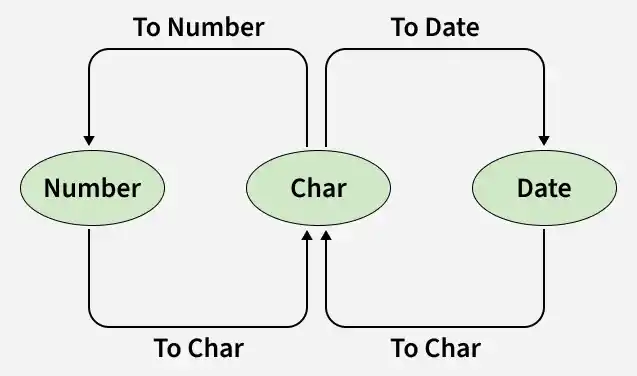

  Done by the user when SQL can't convert automatically or when precise control is needed.

Examples:

```sql
-- MySQL
SELECT DATE_FORMAT('2026-04-22 14:35:10', '%m/%y');
SELECT STR_TO_DATE('2026-04-22 14:35:10', '%Y-%m-%d %H:%i:%s');
SELECT CONVERT(1234.56, CHAR);
SELECT CONVERT('123.45', DECIMAL(10,2));
```

### Aggregation Functions

| Function  | Description         |
| --------- | ------------------- |
| `AVG()`   | Average of a column |
| `COUNT()` | Count rows/values   |
| `MAX()`   | Maximum value       |
| `MIN()`   | Minimum value       |
| `SUM()`   | Sum of values       |

#### COUNT()

Syntax:

- Count all rows:

  ```sql
  SELECT COUNT(*) FROM table_name;
  ```

- Count distinct values in a column

  ```sql
  SELECT COUNT(DISTINCT column_name) FROM table_name;
  ```

Examples:

```sql
DROP TABLE IF EXISTS Orders;

CREATE TABLE Orders (
  order_id INT PRIMARY KEY,
  order_num INT
);

INSERT INTO Orders (order_id, order_num) VALUES
  (1, 30),
  (2, 50),
  (3, 100);
  
SELECT COUNT(*) AS cnt FROM Orders;
SELECT COUNT(DISTINCT order_id) FROM Orders;
SELECT COUNT(CASE WHEN order_num > 30 THEN 1 ELSE NULL END) AS cnt FROM Orders;
```

**Notice**:

1. Optimize queries for large datasets

   ```sql
   -- Create index on Country column
   CREATE INDEX idx_country ON Customers(Country);
   
   -- Faster COUNT query using the index
   SELECT COUNT(*) FROM Customers WHERE Country = 'Spain';
   ```

2. Avoid complex `COUNT` queries for large tables

   ```sql
   SELECT COUNT(*) FROM Customers WHERE (Country = 'Spain' OR Country = 'France') AND Age > 30 AND City = 'Barcelona';
   ```

#### SUM()

Syntax:

```sql
SELECT SUM(column_name) FROM table_name;
```

Examples:

```sql
DROP TABLE IF EXISTS Orders;

CREATE TABLE Orders (
  order_id INT PRIMARY KEY,
  order_num INT,
  order_price INT
);

INSERT INTO Orders (order_id, order_num, order_price) VALUES
  (1, 30, 1000),
  (2, 50, 2000),
  (3, 100, 100);
  
SELECT SUM(order_num) AS TotalNum FROM Orders;
SELECT SUM(order_num * order_price) AS TotalRevenue FROM Orders;
SELECT SUM(order_num * order_price) AS TotalRevenue FROM Orders GROUP BY order_num;
SELECT SUM(DISTINCT order_price) AS SumDistinctPrice FROM Orders;
SELECT SUM(order_num * order_price) AS TotalRevenue FROM Orders GROUP BY order_num HAVING SUM(order_num * order_price) > 10000;
```

#### MIN()

Syntax:

```sql
SELECT MIN(column_name) FROM table_name;
```

Examples:

```sql
DROP TABLE IF EXISTS Orders;

CREATE TABLE Orders (
  order_id INT PRIMARY KEY,
  order_num INT,
  order_price INT
);

INSERT INTO Orders (order_id, order_num, order_price) VALUES
  (1, 30, 1000),
  (2, 50, 2000),
  (3, 100, 100);
  
SELECT MIN(order_price) AS min_price FROM Orders;
```

#### MAX()

Syntax:

```sql
SELECT MAX(column_name) FROM table_name;
```

Examples:

```sql
DROP TABLE IF EXISTS Orders;

CREATE TABLE Orders (
  order_id INT PRIMARY KEY,
  order_num INT,
  order_price INT
);

INSERT INTO Orders (order_id, order_num, order_price) VALUES
  (1, 30, 1000),
  (2, 50, 2000),
  (3, 100, 100);
  
SELECT MAX(order_price) AS min_price FROM Orders;
```

#### AVG()

Syntax:

```sql
SELECT AVG(column_name) FROM table_name;
```

Examples:

```sql
DROP TABLE IF EXISTS Orders;

CREATE TABLE Orders (
  order_id INT PRIMARY KEY,
  order_num INT,
  order_price INT
);

INSERT INTO Orders (order_id, order_num, order_price) VALUES
  (1, 30, 1000),
  (2, 50, 2000),
  (3, 100, 100);

SELECT AVG(order_price) AS avg_price FROM Orders;
```

### User-Defined Function (UDF)

A User-Defined Function (UDF) is a function created by the database user to perform specific operations that are not covered by built-in functions. UDFs allow us to encapsulate complex logic, make the code more reusable, and streamline database operations.

Examples:

```sql
-- Clean setup
DROP TABLE IF EXISTS employees;
CREATE TABLE employees (
  employee_id INT PRIMARY KEY,
  employee_name VARCHAR(100) NOT NULL,
  salary DECIMAL(10,2) NOT NULL
);

INSERT INTO employees (employee_id, employee_name, salary) VALUES
  (1, 'Michael', 120000.00),
  (2, 'Sarah',    85000.00),
  (3, 'David',    60000.00);

-- If function already exists, drop it first
DROP FUNCTION IF EXISTS fn_tax;

-- Change delimiter so we can define function body
DELIMITER $$

CREATE FUNCTION fn_tax(
  p_salary DECIMAL(10,2),
  p_rate   DECIMAL(5,2)   -- e.g. 10.00 means 10%
)
RETURNS DECIMAL(10,2)
DETERMINISTIC
BEGIN
  DECLARE v_tax DECIMAL(10,2);

  -- Simple validation
  IF p_salary IS NULL OR p_rate IS NULL OR p_salary < 0 OR p_rate < 0 THEN
    RETURN NULL;
  END IF;

  SET v_tax = ROUND(p_salary * (p_rate / 100), 2);
  RETURN v_tax;
END$$

DELIMITER ;

-- Call function directly
SELECT fn_tax(1000.00, 12.50) AS tax_amount;

-- Use function in query
SELECT
  employee_id,
  employee_name,
  salary,
  fn_tax(salary, 10.00) AS tax_10_percent,
  salary - fn_tax(salary, 10.00) AS salary_after_tax
FROM employees
ORDER BY employee_id;
```


---


## Views

### CREATE VIEW

Syntax:

```sql
CREATE VIEW view_name AS SELECT column1, column2, ... FROM table_name WHERE condition;
```

- `CREATE VIEW view_name`: Creates a view with the specified name.
- `AS`: Indicates that the view will be defined based on the following SELECT query.
- `SELECT column1, column2…`: Columns included in the view (can be from one or multiple tables).
- `FROM table_name`: Table(s) from which the view will fetch data.
- `WHERE condition`: Optional filter to restrict the data included in the view.

Examples:

```sql
DROP TABLE IF EXISTS Orders;

CREATE TABLE Orders (
  order_id INT PRIMARY KEY,
  order_num INT,
  order_price INT
);

INSERT INTO Orders (order_id, order_num, order_price) VALUES
  (1, 30, 1000),
  (2, 50, 2000),
  (3, 100, 100);
  
-- Creating a simple view
CREATE VIEW expensive_products AS SELECT * FROM Orders WHERE order_price > 1000;

-- Creating a joined view
CREATE VIEW employee_department_info AS SELECT e.employee_id, e.first_name, e.last_name, d.department_name FROM employees e JOIN departments d ON e.department_id = d.department_id;

-- Createing and use view
CREATE VIEW ProductCustomers AS 
  SELECT cust_name, cust_contact, prod_id 
  FROM Customers, Orders, OrderItems 
  WHERE Customers.cust_id = Orders.cust_id AND OrderItems.order_num = Orders.order_num;
-- Use view
SELECT cust_name, cust_contact FROM ProductCustomers WHERE prod_id = 'RGAN01';
-- Use views to format output
SELECT RTRIM(vend_name) + '(' + RTRIM(vend_country) + ')' AS vend_title FROM Vendors ORDER BY vend_name;
SELECT RTRIM(vend_name) || '(' || RTRIM(vend_country) || ')' AS vend_title FROM Vendors ORDER BY vend_name;
CREATE VIEW VendorLocations AS SELECT RTRIM(vend_name) + '(' + RTRIM(vend_country) + ')' AS vend_title FROM Vendors;
SELECT * FROM VendorLocations;
CREATE VIEW VendorLocations AS SELECT RTRIM(vend_name) || '(' || RTRIM(vend_country) || ')' AS vend_title FROM Vendors; 
SELECT * FROM VendorLocations;
-- Use view to filter
CREATE VIEW CustomerEMailList AS SELECT cust_id, cust_name, cust_email FROM Customers WHERE cust_email IS NOT NULL;
SELECT * FROM CustomerEMailList;
-- Use view to simplify computed columns
CREATE VIEW OrderItemsExpanded AS SELECT prod_num, prod_id, quantity, item_price, quantity*item_price AS expanded_price FROM OrderItems;
SELECT * FROM OrderItemsExpanded WHERE order_num = 20008;
```

### UPDATE VIEW

Syntax:

```sql
UPDATE view_name SET column1 = value1, column2 = value2, ... WHERE condition;
```

Examples:

```sql
-- Updating view using IN operator
UPDATE view1 SET Marks=50 where Roll_no in (3,5);

-- Updating view using arithmetic operation
UPDATE view1 SET Marks = Marks*0.95;

-- Updating view using aggregate function
CREATE OR REPLACE VIEW view1 AS SELECT Subject, SUM(Marks) AS TotalMarks FROM Student GROUP BY Subject;

-- Updating view using subqueries
CREATE OR REPLACE VIEW view1 AS
SELECT Name,
       (SELECT SUM(Marks) FROM Student s WHERE s.Subject = Student.Subject) AS TotalMarks
FROM Student;
```

### RENAME VIEW

Syntax:

```sql
EXEC sp_rename 'old_view_name', 'new_view_name';
```

- `sp_rename` system stored procedure is used to rename a view in SQL.
- `old_view_name` denotes the current name of the view which is you want to rename the view in SQL.
- `new_view_name` denotes the new name of the view.

Examples:

```sql
CREATE VIEW sales_report AS
SELECT product_id, SUM(quantity) AS total_quantity
FROM Sales
GROUP BY product_id;

EXEC sp_rename 'sales_report', 'monthly_sales_report';
```

### DROP VIEW

Syntax:

```sql
DROP VIEW view_name;
```

Examples:

```sql
CREATE VIEW HighSalaryEmployees AS SELECT * FROM Employees WHERE Salary > 50000;
DROP VIEW HighSalaryEmployees;
```

### Summary

1. Views must have unique names like tables.
2. No general limit on the number of views.
3. Creating views requires sufficient privileges.
4. Views may be nested, but nested views can hurt performance.
5. Many DBMS prohibit `ORDER BY` in view definitions.
6. Some DBMS require explicit column names for returned columns; computed columns need aliases.
7. Views cannot be indexed or have associated triggers/defaults in many DBMS;
8. Some views are read-only; you can select but not write back to base tables.
9. Some DBMS allow only updatable views where inserted/updated rows still belong to the view.

---


## Indexes

### Create Index

Syntax:

```sql
-- Creating a Index
CREATE INDEX index_name ON table_name  (column1, column2.....);

-- Creating a Unique Index
CREATE UNIQUE INDEX index_name ON table_name (column1, column2.....);
```

- index_name: The name of the index.
- table_name: The name of the table on which the index is created.
- column1, column2, ...: The columns that the index will be applied to.

Examples:

```sql
CREATE INDEX idx ON Students(NAME);

-- Creating a Unique Index
CREATE UNIQUE INDEX idx_student_id ON Students(student_id);

-- Retrieve data using the index
SELECT * FROM Students USE INDEX(idx_name);

-- Verifying the index creation
SHOW INDEXES FROM Students;
```

### Drop Index

Syntax:

```sql
DROP INDEX index_name ON table_name;
```

Examples:

```sql
CREATE TABLE EMPLOYEE(
   EMP_ID INT,
   EMP_NAME VARCHAR(20),
   AGE INT,
   DOB DATE,
   SALARY DECIMAL(7,2)); 
   
CREATE INDEX EMP ON EMPLOYEE(EMP_ID, EMP_NAME);

DROP INDEX IF EXISTS EMP ON EMPLOYEE;

SHOW INDEXES FROM EMPLOYEE;
```

### Show Indexes

Syntax:

```sql
SHOW INDEXES FROM table_name;
```

- This command displays all the indexes created for a particular table.
- It providing details such as index name, column names, and more.

Examples:

```sql
CREATE TABLE orders (
    order_id INT AUTO_INCREMENT,
    customer_id INT NOT NULL,
    order_date DATE NOT NULL,
    total_amount DECIMAL(10, 2),
    PRIMARY KEY(order_id),
    INDEX idx_customer_id (customer_id), -- Regular index on customer_id
    UNIQUE INDEX unique_order_date (order_date), -- Unique index on order_date
    INDEX invisible_index (total_amount) INVISIBLE, -- Invisible index on total_amount
    INDEX composite_index (customer_id, order_date) COMMENT 'By customer and order date' -- Composite index on multiple columns
);

SHOW INDEXES FROM orders;
```

### Unique Index

Syntax:

```sql
CREATE UNIQUE INDEX index_name ON table_name (column1, column2, ..., columnN);
```

- index_name: The name of the unique index.
- table_name: The name of the table where the index will be created.
- column1, column2, ..., columnN: The columns on which the unique index is being applied.

Examples:

```sql
CREATE UNIQUE INDEX UNIQUE_NAME ON CUSTOMERS(NAME);

CREATE UNIQUE INDEX MUL_UNIQUE_INDEX ON CUSTOMERS(NAME, AGE);

CREATE UNIQUE INDEX UNIQUE_SALARY ON CUSTOMERS(SALARY);

SHOW INDEX FROM CUSTOMERS;

-- Firstly, create a UNIQUE INDEX on ADDRESS column
CREATE UNIQUE INDEX ADD_UNIQUE_INDEX ON CUSTOMERS(ADDRESS);

-- Attempts to assign a duplicate value to a column that has a UNIQUE index
UPDATE CUSTOMERS SET ADDRESS = 'London' WHERE ADDRESS = 'Sydney';
```

---


## Transaction

### BEGIN TRANSACTION

Syntax:

```sql
BEGIN TRANSACTION transaction_name;
```

Examples:

```sql
BEGIN TRANSACTION;

-- Deduct $150 from Account A
UPDATE Accounts
SET Balance = Balance - 150
WHERE AccountID = 'A';

-- Add $150 to Account B
UPDATE Accounts
SET Balance = Balance + 150
WHERE AccountID = 'B';

-- Commit the transaction if both operations succeed
COMMIT;
```

### COMMIT

Syntax:

```sql
COMMIT;
```

Examples:

```sql
DELETE FROM Student WHERE AGE = 20;
COMMIT;
```

### ROLLABCK

Syntax:

```sql
ROLLBACK;
```

Examples:

```sql
DELETE FROM Student WHERE AGE = 20;
ROLLBACK;
```

### SAVEPOINT

Syntax:

```sql
SAVEPOINT SAVEPOINT_NAME;
```

Examples:

```sql
SAVEPOINT SP1;
DELETE FROM Student WHERE AGE = 20;
SAVEPOINT SP2;
```

### ROLLBACK TO SAVEPOINT

Syntax:

```sql
ROLLBACK TO SAVEPOINT SAVEPOINT_NAME;
```

Examples:

```sql
ROLLBACK TO SP1;
```

### RELEASE SAVEPOINT

Syntax:

```sql
RELEASE SAVEPOINT SAVEPOINT_NAME;
```

Examples:

```sql
RELEASE SAVEPOINT SP2; -- Release the second savepoint.
```

---


## Others

### Cursor

A cursor in SQL is a database object used to process data one row at a time, useful when row-by-row handling is needed instead of bulk processing.

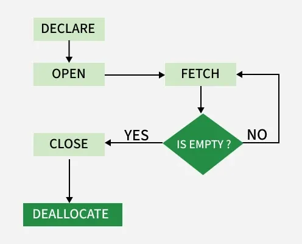

Types of cursors in SQL:

1. Implicit Cursors
2. Explicit Cursors

Syntax:

- Declare a cursor

  ```sql
  DECLARE cursor_name CURSOR FOR SELECT * FROM table_name
  ```

- Open cursor connection

  ```sql
  OPEN cursor_connection
  ```

- Fetch Data from the cursor

  |    Mode    |                Description                 |
  | :--------: | :----------------------------------------: |
  |   FIRST    |  Fetches the first row in the result set   |
  |    LAST    |            Fetches the last row            |
  |    NEXT    |  Fetches the next row (default behavior)   |
  |   PRIOR    |          Fetches the previous row          |
  | ABSOLUTE n |            Fetches the nth row             |
  | RELATIVE n | Fetches a row relative to current position |

  ```sql
  FETCH NEXT/FIRST/LAST/PRIOR/ABSOLUTE n/RELATIVE n FROM cursor_name
  ```

- Close cursor connection

  ```sql
  CLOSE cursor_name
  ```

- Deallocate cursor memory

  ```sql
  DEALLOCATE cursor_name
  ```

Examples:

```sql
DECLARE s1 CURSOR FOR SELECT * FROM studDetails

OPEN s1

FETCH FIRST FROM s1
FETCH LAST FROM s1
FETCH NEXT FROM s1
FETCH PRIOR FROM s1
FETCH ABSOLUTE 7 FROM s1
FETCH RELATIVE -2 FROM s1

CLOSE s1

-- create an implicit cursor
BEGIN
  FOR emp_rec IN SELECT * FROM emp LOOP
    DBMS_OUTPUT.PUT_LINE('Employee name: ' || emp_rec.ename);
  END LOOP;
END;
```

### Stored Procedure

Stored procedures are used to group SQL statements and business logic into a single reusable unit that runs inside the database.

Types of SQL stored procedures:

1. System Stored Procedures
2. User-Defined Stored Procedures (UDPs)
3. Extended Stored Procedures
4. CLR Stored Procedures

Syntax:

```sql
CREATE PROCEDURE procedure_name
(parameter1 data_type, parameter2 data_type, ...)
AS
BEGIN
   -- SQL statements to be executed
END
```

- `CREATE PROCEDURE`: Creates a new stored procedure.
- `@parameters`: Used to pass values into the procedure.
- `BEGIN…END`: Contains the SQL code that the procedure runs.

Examples:

```sql
CREATE PROCEDURE GetCustomersByCountry
    @Country VARCHAR(50)
AS
BEGIN
    SELECT CustomerName, ContactName
    FROM Customers
    WHERE Country = @Country;
END;

EXEC GetCustomersByCountry @Country = 'Sri lanka';
```

### Trigger

A trigger in SQL is a special stored procedure that runs automatically when an `INSERT`, `UPDATE`, or `DELETE` operation occurs on a table.

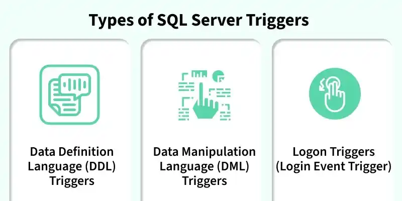

Examples:

```sql
-- For SQL Server
CREATE TRIGGER update_student_score
AFTER UPDATE ON student_grades
FOR EACH ROW
BEGIN
   UPDATE total_scores
   SET score = score + :new.grade
   WHERE student_id = :new.student_id;
END;

CREATE TRIGGER validate_grade
BEFORE INSERT ON student_grades
FOR EACH ROW
BEGIN
   IF :new.grade < 0 OR :new.grade > 100 THEN
      RAISE_APPLICATION_ERROR(-20001, 'Invalid grade value.');
   END IF;
END;
```

---


## Summary

### TRUNCATE vs DELETE

|                        TRUNCATE TABLE                        |                            DELETE                            |
| :----------------------------------------------------------: | :----------------------------------------------------------: |
|                Removes all rows from a table                 | Removes rows based on a [`WHERE`](https://www.geeksforgeeks.org/sql/sql-where-clause/) clause or all rows if no condition is specified |
|                  WHERE clause not supported                  |                    WHERE clause supported                    |
|              Uses minimal logging and is faster              |                   Fully logged and slower                    |
|         Generally cannot be rolled back in some DBMS         |          Can be rolled back if within a transaction          |
|                    Does not fire triggers                    | Fires [triggers](https://www.geeksforgeeks.org/sql/sql-trigger-student-database/) |
| Cannot truncate a table referenced by a foreign key (without disabling the constraint) |    Can delete rows in a table referenced by a foreign key    |
|     Resets identity seed value (auto-increment counter)      |            Does not reset the identity seed value            |
|           Generally faster for large data volumes            |       Can be slower, especially for large data volumes       |
|           Typically used to quickly empty a table            |      Used to remove specific rows based on a condition       |
|      Releases the storage space used by the table rows       | Does not automatically reclaim space, may require a VACUUM or similar command |
|    Retains the table structure, constraints, and indexes     |    Retains the table structure, constraints, and indexes     |

### TRUNCATE vs DROP

|                        TRUNCATE TABLE                        |                          DROP TABLE                          |
| :----------------------------------------------------------: | :----------------------------------------------------------: |
| Removes all rows from a table, leaving the structure intact. |      Deletes the entire table, including its structure.      |
| Generally faster than DELETE since it deallocates data pages. |   Fast operation since it removes both data and structure.   |
|   Minimal logging; typically logs page deallocations only.   |       Fully logged; the entire table drop is recorded.       |
|             Retained; only the data is removed.              |     Deleted; table structure and data are both removed.      |
| Resets the auto-increment counter to the seed value (if present). |          No impact, as the entire table is removed.          |
|                   Triggers are not fired.                    |        Not applicable, as the table no longer exists.        |
| Cannot truncate a table if it is referenced by a [foreign key](https://www.geeksforgeeks.org/mysql/mysql-foreign-key-constraint/). | Cannot drop a table if other tables reference it unless the foreign key constraint is removed first. |
| Used when you need to remove all data from a table but keep the table itself. | Used when you want to completely remove the table from the database. |
| Data cannot be recovered unless a backup is available (depending on the database system). | The table and its data cannot be recovered unless a backup is available. |
|           Requires ALTER permission on the table.            |            Requires DROP permission on the table.            |

### Local Vs Global Temporary Tables

|            Local Temporary Table            |                   Global Temporary Table                    |
| :-----------------------------------------: | :---------------------------------------------------------: |
|              `# (Single hash)`              |                     `## (Double hash)`                      |
|      Only the session that created it       |                  Available to all sessions                  |
| Automatically dropped when the session ends | Dropped when the last connection referencing the table ends |
|   Only the creating session can access it   |                 All sessions can access it                  |
|        Session-specific data storage        |     Shared temporary data storage for multiple sessions     |

### COMMIT vs ROLLBACK

|     Feature     |                            COMMIT                            |                           ROLLBACK                           |
| :-------------: | :----------------------------------------------------------: | :----------------------------------------------------------: |
|    Function     |  Permanently saves changes made by the current transaction.  |       Undoes changes made by the current transaction.        |
| Undo Capability |             Cannot undo changes after execution.             | Reverts the database to its previous state before the transaction. |
|  When Applied   |     Used when the transaction is successfully completed.     |  Used when the transaction fails, is incorrect, or aborted.  |
| Data Integrity  |         Ensures that changes are saved permanently.          | Ensures that errors do not affect the database by undoing partial changes. |
|     Syntax      |                          `COMMIT;`                           |                         `ROLLBACK;`                          |
| Error Handling  | No changes are rolled back even if errors occur after the COMMIT statement. | Automatically undoes uncommitted changes in case of errors or failures. |

### ORDER BY vs GROUP BY

| ORDER BY                               | GROUP BY                                                   |
| -------------------------------------- | ---------------------------------------------------------- |
| Sorts the produced output              | Groups rows; output order may not be grouping order        |
| Can use any column (even non-selected) | Only use select-list columns or expressions used in SELECT |
| Not always required                    | Required when using aggregates on columns or expressions   |

### UNION ALL vs UNION

|                          UNION ALL                           |                            UNION                             |
| :----------------------------------------------------------: | :----------------------------------------------------------: |
|                Includes all duplicate records                |                  Removes duplicate records                   |
|          Faster, as it doesn't check for duplicates          |         Slower, as it needs to eliminate duplicates          |
|         Use when duplicates are acceptable or needed         |            Use when duplicates need to be removed            |
| `Syntax: SELECT columns FROM table1 UNION ALL SELECT columns FROM table2;` | `Syntax: SELECT columns FROM table1 UNION SELECT columns FROM table2;` |
| Generally lower memory usage, since no extra processing for duplicates | Higher memory usage, due to additional steps for duplicate removal |
| Returns combined rows from all `SELECT` statements, including duplicates | Returns combined rows from all `SELECT` statements, without duplicates |
| Useful for large datasets where performance is critical and duplicates are acceptable | Useful when data integrity requires unique records in the result set |

### EXCEPT vs NOT IN

|                            EXCEPT                            |                            NOT IN                            |
| :----------------------------------------------------------: | :----------------------------------------------------------: |
|              Removes duplicates from the result              |               Retains duplicates in the result               |
| Generally more efficient for large datasets as it processes only the required rows | May be slower for large datasets, especially when checking multiple conditions |
| When you need to find rows that exist in one result set but not the other | When you need to check a specific column’s values against a list |
|                    Not supported by MySQL                    |               Supported by most SQL databases                |

### ALL vs ANY

|                           SQL ALL                            |                           SQL ANY                            |
| :----------------------------------------------------------: | :----------------------------------------------------------: |
|    Condition must be true for every value in the subquery    | Condition must be true for at least one value in the subquery |
|                       More restrictive                       |                       Less restrictive                       |
|                  Usually returns fewer rows                  |                  Usually returns more rows                   |
| value > ALL (subquery) means the value is greater than all returned values | value > ANY(subquery) means the value is greater than any one value |
|          Use when comparing against a strict range           |        Use when comparing against flexible conditions        |

### EXISTS vs IN

|                          **EXISTS**                          |                            **IN**                            |
| :----------------------------------------------------------: | :----------------------------------------------------------: |
|  Checks if at least one matching row exists in a subquery.   | Checks whether a value is within a list or subquery result.  |
| Stops searching once a match is found (more efficient for large data). | Compares the value against the entire list/result (may be slower for large data). |
|            Works well with correlated subqueries.            |   Works best with small fixed lists or simple comparisons.   |
|                 Handles NULL values safely.                  |   Fails or behaves unexpectedly if the list contains NULL.   |
| `SELECT * FROM Customers cWHERE EXISTS ( SELECT 1 FROM Orders oWHERE o.CustomerID = c.customer_id );` | `SELECT * FROM CustomersWHERE customer_id IN ( SELECT CustomerIDFROM Orders );` |

### Primary Key vs Foreign Key

| **PRIMARY KEY**                                              | **FOREIGN KEY**                                              |
| ------------------------------------------------------------ | ------------------------------------------------------------ |
| A primary key is used to ensure data in the specific column is unique. | A foreign key is a column or group of columns in a relational database table that provides a link between data in two tables. |
| It uniquely identifies a record in the relational database table. | It refers to the field in a table which is the primary key of another table. |
| Only one primary key is allowed in a table.                  | Whereas more than one foreign key is allowed in a table.     |
| It is a combination of `UNIQUE` and `Not Null` constraints.  | It can contain duplicate values and a table in a relational database. |
| It does not allow `NULL` values .                            | It can also contain `NULL` values.                           |
| Its value cannot be deleted from the parent table.           | Its value can be deleted from the child table.               |
| It constraint can be implicitly defined on the temporary tables. | It constraint cannot be defined on the local or global temporary tables. |

### Primary Key vs Alternate Key

|          **Primary Key**           |              **Alternate Key**               |
| :--------------------------------: | :------------------------------------------: |
|           Must be unique           |                Must be unique                |
|     Cannot contain NULL values     |           Can contain NULL values            |
| Used to identify each row uniquely |      An alternate option for uniqueness      |
|     The selected candidate key     | Other candidate keys not selected as primary |
|     One primary key per table      |       Multiple alternate keys possible       |

### INNER JOIN vs OUTER JOIN

|                          INNER JOIN                          |                          OUTER JOIN                          |
| :----------------------------------------------------------: | :----------------------------------------------------------: |
|  Returns only records with matching values in both tables.   | Returns records even if there is no match in one or both tables. |
|                 Excludes non-matching rows.                  |   Includes non-matching rows (NULLs fill missing values).    |
|           Produces a smaller, filtered result set.           |      Produces a larger, more comprehensive result set.       |
|                  Only one type: INNER JOIN.                  |          Three types: LEFT, RIGHT, FULL OUTER JOIN.          |
| Used when focusing strictly on relationships between tables. | Used when dealing with incomplete data or ensuring no records are lost. |
|               Common in transactional queries.               |  Common in reporting, analytics and data integration tasks.  |

### Clustered and Non-Clustered Indexing

|                       Clustered Index                        |                     Non-Clustered Index                      |
| :----------------------------------------------------------: | :----------------------------------------------------------: |
|         Faster for range-based queries and sorting.          | Slower for range-based queries but faster for specific lookups. |
|             Requires less memory for operations.             |   Requires more memory due to additional index structure.    |
|     The clustered index stores data in the table itself.     | The non-clustered index stores data separately from the table. |
|          A table can have only one clustered index.          |       A table can have multiple non-clustered indexes.       |
|       The clustered index can store data on the disk.        | The non-clustered index stores the index structure (B-tree) on disk with pointers to the data pages. |
|   Stores pointers to the data blocks, not the data itself.   | Stores both the indexed value and a pointer to the actual row in a separate data page. |
|          Leaf nodes contain the actual data itself.          |   Leaf nodes contain indexed columns and pointers to data.   |
|     Defines the physical order of the rows in the table.     | Defines the logical order of data in the index, not the table. |
|     The data is physically reordered to match the index.     | The logical order does not match the physical order of rows. |
|        Primary keys are by default clustered indexes.        | Composite keys used with unique constraints are non-clustered. |
| Typically larger, especially for large primary clustered indexes. |  Smaller than clustered indexes, especially when composite.  |
|             Ideal for range queries and sorting.             | Suitable for optimizing lookups and queries on non-primary columns. |
| A clustered index directly impacts the table's physical storage order. | A non-clustered index does not affect the physical storage order of the table. |

### Nested vs Correlated Subqueries

|        Nested (Non-Correlated) Subquery        |                     Correlated Subquery                      |
| :--------------------------------------------: | :----------------------------------------------------------: |
|     Executes once before the outer query.      |          Executes for each row of the outer query.           |
|        Independent of the outer query.         |          Dependent on values from the outer query.           |
|   Usually more efficient for large datasets.   |           Can be slower as it runs multiple times.           |
| Example: WHERE col IN (SELECT col FROM table2) | Example: WHERE col > (SELECT AVG(col) FROM table 2 WHERE table2.id = outer.id) |

### Comparison of Implicit and Explicit cursors

|          **Implicit Cursors**           |          **Explicit Cursors**          |
| :-------------------------------------: | :------------------------------------: |
| Automatically created by the SQL engine |      Manually created by the user      |
|         No declaration required         |    Requires declaration before use     |
|      Managed automatically by SQL       | Controlled using open, fetch and close |
|     Used for simple DML operations      | Used for complex row-by-row processing |
|          Provide less control           |  Provide more control and flexibility  |
|        Faster and more efficient        |     Slower due to manual handling      |

---


## Reference

[1] Forta B. SQL in 10 Minutes, 2013

[2] [SQL Data Types](https://www.geeksforgeeks.org/sql/sql-data-types/)

[3] [Structured Query Language (SQL)](https://www.geeksforgeeks.org/sql/what-is-sql/)

[4] [SQL Commands | DDL, DQL, DML, DCL and TCL Commands](https://www.geeksforgeeks.org/sql/sql-ddl-dql-dml-dcl-tcl-commands/)

[5] [SQL Operators](https://www.geeksforgeeks.org/sql/sql-operators/)

[7] [SQL CREATE DATABASE](https://www.geeksforgeeks.org/sql/sql-create-database/)

[8] [SQL CREATE TABLE](https://www.geeksforgeeks.org/sql/sql-create-table/)

[9] [SQL DROP TABLE](https://www.geeksforgeeks.org/sql/sql-drop-table-statement/)

[10] [ALTER (RENAME) in SQL](https://www.geeksforgeeks.org/sql/sql-alter-rename/)

[11] [SQL TRUNCATE TABLE](https://www.geeksforgeeks.org/sql/sql-truncate/)

[12] [Temporary Table in SQL](https://www.geeksforgeeks.org/sql/what-is-temporary-table-in-sql/)

[13] [SQL ALTER TABLE](https://www.geeksforgeeks.org/sql/sql-alter-add-drop-modify/)

[14] [SQL SELECT Query](https://www.geeksforgeeks.org/sql/sql-select-query/)

[15] [SQL INSERT INTO Statement](https://www.geeksforgeeks.org/sql/sql-insert-statement/)

[16] [SQL Query to Insert Multiple Rows](https://www.geeksforgeeks.org/sql/sql-query-to-insert-multiple-rows/)

[17] [SQL UPDATE Statement](https://www.geeksforgeeks.org/sql/sql-update-statement/)

[18] [SQL DELETE Statement](https://www.geeksforgeeks.org/sql/sql-delete-statement/)

[19] [SQL Query to Delete Duplicate Rows](https://www.geeksforgeeks.org/sql/sql-query-to-delete-duplicate-rows/)

[20] [Difference Between COMMIT and ROLLBACK in SQL](https://www.geeksforgeeks.org/sql/difference-between-commit-and-rollback-in-sql/)

[21] [SQL WITH Clause](https://www.geeksforgeeks.org/sql/sql-with-clause/)

[22] [SQL HAVING Clause](https://www.geeksforgeeks.org/sql/sql-having-clause-with-examples/)

[23] [SQL ORDER BY](https://www.geeksforgeeks.org/sql/sql-order-by/)

[24] [SQL GROUP BY](https://www.geeksforgeeks.org/sql/sql-group-by/?utm_source=danielmiessler.com&utm_medium=newsletter&utm_campaign=ul-no-457-china-builds-a-military-app-using-meta-llama)

[25] [SQL LIMIT Clause](https://www.geeksforgeeks.org/sql/sql-limit-clause/)

[26] [SQL Distinct Clause](https://www.geeksforgeeks.org/sql/sql-distinct-clause/)

[27] [Aliases in SQL](https://www.geeksforgeeks.org/sql/sql-aliases/)

[28] [SQL TOP, LIMIT, FETCH FIRST Clause](https://www.geeksforgeeks.org/sql/sql-top-limit-fetch-first-clause/)

[29] [SQL - Logical Operators](https://www.geeksforgeeks.org/sql/sql-logical-operators/)

[30] [SQL LIKE Operator](https://www.geeksforgeeks.org/sql/sql-like/)

[31] [SQL IN Operator](https://www.geeksforgeeks.org/sql/sql-in-operator/)

[32] [SQL NOT Operator](https://www.geeksforgeeks.org/sql/sql-not-operator/)

[33] [SQL NOT EQUAL Operator](https://www.geeksforgeeks.org/sql/sql-not-equal-operator/)

[34] [SQL IS NULL](https://www.geeksforgeeks.org/sql/sql-is-null-operator/)

[35] [SQL UNION Operator](https://www.geeksforgeeks.org/sql/sql-union-operator/)

[36] [SQL UNION ALL](https://www.geeksforgeeks.org/sql/sql-union-all/)

[37] [SQL Except Operator](https://www.geeksforgeeks.org/sql/sql-except-clause/)

[38] [SQL BETWEEN Operator](https://www.geeksforgeeks.org/sql/sql-between/)

[39] [SQL ALL and ANY Operators](https://www.geeksforgeeks.org/sql/sql-all-and-any/)

[40] [SQL INTERSECT Clause](https://www.geeksforgeeks.org/sql/sql-intersect-clause/)

[41] [SQL EXISTS](https://www.geeksforgeeks.org/sql/sql-exists/)

[42] [SQL CASE Statement](https://www.geeksforgeeks.org/sql/sql-case-statement/)

[43] [SQL Count() Function](https://www.geeksforgeeks.org/sql/sql-count-function/)

[44] [SQL SUM() Function](https://www.geeksforgeeks.org/sql/sql-sum-function/)

[45] [SQL MIN() Function](https://www.geeksforgeeks.org/sql/sql-min-function/)

[46] [SQL MAX() Function](https://www.geeksforgeeks.org/sql/sql-max-function/)

[47] [AVG() Function in SQL](https://www.geeksforgeeks.org/sql/avg-function-in-sql/)

[48] [SQL NOT NULL Constraint](https://www.geeksforgeeks.org/sql/sql-not-null-constraint/)

[49] [SQL PRIMARY KEY Constraint](https://www.geeksforgeeks.org/sql/primary-key-constraint-in-sql/)

[50] [SQL FOREIGN KEY Constraint](https://www.geeksforgeeks.org/sql/foreign-key-constraint-in-sql/)

[51] [Composite Key in SQL](https://www.geeksforgeeks.org/sql/composite-key-in-sql/)

[52] [SQL UNIQUE Constraint](https://www.geeksforgeeks.org/sql/sql-unique-constraint/)

[53] [SQL ALTERNATE KEY](https://www.geeksforgeeks.org/sql/sql-alternate-key/)

[54] [SQL CHECK Constraint](https://www.geeksforgeeks.org/sql/sql-check-constraint/)

[55] [SQL DEFAULT Constraint](https://www.geeksforgeeks.org/sql/sql-default-constraint/)

[56] [SQL Outer Join](https://www.geeksforgeeks.org/sql/sql-outer-join/)

[57] [SQL Self Join](https://www.geeksforgeeks.org/sql/sql-self-join/)

[58] [SQL | UPDATE with JOIN](https://www.geeksforgeeks.org/sql/sql-update-with-join/)

[59] [SQL DELETE JOIN](https://www.geeksforgeeks.org/sql/sql-delete-join/)

[60] [SQL | Date Functions](https://www.geeksforgeeks.org/sql/sql-date-functions-set-1/)

[61] [SQL | String functions](https://www.geeksforgeeks.org/sql/sql-string-functions/)

[62] [SQL | Numeric Functions](https://www.geeksforgeeks.org/sql/sql-numeric-functions/)

[63] [SQL - Statistical Functions](https://www.geeksforgeeks.org/sql/sql-statistical-functions/)

[64] [Working With JSON in SQL](https://www.geeksforgeeks.org/sql/working-with-json-in-sql/)

[65] [Conversion Function in SQL](https://www.geeksforgeeks.org/sql/sql-conversion-function/)

[66] [SQL CREATE VIEW Statement](https://www.geeksforgeeks.org/sql/sql-create-view-statement/)

[67] [SQL UPDATE VIEW](https://www.geeksforgeeks.org/sql/sql-update-view/)

[68] [SQL - Rename View](https://www.geeksforgeeks.org/sql/sql-rename-view/)

[69] [SQL - DROP View](https://www.geeksforgeeks.org/sql/sql-delete-view/)

[70] [SQL Indexes](https://www.geeksforgeeks.org/sql/sql-indexes/)

[71] [SQL CREATE INDEX Statement](https://www.geeksforgeeks.org/sql/sql-create-index/)

[72] [SQL DROP INDEX Statement](https://www.geeksforgeeks.org/sql/sql-drop-index/)

[73] [SQL Show Indexes](https://www.geeksforgeeks.org/sql/sql-show-indexes/)

[74] [SQL Unique Index](https://www.geeksforgeeks.org/sql/sql-unique-index/)

[75] [Clustered and Non-Clustered Indexing](https://www.geeksforgeeks.org/sql/clustered-and-non-clustered-indexing/)

[76] [SQL Subquery](https://www.geeksforgeeks.org/sql/sql-subquery/)

[77] [SQL Correlated Subqueries](https://www.geeksforgeeks.org/sql/sql-correlated-subqueries/)

[78] [SQL Nested Queries](https://www.geeksforgeeks.org/sql/nested-queries-in-sql/)

[79] [SQL Triggers](https://www.geeksforgeeks.org/sql/sql-trigger-student-database/)

[80] [Cursor in SQL](https://www.geeksforgeeks.org/sql/what-is-cursor-in-sql/)

[81] [Difference between Primary Key and Foreign Key](https://www.geeksforgeeks.org/dbms/difference-between-primary-key-and-foreign-key/)

[82] [A Crash Course on Relational Database Design](https://blog.bytebytego.com/p/a-crash-course-on-relational-database)