# DB Storage

[TOC]


## DB System Structure

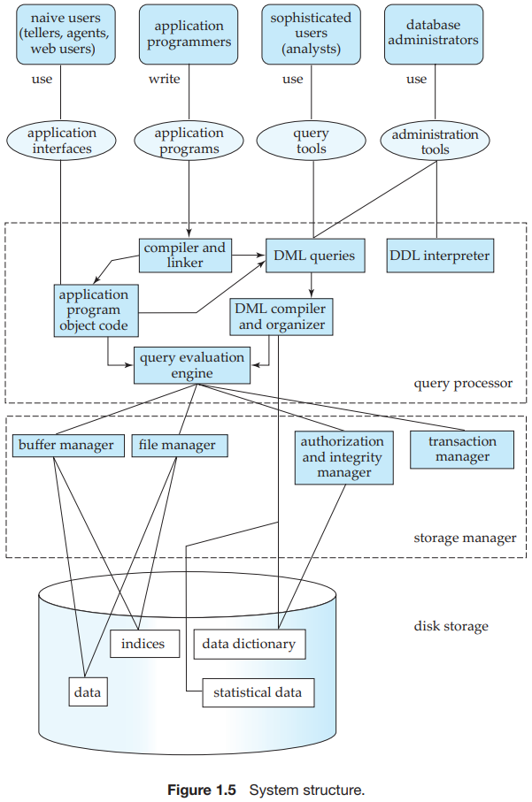


## Storage Device

### Hierarchy

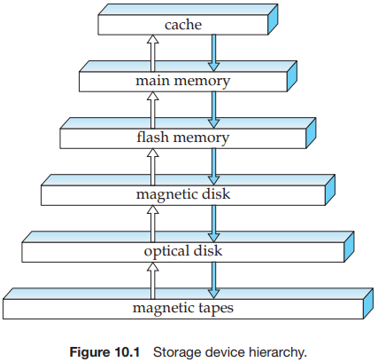

### Disk

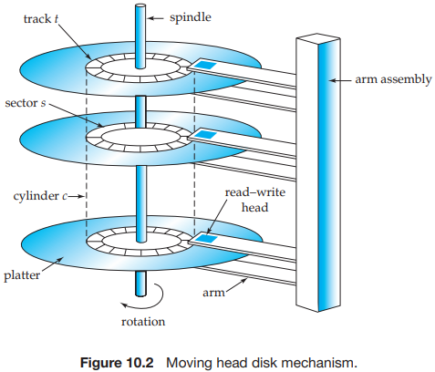

The main measures of the qualities of a disk are capacity, access time, data-transfer rate, and reliability:

- `Access time` is the time from when a read or write request is issued to when data transfer begins. 
- The `average seek time` is the average of the seek times, measured over a sequence of (uniformly distributed) random requests.
- Once the head has reached the desired track, the time spent waiting for the sector to be accessed to appear under the head is called the `rotational latency time`.
- The `data transfer rate` is the rate at which data can be retrieved from or stored to the disk.
- The final commonly used measure of a disk is the `mean time to failure (MTTF)`, which is a measure of the reliability of the disk. The mean time to failure of a disk (or of any other system) is the amount of time that, on average, we can expect the system to run continuously without any failure.

### Redundant Arrays Of Independent Disks (RAID)

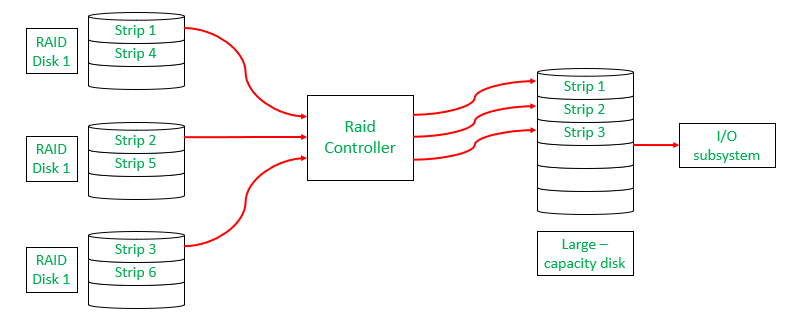

RAID is a technique that combines multiple hard drives or SSDs into a single system to improve performance, data safety, or both. If one drive fails, data can still be recovered from the others.

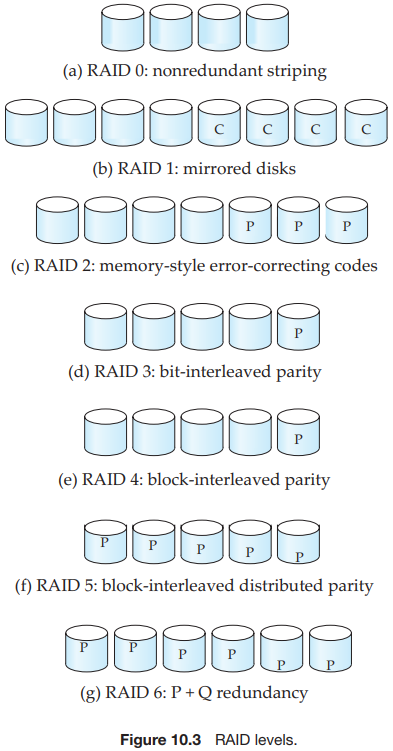

- `RAID level 0`, refers to disk arrays with striping at the level of blocks, but without any redundancy (such as mirroring or parity bits).
- `RAID level 1`, refers to disk mirroring with block striping.
- `RAID level 2`, known as memory-style error-correcting code (ECC) organization, employs parity bits. 
- `RAID level 3`, bit-interleaved parity organization.
- `RAID level 4`, block-interleaved parity organization.
- `RAID level 5`, block-interleaved distributed parity.
- `RAID level 6`, the $P + Q$ The redundancy scheme is much like RAID level 5, but stores extra redundant information to guard against multiple disk failures.

The RAID Levels Comparison Table (0–6, 10, 50, 60):

|  RAID Level   |                    Technique                     |       Fault Tolerance       |     Usable Capacity     |            Performance             |                      Advantages                      |                        Disadvantages                         |
| :-----------: | :----------------------------------------------: | :-------------------------: | :---------------------: | :--------------------------------: | :--------------------------------------------------: | :----------------------------------------------------------: |
|  **RAID 0**   |               Block-Level Striping               |           0 disks           |          N × B          |        Excellent read/write        |          Fastest performance, full capacity          |      No redundancy, one disk failure → total data loss       |
|    RAID 1     |                    Mirroring                     | Up to N/2 disks (best case) |       (N × B) / 2       |      Good read, average write      |           High reliability, easy recovery            |                 50% storage loss, expensive                  |
|    RAID 2     |        Bit-Level Striping + Hamming Code         |           1 disk            | (N − parity drives) × B |                Fast                |               Strong error correction                |                     Complex, rarely used                     |
|    RAID 3     |      Byte-Level Striping + Dedicated Parity      |           1 disk            |       (N − 1) × B       |    Good sequential performance     |           High throughput for large files            |      Slow for small/random I/O, parity disk bottleneck       |
|    RAID 4     |     Block-Level Striping + Dedicated Parity      |           1 disk            |       (N − 1) × B       |             Fast reads             |         Single parity disk makes writes slow         |                    Parity disk bottleneck                    |
|    RAID 5     |    Block-Level Striping + Distributed Parity     |           1 disk            |       (N − 1) × B       |     Good read, moderate write      |       Balanced cost + performance + redundancy       |               Slow random writes due to parity               |
|    RAID 6     | Block-Level Striping + Double Distributed Parity |           2 disks           |       (N − 2) × B       |      Good read, slower write       | Can survive ***\*2 disk failures\****, very reliable |                 More parity → slower writes                  |
| RAID 10 (1+0) |               Mirroring + Striping               |   1 disk per mirror pair    |       (N × B) / 2       |        Excellent read/write        |                 Fastest + redundancy                 |               Needs even # of disks, expensive               |
| RAID 50 (5+0) |        Block Striping over RAID-5 arrays         |   1 disk per RAID-5 group   |     G × (n − 1) × B     | High performance & good redundancy |   High speed + better fault tolerance than RAID 5    | Cannot tolerate >1 disk failure per group; rebuilds are slow; parity overhead; complex setup |
| RAID 60 (6+0) |        Block Striping over RAID-6 arrays         |  2 disks per RAID-6 group   |     G × (n − 2) × B     | Very high redundancy + good speed  |     Survives 2 failures per group, very reliable     | High cost; requires many disks; slower writes due to double parity; complex configuration |

## Data Abstraction

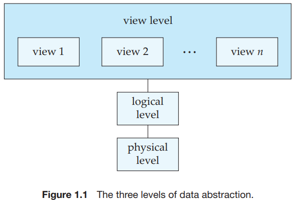

- `Physical level`. The lowest level of abstraction describes `how` the data are actually stored. 
- `Logical level`. The next-higher level of abstraction describes `what` data are stored in the database, and what relationships exist among those data. 
- `View level`. The highest level of abstraction describes only part of the entire database.


## Indexing

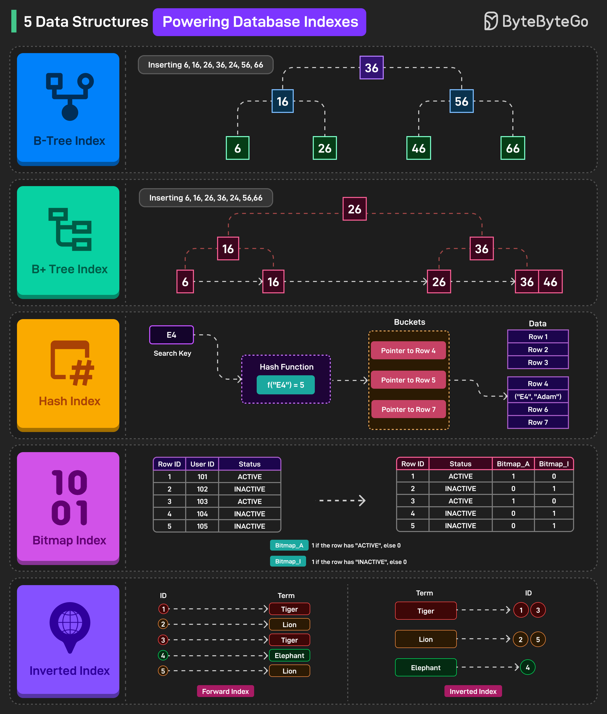

Indexing in databases is a data structure technique used to speed up data retrieval operations by minimizing the number of disk accesses required to locate records.

### File Organization

#### Sequential (Ordered) File Organization

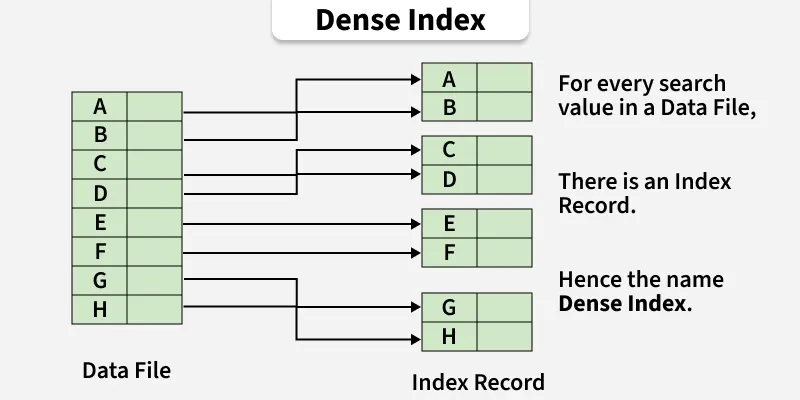

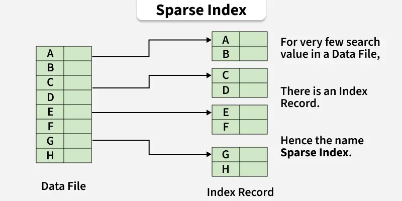

In this type of organization, the indices are based on a sorted ordering of the values. These are generally fast and a more traditional type of storage mechanism. These ordered or Sequential file organizations might store the data in a dense or sparse format.

#### Hash File Organization

Uses a hash function to map keys to buckets.

### Methods

#### Clustered Indexing

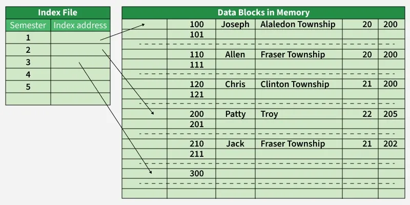

Clustered Indexing stores related records together in the same file, reducing search time and improving performance, especially for join operations. Data is stored in sorted order based on a key (often a non-primary key) to group similar records, like students by semester. If the indexed column isn't unique, multiple columns can be combined to form a unique key. This makes data retrieval faster by keeping related records close and allowing quicker access through the index.

#### Primary Indexing

Primary indexing is an indexing technique in which the index is created on the primary key of a data file. The data records are physically stored in sorted order according to the primary key. The primary key uniquely identifies each record, each index entry corresponds to a block of records and contains the primary key value along with a pointer to the first record of that block. It is commonly used with sequential file organization and improves the efficiency of search operations because the data is ordered.

#### Non-clustered or Secondary Indexing

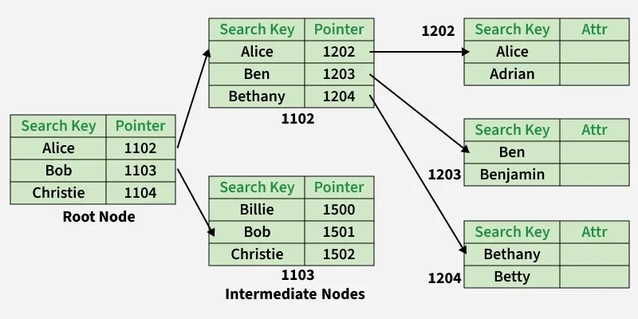

A non-clustered index just tells us where the data lies, i.e., it gives us a list of virtual pointers or references to the location where the data is actually stored. Data is not physically stored in the order of the index. Instead, data is present in leaf nodes.

#### Multilevel Indexing

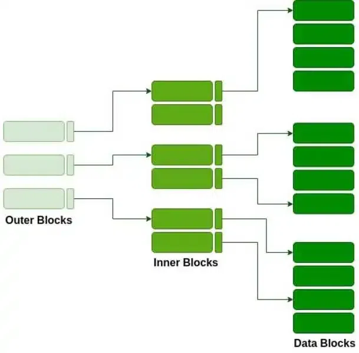

The multilevel indexing segregates the main block into various smaller blocks so that the same data can be stored in a single block.

The outer blocks are divided into inner blocks, which in turn point to the data blocks. This can be easily stored in the main memory with fewer overheads. This hierarchical approach reduces memory overhead and speeds up query execution.

### Bitmap Indexing


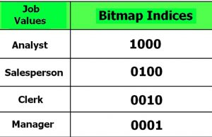


Bitmap Indexing is a powerful data indexing technique used in Database Management Systems (DBMS) to speed up queries- especially those involving large datasets and columns with only a few unique values (called low-cardinality columns).

Creating a bitmap index in SQL:

```sql
CREATE BITMAP INDEX Index_Name ON Table_Name (Column_Name);
```

### Inverted Index

An inverted index is an index data structure storing a mapping from content, such as words or numbers, to their locations in a document or a set of documents. In simple words, it is a hashmap-like data structure that directs you from a word to a document or a web page. They are especially useful for large collections of documents, where searching through all the documents would be prohibitively slow.


## File Organization

File organization in DBMS refers to the method of storing data records in a file so they can be accessed efficiently. It determines how data is arranged, stored, and retrieved from physical storage.

### Types

Some types of File Organizations are: 

- Sequential File Organization
- Heap File Organization
- Clustered File Organization
- ISAM (Indexed Sequential Access Method)
- Hash File Organization
- B+ Tree File Organization

### Sequential File Organization

In this method, the file is stored one after another in a sequential manner. There are two ways to implement this method:

1. Pile File Method

   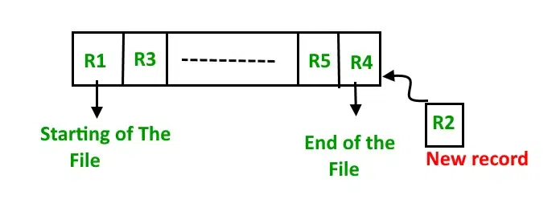

   This method is quite simple, in which we store the records in a sequence, i.e., one after the other, in the order in which they are inserted into the tables.

2. Sorted File Method

   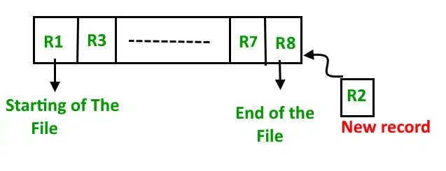

   In this method, as the name itself suggests, whenever a new record has to be inserted, it is always inserted in a sorted (ascending or descending) manner. The sorting of records may be based on any primary key or any other key. 

### Heap File Organization

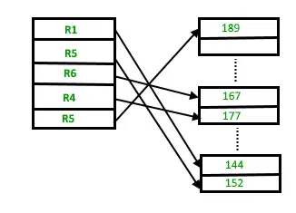

(before insert)

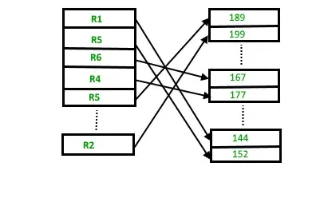

(after insert)

Heap File Organization works with data blocks. In this method, records are inserted at the end of the file into the data blocks. No Sorting or Ordering is required in this method. If a data block is full, the new record is stored in some other block, Here the other data block need not be the very next data block, but it can be any block in the memory. It is the responsibility of the DBMS to store and manage the new records. 

### Clustered File Organization

Clustered File Organization stores related records from different tables together based on a common field, like a foreign key. This improves query performance for join operations by placing related data physically close on disk.

### ISAM (Indexed Sequential Access Method)

`Indexed Sequential Access Method (ISAM)` is a file organization technique used in databases to speed up data retrieval. It combines sequential and direct access using indexes. ISAM stores records in sorted order and maintains an index to quickly locate any record, making it efficient for both sequential processing and fast lookups.

### Hash File Organization

#### Static Hashing

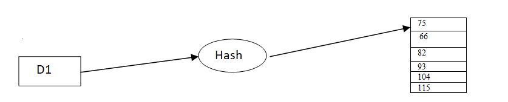

#### Dynamic Hashing

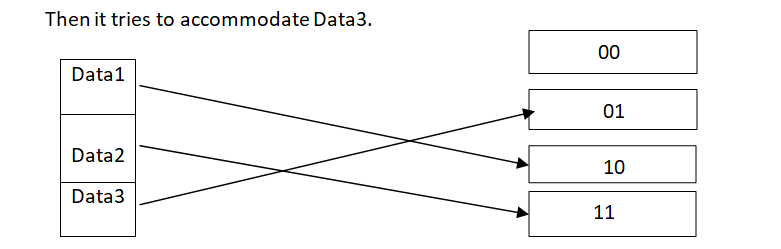

In dynamic hashing, Data buckets grow or shrink (dynamically added or removed) as the data set grows or shrinks. Dynamic Hashing is also known as Extended Hashing. Dynamic hashing requires the hash function to generate a large number of values.

#### Open Addressing

All records are stored in the hash table itself (no separate buckets). If a collision occurs, another empty slot is found using a probing sequence.

#### Separate Chaining

In separate chaining, each slot in the hash table holds a linked list of records (or keys) that hash to the same index.

### B+ Tree File Organization

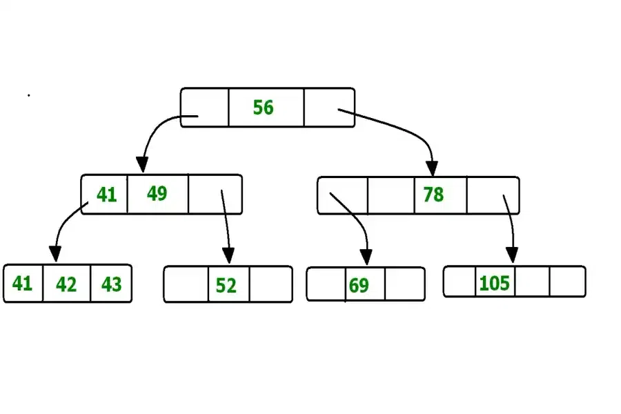

B+ Tree, as the name suggests, uses a tree-like structure to store records in a File. It uses the concept of Key indexing, where the primary key is used to sort the records. For each primary key, an index value is generated and mapped to the record. An index of a record is the address of the record in the file. 


## Reference

[1] Abraham Silberschatz; Henry F. Korth; S. Sudarshan . Database System Concepts. 6ED

[2] [File Organization in DBMS](https://www.geeksforgeeks.org/dbms/file-organization-in-dbms-set-1/)

[3] [Indexing in Databases](https://www.geeksforgeeks.org/dbms/indexing-in-databases-set-1/)

[4] [Clustered File Organization in DBMS](https://www.geeksforgeeks.org/dbms/clustered-file-organization-in-dbms/)

[5] [ISAM in Database](https://www.geeksforgeeks.org/dbms/isam-in-database/)

[6] [B+ File Organization in DBMS](https://www.geeksforgeeks.org/dbms/b-plus-file-organization-in-dbms/)

[7] [Bitmap Indexing in DBMS](https://www.geeksforgeeks.org/dbms/bitmap-indexing-in-dbms/)

[8] [File Organization in DBMS | Set 3](https://www.geeksforgeeks.org/dbms/file-organization-in-dbms-set-3/)

[9] [Inverted Index](https://www.geeksforgeeks.org/dbms/inverted-index/)

[10] [RAID (Redundant Arrays of Independent Disks)](https://www.geeksforgeeks.org/dbms/raid-redundant-arrays-of-independent-disks/)

[11] [Database Index Internals: Understanding the Data Structures](https://blog.bytebytego.com/p/database-index-internals-understanding)

[12] [EP172: Top 5 common ways to improve API performance](https://blog.bytebytego.com/p/ep172-top-5-common-ways-to-improve)
