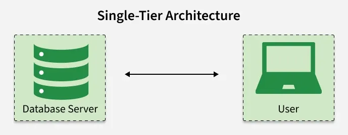
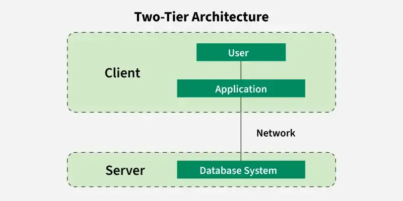
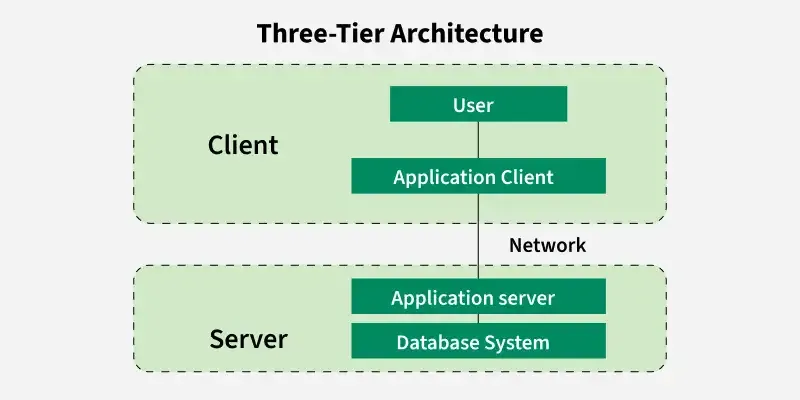
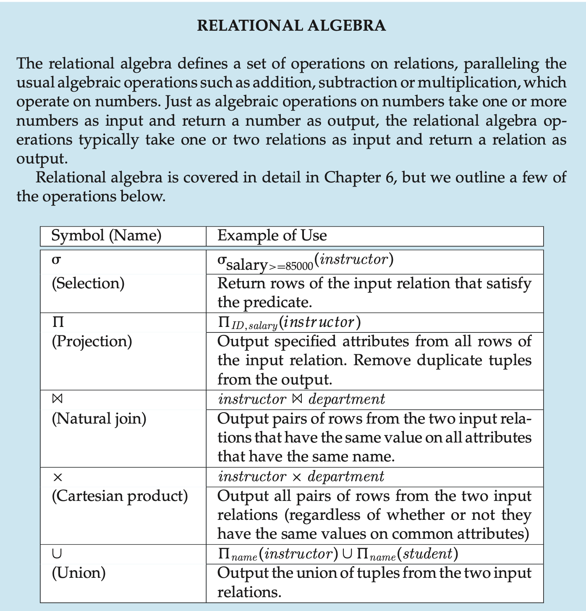
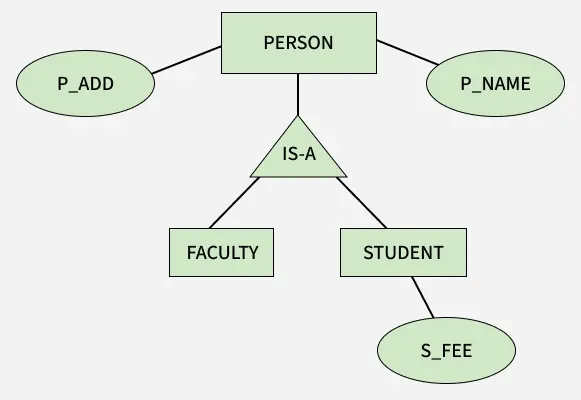
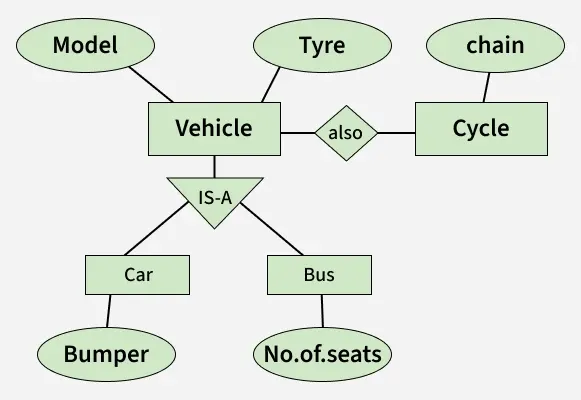

# DB Summary

[TOC]

## DBMS Types

- Relational Database Management System (RDBMS)
- NoSQL DBMS
- Object-Oriented DBMS (OODBMS)
- Hierarchical Database
- Network Database
- Cloud-Based Database

## DBMS Architecture

### 1-Tier Architecture

### 2-Tier Architecture

### 3-Tier Architecture

### Relational Algebra

## Relational Model

### E-R Notation

### ER Model

### Enhanced ER Model

### Generalization, Specialization, Inheritance, and Aggregation in ER Model

#### Generalization

#### Specialization

#### Inheritance

#### Aggregation

## Normalization

- `First Normal Form (1NF)`: Eliminating Duplicate Records
- `Second Normal Form (2NF)`: Eliminating Partial Dependency
- `Third Normal Form (3NF)`: Eliminating Transitive Dependency
- `Boyce-Codd Normal Form (BCNF)`: The Strongest Form of 3NF
- `Fourth Normal Form (4NF)`: Removing Multi-Valued Dependencies
- `Fifth Normal Form (5NF)`: Eliminating Join Dependency

### Denormalization

### Data Replication

## Transactions and Concurrency Control

### ACID Properties

### Concurrency Control Protocols

### Recoverable

## Storage

### Hierarchy

### Data Abstraction

- `Physical level`. The lowest level of abstraction describes `how` the data are actually stored. 
- `Logical level`. The next-higher level of abstraction describes `what` data are stored in the database, and what relationships exist among those data. 
- `View level`. The highest level of abstraction describes only part of the entire database.

### System structure

### Indexing

## Reference

[1] Abraham Silberschatz; Henry F. Korth; S. Sudarshan. Database System Concepts. 6th Edition

[2] [DBMS Tutorial](https://www.geeksforgeeks.org/dbms/dbms/)

[3] [Introduction of DBMS](https://www.geeksforgeeks.org/dbms/introduction-of-dbms-database-management-system-set-1/)

[4] [Types of DBMS Architecture](https://www.geeksforgeeks.org/dbms/dbms-architecture-2-level-3-level/)

[5] [Introduction of ER Model](https://www.geeksforgeeks.org/dbms/introduction-of-er-model/)

[6] [Enhanced ER Model](https://www.geeksforgeeks.org/dbms/enhanced-er-model/)

[7] [Introduction to Database Normalization](https://www.geeksforgeeks.org/dbms/introduction-of-database-normalization/)

[8] [Denormalization in Databases](https://www.geeksforgeeks.org/dbms/denormalization-in-databases/)

[9] [ACID Properties in DBMS](https://www.geeksforgeeks.org/dbms/acid-properties-in-dbms/)

[10] [Lock Based Concurrency Control Protocol in DBMS](https://www.geeksforgeeks.org/dbms/lock-based-concurrency-control-protocol-in-dbms/)

[11] [Indexing in Databases](https://www.geeksforgeeks.org/dbms/indexing-in-databases-set-1/)
