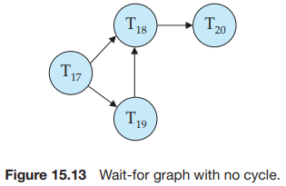
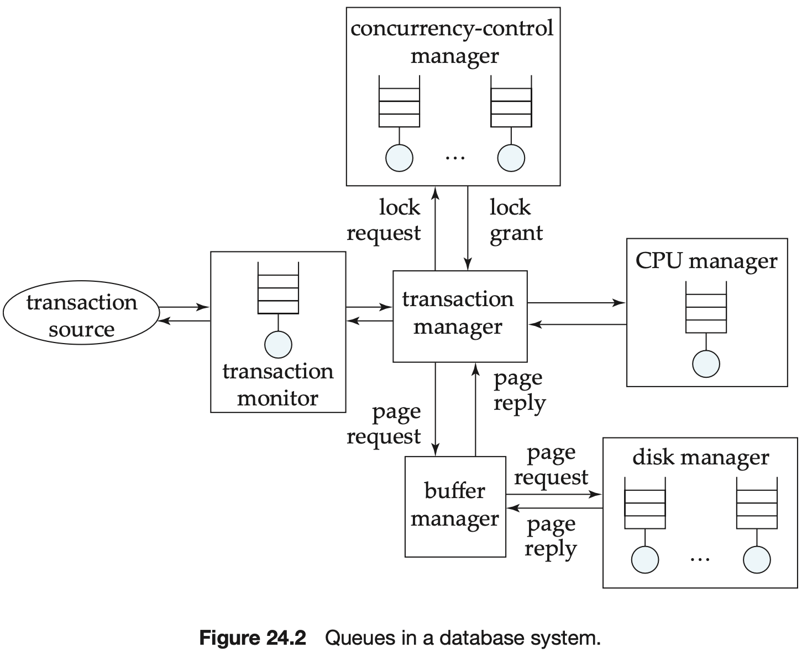
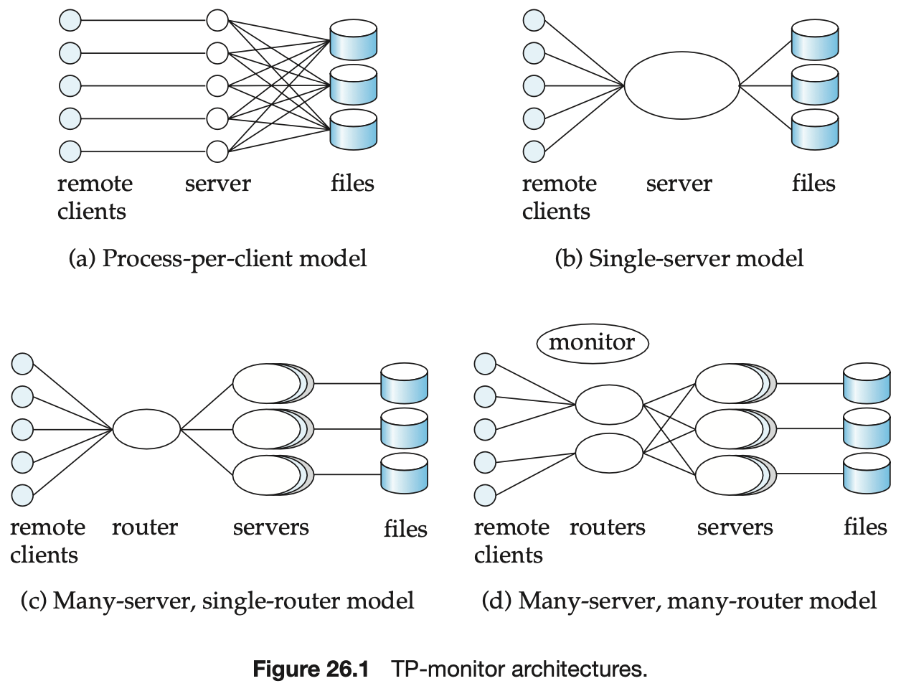
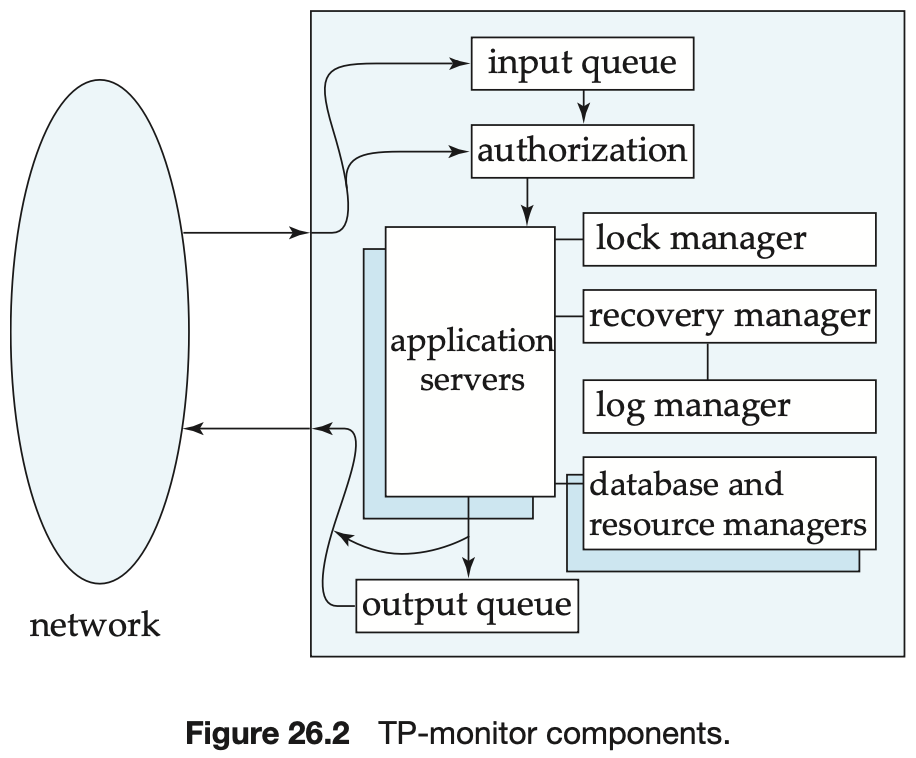

## Transactions

[TOC]

This note summarizes the fundamentals of database transactions and concurrency control with a practical emphasis: the ACID properties, concurrency-control techniques (locking, timestamps, MVCC/snapshot isolation), two‑phase locking and deadlock handling, basic performance considerations, and the role of transaction-processing monitors.

## ACID properties

ACID is a concise way to describe the correctness guarantees that transactions provide:

- Atomicity — all or nothing: a transaction's changes are made visible only if the transaction commits; on failure the system must roll back all partial effects.
- Consistency — integrity preservation: if the database satisfies integrity constraints before a transaction, then it should satisfy them after the transaction (assuming the transaction is correct). Consistency is usually an application-level property enforced by constraints and transaction logic.
- Isolation — apparent serial execution: concurrent transactions should behave as if they executed in some serial order. Different isolation levels relax this requirement to trade off performance and concurrency.
- Durability — persistence of committed updates: once a transaction commits, its effects survive crashes (typically via logging and careful write ordering).

Note: in practice isolation has multiple levels (read uncommitted, read committed, repeatable read, serializable) which allow different anomalies; serializability is the strongest property that guarantees equivalence to some serial schedule.

## Why concurrency control matters

Concurrent execution increases throughput and resource utilization but introduces interference between transactions. Concurrency control enforces correctness (typically serializability or a weaker, controlled isolation) while allowing high concurrency when safe.

Common concurrency-control approaches:

- Lock-based protocols (blocking): transactions acquire locks on data items to prevent conflicting accesses.
- Timestamp-based protocols: assign logical timestamps to transactions and order conflicting operations by timestamps.
- Multi-version concurrency control (MVCC): maintain multiple versions of data so readers can access a consistent snapshot without blocking writers; writers create new versions.

Each approach trades implementation complexity, read/write conflict behavior, and performance characteristics.
## ACID

### Atomicity

Atomicity ensures that either all the effects of a transaction are reflected in the database, or none are; a failure cannot leave the database in a state where a transaction is partially executed.

### Consistency

Consistency ensures that, if the database is initially consistent, the execution of the transaction (by itself) leaves the database in a consistent state.

### Isolation

Isolation ensures that concurrently executing transactions are isolated from one another, so that each has the impression that not other transaction is executing concurrently with it.

### Durability

Durability ensures that, once a transaction has been committed, that transaction's updates do not get lost, even if there is a system failure.

## Concurrent Execution

Concurrent execution of transactions improves the throughput of transactions and system utilization, and also reduces the waiting time of transactions.

There are various `concurrency-control` policies:

- Locking
- Timestamps
- Multiple Versions and Snapshot Isolation

One protocol that ensures serializability is the `two-phase locking protocol`. This protocol requires that each transaction issue lock and unlock requests in two phases:

1. `Growing phase`. A transaction may obtain locks, but may not release any lock.
2. `Shrinking phase`. A transaction may release locks, but may not obtain any new locks.

There are two principal methods for dealing with the deadlock problem:

- Deadlock Prevention

  There are two approaches to deadlock prevention:

  1. One approach ensures that no cyclic waits can occur by ordering the requests for locks or requiring all locks to be acquired together.
  2. The other approach is closer to deadlock recovery and performs transaction rollback instead of waiting for a lock whenever the wait could potentially result in a deadlock.

- Deadlock Detection and Recovery

  

## Performance

The best way to spend the money is to achieve the maximum number of transactions per second. A reduction of 1 I/O per second saves:
$$
(price\ per\ disk\ drive)/(access\ per\ second\ per\ disk)
$$
, thus, if a particular page is accessed $n$ times per second, the saving due to keeping it in memory is $n$ times the above value. Storing a page in memory costs:
$$
(price\ per\ megabyte\ of\ memory)/(pages\ per\ megabyte\ of\ memory)
$$
, thus, the break-even point is:
$$
n * \frac{price\ per\ disk\ drive}{access\ per\ second\ per\ disk} = \frac{price\ per\ megabyte\ of\ memory}{pages\ per\ megabyte\ of\ memory}
$$
, we can rearrange the equation and substitute current values for each of the above parameters to get a value for $n$; if a page is accessed more frequently than this, it is worth buying enough memory to store it.

## TP Monitor

`Transaction-processing monitors (TP monitors)` are systems that were developed in the 1970s and 1980s, initially in response to a need to support a large number of remote terminals (such as airline-reservation terminals) from a single computer. The term `TP monitor` initially stood for `teleprocessing monitor`.

## Reference

[1] Abraham Silberschatz, Henry F. Korth, S. Sudarshan . Database System Concepts . 6 Edition