## Transactions

[TOC]

An SQL transaction groups one or more SQL operations into a single unit of work to ensure reliable data processing. It guarantees that all operations are completed successfully or none are applied, preserving data integrity.

## ACID

### Atomicity

Atomicity ensures that either all the effects of a transaction are reflected in the database, or none are; a failure cannot leave the database in a state where a transaction is partially executed.

### Consistency

Consistency ensures that, if the database is initially consistent, the execution of the transaction (by itself) leaves the database in a consistent state.

### Isolation

Isolation ensures that concurrently executing transactions are isolated from one another, so that each has the impression that not other transaction is executing concurrently with it.

### Durability

Durability ensures that, once a transaction has been committed, that transaction's updates do not get lost, even if there is a system failure.

## Concurrent execution

Concurrent execution of transactions improves the throughput of transactions and system utilization, and also reduces the waiting time of transactions.

### Concurrency Control Protocols

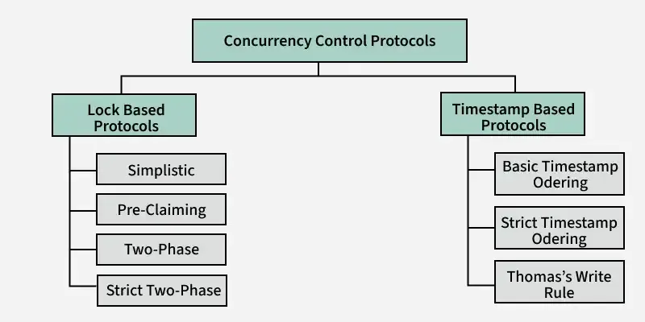

The `Lock-Based Protocols` in DBMS ensure that a transaction cannot read or write data until it gets the necessary lock.

The `Timestamp Ordering Protocol` enforces that older transactions (with smaller timestamps) are given higher priority. This prevents conflicts and ensures the execution is serializable and deadlock-free.

#### Simplistic Lock Protocol

Simple lock-based protocols enable all transactions to obtain a lock on the data before inserting, deleting, or updating it. It will unlock the data item once the transaction is completed.

#### Pre-Claiming Lock Protocol

The Pre-Claiming Lock Protocol avoids deadlocks by requiring a transaction to request all needed locks before it starts. It runs only if all locks are granted; otherwise, it waits or rolls back.

#### Two-Phase Locking Protocol

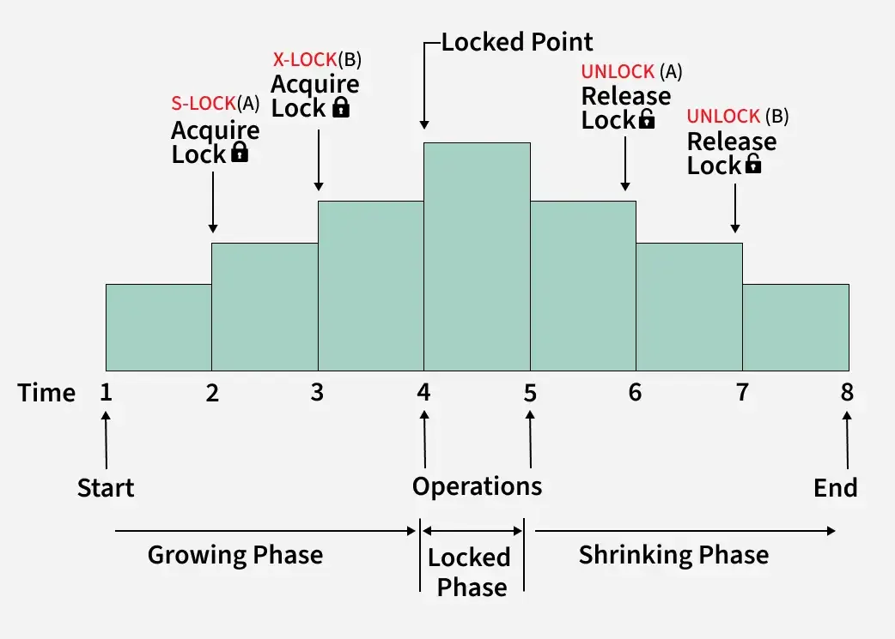

This protocol requires that each transaction issue lock and unlock requests in two phases:

1. `Growing phase`: A transaction may obtain locks, but may not release any lock.
2. `Shrinking phase`: A transaction may release locks, but may not obtain any new locks.

#### Strict Two-Phase Locking Protocol

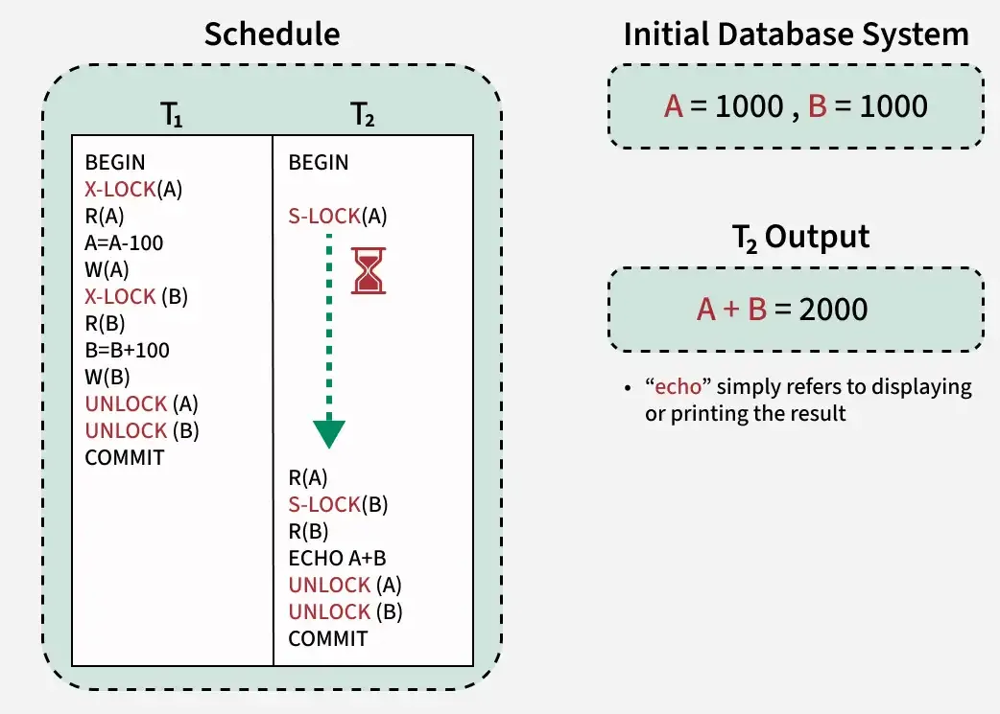

Strict Two-Phase Locking requires that, in addition to the 2-PL, all Exclusive(X) locks held by the transaction be released until after the Transaction Commits. 

#### Rigorous Two-Phase Lock Protocol

A stricter form of the Two-Phase Locking (2PL) protocol, where all locks (both Shared and Exclusive) are held until the transaction commits.

#### Basic Timestamp Ordering

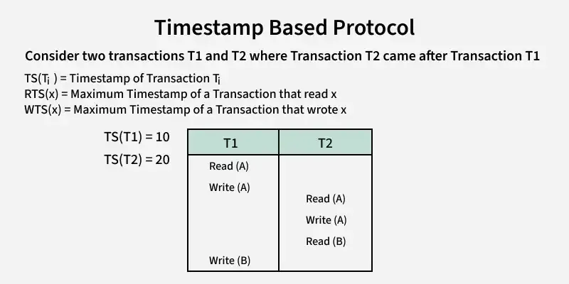

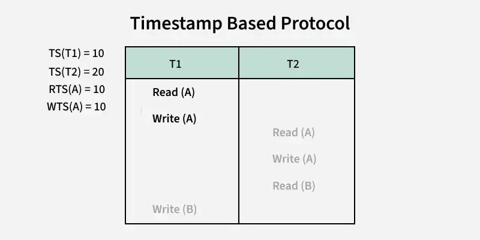

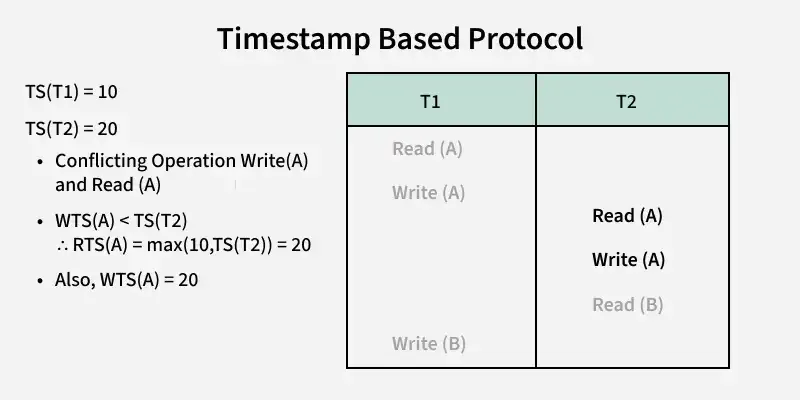

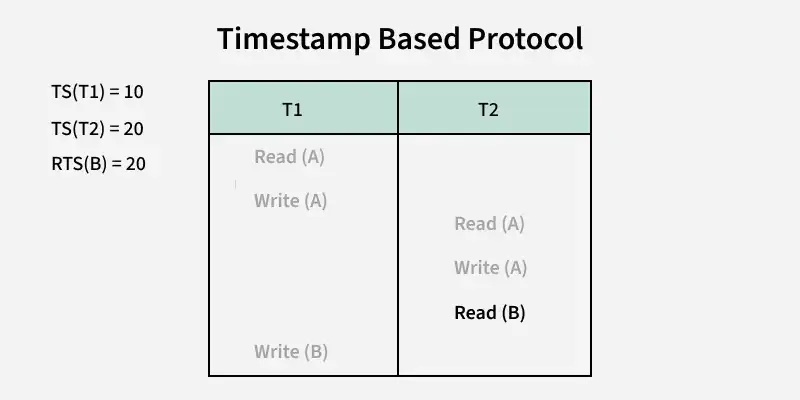

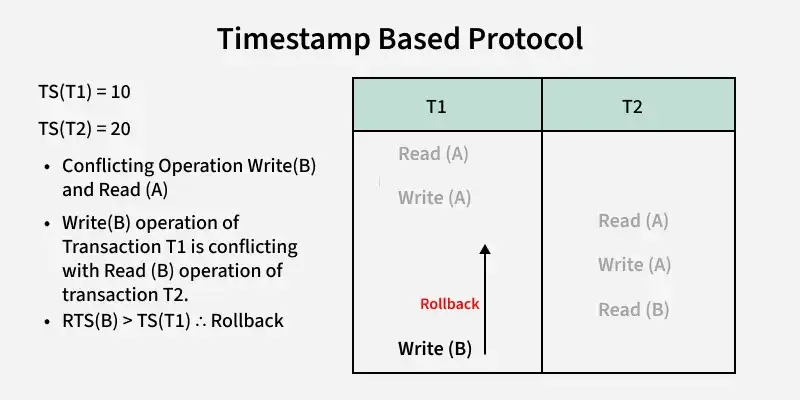

The Basic Timestamp Ordering Protocol works by comparing the timestamp of the current transaction with the timestamps on the data items it wants to read/write.

#### Strict Timestamp Ordering Protocol

The Strict Timestamp Ordering Protocol is an enhanced version that avoids cascading rollbacks by delaying operations until it's safe to execute them.

#### Thoma's Write Rule

The Thomas Write Rule (TWR) is an extension of the Basic Timestamp Ordering (TO) Protocol used for concurrency control in Database Management Systems (DBMS).

### Deadlock

Both transactions are waiting for resources held by the other, preventing either from proceeding with their execution. This situation creates a deadlock.

There are two principal methods for dealing with the deadlock problem:

- Deadlock Prevention

  There are two approaches to deadlock prevention:

  1. One approach ensures that no cyclic waits can occur by ordering the requests for locks or requiring all locks to be acquired together.
  2. The other approach is closer to deadlock recovery and performs transaction rollback instead of waiting for a lock whenever the wait could potentially result in a deadlock.

- Deadlock Detection and Recovery

  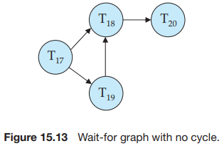

### Starvation

Starvation occurs when a transaction waits indefinitely because the system keeps prioritizing other transactions. This often happens in systems with frequent aborts or restarts, such as those using deadlock prevention algorithms.

The most common method to prevent starvation is First-Come, First-Served (FCFS) scheduling:

- Transactions are served in the order of their arrival.
- Ensures fairness - no transaction waits forever.

### Concurrency Control Manager

The Concurrency Control Manager is responsible for:

- Scheduling transactions in a fair manner.
- Avoiding both deadlocks and starvation.
- Ensuring serializability, isolation, and system consistency.

## Recovery

### Log-Based Recovery

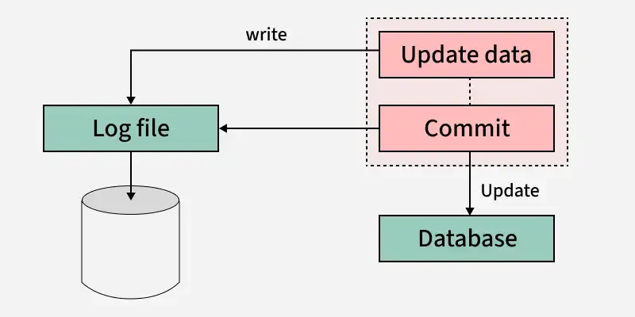

Log-based recovery in DBMS ensures data can be maintained or restored in the event of a system failure. The DBMS records every transaction on stable storage, allowing for easy data recovery when a failure occurs. For each operation performed on the database, a log file is created. Transactions are logged and verified before being applied to the database, ensuring data integrity.

| Operation |               Trigger               |                      Action                      |
| :-------: | :---------------------------------: | :----------------------------------------------: |
|   Undo    | For uncommitted/failed transactions | Revert changes using the old values in the log.  |
|   Redo    |     For committed transactions      | Reapply changes using the new values in the log. |

#### Undo Operation

The undo operation reverses the changes made by an uncommitted transaction.
Even though the transaction did not commit, its dirty pages may have already been written to disk from the buffer.
Undo restores the old values using the log to remove these partial changes.

#### Redo Operation

The redo operation re-applies the changes of a committed transaction.
Although the transaction has committed, its updated pages may not have been flushed to disk before the crash.
Redo ensures that committed changes are safely applied to the database.

#### Approaches to Modify the Database

In database systems, changes to the database can be made using two main methods:

1. Immediate Modification

   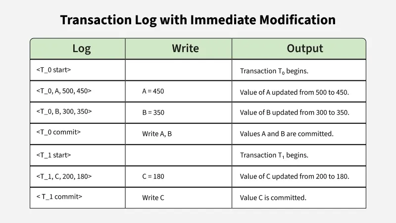

   In the Immediate Modification method, the database is updated as soon as a change is made during a transaction, even before the transaction is committed. Logs are written before making any changes to ensure recovery is possible in case of a system failure.

2. Deferred Modification

   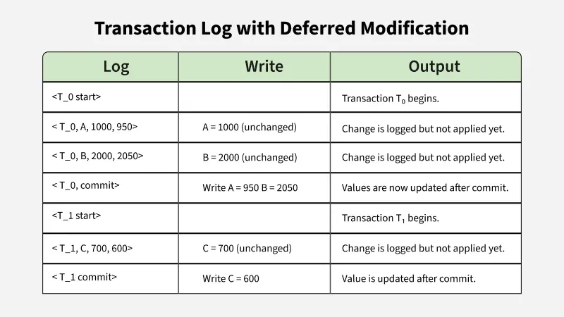

   In the Deferred Modification method, changes to the database are not applied immediately. Instead, they are logged and stored temporarily. The database is only updated after the transaction is fully committed. This method ensures that no partial changes are made to the database, reducing the risk of inconsistency.

#### Recovery using log records

Log-based recovery is a method used in database systems to restore the database to a consistent state after a crash or failure. The process uses a transaction log, which keeps a record of all operations performed on the database, including updates, inserts, deletes, and transaction states (start, commit, or abort).

#### Recovery using checkpoints

Checkpointing is a process used in DBMS to streamline the recovery procedure after a system crash by reducing the amount of log data that needs to be examined. It helps save the current state of the database and active transactions to make recovery faster and more efficient.

## Performance

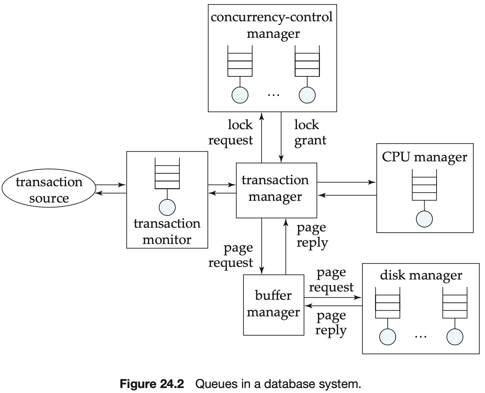

The best way to spend the money is to achieve the maximum number of transactions per second. A reduction of 1 I/O per second saves:
$$
(price\ per\ disk\ drive)/(access\ per\ second\ per\ disk)
$$
, thus, if a particular page is accessed $n$ times per second, the saving due to keeping it in memory is $n$ times the above value. Storing a page in memory costs:
$$
(price\ per\ megabyte\ of\ memory)/(pages\ per\ megabyte\ of\ memory)
$$
, Thus, the break-even point is:
$$
n * \frac{price\ per\ disk\ drive}{access\ per\ second\ per\ disk} = \frac{price\ per\ megabyte\ of\ memory}{pages\ per\ megabyte\ of\ memory}
$$
, we can rearrange the equation and substitute current values for each of the above parameters to get a value for $n$; if a page is accessed more frequently than this, it is worth buying enough memory to store it.

## TP Monitor

`Transaction-processing monitors (TP monitors)` are systems that were developed in the 1970s and 1980s, initially in response to a need to support a large number of remote terminals (such as airline-reservation terminals) from a single computer. The term `TP monitor` initially stood for `teleprocessing monitor`.

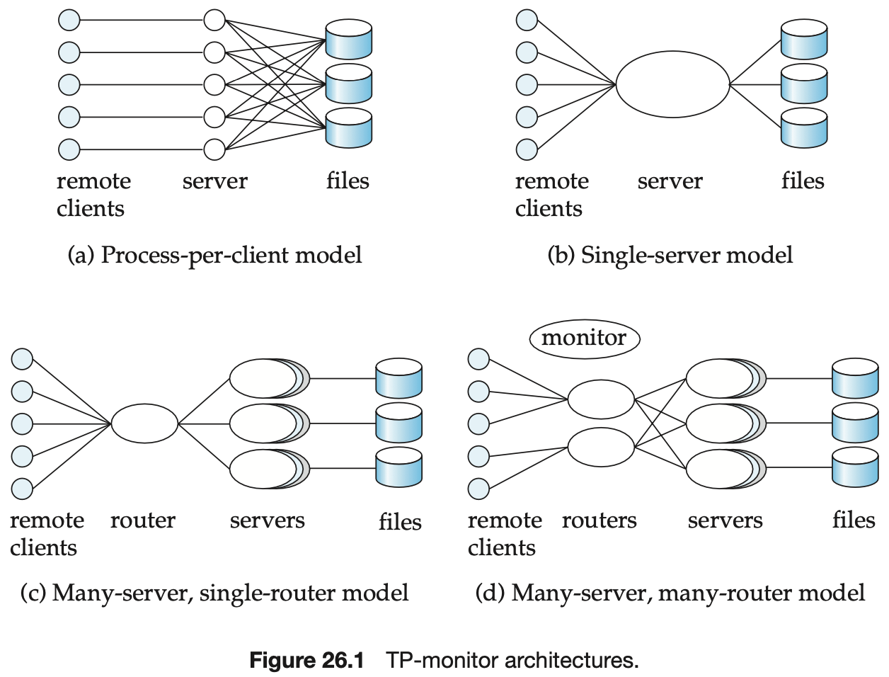

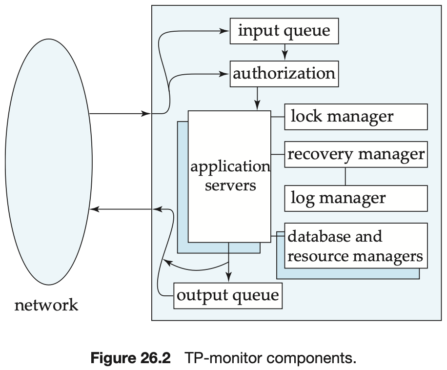

## Online Transaction Processing (OLTP)

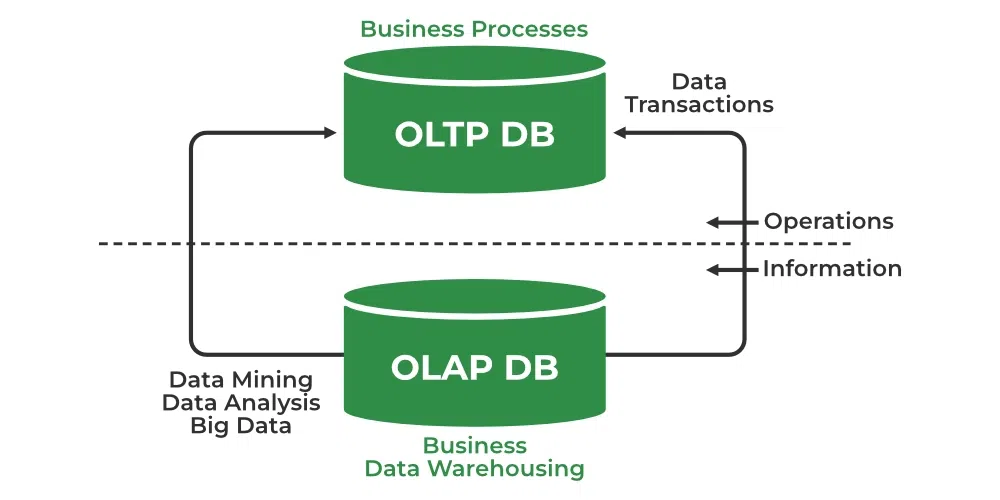

Online Transaction Processing, commonly known as OLTP, is a data processing approach emphasizing real-time execution of transactions. The majority of OLTP systems are meant to manage numerous short atomic operations that keep databases in line.

## Online Analytical Processing (OLAP)

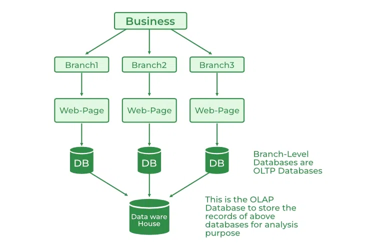

Online Analytical Processing (OLAP) refers to software tools used for the analysis of data in business decision-making processes. OLAP systems generally allow users to extract and view data from various perspectives, many times they do this in a multidimensional format which is necessary for understanding complex interrelations in the data.

## Summary

### OLAP vs OLTP

|     Category      |    OLAP (Online Analytical Processing)     |   OLTP (Online Transaction Processing)    |
| :---------------: | :----------------------------------------: | :---------------------------------------: |
|    Data Source    |  Historical data from multiple databases.  |         Current operational data.         |
|      Purpose      |   Used for analysis and decision-making.   |     Used for day-to-day transactions.     |
|    Method Used    |           Uses a data warehouse.           |           Uses a standard DBMS.           |
|   Normalization   |         Tables are not normalized.         |       Tables are normalized (3NF).        |
|    Query Type     |    Complex, read-heavy queries (slow).     |    Simple, read/write queries (fast).     |
|    Data Volume    |               Large (TB–PB).               |              Small (MB–GB).               |
| Update Frequency  |      Updated periodically in batches.      |       Updated frequently by users.        |
| Backup & Recovery |              Periodic backup.              |      Continuous and rigorous backup.      |
|       Users       | Used by analysts, managers and executives. |   Used by clerks and operational staff.   |
|       Focus       |    Subject-oriented (analysis-focused).    | Application-oriented (operation-focused). |

### Basic TO vs Thoma's Write Rule

|           Aspect            |       Basic Timestamp Ordering (TO)        |               Thomas Write Rule (TWR)                |
| :-------------------------: | :----------------------------------------: | :--------------------------------------------------: |
|          **Basis**          | Strict timestamp checking for reads/writes |       Modified TO that ignores outdated writes       |
|     **Outdated Writes**     |            Transaction aborted             |                    Write ignored                     |
| **Type of Serializability** |           Conflict serializable            | View serializable (not always conflict serializable) |
|    **Concurrency Level**    |            Low (more rollbacks)            |               Higher (fewer rollbacks)               |
|    **System Throughput**    |                    Low                     |                         High                         |

## Reference

[1] Abraham Silberschatz, Henry F. Korth, S. Sudarshan . Database System Concepts . 6 Edition

[2] [Difference Between OLAP and OLTP in Databases](https://www.geeksforgeeks.org/dbms/difference-between-olap-and-oltp-in-dbms/)

[3] [Concurrency Control in DBMS](https://www.geeksforgeeks.org/dbms/concurrency-control-in-dbms/)

[4] [Lock Based Concurrency Control Protocol in DBMS](https://www.geeksforgeeks.org/dbms/lock-based-concurrency-control-protocol-in-dbms/)

[5] [Two Phase Locking Protocol](https://www.geeksforgeeks.org/dbms/two-phase-locking-protocol/)

[6] [Timestamp based Concurrency Control](https://www.geeksforgeeks.org/dbms/timestamp-based-concurrency-control/)

[7] [ACID Properties in DBMS](https://www.geeksforgeeks.org/dbms/acid-properties-in-dbms/)

[8] [Thomas Write Rule in DBMS](https://www.geeksforgeeks.org/dbms/thomas-write-rule-in-dbms/)

[9] [Introduction to TimeStamp and Deadlock Prevention Schemes in DBMS](https://www.geeksforgeeks.org/dbms/introduction-to-timestamp-and-deadlock-prevention-schemes-in-dbms/)

[10] [Starvation in DBMS](https://www.geeksforgeeks.org/dbms/starvation-in-dbms/)

[11] [Log based Recovery in DBMS](https://www.geeksforgeeks.org/dbms/log-based-recovery-in-dbms/)