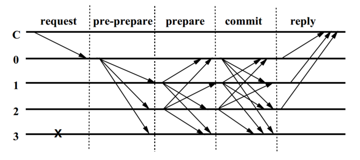

English | [中文版](pbft_zh.md)

# Practical Byzantine Fault Tolerance (PBFT)

[TOC]

PBFT is designed to handle Byzantine faults, where nodes may fail or act maliciously. It ensures consensus as long as less than one-third of the nodes are faulty. PBFT operates in three phase: pre-prepare, prepare, and commit. In the pre-prepare phase, the leader proposes a value.

## Fault Tolerance Rate

The PBFT algorithm can tolerate less than `1/3` invalid or malicious nodes.

## Roles

- Primary Node

	Rotates in election; unlike Paxos and other consensus protocols, the primary node has no special privileges.

	Triggers for re-election:

	- Primary node heartbeat timeout
	- Primary node maliciously sends messages with incorrect numbers
	- Primary node does not forward received `request`
	- Primary node tampers with messages

- Replica Node

## Process

### Overview

1. A node is selected as the primary node by rotation or random algorithm.
2. The client sends a request to the primary node, which, after validation, broadcasts the request to all other replica nodes and sends a pre-prepare message to all follower nodes.
3. Followers receive the pre-prepare message, validate it, and if valid, store the message.
4. After storing, followers broadcast a Prepare message and enter the `Prepare phase`.
5. For a given Request, when a node receives Prepare messages from more than `2f` nodes, it means most nodes have persisted the request, and it enters the `commit phase`.
6. Commit messages are broadcast; when `2f` nodes have sent commit messages, the `commit phase` is complete, the node caches the client's last request, and responds to the client.

### Phase Descriptions

- Pre-Prepare Phase

	The primary node assigns a proposal number to the request received from the client, then sends a **pre-prepare message** to all replica nodes.

- Prepare Phase

	Replica nodes receiving the pre-prepare message check its validity and add their own id; they also receive prepare messages from other nodes, check their validity, and if valid, write them to the message log. Only after collecting `2f+1` validated messages does a node enter the prepared state.

- Commit Phase

	Commit messages are broadcast to inform other nodes that proposal n in view v is prepared. If at least `2f+1` validated commit messages are collected, the proposal is considered committed.

PBFT commit message example:

- C: Client
- 0: Primary node
- 1: Replica node 1
- 2: Replica node 2
- 3: Replica node 3

## Drawbacks

1. PBFT algorithm has communication complexity $O(N^2)$, while in Raft it is $O(N)$

## References

[1] [PBFT Consensus Algorithm](https://www.jianshu.com/p/cf1010f39b84)

[2] [PBFT Algorithm Explained](https://blog.csdn.net/jfkidear/article/details/81275974)

[3] [Consensus Algorithms in Distributed System](https://www.geeksforgeeks.org/operating-systems/consensus-algorithms-in-distributed-system/)
