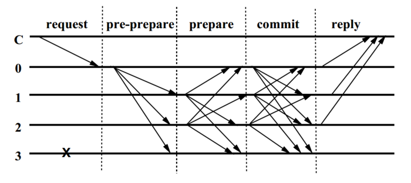

# 实用拜占庭容错(pbft)

<!-- vim-markdown-toc GFM -->

* [容错率](#容错率)
* [角色](#角色)
* [流程](#流程)
    - [简述](#简述)
    - [阶段说明](#阶段说明)
* [缺点](#缺点)
* [参考](#参考)

<!-- vim-markdown-toc -->

## 容错率

pbft算法可以容忍小于`1/3`个无效或者恶意节点

## 角色

- 主节点

  轮流当选，与paxos等其他共识协议不同，主节点没有特权。

  重新选举触发条件：

  - 主节点心跳超时
  - 主节点恶意发送错误编号的消息
  - 主节点不发送接收到的`request`
  - 主节点篡改消息

- 普通节点

## 流程

### 简述

1. 通过轮换或随机算法选出某个节点作为主节点。
2. 客户端发送请求到主节点，主节点验证通过后，广播请求到所有其他副本节点，发起pre-prepare消息给所有的follower节点
3. follower收到pre-prepare消息后，校验消息；校验ok就存盘消息
4. follower存盘后广播Prepare消息，自己进入`Prepare阶段`
5. 所有节点针对某个Request的Prepare消息，当统计结果超过`2f`个节点时，表明大部分节点已完成了持久化，自己进入`commit阶段`
6. 广播commit消息，当`2f`个节点都发出commit消息时，完成`commit阶段`，缓存客户端最后一次请求，并反馈给客户端。

### 阶段说明

- 预准备阶段(Pre-Prepare)

  主节点为从客户端收到的请求分配提案编号，然后发出**预准备消息**给各副本节点。

- 准备阶段(Prepare)

  副本节点收到预准备消息后，检查消息合法，带上自己的id信息；同时接收来自其他节点的准备信息，收到准备消息的节点对消息同样进行消息合法性检查，验证通过后，把这个准备消息写入消息日志中，集齐`2f+1`个验证过的消息才进入准备状态。

- 提交阶段(Commit)

  广播commit消息，高速其他节点某个提案n在视图v中已处于准备状态。如果集齐至少`2f+1`验证通过的commit消息，则说明提案通过

pbft提交消息举例：

- C：客户端
- 0：主节点
- 1：普通节点1
- 2：普通节点2
- 3：普通节点3

## 缺点

1. pbft算法通信复杂度$O(N^2)$，在raft系统中，复杂度为$O(N)$

## 参考

- [PBFT共识算法](https://www.jianshu.com/p/cf1010f39b84)
- [深入浅出PBFT算法原理](https://blog.csdn.net/jfkidear/article/details/81275974)

