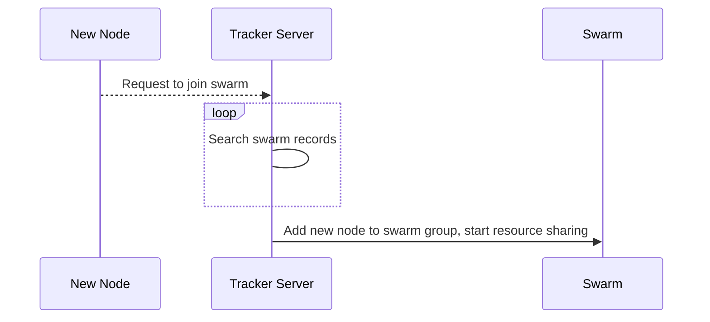
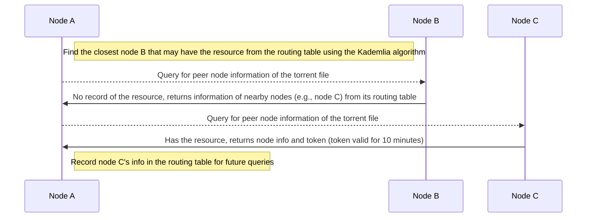
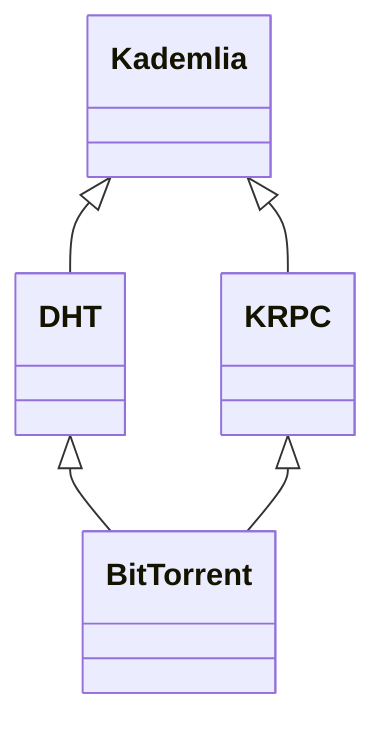
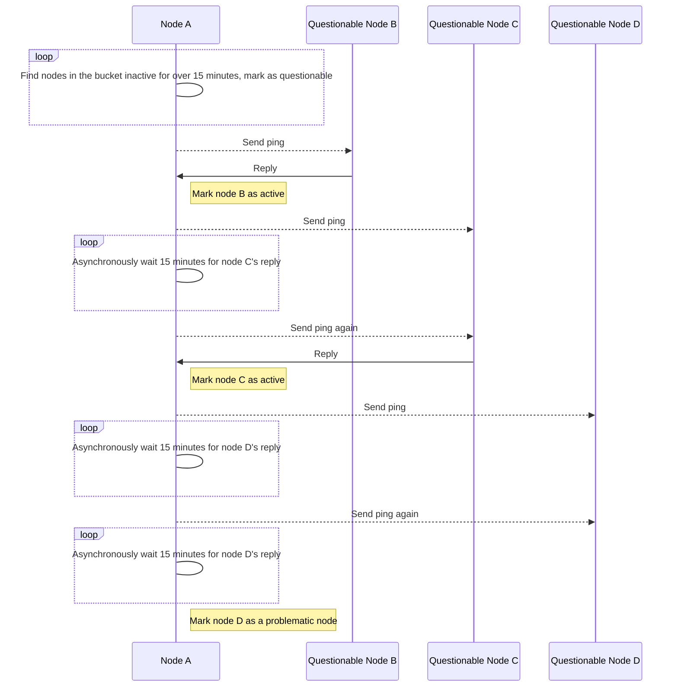

English | [中文版](dht_zh.md)

# DHT

[TOC]

## Prerequisites

- Node ID

	A globally unique identifier (node id). An active node is one that has responded to a request or sent a request within the last 15 minutes. If there is no activity within 15 minutes, the node becomes a questionable node. Active nodes have higher priority than questionable nodes.

- Distance Metric

	Used to compare the distance between two nodes or between a node and an infohash. The distance is calculated using the XOR algorithm between two node ids. The value depends only on the ids and is unrelated to actual geographic location.

- Routing Table

	All nodes must maintain a routing table to record their communication information with other nodes in the DHT network. The smaller the distance metric, the more detailed the information.

- Kademlia Algorithm

	XOR two hashes, convert the result to an unsigned integer; the smaller the result, the closer the distance.

	When a node wants to find the peer node information for a torrent file, it uses the Kademlia algorithm to compare the infohash field of the torrent file with the node ids in the routing table, and communicates with the closest node.

**The above concepts belong to the Kademlia algorithm. For details, please refer to [Kademlia Algorithm](kad.md)**

## Overview

DHT (Distributed Sloppy Hash Table) is generally used to store peer node information for torrent files without tracker addresses. Each node acts as a tracker server. The DHT protocol is implemented on top of UDP using the Kademlia algorithm.

Each node has a globally unique identifier (node id).

### Traditional BT Mode

Disadvantage: Tracker servers are prone to failure or being blocked.

### DHT Mode

The DHT protocol is used to bypass tracker server blocking and is an effective supplement to the traditional BT mode.

### Relationship among Kademlia, DHT, KRPC, and BitTorrent

## DHT

### Routing Table

The following diagram illustrates bucket management of questionable nodes:

## References

### Literature

[1] Chord——A Scalable Peer-to-peer Lookup Service for Internet Applications

[2] Kademlia——A Peer-to-peer Information System Based on the XOR Metric

[3] A Survey of DHT Security Techniques

### External Links

- [Official DHT Protocol Documentation](http://www.bittorrent.org/beps/bep_0005.html)
- [wiki Distributed hash table](https://en.wikipedia.org/wiki/Distributed_hash_table)
- [Baidu Baike - DHT](https://baike.baidu.com/item/DHT/1007999?fr=aladdin)
- [DHT Crawler](https://www.jianshu.com/p/4175b27b6758)
- [Kademlia, DHT, KRPC, BitTorrent Protocol, DHT Sniffer](https://www.cnblogs.com/LittleHann/p/6180296.html)
