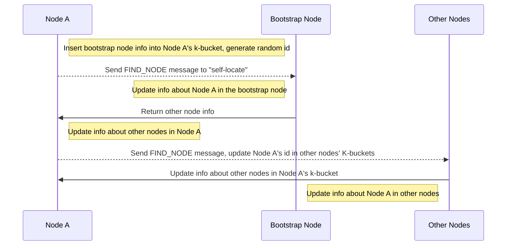
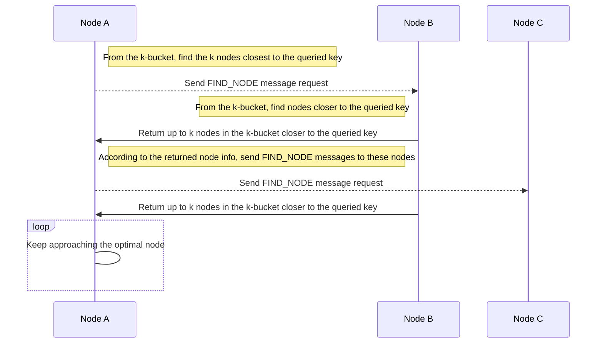
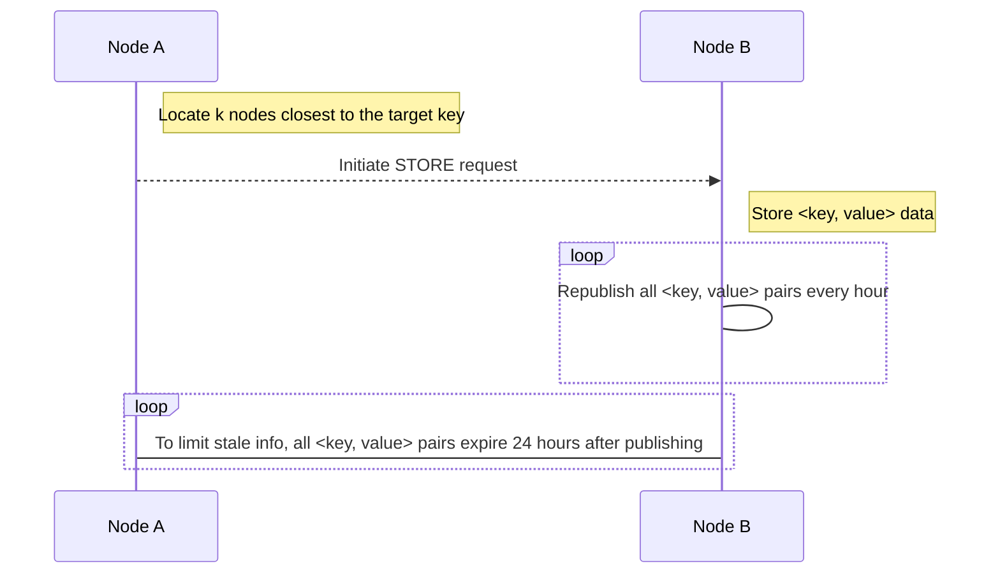
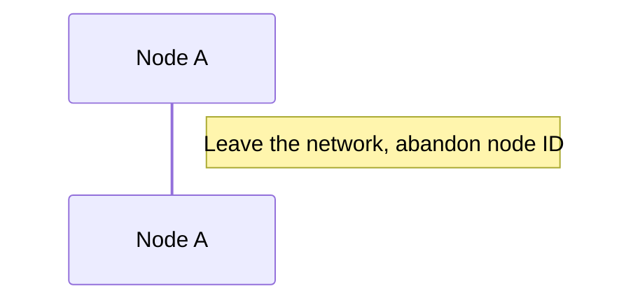

English | [中文版](kad_zh.md)

# Kademlia Algorithm

[TOC]


## Abstract

Kademlia is based on the distance calculation between two nodes, which is the XOR distance of the two network node IDs. The result of the calculation is finally returned as an integer value. The XOR distance has nothing to do with the actual geographic location, only with the IDs.


## Node ID

A globally unique id, implemented differently in different projects

- Kademlia

	Uses SHA1 hash to calculate Node ID. SHA1 is a 160-bit hash space, so the entire ID length is 160 bits, i.e., 20 bytes. The node id range is $[0,2^{160}]$.

- IPFS

	Uses SHA256 to calculate Node ID, which is a 256-bit hash space, i.e., 32 bytes.

- Ethereum

	Uses sha3, also a 256-bit hash space, 32 bytes.


## Node Distance

Directly perform XOR operation on two Node IDs to get their distance, which is used to index k-buckets.

Example:

The NodeID of the current node is 1101, and the NodeID of another node is 1010. The distance is calculated as follows:

Distance is 5$=(1101)XOR(1000)$

### LCP

In Kademlia, a binary tree is constructed based on the number of matching prefix bits (LCP, Longest Common Prefix) between the current node's Node ID and the Node IDs of other peer nodes it stores.

Example:

The NodeID of the current node is 1101, and the NodeID of another node is 1000, so the LCP is 1.

Example:

The current node ID is 0011, so it can be divided into LCP = 0, 1, 2, 3, a total of 4 subtrees. For a Node ID of 160 bits, there will be 160 subtrees, i.e., 160 buckets. Each bucket can be indexed by the result of XOR.


## Protocol Messages

There are four types of messages in the Kademlia protocol:

- PING

	Used to test whether a node is still online

- STORE

	Store a key-value pair in a node

- FIND_NODE

	The recipient returns the K nodes in its bucket closest to the requested key

- FIND_VALUE

	Same as FIND_NODE, but if the recipient has the requested key, it returns the value of the key. Each RPC message contains a random value added by the initiator to ensure that the response message can be matched with the previously sent request message when received.


## Routing Table

The routing table records all k-buckets.

Implemented differently in different projects:

- IPFS

	Dynamically allocated, each newly created table initially contains one k-bucket

- BitTorrent

	Pre-allocates the number of k-buckets according to the ID space (e.g., 160 bits allocates 160 buckets, 256 bits allocates 256 buckets, so that the distance can be directly used as the bucket index)

- Ethereum

	Uses a fixed number of buckets, but limited to 17

### K-bucket

Each bucket can hold up to k nodes. When a bucket is full, no new nodes are allowed to join, and the bucket is split into two buckets. Suppose each node's ID is N bits, then each node needs to maintain up to N K-buckets for storage.

#### Bucket Splitting

```flow
st=>start: New routing table
insert=>operation: Insert a new node
is_full=>condition: Is it full?
input_bucket=>operation: Put the node into the bucket
splict_bucket=>operation: Split the bucket into two, the first bucket range [0,2^159], the second bucket range [2^159,2^160]

st->insert->is_full
is_full(no)->input_bucket->insert
is_full(yes)->splict_bucket->input_bucket->insert
```

### Bucket Update Mechanism

- Active node collection

	Actively send FIND_NODE queries to update the node information in the k-bucket.

- Passive node collection

	When receiving requests from other nodes (e.g., FIND_NODE, FIND_VALUE), add the sender's node ID to a k-bucket.

- Detecting failed nodes

	Periodically send PING requests to determine whether a node in the k-bucket is online, and then clean up offline nodes from the k-bucket.


## Joining the Network




## Locating Nodes

First look in your own k-bucket. If not found, look in the k-buckets of nearby nodes. The entire search process is convergent, and the query complexity can be proven to be $\log N$

### Find your own k-bucket

Suppose the current node is **110**, and the target node is **101**, the distance is $011=(110)XOR(101)$.

todo

### Find the k-bucket of nearby nodes



Node info may include a round-trip time (RTT) parameter, which can be used to define a timeout setting for each queried node. If a query to a node times out, another query is initiated.


## Locating Resources

By mapping resource information to a key, the resource can be located.

```mermaid
sequenceDiagram
Note right of Node A:Check if it stores the data; if so, return directly; if not, return k nodes closest to the key
Node A-->>Node B:Send FIND_VALUE message
Note left of Node B:Check if it stores the data
Node B->>Node A:Return the node in Node B's k-bucket closest to the key
Note right of Node A:Update result list, approach the target result
Node A-->>Node C:Send FIND_VALUE message
Node C->>Node A:Return the value corresponding to the key
```

## Storing Resources




## Leaving the Network




## Query Acceleration

Because Kademlia uses XOR distance for routing lookups, for a network defined by n bits, the time complexity of a lookup operation on a node is $\log{n}$.

XOR distance satisfies the triangle inequality: any side's distance is less than (or equal to) the sum of the other two sides; XOR distance allows Kademlia's routing table to be built on a single bit, i.e., bit groups (multiple bits together) can be used to build the routing table; bit groups can also be called prefixes.

For an m-bit prefix, there can be $2^m-1$ K-buckets (an m-bit prefix can correspond to $2^m$ K-buckets, the other K-bucket can be further expanded to include the routing tree containing the node's own ID).

A b-bit prefix can reduce the maximum number of queries from $\log n$ to $\log (\frac{n}{b})$. This is only the maximum number of queries, as your own K-bucket may have more bits in common with the target key than the prefix.


## References

- [Wikipedia - Kademlia Algorithm](https://en.wikipedia.org/wiki/Kademlia)
- [P2P Network Core Technology: Kademlia Protocol](https://zhuanlan.zhihu.com/p/40286711)
- [KADEMLIA Algorithm Study](https://shuwoom.com/?p=813)
