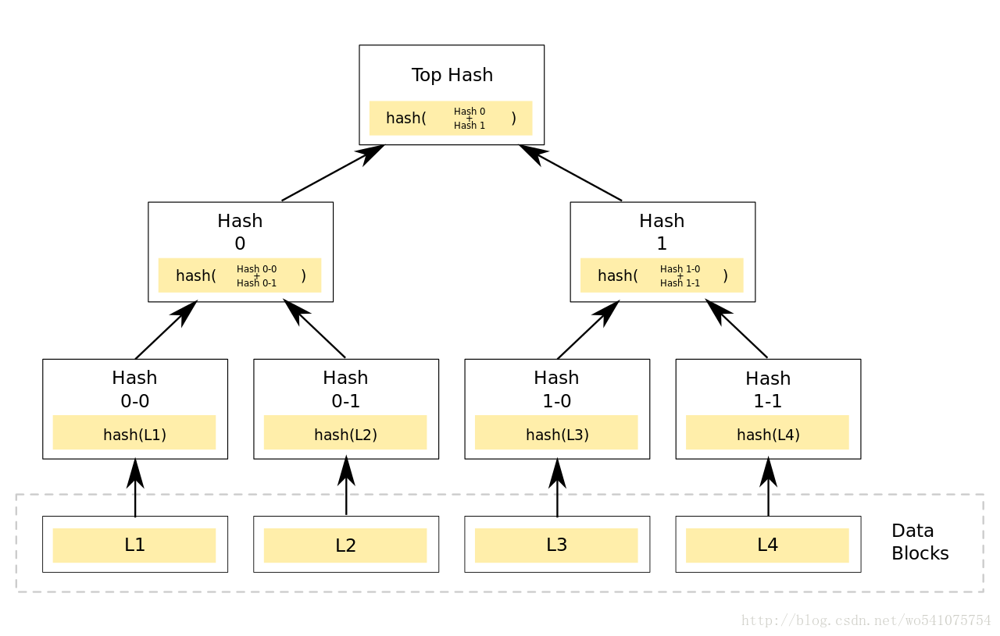
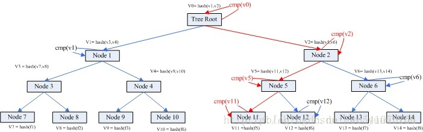
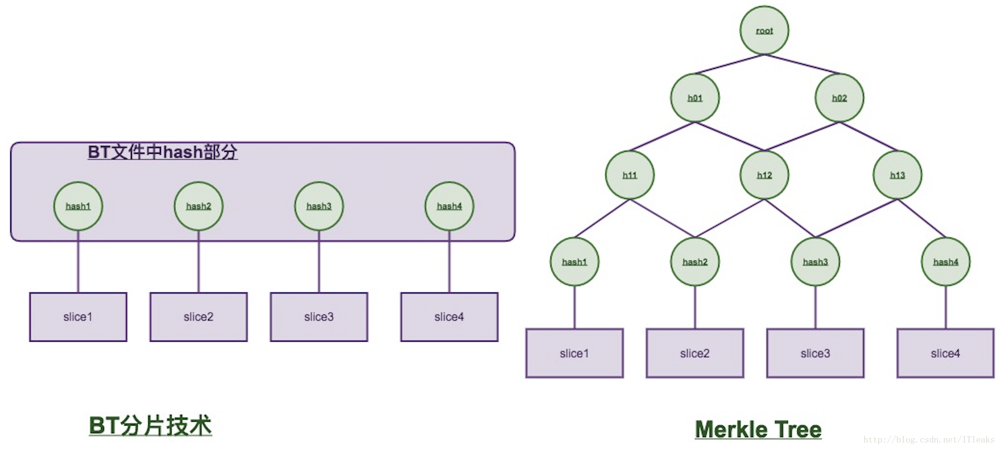
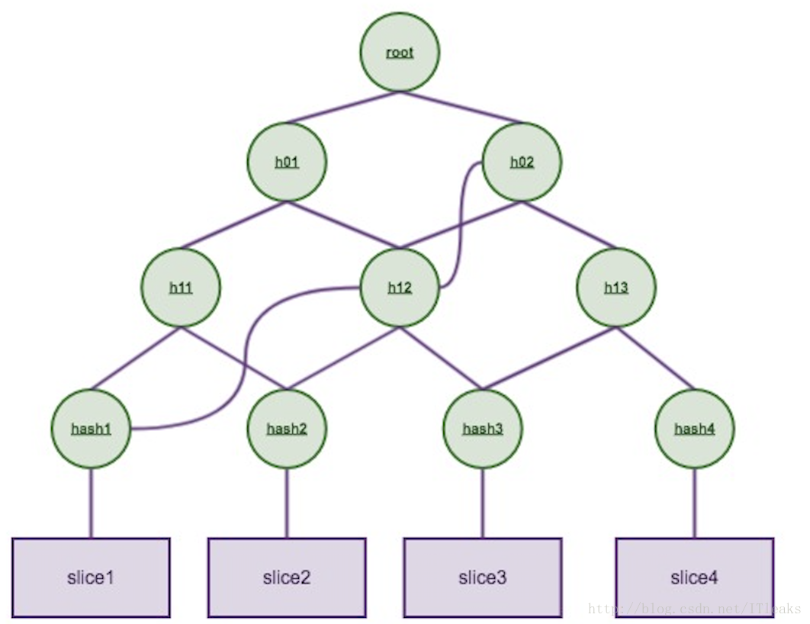

English | [中文版](merkle_zh.md)

# Merkle Tree

[TOC]


## Overview

Merkle Tree, also known as Hash Tree, is a tree that stores hash values. The leaves of a Merkle tree are the hash values of data blocks (e.g., files or collections of files). Non-leaf nodes are the hash of the concatenated strings of their child nodes.

Two nodes form a pair, and the hash of any two sibling nodes can be combined to obtain the parent node, eventually tracing back to the root node. Any change in the underlying data will propagate to its parent node, all the way up to the root.


## Merkle Tree Structure

### Creating a Merkle Tree



- A Merkle tree is a tree, mostly a binary tree, but can also be a multi-way tree. Regardless of the branching factor, it has all the characteristics of a tree structure.
- The value of a leaf node in a Merkle tree is a unit of data from the data set or the hash of a unit of data.
- The value of a non-leaf node is calculated by hashing all the leaf node values beneath it, according to a hash algorithm.

### Retrieving Data Blocks



Complexity: $\log (N)$

### Update, Insert, and Delete

TODO

### Node Verification

Example[<sup>[7]</sup>](#7): For a merkle tree:



To verify the correctness of `slice2`, you only need to obtain `hash1`, `h12`, and `h02` along with the `root` hash to verify it.




## Source Code Analysis

The IPFS team built a new data structure based on the Merkle tree: Merkle DAG. It differs from the Merkle tree in the following ways:

1. Merkle DAG does not require tree balancing; DAGs can have singleton nodes.
2. Non-leaf nodes are allowed to contain data; sometimes small data is stored directly in non-leaf nodes.

Source code example:

```C++
TODO
```


## Applications

### Zero-Knowledge Proof

TODO


## References

[1] [Merkle Tree Patent Document (English)](res/US4309569.pdf)
[2] [Merkle Tree Algorithm Analysis](https://blog.csdn.net/wo541075754/article/details/54632929)
[3] [Blockchain Technology Architecture Analysis (3) - Merkle Tree](https://zhuanlan.zhihu.com/p/39271872)
[4] [Baidu Baike - Merkle Tree](https://baike.baidu.com/item/%E6%A2%85%E5%85%8B%E5%B0%94%E6%A0%91)
[5] [Zero-Knowledge Proof - A New Type of Merkle Tree (Shrubs)](https://learnblockchain.cn/2019/10/15/Shrubs)
[6] [Merkle Tree and Zero Knowledge Proof](https://www.codenong.com/cs110403770/)
[7] [Ethereum MPT Principle, The Best Article You Should Read](https://blog.csdn.net/ITleaks/article/details/79992072)
