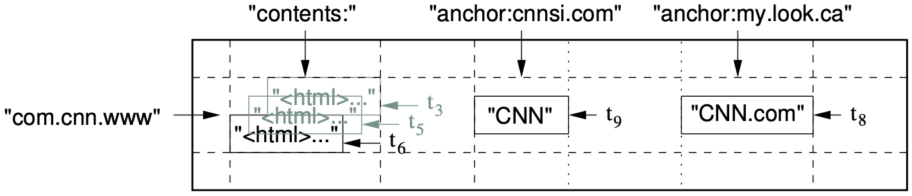
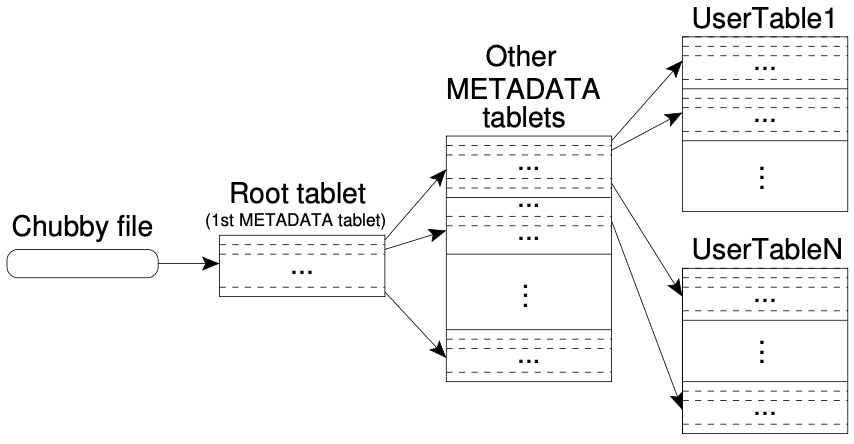

# Bigtable: A Distributed Storage System for Structured Data

[TOC]

## Data Model

A Bigtable is a sparse, distributed, persistent multi-dimensional sorted map. Each value in the map is an uninterpreted array of bytes:
$$
(row:string, column:string, time:int64) \rightarrow string
$$
A slice of an example table that stores Web pages:

### Row

The row keys in a table are arbitrary strings (currently up to 64KB in size, although 10-100 bytes is a typical size for most of our users).

Each row range is called a `table`, which is the unit of distribution and load balancing.

### Column Families

Column keys are grouped into sets called `column families`, which form the basic unit of access control.

A column key is named using the following syntax: `family:qualifier`.

### Timestamps

Each cell in a Bigtable can contain multiple versions of the same data; these versions are indexed by timestamp.

## API

The Bigtable API provides functions for creating and deleting tables and column families. It also provides functions for changing cluster, table, and column family metadata, such as access control rights.

## Building Blocks

Bigtable uses the distributed Google File System(GFS) to store log and data files. The Google `SSTable` file format is used internally to store Bigtable data.

## Implementation

The Bigtable implementation has three major components:

- A library that is linked into every client: clients communicate directly with table servers for reads and writes.
- One master server: the master is responsible for assigning tablets to tablet servers, detecting the addition and expiration of table servers, balancing tablet-server load, and garbage collection of files in GFS.
- Many tablet servers: each tablet server manages a set of tablets (typically we have somewhere between ten to a thousand tablets per tablet server).

### Tablet Location

We use a three-level hierarchy analogous to that of a $B^{+}$-tree to store tablet location information:

*Tablet location hierarchy*

The client library caches tablet locations.

We also store secondary information in the `METADATA` table, including a log of all events pertaining to each tablet. This information is helpful for debugging and performance analysis.

### Tablet Assignment

Bigtable uses Chubby to keep track of tablet servers. When a tablet server starts, it creates, and acquires and exclusive lock on, a uniquely-named file in a specific Chubby directory.

A tablet server will attempt to reacquire an exclusive lock on its file as long as the file still exists. If the file no longer exists, then the tablet server will never be able to serve again, so it kills itself. Whenever a tablet server terminates, it attempts to release its lock so that the master will reassign its tablets more quickly.

The master executes the following steps at startup:

1. The master grabs a unique `master` lock in Chubby, which prevents concurrent master instantiations.
2. The master scans the servers directory in Chubby to find the live servers.
3. The master communicates with every live tablet server to discover what tablets are already assigned to each server.
4. The master scans the `METADATA` table to learn the set of tablets.

### Tablet Serving

*Table Representation*

The persistent state of a tablet is stored in GFS.

The recently committed ones are stored in memory in a sorted buffer called a `memtable`; the older updates are stored in a sequence of SSTables.

## Reference

[1] Fay Chang, Jeffrey Dean, Sanjay Ghemawat, Wilson C. Hsieh, Deborah A. Wallach Mike Burrows, Tushar Chandra, Andrew Fikes, Robert E. Gruber . Bigtable: A Distributed Storage System for Structured Data

[2] [Bigtable](https://xianmu.github.io/posts/2018-01-03-Bigtable.html)