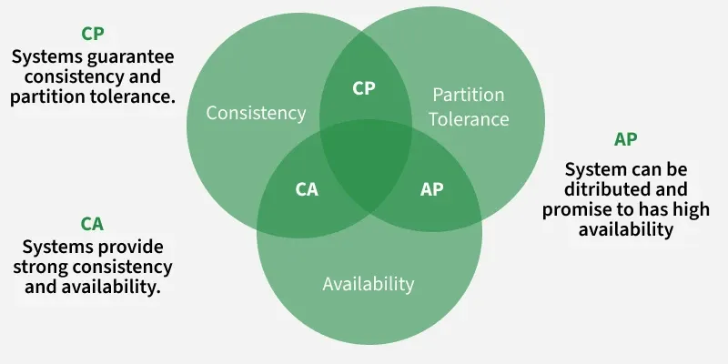

# CAP理论

[TOC]

分布式系统在以下三个特性中：

- Consistency 一致性
- Availability 可用性
- PartitionTolerance 分区容错性

最多满足两个特性，无法通知满足三个。

## 分区容错性

分布式系统中的某个节点出现问题，不影响整体使用。

## 可用性

一直可以正常地对分布式系统做读写操作

## 一致性

分布式系统各节点的数据都是一致的