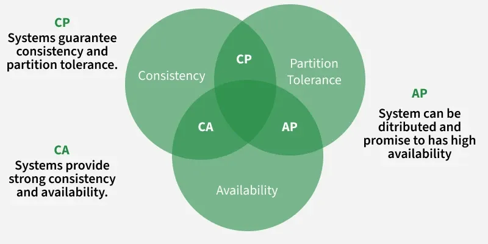
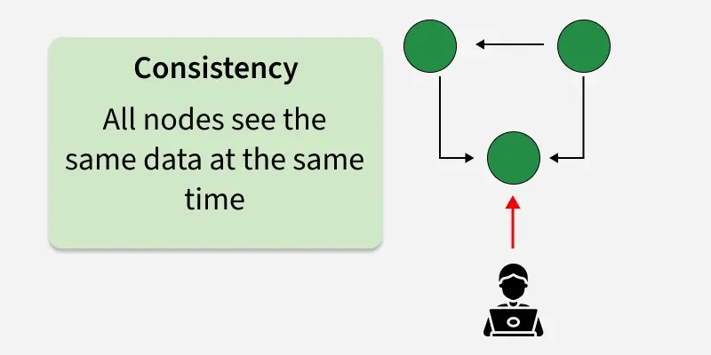
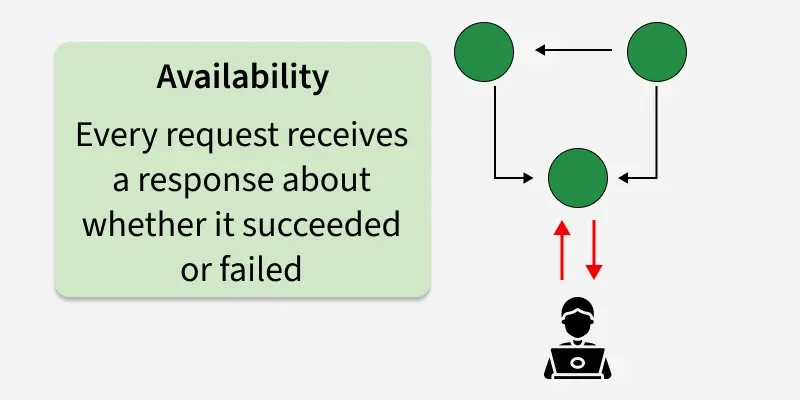
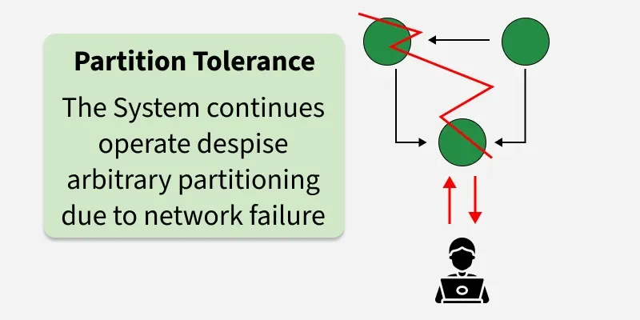

# CAP Theorem

[TOC]

## Intro

CAP states that **during a network partition**, a system must choose between:

- Consistency (linearizability)
- Availability
- Partition Tolerance

CAP describes **constraints**, not design goals.

## Consistency

Consistency defines that all clients see the same data simulaneously, no matter which node they connect to in a distributed system. For eventual consistency, the guarantees are a bit loose. Eventual consistency guarantee means client will eventually see the same data on all the nodes at some point of time in the future.

## Availability

Availability defines that all non-failing nodes in a distributed system return a response for all read and write requests in a bounded amount of time, even if one or more other nodes are down.

## Partition Tolerance

Partition Tolerance defines that the system continues to operate despite arbitrary message loss or failure in parts of the system. Distributed systems guaranteeing partition tolerance can gracefully recover from partitions once the partition heals.

## Trade-Offs in the CAP Theorem

### CA System

A CA system provides Consistency and Availability but does not tolerate network partitions. This means that all nodes always return the same data and the system remains accessible, but if a network partition occurs, the system cannot continue operating correctly.

### CP System

A CP system provides Consistency and Partition Tolerance but sacrifices availability during network failures. When a partition occurs between nodes, the system may temporarily block requests to ensure that all nodes maintain consistent data.

### AP System

An AP system provides Availability and Partition Tolerance but does not guarantee immediate consistency. During a network partition, the system continues to serve requests, but some nodes may return stale or outdated data until the system eventually synchronizes.

### Real-World Examples

| **System**                               | **CAP Choice**          | **Why**                        | **Use Case**                  |
| :--------------------------------------- | :---------------------- | :----------------------------- | :---------------------------- |
| **PostgreSQL (single node)**             | CA                      | No distribution, no partitions | Traditional applications      |
| **PostgreSQL (synchronous replication)** | CP                      | Waits for all replicas         | Financial transactions        |
| **Cassandra**                            | AP                      | Prioritizes availability       | Write-heavy, analytics        |
| **MongoDB (default)**                    | CP                      | Prioritizes consistency        | General purpose               |
| **DynamoDB**                             | AP (configurable to CP) | Designed for availability      | Amazon shopping cart          |
| **Redis (single node)**                  | CA                      | In-memory, single master       | Caching                       |
| **Redis Cluster**                        | CP (with trade-offs)    | Partition tolerant             | Distributed caching           |
| **ZooKeeper**                            | CP                      | Strong consistency required    | Coordination, leader election |
| **Kafka**                                | CP (configurable)       | Message ordering, no loss      | Event streaming               |

## PACELC Theorem (The CAP Extension)

PACELC extends CAP to account for latency even without partitions.

TODO

## References

[1] [CAP Theorem in System Design](https://www.geeksforgeeks.org/system-design/cap-theorem-in-system-design/)