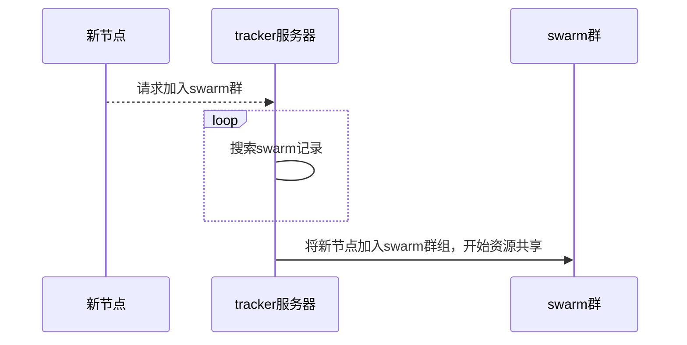
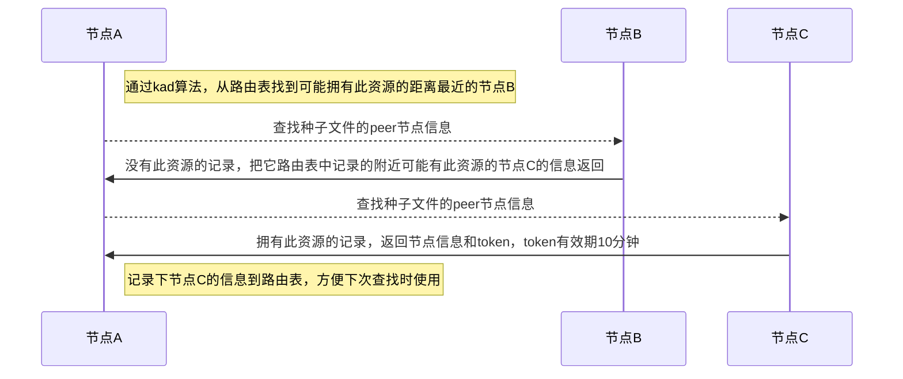
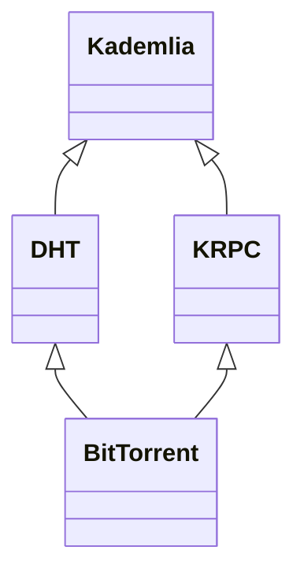
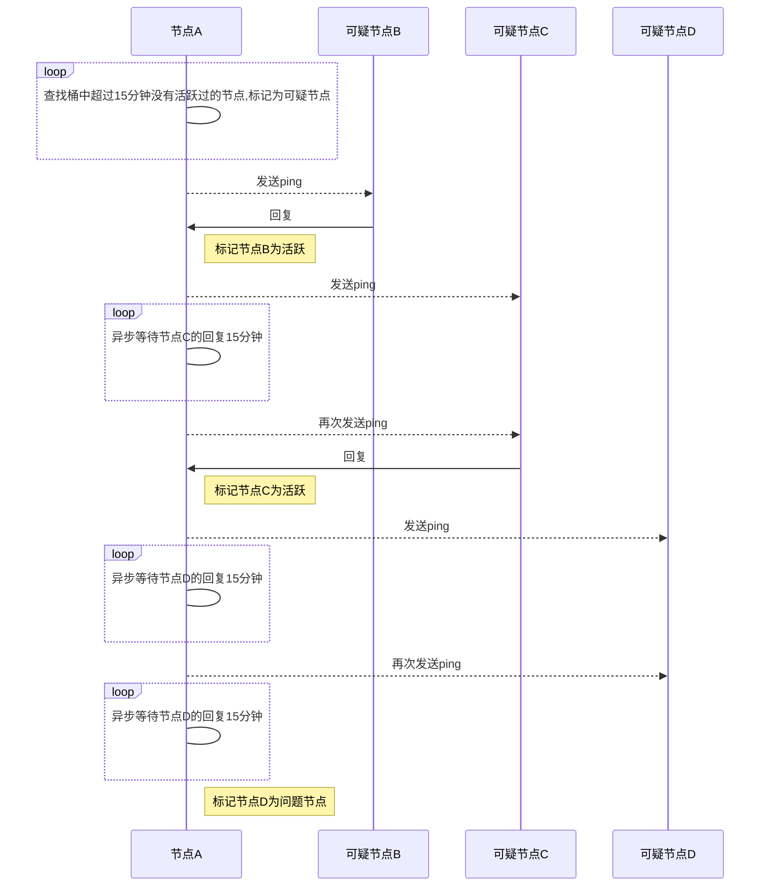

# DHT

## 前提

- 节点id

  全局唯一标识(节点id)，一个活跃的节点就是能在15分钟之内响应过请求或者在15分钟之内发送过请求的节点。15分钟之内没有活动的话，这个节点变成问题节点，活跃节点比问题节点优先级要高。

- 度量距离(distance metric)

  用来比较两个节点或节点与infohash之间的距离，只与通过XOR算法来计算两个节点id的距离，值只与id相关，与实际的地理位置无关。

- 路由表(routing table)

  所有节点都必须保存一个路由表，用来记录它和dht网络中其他节点的交流信息，节点的度量距离越小，信息越详细。

- kad算法

  对两个hash进行xor（异或）运算，把结果转换成无符号整数，结果值越小，距离越近。

  当一个节点想找到种子文件的peer节点信息时，使用kad算法将种子文件的infohash字段和路由表中的节点id比较，找到距离最近的节点进行通信。

**以上概念属于kad算法范畴，详情请参考[Kademlia算法](kad.md)**

## 概述

DHT(Distributed Sloppy Hash Table, 分布式哈希表)，一般用来存储没有tracker地址的种子文件所对应的peer节点的信息，每个节点都是一个tracker服务器，dht协议在udp的基础上使用kad算法实现。

每个节点都有一个全局唯一标识(节点id)。

### 传统的bt模式

缺点：tracker服务器容易出现故障或被屏蔽。

### DHT模式

使用dht协议来绕过对tracker服务器的封禁，是对传统bt模式的一种有效补充。

### Kademlia,DHT,KRPC和BitTorrent之间的关系

## DHT

### 路由表

bucket管理问题节点示意图如下：

## 参考

- [DHT协议官方文档](http://www.bittorrent.org/beps/bep_0005.html)
- [wiki Distributed hash table](https://en.wikipedia.org/wiki/Distributed_hash_table)
- [百度百科-DHT](https://baike.baidu.com/item/DHT/1007999?fr=aladdin)
- [DHT爬虫](https://www.jianshu.com/p/4175b27b6758)
- [Kademlia、DHT、KRPC、BitTorrent 协议、DHT Sniffer](https://www.cnblogs.com/LittleHann/p/6180296.html)

