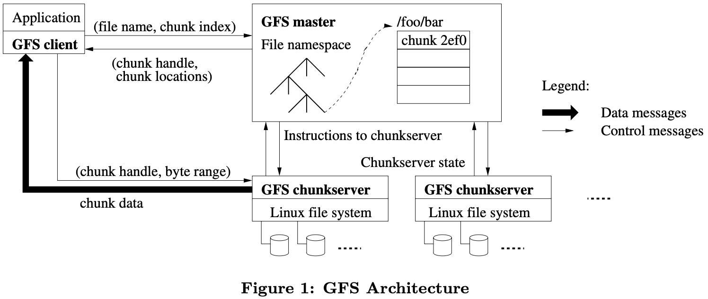
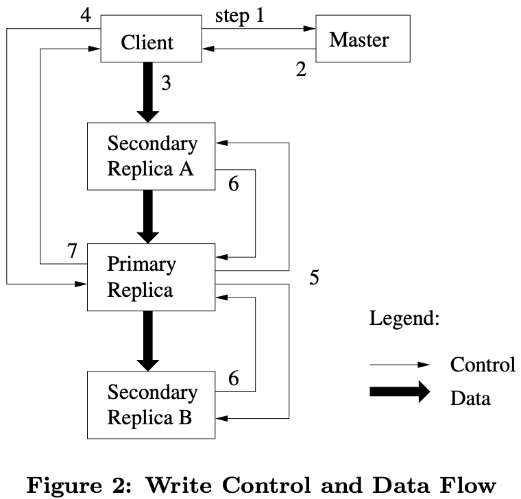

# The Google File System

[TOC]

The Google File System is a scalable distributed file system for large distributed data-intensive applications. It provides fault tolerance while running on inexpensive commodity hardware, and it delivers high aggregate performance to a large number of clients.

## DESIGN OVERVIEW

### Assumptions

- The system is built from many inexpensive commodity components that often fail.
- The system stores a modest number of large files.
- The workloads primarily consist of two kinds of reads: large streaming reads and small random reads.
- The workloads also have many large, sequential writes that append data to files.
- The system must efficiently implement well-defined semantics for multiple clients that concurrently append to the same file.
- High sustained bandwidth is more important than low latency.

### Architecture

A GFS cluster consists of a single `master` and multiple `chunkservers` and is accessed by multiple `clients`.

GFS client code linked into each application implements the file system API and communicates with the master and chunkservers to read or write data on behalf of the application.

The duty of the master:

- Maintains all file system metadata.
- Controls system-wide activities such as chunk lease management, garbage collection of orphaned chunks, and chunk migration between chunk servers.
- Periodically communicates with each chunkserver in `HeartBeat` messages to give it instructions and collect its state.

### Chunk Size

Chunk size is one of the key design parameters. We have chosen 64MB, which is much larger than typical file system block sizes.

A large chunk size offers several important advantages:

1. It reduces clients' need to interact with the master because reads and writes on the same chunk require only one initial request to the master for chunk location information.
2. Since on a large chunk, a client is more likely to perform many operations on a given chunk, it can reduce network overhead by keeping a persistent TCP connection to the chunkserver over an extended period of time.
3. It reduces the size of the metadata stored on the master.

A large chunk size, even with lazy space allocation, has its disadvantages:

1. A small file consists of a small number of chunks, perhaps just one. The chunkservers storing those chunks may become hot spots if many clients are accessing the same file.

### Metadata

The master stores three major types of metadata:

- the file and chunk namespaces.
- the mapping from files to chunks.
- the locations of each chunk's replicas.

Since metadata is stored in memory, master operations are fast.

The master does not keep a persistent record of which chunkservers have a replica of a given chunk.

The operation log contains a historical record of critical metadata changes.

### Consistency Model

Namespace locking guarantees atomicity and correctness.

A file region is `consistent` if all clients will always see the same data, regardless of which replicas they read from.

A region is `defined` after a file data mutation if it is consistent and clients will see what the mutation writes in its entirety.

## SYSTEM INTERACTIONS

We designed the system to minimize the master's involvement in all operations.

### Lease and Mutation Order

The master grants a chunk lease to one of the replicas, which we call the `primary`.

The control flow of a write-through these numbered steps:

1. The client asks the master which chunkserver holds the current lease for the chunk and the locations of the other replicas.
2. The master replies with the identity of the primary and the locations of the other (`secondary`) replicas.
3. The client pushes the data to all the replicas. A client can do so in any order. Each chunkserver will store the data in an internal LRU buffer cache until the data is used or aged out.
4. Once all the replicas have acknowledged receiving the data, the client sends a write request to the primary. The request identifies the data pushed earlier to all of the replicas. The primary assigns consecutive serial numbers to all the mutations it receives.
5. The primary forwards the write request to all secondary replicas.
6. The secondaries all reply to the primary, indicating that they have completed the operation.
7. The primary replies to the client.

### Atomic Record Appends

GFS provides an atomic append operation called `record append`.

## MASTER OPERATION

### Replica Placement

The chunk replica placement policy serves two purposes:

- Maximize data reliability and availability.
- Maximize network bandwidth utilization.

### Creation, Re-replication, Rebalancing

When the master `creates` a chunk, it chooses where to place the initially empty replicas. It considers several factors:

1. We want to place new replicas on chunkservers with below-average disk space utilization.
2. We want to limit the number of "recent" creations on each chunkserver.
3. As discussed above, we want to spread replicas of a chunk across racks.

### Stale Replica Detection

Chunk replicas may become stale if a chunkserver fails and misses mutations to the chunk while it is down. For each chunk, the master maintains a `chunk version number` to distinguish between up-to-date and stale replicas.

## FAULT TOLERANCE AND DIAGNOSIS

### High Availability

We keep the overall system highly available with two simple yet effective strategies:

- Fast Recovery: both the master and the chunk server are designed to restore their state and start in seconds, no matter how they terminated.
- Replication: 
  - Each chunk is replicated on multiple chunkservers on different racks.
  - The master state is replicated for reliability.

## Reference

[1] Sanjay Ghemawat, Howard Gobioff, and Shun-Tak Leung . The Google File System

[2] [The Google File System 详解](https://www.siyuanblog.cn/archives/gfs)