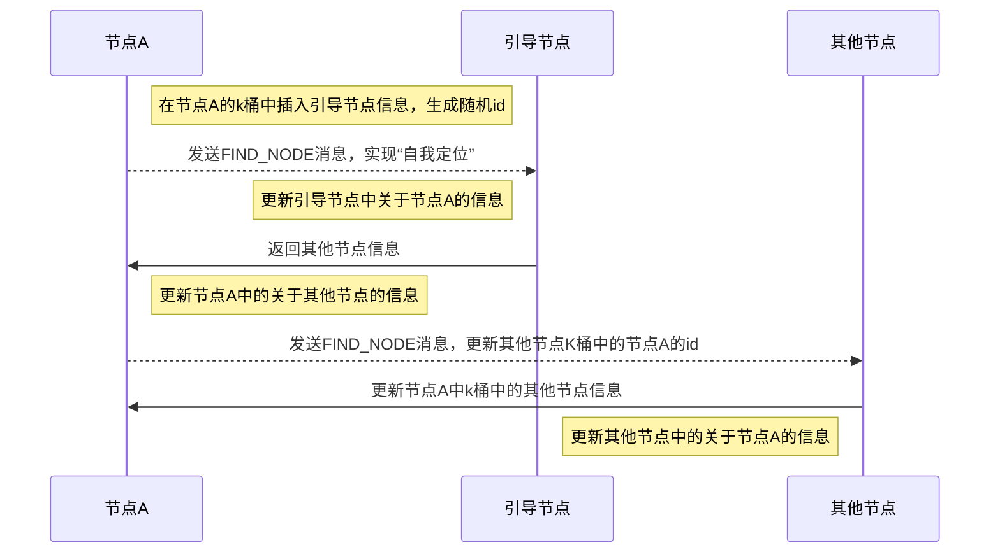
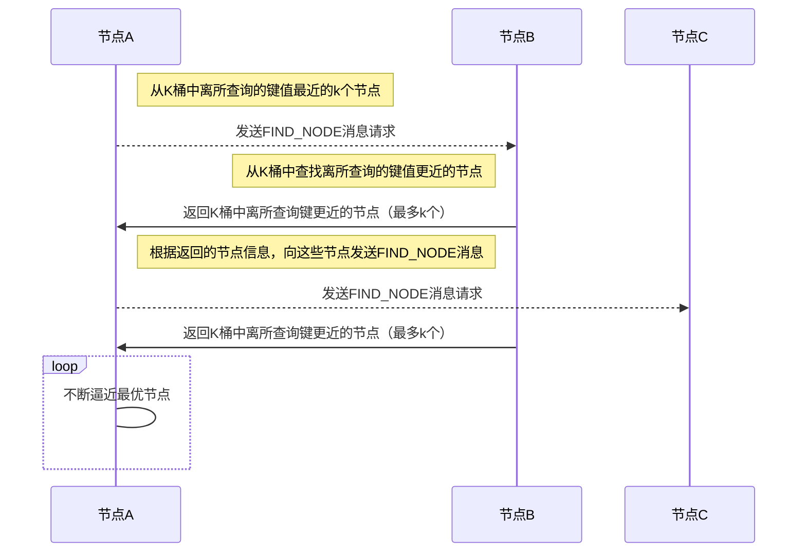
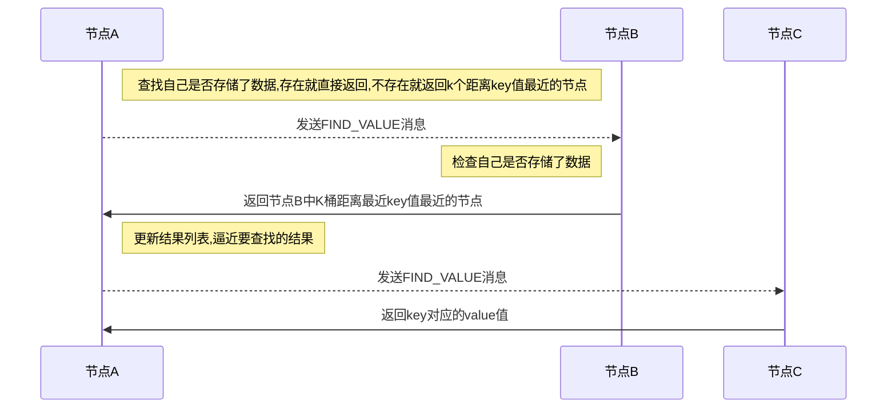
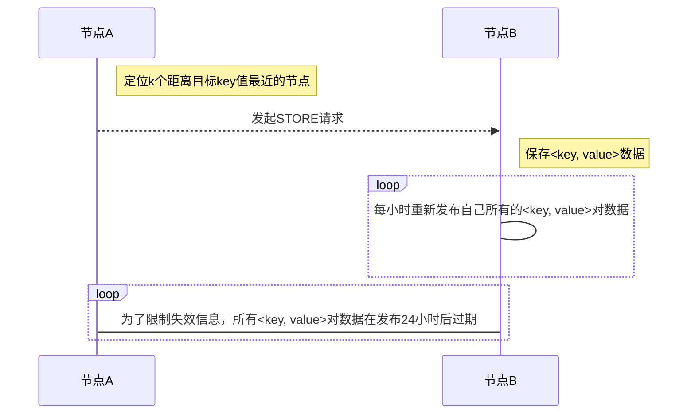
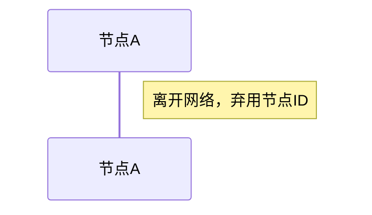

# Kademlia算法

[TOC]


## 摘要

Kademlia基于两个节点之间的距离计算，该距离是两个网络节点ID号的异或 XOR distance，计算的结果最终作为整型数值返回。异或距离跟实际上的地理位置没有任何关系，只与ID相关。


## 节点ID

全局唯一id，在不同的项目中实现不同

- Kademlia

  使用 SHA1 哈希来计算Node ID，SHA1 是一个 160 bit 的哈希空间，整个 ID 长度是 160 个位， 也就是 20 个字节，节点id的范围为$[0,2^{160}]$。

- IPFS

  IPFS 中都使用 SHA256 来计算 Node ID，ID 长度是 256 位的哈希空间， 也即 32 个字节。

- Ethereum

  使用 sha3，也是 256 位哈希空间， 32 字节


## 节点距离

直接对两个 Node ID 进行 XOR 运算，就可以得出他们之间的距离，距离用来对k桶做索引。

例：

前节点的 NodeID 是 1101，它与另一个节点 1010 的距离计算如下：

距离为5$=(1101)XOR(1000)$

### LCP

Kademlia 中，根据当前节点的 Node ID 与它保存的其他 peer 节点 Node ID 的匹配的**最多的前缀 bit 个数（LCP, Longest Common Prefix）**来构建一颗二叉树（Binary Tree）

例：

前节点的 NodeID 是 1101，另一个节点的NodeID是1000，那么LCP就是1

例：

当前节点 ID 是 0011，那么它可以划分为 LCP = 0, 1, 2, 3 一共 4 个子树;对于一个 160 bit 空间的 Node ID 来说，一共会有 160 个子树，也就是 160 个 buckets。每个 bucket 可以通过 XOR 的结果来索引


## 协议消息

Kademlia协议共有4种消息：

- PING

  用来测试节点是否仍然在线

- STORE

  在某个节点中存储一个键值对

- FIND_NODE

  请求的接受者将返回自己桶中离请求键值最近的K个节点

- FIND_VALUE

  与FIND_NODE一样，不过当请求的接受者存有请求者所请求的键的时候，它将返回相应键的值。每一个RPC消息中都包含一个发起者加入的随机值，这一点确保响应消息在收到的时候能够与前面发送的请求消息匹配。


## 路由表

路由表记录所有的k桶。

在不同项目中有不同实现：

- IPF

  动态分配，每个新建的表初始时包含一个k桶

- BitTorrent

  先根据 ID 空间预先分配 kbucket 数量的空间（比如 160 位，就分配 160 个 buckets 空间，256 位就直接分配 256 个 buckets 空间，这样，后续计算 distance 的时候可以直接 distance 作为 bucket 索引)

- 以太坊

  使用固定数量的 buckets，但是却限定在 17 个

### K桶

每个bucket最多存放k个节点。当一个bucket放满了节点之后，将不再允许新的节点加入，此时这个桶分裂为2个桶。假设每个节点的ID是N bits，那么每个节点最多需要维护N个K桶用于存储。

#### 桶的分裂

```flow
st=>start: 新的路由表
insert=>operation: 插入一个新的节点
is_full=>condition: 是否已满
input_bucket=>operation: 将节点放入桶
splict_bucket=>operation: 将桶分割为2个桶，第一个桶范围[0,2^159], 第二个桶范围[2^159,2^160]

st->insert->is_full
is_full(no)->input_bucket->insert
is_full(yes)->splict_bucket->input_bucket->insert
```

### 桶的更新机制

- 主动手机节点

  主动发送FIND_NODE查询节点的请求，从而更新k桶的节点信息。

- 被动收集节点

  当收到其他节点发送过来的请求（如：FIND_NODE, FIND_VALUE），会把对方的节点ID加入到某个k桶中。

- 检测失效节点

  周期性发起PING请求，判断k桶中某个节点是否在线，然后清理k桶中哪些下线的节点。


## 加入网络




## 定位节点

先找自己的k桶，自己的找不到就查找附近节点的k桶。整个检索过程是不断收敛的，查询复杂度可以证明是$\log N$

### 查找自己的k桶

假设现在的当前节点是 **110**，它想要查的目标节点是 **101** 节点，距离为$011=(110)XOR(101)$。

todo

### 查找附近节点的k桶



节点信息中可疑增加一个往返时间，或者叫做RTT的参数，这个参数可以被用来定义一个针对每个被查询节点的超时设置，即当向某个节点发起的查询超时的时候，另一个查询才会发起。


## 定位资源

通过把资源信息与键进行映射，资源即可进行定位。



## 保存资源




## 离开网络




## 查询加速

因为 Kademlia 使用异或距离来进行路由查找。对于一个 n bits 定义的网络，在一个节点上执行查找操作的时间复杂度为$\log{n}$。

异或距离满足三角形不等式: 任何一边的距离小于(或等于)其它两边距离之和；异或距离使得Kademlia的路由表可以建在单个bit之上，即可使用位组(多个位联合)来构建路由表；位组也可以称之为前缀。

对一个 m 位的前缀来说，可对应 $2𝑚−12m−1$ 个K桶（m位的前缀本来可以对应 2𝑚2m 个K桶）另外的那个 K 桶可以进一步扩展为包含该节点本身 ID 的路由树。

一个 b 位的前缀可以把查询的最大次数从$\log n$减少到$log (\frac{n}{b})$. 这只是查询次数的最大值，因为自己 K 桶可能比前缀有更多的位与目标键相同。


## 参考

- [维基百科-Kademlia算法](https://zh.wikipedia.org/wiki/Kademlia)
- [P2P 网络核心技术：Kademlia 协议](https://zhuanlan.zhihu.com/p/40286711)
- [KADEMLIA算法学习](https://shuwoom.com/?p=813)

