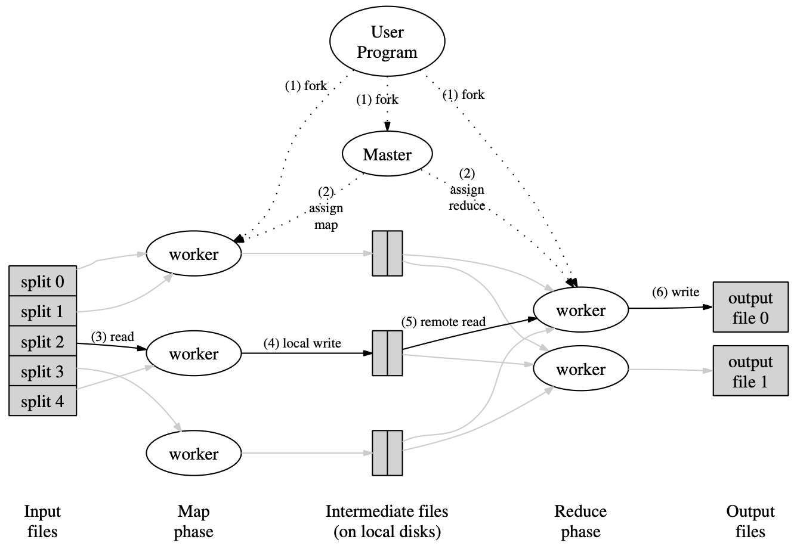

# Google: MapReduce

[TOC]

## Types

conceptually the map and reduce functions supplied by the user have associated types:

> map (k1, v1)              -> list(k2, v2)
>
> Reduce (k2, list(v2)) -> list(v2) 

I.e., the input keys and values are drawn from a different domain than the output keys and values. Furthermore, the intermediate keys and values are from the same domain as the output keys and values.

## Implementation

*Execution overview*

The above figure shows the overall flow of a MapReduce operation in our implementation. When the user program calls the *MapReduce* function, the following sequence of actions occurs:

1. The MapReduce library in the user program first splits the input files into $M$ pieces of typically 16 megabytes to 64 megabytes (MB) per piece (nontrollable by the user via an optional parameter). It then starts up many copies of the program on a cluster of machines.
2. One of the copies of the program is special - the master. The rest are workers are assigned work by the master. The rest are workers who are assigned work by the master. There are $M$ map tasks and $R$ reduce tasks to assign. The master picks idle workers and assigns each one a map task or a reduce task.
3. A worker who is assigned a map task reads the contents of the corresponding input split. It parses key/value pairs out of the input data and passes each pair to the user-defined *Map* function. The intermediate key/value pairs produced by the *Map* function are buffered in memory.
4. Periodically, the buffered pairs are written to the local disk, partitioned into $R$ regions by the partitioning function. The locations of these buffered pairs on the local disk are passed back to the master, who is responsible for forwarding these locations to the reduce workers.
5. When a reduce worker is notified by the master about these locations, it uses remote procedure calls to read the buffered data from the local disks of the map workers. When a reduced worker has read all intermediate data, it sorts it by the intermediate keys so that all occurrences of the same key are grouped together. The sorting is needed because, typically, many different keys map to the same reduce task. If the amount of intermediate data is too large to fit in memory, an external sort is used.
6. The reduce worker iterates over the sorted intermediate data and for each unique intermediate key encountered, it passes the key and the corresponding set of intermediate values to the user's *Reduce* function. The output of the *Reduce* function is appended to a final output file for this reduce partition.
7. When all map tasks and reduce tasks have been completed, the master wakes up the user program. At this point, the *MapReduce* call in the user program returns back to the user code.

### Worker Failure

The master pings every worker periodically. If no response is received from a worker in a certain amount of time, the master marks the worker as failed. Any map tasks completed by the worker are reset back to their initial *idle* state, and therefore become eligible for scheduling on other workers.

### Task Granularity

We subdivide the map phase into $M$ pieces and the reduce phase into $R$ pieces, as described above. Ideally, $M$ and $R$ should be much larger than the number of worker machines.

There are practical bounds on how large $M$ and $R$ can be in our implementation, since the master must make $O(M + R)$ scheduling decisions and keeps $O(M * R)$ state in memory as described above.

## Refinements

The users of MapReduce specify the number of reduce tasks/output files that they desire $(R)$. Data gets partitioned across these tasks using a partitioning function on the intermediate key.

We guarantee that within a given partition, the intermediate key/value pairs are processed in increasing key order.

## Reference

[1] Jeffrey Dean, Sanjay Ghemawat . MapReduce: Simplified Data Processing on Large Clusters

[2] [【论文阅读笔记】MapReduce: Simplified Data Processing on Large Clusters](https://superlova.github.io/2021/05/04/%E3%80%90%E8%AE%BA%E6%96%87%E9%98%85%E8%AF%BB%E7%AC%94%E8%AE%B0%E3%80%91MapReduce-Simplified-Data-Processing-on-Large-Clusters/)
