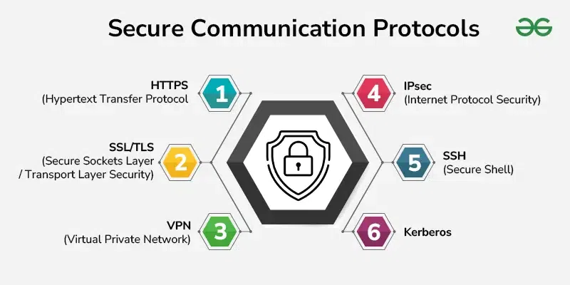

# Secure In Distributed System

[TOC]

Secure communication plays a vital role in safeguarding sensitive data.

## Fundamental

The main secure communication fundamentals elements include:

- Encryption
- Authentication
- Integrity
- Non-Repudiation
- Secure Protocols

## Protocol

Secure conversation protocols are vital for making sure the confidentiality, integrity, and authenticity of information transmitted over networks. Here are some of the important thing secure verbal exchange protocols:

## Authentication and Authorization Mechanisms

Authentication and authorization mechanisms are essential for securing structures and facts. Authentication verifies person identities, while authorization controls their get entry to sources.

### Authentication Mechanisms

1. Passwords and PINs

   User provides a secret phrase or wide variety.

   - Pros: Simple, widely used.
   - Cons: Vulnerable to assaults(brute pressure, phishing).

2. Biometrics

   Uses specific biological traits(fingerprints, facial reputation).

   - Pros: Hard to forge.
   - Cons: Privacy concerns, false positives/negatives.

3. Multi-Factor Authentication(MFA)

   Combines two or greater authentication techniques(some thing you understand, have or are).

   - Pros: Stronger security.
   - Cons: More complex for users.

4. Token-Based Authentication

   Uses physical tokens or software tokens(smart playing cards, OTP apps).

   - Pros: Enhances protection.
   - Cons: Tokens can be misplaced or stolen.

5. Certificate-Based Authentication

   Uses digital certificates to affirm identification.

   - Pros: Strong safety, broadly used in corporations.
   - Cons: Requires infrastructure for dealing with certificates(PKI).

6. Single Sign-On(SSO)

   Allows users to log in once and get entry to a couple of structures.

   - Pros: Convenient, improves user experience.
   - Cons: Single factor of failure.

### Authorization mechanisms

1. Role-Based Access Control(RBAC)

   Assigns permissions primarily based on user roles.

   - Pros: Simplifies control, enforces least privilege.
   - Cons: Can be rigid in dynamic environments.

2. Attribute-Based Access Control(ABAC)

   Grants get admission to based on attributes(user, resource, surroundings).

   - Pros: Flexible, quality-grained manage.
   - Cons: Complex to put into effect and manage.

3. Discretionary Access Control(DAC)

   Owners decide get right of entry to rights.

   - Pros: Flexible, simple
   - Cons: Less secure, liable to insider threats.

4. Mandatory Access Control(MAC)

   Access rights decided by a government based on protection labels.

   - Pros: High safety.
   - Cons: Rigid, hard to control in large businesses.

5. Policy-Based Access Control

   Users rules to define get right of entry to guidelines.

   - Pros: Flexible, adaptable to complicated environments.
   - Cons: Can be tough to outline and control regulations.

## References

[1] [Secure Communication in Distributed System](https://www.geeksforgeeks.org/operating-systems/secure-communication-in-distributed-system/)