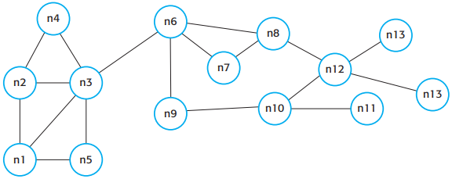

# Distributed System Summary

[TOC]

## Introduction

This document summarizes the core concepts and design principles of **Distributed Systems**, based primarily on *Distributed Systems: Concepts and Design (5th Edition)* by Coulouris et al.

It is intended for **engineers and system designers** seeking a concise yet principled overview for learning, revision, or interview preparation.

### What is a distributed system?

A **distributed system** is a collection of independent computers that appears to its users as a single coherent system.

### Key characteristics

- No shared memory or global clock
- Communication via message passing
- Partial failures are the norm
- Concurrency is inherent

### Primary goals

- Resource sharing
- Scalability
- Fault tolerance
- Transparency (access, location, replication, failure, concurrency)

---

## System Models and Fundamental Assumptions

### Architectural Models

- Client–Server

- Peer-to-Peer (P2P)

  

  *A decentralized p2p architecture*

- Hybrid (e.g., super-nodes)

- Microservices (logical, not physical distribution)

### Interaction Model (Timing Assumptions)

| Model                 | Guarantees                                    |
| --------------------- | --------------------------------------------- |
| Synchronous           | Bounded message delay, bounded execution time |
| Asynchronous          | No timing guarantees                          |
| Partially synchronous | Bounds hold eventually                        |

### Failure Models

- Crash failure
- Omission failure
- Byzantine failure (arbitrary / malicious)

---

## Communication and Time

### Message Passing

- Reliable vs unreliable channels
- Ordering guarantees
- Duplication and loss

### Physical Time and Clock Synchronization

- Clock drift and skew
- Cristian’s algorithm
- Berkeley algorithm
- Network Time Protocol (NTP)

### Logical Time

- Lamport clocks (happened-before relation)
- Vector clocks (causal ordering)

Logical time captures **causality**, which physical time cannot guarantee.

---

## Global States and Snapshots

### Global State Problem

- No instant global view exists in a distributed system
- Global properties must be inferred

### Consistent Cuts

A cut is consistent if it respects causality (no receive without send).

### Chandy–Lamport Snapshot Algorithm

- Marker-based
- Captures a consistent global state without stopping the system
- Foundation for debugging, checkpointing, deadlock detection

---

## Consistency Models

### Data Consistency Models

- Linearizability (strongest)
- Sequential consistency
- Causal consistency
- Eventual consistency

### Client-Centric Consistency

- Read-your-writes
- Monotonic reads
- Monotonic writes
- Writes-follow-reads

### Consistency vs Isolation

- Consistency: visibility across replicas
- Isolation: behavior of concurrent transactions

They address **different dimensions**.

---

## Replication and Partitioning (Storage Perspective)

### Replication

- Active replication
- Passive (primary–backup)
- Leader–follower

### Quorum-Based Systems

- Read quorum (R)
- Write quorum (W)
- Total replicas (N)
- Guarantee: R + W > N

### Partitioning

- Range partitioning
- Hash partitioning
- Consistent hashing

---

## Coordination and Consensus

### Coordination Problems

- Mutual exclusion
- Leader election
- Distributed agreement

### Two-Phase Commit (2PC)

- Blocking
- Not fault-tolerant to the coordinator crash

### Consensus

Properties:

- Agreement
- Validity
- Termination

### Paxos and Raft

- Crash fault-tolerant
- Assumes partial synchrony
- Leader-based consensus

### Byzantine Fault Tolerance

- Arbitrary failures
- Requires ≥ 3f + 1 nodes
- Used in blockchain systems

---

## Fault Tolerance and Recovery

- Failure detection (timeouts, heartbeats)
- Replication for availability
- Checkpointing and rollback
- Idempotent operations

---

## Security in Distributed Systems

- Authentication
- Authorization
- Secure channels
- Key management
- Trust models

Security assumptions define the attack surface.

---

## Distributed Debugging and Monitoring

- State collection
- Event ordering
- Log correlation
- Predicate detection

---

## Performance and Scalability

### Performance Metrics

- Latency
- Throughput
- Tail latency

### Scalability Limits

- Centralized coordination
- Global locks
- Synchronous protocols

### Backpressure

- Flow control
- Prevents overload collapse

---

## Relation to Blockchain Systems (Extension)

- P2P networking ≠ blockchain
- Consensus vs finality
- Logical time (block height) dominates physical time
- Byzantine assumptions are fundamental

---

## Key Takeaways

- Distribution introduces uncertainty, not just complexity
- Time and failure models define what is achievable
- Consistency is a spectrum, not a binary choice
- Coordination is the hardest problem
- Blockchain systems are specialized Byzantine distributed systems

---

## Summary

### Consensus Algorithm 

| Algorithm           | Description                                                  | Fault Tolerance               | Benefits                                      | Challenges                                          |
| ------------------- | ------------------------------------------------------------ | ----------------------------- | --------------------------------------------- | --------------------------------------------------- |
| Paxos               | Achieves consensus despite network delays and node failures. | Crash Fault Tolerant(CFT)     | Robust and proven; high fault tolerance       | Complex to understand and implement                 |
| Raft                | Leader-based log replication for consensus.                  | Crash Fault Tolerant(CFT)     | Easier to understand and implement than Paxos | Leader election can cause delays                    |
| PBFT                | Handles Byzantine faults with supermajority agreement.       | Byzantine Fault Tolerant(BFT) | High security, handles arbitray faults        | Requires high message overhead; limited scalability |
| Proof of Work(PoW)  | Miners solve cryptographic puzzles to validate transactions. | Byzantine Fault Tolerant(BFT) | Highly secure; decentralized                  | High energy consumption slow transaction times      |
| Proof of Stake(PoS) | Validators are chosen based on stake to propose new blocks.  | Byzantine Fault Tolerant(BFT) | Energy efficient; scalable                    | Wealth concentration; potential centralization      |

### Consensus Algorithm Challenges

1. Fault Tolerance

   - Crash Fault Tolerance(CFT)

     Algorithms like Paxos and Raft are designed to handle node crashes and recover without data loss.

   - Byzantine Fault Tolerance(BFT)

     Algorithms like PBFT and Tendermint are designed to handle arbitrary failures, including malicious behavior, which is more complex and resource-intensive.

2. Scalability

   - Message Overhead

     Many consensus algorithms require extensive communication between nodes. As the number of nodes increases, the message complexity can grow significantly, leading to network congestion and latency.

   - Performance Bottlenecks

     Centralized points of failure, such as leaders in Raft, can become performance bottlenecks in large-scale systems.

3. Security

   - Sybil Attacks

     Attackers create multiple fake identities to gain influence over the network. Pow and Pos address this by requiring computational work or stake, respectively, making it costly to mount such attacks.

   - Double-Spending

     Ensuring that a digital currency cannot be spent more than once is critical in blockchain systems, requiring mechanisms to detect and prevent double spending.

   - Denial-of-Service(DoS) Attacks

     Consensus algorithms must include measures to protect against DoS attacks that aim to disrupt network operations.

4. Synchronization

   - Network Latency

     Variations in network latency can cause delays in message delivery, leading to nodes having different views of the system state.

   - Clock Synchronization

     In many algorithms, nodes rely on synchronized clocks to order events correctly. Asynchronous clocks can lead to inconsistencies and disagreements among nodes.

5. Configuration Management

   - Dynamic Membership

     Handling changes in the set of participating nodes dynamically while maintaining consensus is challenging. Algorithms need mechanisms to accommodate nodes joining or leaving without causing inconsistencies.

   - Parameter Tuning

     Properly tuning parameters like timeout periods, message intervals, and quorum size is critical for optimal performance but can be difficult to get right.

### Issues

The following are some of the major design issues of distributed systems:

1. Communication Issues
   - Message Passing
   - Communication Latency and Bandwidth
   - Communication Protocols
2. Process Management
   - Process Coordination
   - Process Migration
   - Thread Management
3. Data management
   - Data Storage
   - Data Access
   - Consistency and Replication
   - Data Integrity
4. Fault Tolerance and Reliability
   - Failure Detection
   - Redundancy and Recovery
   - Consensus and Quorum Systems
5. Security
   - Authentication and Authorization
   - Cryptography
   - Data Privacy
6. Scalability and Modularity
   - Scalable Architectures
   - Modular Design
   - Elasticity
7. Synchronization and Coordination
   - Clock Synchronization
   - Leader Election
   - Mutual Exclusion
8. Transparency
   - Access Transparency
   - Location transparency
   - Replication Transparency
9. Performance
   - Load Balancing
   - Caching and Cache Management
   - Latency and Throughput
10. Algorithmic Challenges
    - Distributed Algorithms
    - Global State Management
    - Distributed Synchronization
11. Application-Specific Design Challenges
    - Mobile Systems
    - Sensor Networks
    - Peer-to-Peer(P2P) Systems
    - Cloud Computing
12. Debugging and Monitoring
    - Debugging Distributed Systems
    - Event Monitoring
    - Distributed Tracing
13. Real-Time Systems
    - Real-Time Scheduling
    - Quality of Service(QoS)

## Reference

[1] George Coulouris, Jean Dolimore, Tim Kindberg, Gordon Blair. DISTRIBUTED SYSTEMS: Concepts and Design. 5ED

[2] Ian Sommerville. SOFTWARE ENGINEERING. 9th Edition

[3] [WIKIPEDIA-Distributed computing](https://en.wikipedia.org/wiki/Distributed_computing)

[4] [A Beginner's Guide To Distributed Systems](https://www.designgurus.io/blog/a-beginners-guide-to-distributed-systems)

[5] [What is a distributed system?](https://www.atlassian.com/microservices/microservices-architecture/distributed-architecture)

[6] [Comparison of different Consensus Algorithms](https://www.geeksforgeeks.org/operating-systems/consensus-algorithms-in-distributed-system/)
