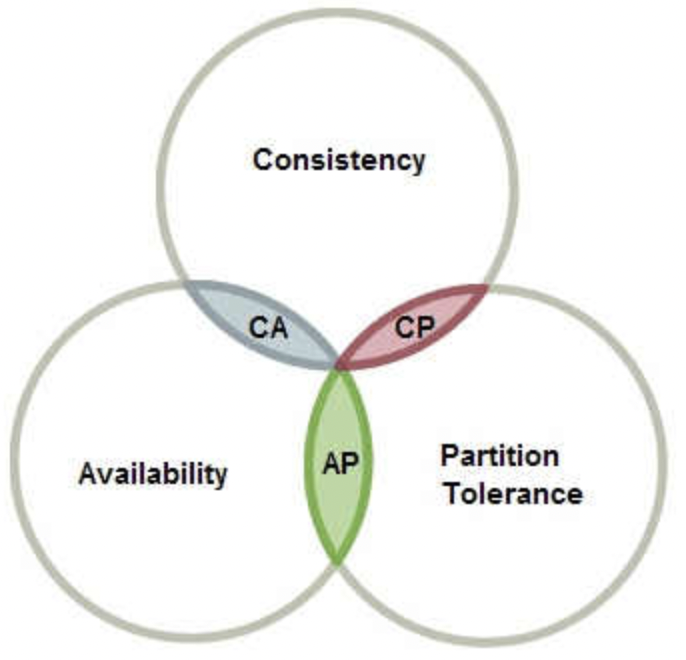

# Distributed System Summary

[TOC]

## Introduction

This document summarizes the core concepts and design principles of **Distributed Systems**, based primarily on *Distributed Systems: Concepts and Design (5th Edition)* by Coulouris et al.

It is intended for **engineers and system designers** seeking a concise yet principled overview for learning, revision, or interview preparation.

### What is a distributed system?

A **distributed system** is a collection of independent computers that appears to its users as a single coherent system.

### Key characteristics

- No shared memory or global clock
- Communication via message passing
- Partial failures are the norm
- Concurrency is inherent

### Primary goals

- Resource sharing
- Scalability
- Fault tolerance
- Transparency (access, location, replication, failure, concurrency)

---

## System Models and Fundamental Assumptions

### Architectural Models

- Client–Server

- Peer-to-Peer (P2P)

  

  *A decentralized p2p architecture*

- Hybrid (e.g., super-nodes)

- Microservices (logical, not physical distribution)

### Interaction Model (Timing Assumptions)

| Model                 | Guarantees                                    |
| --------------------- | --------------------------------------------- |
| Synchronous           | Bounded message delay, bounded execution time |
| Asynchronous          | No timing guarantees                          |
| Partially synchronous | Bounds hold eventually                        |

### Failure Models

- Crash failure
- Omission failure
- Byzantine failure (arbitrary / malicious)

---

## Communication and Time

### Message Passing

- Reliable vs unreliable channels
- Ordering guarantees
- Duplication and loss

### Physical Time and Clock Synchronization

- Clock drift and skew
- Cristian’s algorithm
- Berkeley algorithm
- Network Time Protocol (NTP)

### Logical Time

- Lamport clocks (happened-before relation)
- Vector clocks (causal ordering)

Logical time captures **causality**, which physical time cannot guarantee.

---

## Global States and Snapshots

### Global State Problem

- No instant global view exists in a distributed system
- Global properties must be inferred

### Consistent Cuts

A cut is consistent if it respects causality (no receive without send).

### Chandy–Lamport Snapshot Algorithm

- Marker-based
- Captures a consistent global state without stopping the system
- Foundation for debugging, checkpointing, deadlock detection

---

## Consistency Models

### Data Consistency Models

- Linearizability (strongest)
- Sequential consistency
- Causal consistency
- Eventual consistency

### Client-Centric Consistency

- Read-your-writes
- Monotonic reads
- Monotonic writes
- Writes-follow-reads

### Consistency vs Isolation

- Consistency: visibility across replicas
- Isolation: behavior of concurrent transactions

They address **different dimensions**.

---

## CAP theorem

CAP states that **during a network partition**, a system must choose between:

- Consistency (linearizability)
- Availability

CAP describes **constraints**, not design goals.

---

## Replication and Partitioning (Storage Perspective)

### Replication

- Active replication
- Passive (primary–backup)
- Leader–follower

### Quorum-Based Systems

- Read quorum (R)
- Write quorum (W)
- Total replicas (N)
- Guarantee: R + W > N

### Partitioning

- Range partitioning
- Hash partitioning
- Consistent hashing

---

## Coordination and Consensus

### Coordination Problems

- Mutual exclusion
- Leader election
- Distributed agreement

### Two-Phase Commit (2PC)

- Blocking
- Not fault-tolerant to the coordinator crash

### Consensus

Properties:

- Agreement
- Validity
- Termination

### Paxos and Raft

- Crash fault-tolerant
- Assumes partial synchrony
- Leader-based consensus

### Byzantine Fault Tolerance

- Arbitrary failures
- Requires ≥ 3f + 1 nodes
- Used in blockchain systems

---

## Fault Tolerance and Recovery

- Failure detection (timeouts, heartbeats)
- Replication for availability
- Checkpointing and rollback
- Idempotent operations

---

## Security in Distributed Systems

- Authentication
- Authorization
- Secure channels
- Key management
- Trust models

Security assumptions define the attack surface.

---

## Distributed Debugging and Monitoring

- State collection
- Event ordering
- Log correlation
- Predicate detection

---

## Performance and Scalability

### Performance Metrics

- Latency
- Throughput
- Tail latency

### Scalability Limits

- Centralized coordination
- Global locks
- Synchronous protocols

### Backpressure

- Flow control
- Prevents overload collapse

---

## Relation to Blockchain Systems (Extension)

- P2P networking ≠ blockchain
- Consensus vs finality
- Logical time (block height) dominates physical time
- Byzantine assumptions are fundamental

---

## Key Takeaways

- Distribution introduces uncertainty, not just complexity
- Time and failure models define what is achievable
- Consistency is a spectrum, not a binary choice
- Coordination is the hardest problem
- Blockchain systems are specialized Byzantine distributed systems

---

## Reference

[1] George Coulouris, Jean Dolimore, Tim Kindberg, Gordon Blair. DISTRIBUTED SYSTEMS: Concepts and Design. 5ED

[2] Ian Sommerville. SOFTWARE ENGINEERING. 9th Edition

[3] [WIKIPEDIA-Distributed computing](https://en.wikipedia.org/wiki/Distributed_computing)

[4] [A Beginner's Guide To Distributed Systems](https://www.designgurus.io/blog/a-beginners-guide-to-distributed-systems)

[5] [What is a distributed system?](https://www.atlassian.com/microservices/microservices-architecture/distributed-architecture)
