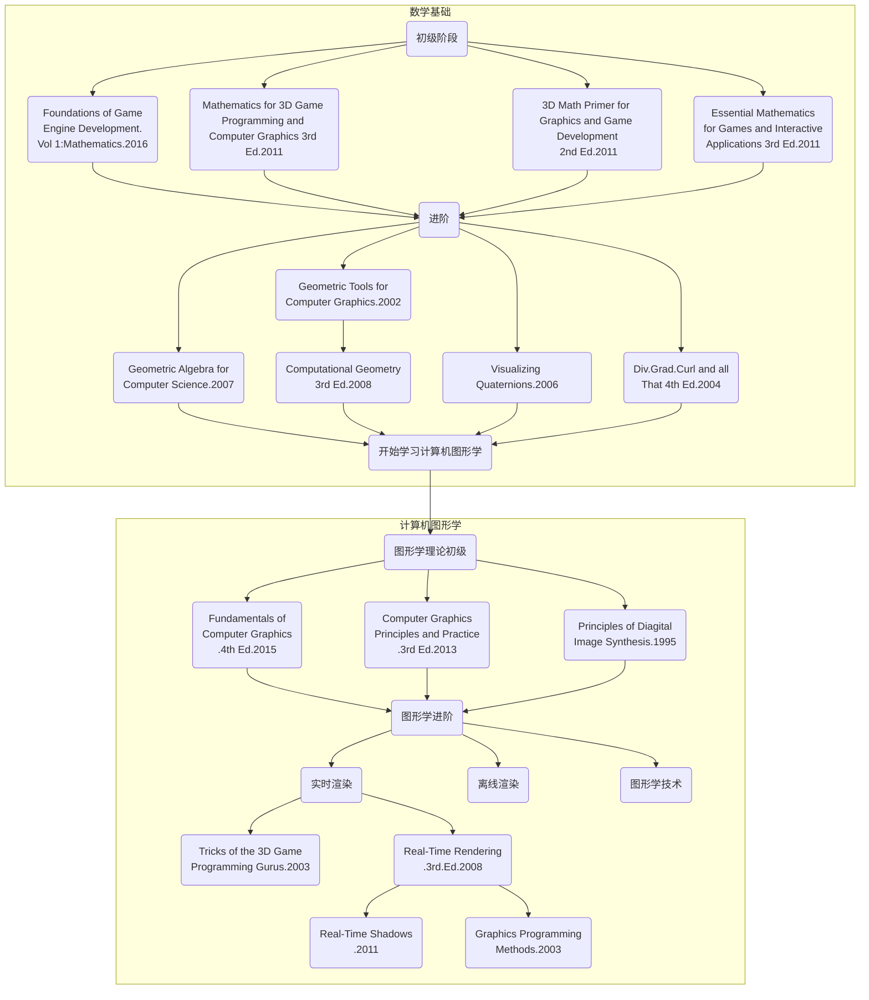

# 计算机图形学学习路径

```mermaid
graph TD
	subgraph 数学基础
		A(初级阶段)
		A_1(Foundations of Game <br>Engine Development.<br>Vol 1:Mathematics.2016)
		A_2(Mathematics for 3D Game <br>Programming and <br>Computer Graphics 3rd Ed.2011)
		A_3(3D Math Primer for <br>Graphics and Game Development<br> 2nd Ed.2011)
		A_4(Essential Mathematics <br>for Games and Interactive <br>Applications 3rd Ed.2011)
		
		A-->A_1-->B
		A-->A_2-->B
		A-->A_3-->B
		A-->A_4-->B
		
		B(进阶)
		B_1(Geometric Algebra for<br> Computer Science.2007)
		B_2(Geometric Tools for<br> Computer Graphics.2002)
		B_2_1(Computational Geometry<br> 3rd Ed.2008)
		B_3(Visualizing Quaternions.2006)
		B_4(Div.Grad.Curl and all <br>That 4th Ed.2004)
		
		B_5(开始学习计算机图形学)
		B-->B_1-->B_5
		B-->B_2-->B_2_1-->B_5
		B-->B_3-->B_5
		B-->B_4-->B_5
	end
	
	subgraph 计算机图形学
		C(图形学理论初级)
		C_1(Fundamentals of <br>Computer Graphics<br>.4th Ed.2015)
		C_2(Computer Graphics <br>Principles and Practice<br>.3rd Ed.2013)
		C_3(Principles of Diagital <br>Image Synthesis.1995)
		
		B_5-->C
		C-->C_1-->D
		C-->C_2-->D
		C-->C_3-->D
		
		D(图形学进阶)
		D_1(实时渲染)
		D_1_1(Tricks of the 3D Game <br>Programming Gurus.2003)
		D_1_2(Real-Time Rendering<br>.3rd.Ed.2008)
		D_1_2_1(Real-Time Shadows<br>.2011)
		D_1_2_2(Graphics Programming <br>Methods.2003)
		D_2(离线渲染)
		D_3(图形学技术)
		
		D-->D_1
		D_1-->D_1_1
		D_1-->D_1_2
		D_1_2-->D_1_2_1
		D_1_2-->D_1_2_2
		D-->D_2
		D-->D_3
	end
```

## 参考

- [miloyip/game-programmer](https://github.com/miloyip/game-programmer)

